# Sơ đồ Use Case (Mermaid)

> **Render**: Copy block `mermaid` vào https://mermaid.live hoặc dùng VSCode Mermaid Preview extension. Để xuất PNG/SVG cho báo cáo, dùng `mermaid.live` → Export.
>
> **Lưu ý**: Mermaid không có syntax UML use case "thuần", nên ở đây dùng `flowchart LR` với:
> - Actor: hình `(((Tên Actor)))` (oval đôi)
> - Use case: hình `(Tên use case)` (oval)
> - Hệ thống: gói `subgraph`
> - `<<extend>>` / `<<include>>`: cạnh nét đứt `-.->`

---

## A1.1 — Use case tổng quát

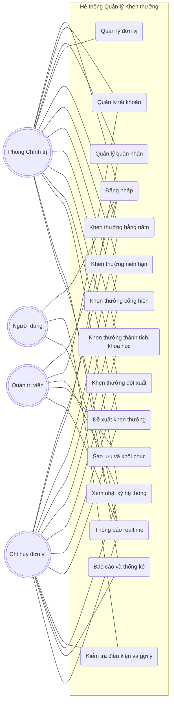

**Mô tả**: 4 actor truy cập hệ thống qua 15 nhóm chức năng. SUPER_ADMIN có quyền cao nhất (backup, xem log resource = 'backup'). ADMIN cùng SUPER_ADMIN quản lý tài khoản (cùng dùng `requireAdmin`). MANAGER có thể xem nhật ký hệ thống (route dùng `requireManager`) nhưng bị filter bỏ log backup. USER chủ yếu xem hồ sơ cá nhân và nhận thông báo.

**Phân nhóm khen thưởng theo nghiệp vụ** (5 nhóm — mỗi nhóm có sơ đồ phân rã riêng):
- **UC5 Hằng năm** — danh hiệu theo từng năm. Phân rã thành **cá nhân hằng năm** (CSTDCS / CSTT / BKBQP / CSTDTQ / BKTTCP — xem A1.5) và **đơn vị hằng năm** (ĐVQT / ĐVTT / BKBQP đơn vị / BKTTCP đơn vị — xem A1.6).
- **UC6 Niên hạn** — xét theo **thời gian phục vụ**: HCCSVV (10/15/20 năm), HCQKQT (25 năm), KNC VSNXD QĐNDVN (25 nam / 20 nữ năm). Xem A1.7.
- **UC7 Cống hiến** — xét theo **120 tháng tích lũy hệ số chức vụ**: HCBVTQ (Huân chương Bảo vệ Tổ quốc). Xem A1.7.
- **UC8 Thành tích khoa học** — xét theo **kết quả nghiên cứu**: NCKH gồm đề tài (ĐTKH) và sáng kiến khoa học (SKKH). Khớp với `AWARD_LABELS[scientific-achievements] = "Thành tích khoa học"`. Xem A1.7.
- **UC9 Đột xuất** — khen thưởng theo **sự kiện / chiến công** không theo lịch định kỳ, đính kèm file quyết định. ADMIN tạo trực tiếp qua module riêng `adhoc-awards`, không qua flow đề xuất 3 cấp. Xem A1.9.

> Sơ đồ tổng quan **không** vẽ quan hệ `<<include>>` / `<<extend>>` giữa các use case (notify realtime, audit log, eligibility check là side-effect / orthogonal concerns). Các quan hệ chi tiết được mô tả trong từng sơ đồ phân rã A1.2 – A1.14.

---

## A1.2 — Use case phân rã: Quản lý tài khoản và phân quyền

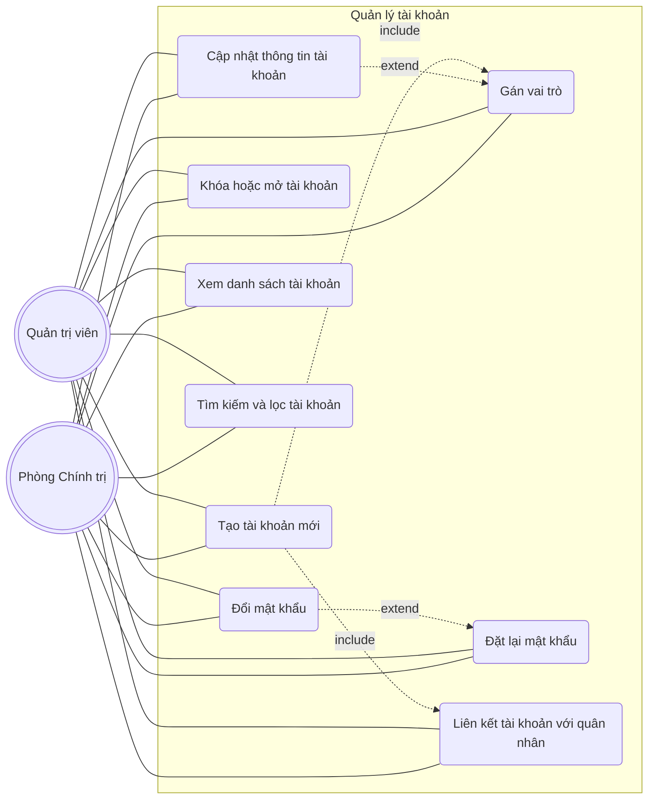

**Quyền**: route `/api/accounts` dùng middleware `requireAdmin` → cả SUPER_ADMIN (Quản trị viên) và ADMIN (Phòng Chính trị) đều có thể tạo / sửa / khóa / reset / xoá tài khoản.

---

## A1.3 — Use case phân rã: Quản lý quân nhân

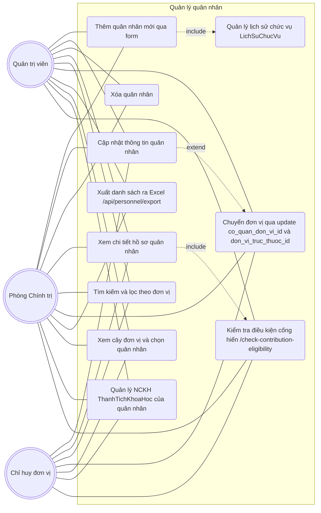

**Phân quyền route**:
- POST/DELETE/EXPORT (`/api/personnel`): `requireAdmin` → SUPER_ADMIN + ADMIN.
- PUT `/api/personnel/:id`: `requireManager` → SUPER_ADMIN + ADMIN + MANAGER (MANAGER chỉ sửa quân nhân thuộc đơn vị quản lý).
- GET list / detail: MANAGER xem được trong phạm vi đơn vị; USER chỉ xem hồ sơ của chính mình.

**Lưu ý**: Bảng `QuanNhan` hiện **không hỗ trợ Excel import** — chỉ thêm thủ công qua form (xem A3.2). Excel import chỉ áp dụng cho các loại khen thưởng (xem A1.7).

---

## A1.4 — Use case phân rã: Quản lý đơn vị (CQDV / DVTT)

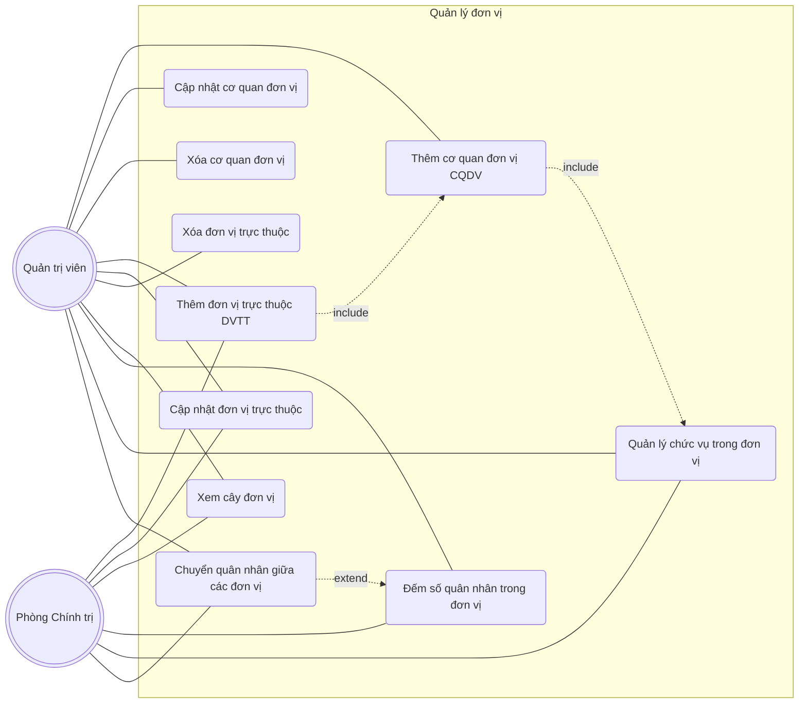

---

## A1.5 — Use case phân rã: Quản lý khen thưởng cá nhân hằng năm (chuỗi BKBQP / CSTDTQ / BKTTCP)

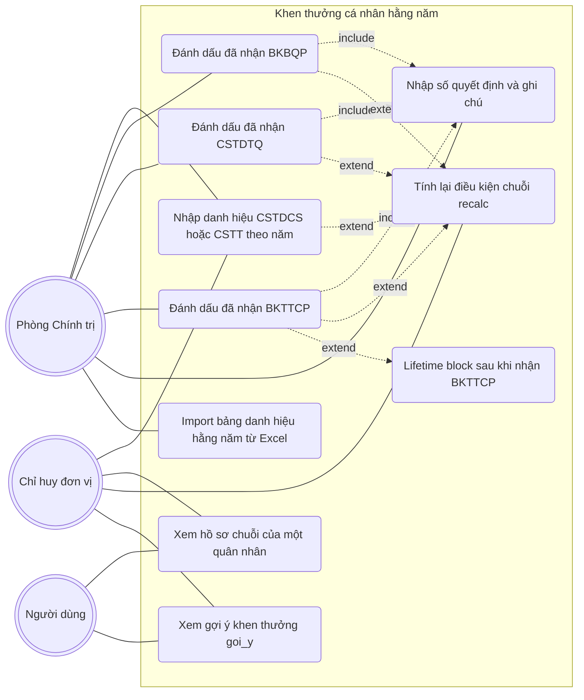

**Đặc thù**: UC10 (lifetime block) là điểm riêng — sau khi quân nhân đã nhận BKTTCP, hệ thống chặn không cho đề xuất các danh hiệu cùng cấp/cao hơn với message "Đã có BKTTCP. Phần mềm chưa hỗ trợ các danh hiệu cao hơn..."

---

## A1.6 — Use case phân rã: Quản lý khen thưởng đơn vị hằng năm

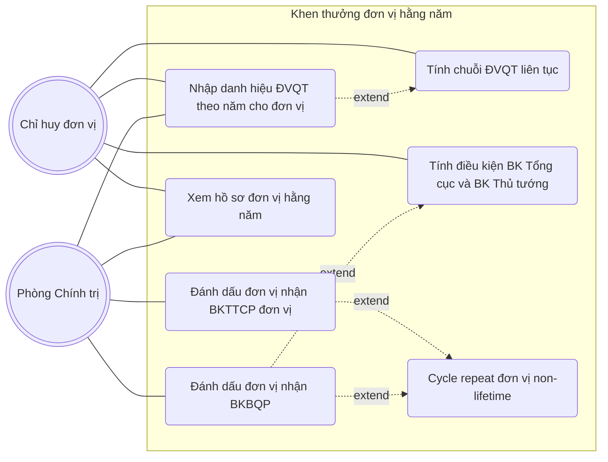

**Khác personal**: BKTTCP đơn vị `isLifetime: false` — đơn vị có thể nhận BKTTCP lặp lại sau mỗi 7 năm (cycle repeat). Personal BKTTCP `isLifetime: true` chỉ nhận 1 lần.

---

## A1.7 — Use case phân rã: Niên hạn / Cống hiến / Thành tích khoa học

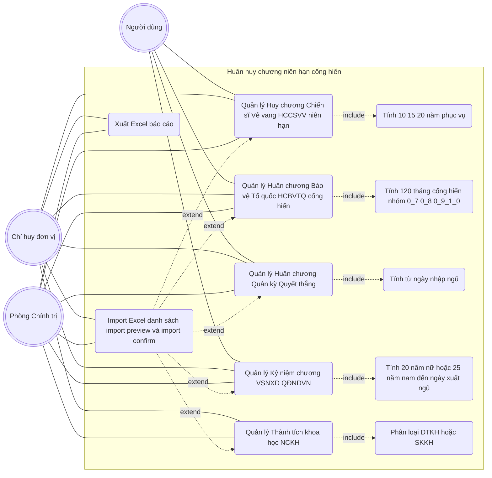

**Endpoints thực tế** (trong code): `routes/{tenureMedal,contributionMedal,commemorativeMedal,militaryFlag,scientificAchievement}.route.ts` đều có `/import/preview` + `/import/confirm`.

**Lưu ý**: Khen thưởng đột xuất (DOT_XUAT) **không nằm trong sơ đồ này** vì có flow vận hành riêng — xem **A1.9** để biết chi tiết (ADMIN tạo trực tiếp, không qua duyệt 3 cấp, không có tính niên hạn).

---

## A1.8 — Use case phân rã: Đề xuất khen thưởng (Proposal)

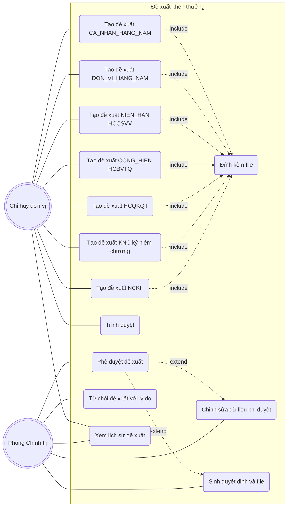

**Đặc thù**: Đây là use case **trung tâm** của hệ thống. **7 loại đề xuất qua Strategy pattern** ở backend. Khen thưởng đột xuất (DOT_XUAT) có flow riêng — ADMIN tạo trực tiếp qua module `adhoc-awards`, không đi qua bảng `BangDeXuat` (xem A1.9 bên dưới).

---

## A1.9 — Use case phân rã: Khen thưởng đột xuất (Adhoc Awards)

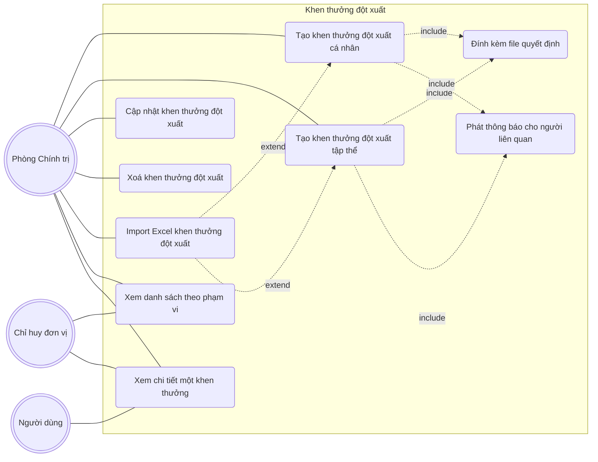

**Đặc thù**: Khác biệt so với A1.8 (Đề xuất khen thưởng):
- **Không qua duyệt 3 cấp**: ADMIN tạo trực tiếp, không có bước MANAGER review hay phê duyệt.
- **Không qua bảng `BangDeXuat`**: ghi thẳng vào bảng riêng `KhenThuongDotXuat`.
- **Không dùng Strategy pattern**: có service riêng `adhocAward.service.ts` với logic tách biệt.
- **Lý do thiết kế**: khen thưởng đột xuất xảy ra theo sự kiện / chiến công cụ thể, cần ghi nhận tức thì, không phù hợp với quy trình duyệt nhiều bước.
- **Phân quyền**: ADMIN tạo / sửa / xoá. MANAGER + USER chỉ xem theo phạm vi (đơn vị / cá nhân).

---

## A1.10 — Use case phân rã: Kiểm tra điều kiện chuỗi (Eligibility)

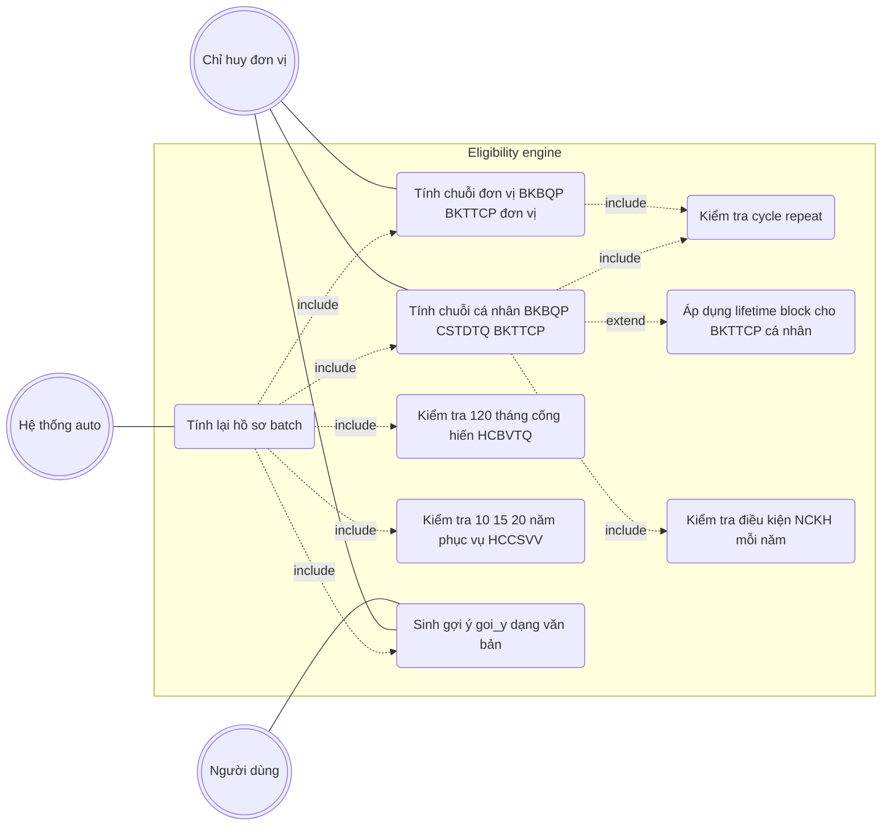

---

## A1.11 — Use case phân rã: Thông báo realtime (Socket.IO)

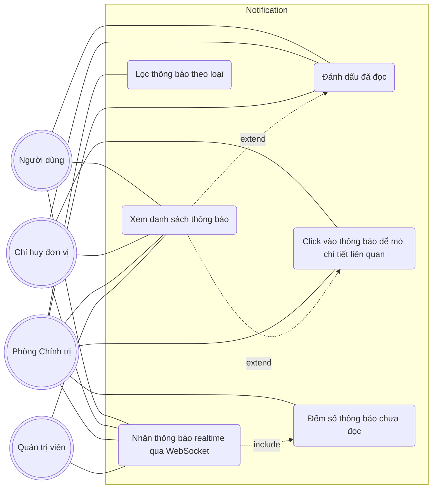

---

## A1.12 — Use case phân rã: Nhật ký hệ thống (Audit log)

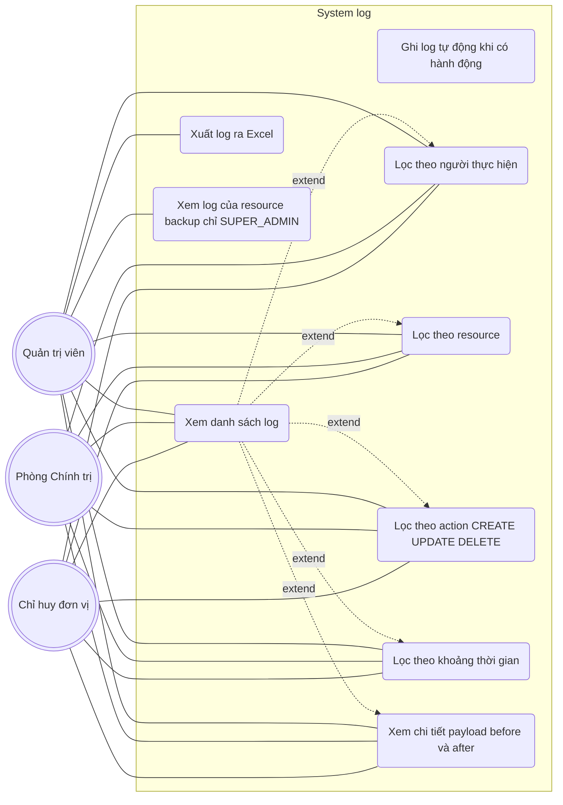

**Phân quyền**: route `/api/system-logs` dùng `requireManager` → cả SUPER_ADMIN, ADMIN và MANAGER đều được xem nhật ký. Tuy nhiên service `systemLogs.service.ts` áp filter:
- **UC9** — log có `resource: 'backup'` chỉ SUPER_ADMIN xem được; ADMIN và MANAGER bị filter loại bỏ hoàn toàn.
- MANAGER còn bị giới hạn theo phạm vi đơn vị: chỉ thấy log do tài khoản trong các đơn vị mình quản lý thực hiện (qua `getManagerAccountIds`).

---

## A1.13 — Use case phân rã: Sao lưu và khôi phục (Backup)

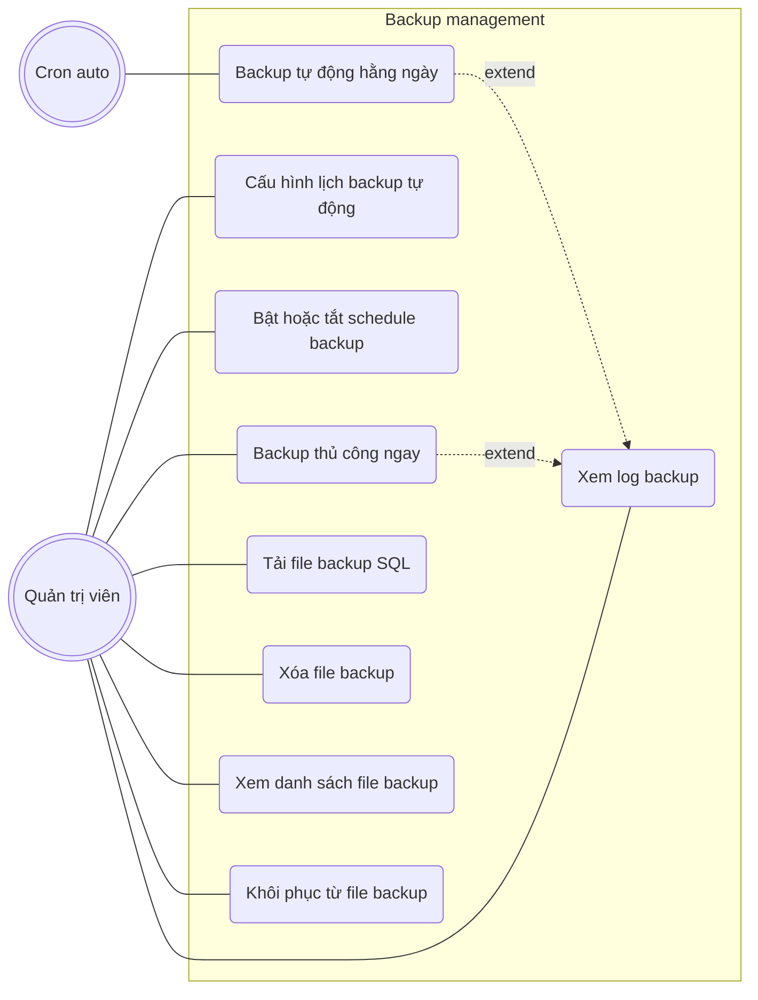

---

> **Ghi chú**: Phần "DevZone" (công cụ admin nâng cao truy cập bằng password riêng) **không** được vẽ thành use case nghiệp vụ — đây là internal tool, không phải tính năng cho actor sử dụng hằng ngày, không cần đưa vào báo cáo.

---

## A1.14 — Use case phân rã: Báo cáo và thống kê

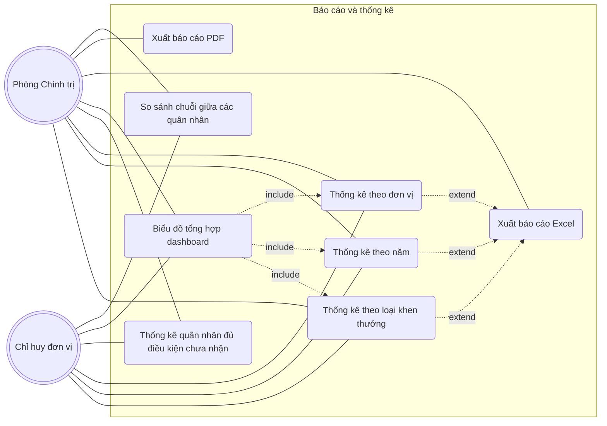

---

## Tổng kết

| # | Sơ đồ | Số use case | Actor |
|---|---|---|---|
| A1.1 | Use case tổng quát | 15 | 4 |
| A1.2 | Quản lý tài khoản | 9 | SUPER_ADMIN, ADMIN |
| A1.3 | Quản lý quân nhân | 11 | SUPER_ADMIN, ADMIN, MANAGER |
| A1.4 | Quản lý đơn vị | 10 | SUPER_ADMIN, ADMIN |
| A1.5 | Hằng năm cá nhân (thuộc UC5) | 10 | ADMIN, MANAGER, USER |
| A1.6 | Hằng năm đơn vị (thuộc UC5) | 7 | ADMIN, MANAGER |
| A1.7 | Niên hạn / Cống hiến / Thành tích khoa học (UC6-UC8) | 7 (+ 5 sub) | ADMIN, MANAGER, USER |
| A1.8 | Đề xuất khen thưởng (UC10) | 14 | MANAGER, ADMIN |
| A1.9 | Khen thưởng đột xuất (UC9 — flow riêng) | 9 | ADMIN, MANAGER, USER |
| A1.10 | Eligibility engine (UC11) | 9 | System, MANAGER, USER |
| A1.11 | Thông báo realtime (UC12) | 6 | 4 role |
| A1.12 | Nhật ký hệ thống (UC13) | 9 | SUPER_ADMIN, ADMIN, MANAGER |
| A1.13 | Backup (UC14) | 9 | SUPER_ADMIN, Cron |
| A1.14 | Báo cáo thống kê (UC15) | 8 | ADMIN, MANAGER |

**Tổng**: 1 sơ đồ tổng quát + 12 sơ đồ phân rã. DevZone không tính (internal tool).
