# Sơ đồ Use Case (Mermaid)

> **Render**: Copy block `mermaid` vào https://mermaid.live hoặc dùng VSCode Mermaid Preview extension. Để xuất PNG/SVG cho báo cáo, dùng `mermaid.live` → Export.
>
> **Lưu ý**: Mermaid `flowchart` không hỗ trợ notation UML use case thuần, nên dùng quy ước xấp xỉ:
> - Actor: hình `(((Tên Actor)))` (oval đôi)
> - Use case: hình `(Tên use case)` (oval)
> - Hệ thống: gói `subgraph`
> - `<<extend>>` / `<<include>>`: cạnh nét đứt `-.->`, mũi tên đi từ **UC nguồn (extension / base)** đến **UC đích (base / inclusion)** theo đúng chuẩn UML 2.5:
>   - `A -.->|include| B` đọc là *"A bao gộp B"* — A luôn kích hoạt B.
>   - `A -.->|extend| B` đọc là *"A mở rộng B"* — A là phần mở rộng, B là base; A có thể chèn vào B tại extension point.
> - Generalization actor: cạnh nét liền `-->` kèm nhãn `«generalization»` (vì Mermaid không vẽ được mũi tên rỗng UML).
>
> **Mức UC theo Cockburn** (áp dụng trong toàn bộ tài liệu):
> - **User-goal level** (mặc định, không đánh dấu): UC đem lại giá trị nghiệp vụ độc lập cho actor — ví dụ *Tạo đề xuất khen thưởng*, *Phê duyệt đề xuất*.
> - **`«subfunction»`** (đánh dấu trong stereotype): UC mức thấp hơn dùng làm bước phụ trợ — ví dụ *Xem danh sách X*, *Tìm kiếm và lọc X*, *Xem chi tiết Y*. Các UC dạng này xuất hiện ở hầu hết module nhưng **không vẽ stereotype trên từng UC** để tránh nhiễu — tham chiếu danh sách dưới đây.
> - **`«module CRUD»`** (đánh dấu trong tên UC): UC đại diện cho gói 4 sub-operation Thêm/Sửa/Xoá/Xem trên cùng entity — chỉ dùng ở A1.7 nơi có 5 loại khen thưởng cùng pattern.
>
> **Các UC mặc định mức `«subfunction»`** (không lặp đánh dấu trong sơ đồ): Xem danh sách (A1.2 UC6, A1.3 UC4, A1.7 UC1–5 sub, A1.8 UC14, A1.11 UC2, A1.12 UC2, A1.15 UC1), Tìm kiếm và lọc (A1.2 UC7, A1.3 UC5, A1.11 UC4, A1.12 UC3–UC6, A1.15 UC3–UC4), Xem chi tiết (A1.3 UC4, A1.7 UC1–5 sub, A1.9 UC8, A1.12 UC7).

---

## A1.1 — Use case tổng quát

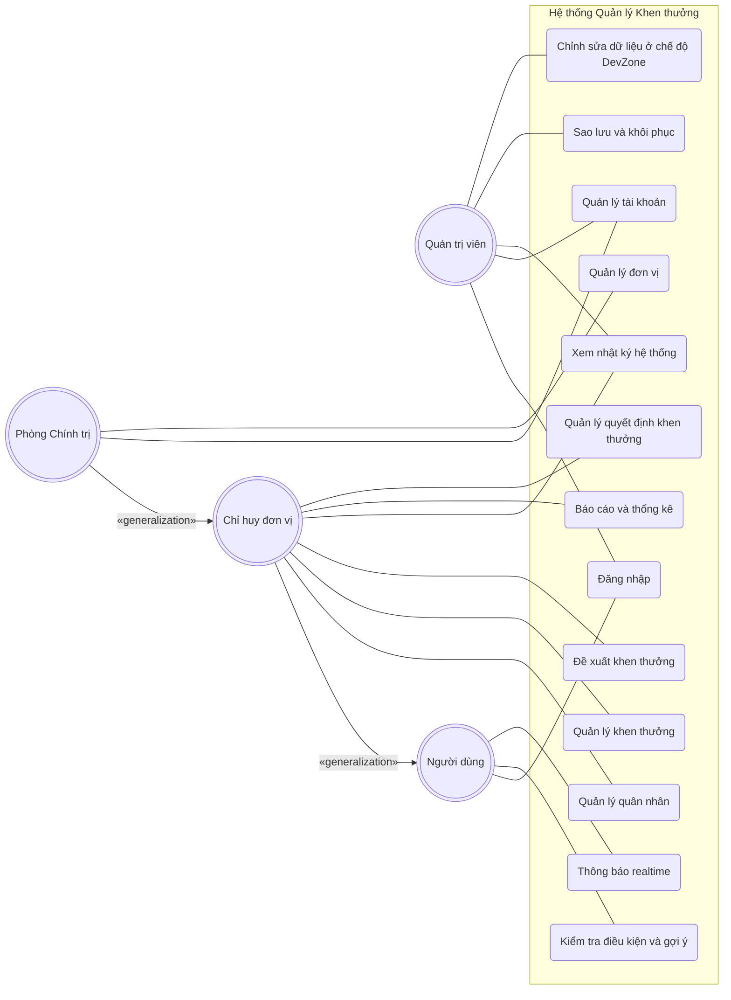
```mermaid
flowchart LR
    SA(((Quản trị viên)))
    AD(((Phòng Chính trị)))
    MG(((Chỉ huy đơn vị)))
    US(((Người dùng)))

    %% Actor generalization: AD → MG → US (SA là vai trò hệ thống độc lập)
    AD -->|«generalization»| MG
    MG -->|«generalization»| US

    subgraph SYS[Hệ thống Quản lý Khen thưởng]
        UC1(Đăng nhập)
        UC2(Quản lý tài khoản)
        UC3(Quản lý quân nhân)
        UC4(Quản lý đơn vị)
        UC5(Quản lý khen thưởng)
        UC6(Đề xuất khen thưởng)
        UC7(Kiểm tra điều kiện và gợi ý)
        UC8(Thông báo realtime)
        UC9(Xem nhật ký hệ thống)
        UC10(Sao lưu và khôi phục)
        UC11(Báo cáo và thống kê)
        UC12(Chỉnh sửa dữ liệu ở chế độ DevZone)
        UC13(Quản lý quyết định khen thưởng)
    end

    %% US: use case gốc (MG, AD kế thừa)
    US --- UC1
    US --- UC7
    US --- UC8

    %% MG: thêm những UC không có ở US
    MG --- UC3
    MG --- UC5
    MG --- UC6
    MG --- UC9
    MG --- UC11
    MG --- UC13

    %% AD: thêm những UC không có ở MG
    AD --- UC2
    AD --- UC4

    %% SA: vai trò hệ thống độc lập — không kế thừa AD
    SA --- UC1
    SA --- UC2
    SA --- UC9
    SA --- UC10
    SA --- UC12
```

**Quan hệ kế thừa actor**: `AD → MG → US` — ADMIN (Phòng Chính trị) kế thừa toàn bộ quyền MANAGER và bổ sung quản lý tài khoản + đơn vị; MANAGER kế thừa quyền USER và bổ sung quản lý nghiệp vụ khen thưởng.

**SUPER_ADMIN là vai trò hệ thống độc lập**: KHÔNG kế thừa từ ADMIN. SA phụ trách quản trị hệ thống (tài khoản, sao lưu, nhật ký đầy đủ, sửa dữ liệu) và không tham gia luồng nghiệp vụ khen thưởng.

**UC5 — Quản lý khen thưởng** gộp 8 nhóm nghiệp vụ (chi tiết ở sơ đồ phân rã A1.3 – A1.9): danh hiệu cá nhân hằng năm, khen thưởng đơn vị hằng năm, Huy chương Chiến sĩ vẻ vang, Huy chương Quân kỳ quyết thắng, Kỷ niệm chương, Huân chương Bảo vệ Tổ quốc, thành tích khoa học, khen thưởng đột xuất.

> Sơ đồ tổng quan **không** vẽ quan hệ `<<include>>` / `<<extend>>` giữa các use case. Quan hệ chi tiết mô tả trong từng sơ đồ phân rã A1.2 – A1.10.

---

## A1.2 — Use case phân rã: Quản lý tài khoản và phân quyền

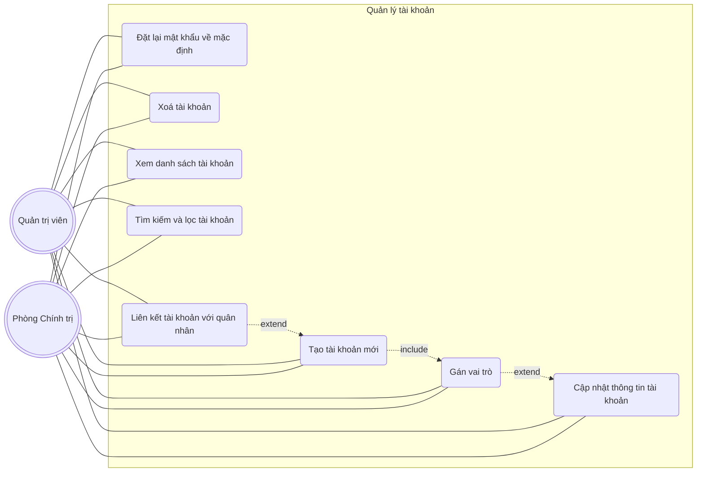
```mermaid
flowchart LR
    SA(((Quản trị viên)))
    AD(((Phòng Chính trị)))

    subgraph SYS[Quản lý tài khoản]
        UC1(Tạo tài khoản mới)
        UC2(Cập nhật thông tin tài khoản)
        UC3(Đặt lại mật khẩu về mặc định)
        UC4(Xoá tài khoản)
        UC5(Gán vai trò)
        UC6(Xem danh sách tài khoản)
        UC7(Tìm kiếm và lọc tài khoản)
        UC8(Liên kết tài khoản với quân nhân)

        UC1 -.->|include| UC5
        UC8 -.->|extend| UC1
        UC5 -.->|extend| UC2
    end

    SA --- UC1
    SA --- UC2
    SA --- UC3
    SA --- UC4
    SA --- UC5
    SA --- UC6
    SA --- UC7
    SA --- UC8

    AD --- UC1
    AD --- UC2
    AD --- UC3
    AD --- UC4
    AD --- UC5
    AD --- UC6
    AD --- UC7
    AD --- UC8
```

**Quyền**: route `/api/accounts` dùng middleware `requireAdmin` (SA + ADMIN) — đây là điểm giao thoa duy nhất giữa SA và ADMIN, vì quản lý tài khoản vừa là hệ thống vừa cần am hiểu cơ cấu tổ chức.

---

## A1.3 — Use case phân rã: Quản lý quân nhân

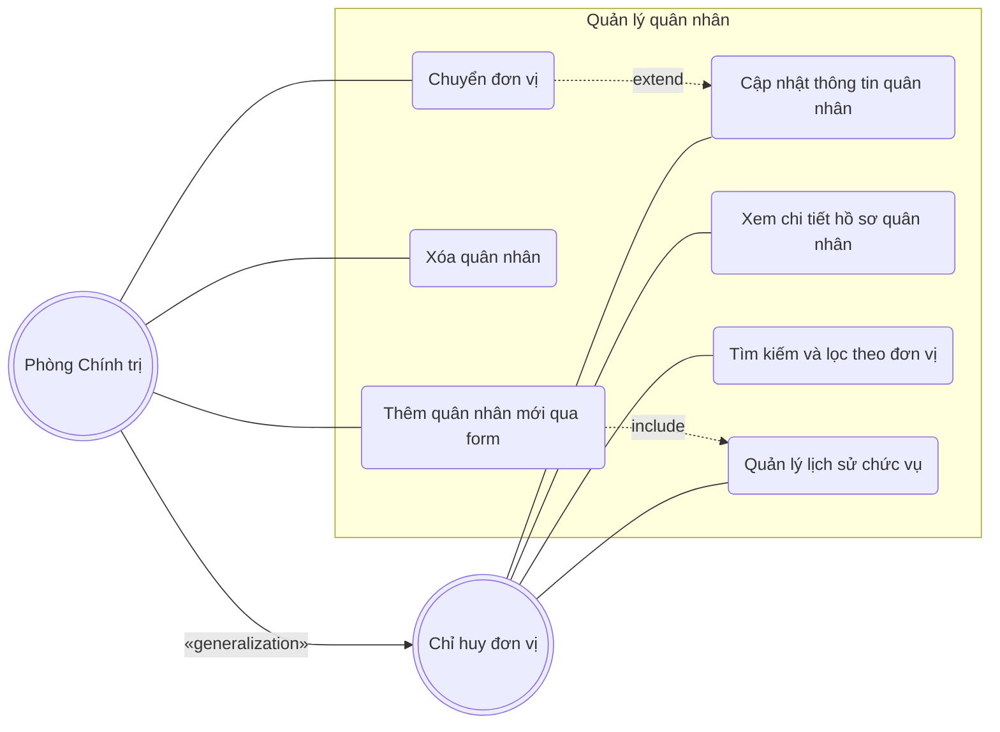
```mermaid
flowchart LR
    AD(((Phòng Chính trị)))
    MG(((Chỉ huy đơn vị)))

    subgraph SYS[Quản lý quân nhân]
        UC1(Thêm quân nhân mới qua form)
        UC2(Cập nhật thông tin quân nhân)
        UC3(Xóa quân nhân)
        UC4(Xem chi tiết hồ sơ quân nhân)
        UC5(Tìm kiếm và lọc theo đơn vị)
        UC6(Chuyển đơn vị)
        UC7(Quản lý lịch sử chức vụ)

        UC1 -.->|include| UC7
        UC6 -.->|extend| UC2
    end

    AD -->|«generalization»| MG

    AD --- UC1
    AD --- UC3

    AD --- UC6

    MG --- UC2
    MG --- UC4
    MG --- UC5
    MG --- UC7
```

**Phân quyền route**:
- POST/DELETE (`/api/personnel`): `requireAdmin` → SUPER_ADMIN + ADMIN.
- PUT `/api/personnel/:id`: `requireManager` → ADMIN + MANAGER (MANAGER chỉ sửa thông tin chung quân nhân thuộc đơn vị mình; **không được chuyển đơn vị và không được đổi chức vụ** — hai việc này ADMIN-only, enforce trong `personnel/update.ts`). USER **không** sửa được hồ sơ.
- Lịch sử chức vụ (`/api/personnel/:id/...` nested): `requireManager` — nhưng khi **thêm**, MANAGER chỉ được thêm giai đoạn **đã kết thúc** (bắt buộc có ngày kết thúc); giai đoạn hiện tại đang mở là ADMIN-only (enforce trong `positionHistory.service.ts`).
- GET list / detail: MANAGER xem được trong phạm vi đơn vị; USER chỉ xem hồ sơ của chính mình (route `/profile/me`).
- `POST /check-contribution-eligibility`: `requireManager` → USER **không** gọi được.

**Lưu ý**: Bảng `QuanNhan` **không hỗ trợ Excel import/export** — chỉ thêm thủ công qua form. Excel import/export chỉ áp dụng cho các loại khen thưởng (xem A1.7).

---

## A1.4 — Use case phân rã: Quản lý đơn vị (CQDV / DVTT)

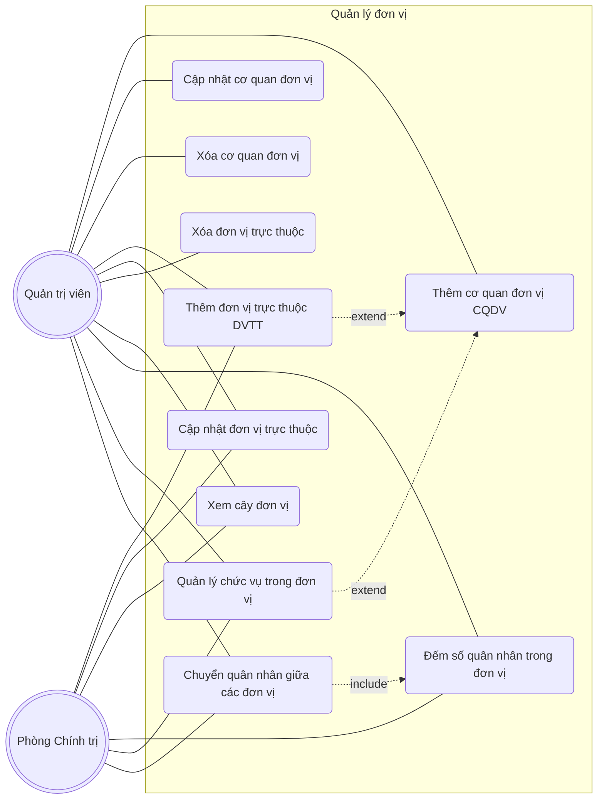
```mermaid
flowchart LR
    SA(((Quản trị viên)))
    AD(((Phòng Chính trị)))

    subgraph SYS[Quản lý đơn vị]
        UC1(Thêm cơ quan đơn vị CQDV)
        UC2(Cập nhật cơ quan đơn vị)
        UC3(Xóa cơ quan đơn vị)
        UC4(Thêm đơn vị trực thuộc DVTT)
        UC5(Cập nhật đơn vị trực thuộc)
        UC6(Xóa đơn vị trực thuộc)
        UC7(Xem cây đơn vị)
        UC8(Đếm số quân nhân trong đơn vị)
        UC9(Quản lý chức vụ trong đơn vị)
        UC10(Chuyển quân nhân giữa các đơn vị)

        UC4 -.->|extend| UC1
        UC9 -.->|extend| UC1
        UC10 -.->|include| UC8
    end

    SA --- UC1
    SA --- UC2
    SA --- UC3
    SA --- UC4
    SA --- UC5
    SA --- UC6
    SA --- UC7
    SA --- UC8
    SA --- UC9
    SA --- UC10

    AD --- UC4
    AD --- UC5
    AD --- UC7
    AD --- UC8
    AD --- UC9
    AD --- UC10
```

---

## A1.5 — Use case phân rã: Quản lý khen thưởng cá nhân hằng năm (chuỗi BKBQP / CSTDTQ / BKTTCP)

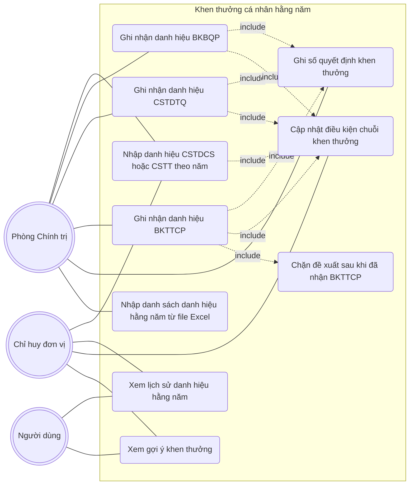
```mermaid
flowchart LR
    AD(((Phòng Chính trị)))
    MG(((Chỉ huy đơn vị)))
    US(((Người dùng)))

    subgraph SYS[Khen thưởng cá nhân hằng năm]
        UC1(Nhập danh hiệu CSTDCS hoặc CSTT theo năm)
        UC2(Ghi nhận danh hiệu BKBQP)
        UC3(Ghi nhận danh hiệu CSTDTQ)
        UC4(Ghi nhận danh hiệu BKTTCP)
        UC5(Ghi số quyết định khen thưởng)
        UC6(Xem lịch sử danh hiệu hằng năm)
        UC7(Cập nhật điều kiện chuỗi khen thưởng)
        UC8(Xem gợi ý khen thưởng)
        UC9(Nhập danh sách danh hiệu hằng năm từ file Excel)
        UC10(Chặn đề xuất sau khi đã nhận BKTTCP)

        UC2 -.->|include| UC5
        UC3 -.->|include| UC5
        UC4 -.->|include| UC5
        UC1 -.->|include| UC7
        UC2 -.->|include| UC7
        UC3 -.->|include| UC7
        UC4 -.->|include| UC7
        UC4 -.->|include| UC10
    end

    AD --- UC1
    AD --- UC2
    AD --- UC3
    AD --- UC4
    AD --- UC5
    AD --- UC9

    MG --- UC1
    MG --- UC6
    MG --- UC7
    MG --- UC8

    US --- UC6
    US --- UC8
```

**Đặc thù**: UC10 — sau khi quân nhân đã nhận BKTTCP, hệ thống từ chối mọi đề xuất thêm với message "Đã có BKTTCP. Phần mềm chưa hỗ trợ các danh hiệu cao hơn..."

**Scope UC6 (Xem lịch sử)**: UC6 có 2 phạm vi dữ liệu tách biệt:
- **MANAGER**: xem lịch sử của quân nhân thuộc đơn vị quản lý (qua `getUnitScopedPersonnel`).
- **USER**: chỉ xem lịch sử của **chính mình** qua route `/profile/me` (không xem được quân nhân khác).

Hai trường hợp chia sẻ cùng UC vì hành vi (đọc danh sách `DanhHieuHangNam`) đồng nhất, chỉ khác filter scope ở backend — không tách thành 2 UC riêng để tránh phình sơ đồ.

---

## A1.6 — Use case phân rã: Quản lý khen thưởng đơn vị hằng năm

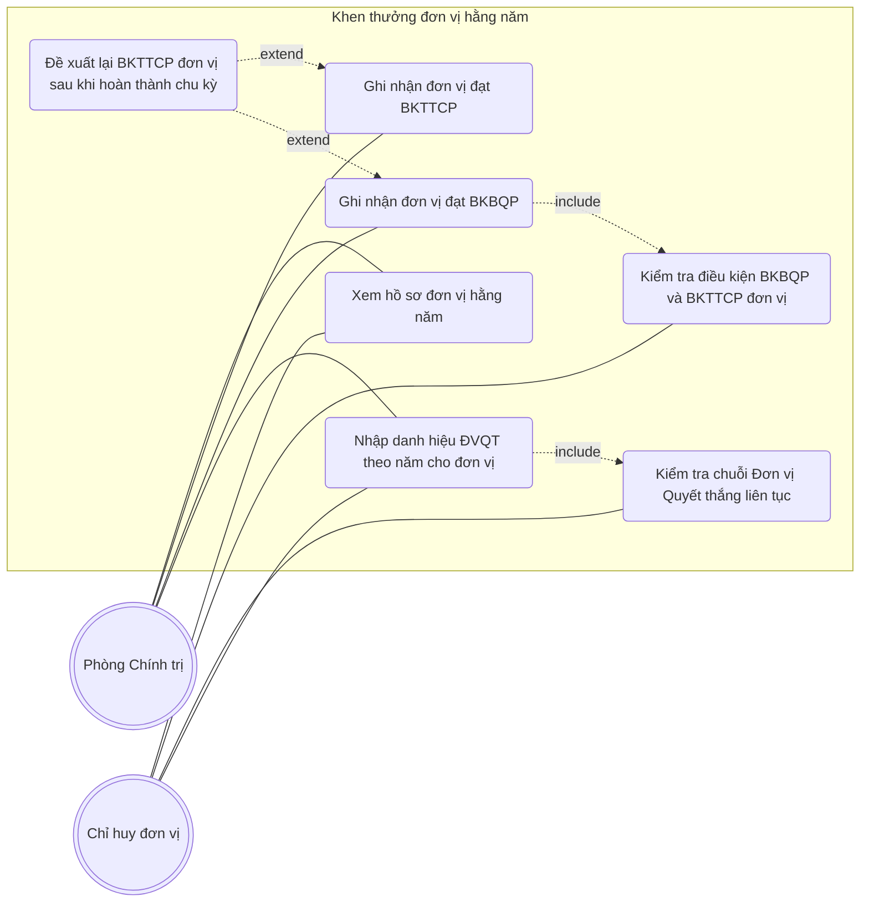
```mermaid
flowchart LR
    AD(((Phòng Chính trị)))
    MG(((Chỉ huy đơn vị)))

    subgraph SYS[Khen thưởng đơn vị hằng năm]
        UC1(Nhập danh hiệu ĐVQT theo năm cho đơn vị)
        UC2(Ghi nhận đơn vị đạt BKBQP)
        UC3(Ghi nhận đơn vị đạt BKTTCP)
        UC4(Kiểm tra chuỗi Đơn vị Quyết thắng liên tục)
        UC5(Kiểm tra điều kiện BKBQP và BKTTCP đơn vị)
        UC6(Xem hồ sơ đơn vị hằng năm)
        UC7(Đề xuất lại BKTTCP đơn vị sau khi hoàn thành chu kỳ)

        UC1 -.->|include| UC4
        UC2 -.->|include| UC5
        UC7 -.->|extend| UC2
        UC7 -.->|extend| UC3
    end

    AD --- UC1
    AD --- UC2
    AD --- UC3
    AD --- UC6
    MG --- UC1
    MG --- UC4
    MG --- UC5
    MG --- UC6
```

**Khác personal**: BKTTCP đơn vị `isLifetime: false` — đơn vị có thể nhận BKTTCP lặp lại sau mỗi 7 năm (cycle repeat). Personal BKTTCP `isLifetime: true` chỉ nhận 1 lần.

---

## A1.7 — Use case phân rã: HCCSVV / HCBVTQ / HCQKQT / KNC / NCKH

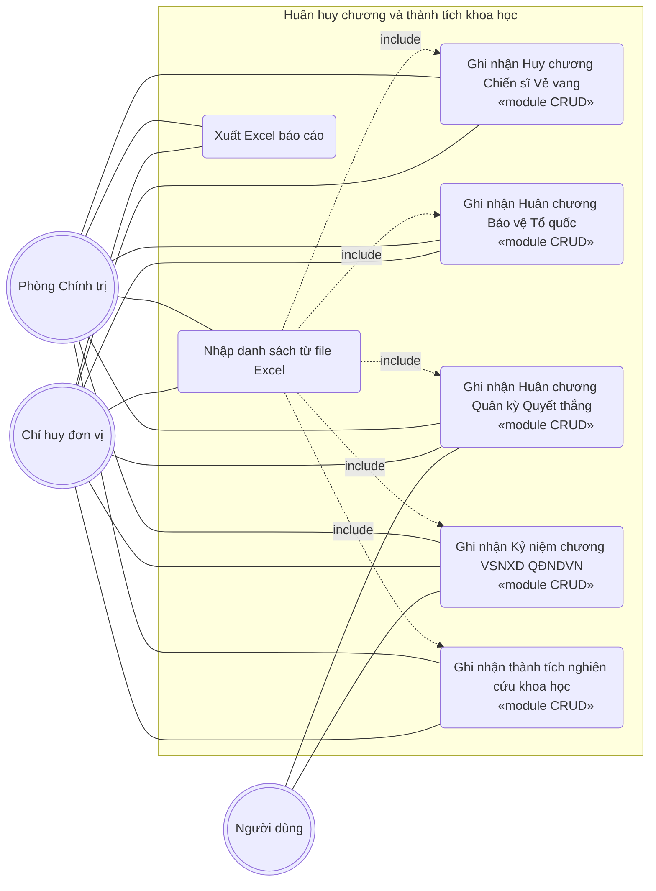
```mermaid
flowchart LR
    AD(((Phòng Chính trị)))
    MG(((Chỉ huy đơn vị)))
    US(((Người dùng)))

    subgraph SYS[Huân huy chương và thành tích khoa học]
        UC1("Ghi nhận Huy chương Chiến sĩ Vẻ vang
        «module CRUD»")
        UC2("Ghi nhận Huân chương Bảo vệ Tổ quốc
        «module CRUD»")
        UC3("Ghi nhận Huân chương Quân kỳ Quyết thắng
        «module CRUD»")
        UC4("Ghi nhận Kỷ niệm chương VSNXD QĐNDVN
        «module CRUD»")
        UC5("Ghi nhận thành tích nghiên cứu khoa học
        «module CRUD»")
        UC6(Nhập danh sách từ file Excel)
        UC7(Xuất Excel báo cáo)

        UC6 -.->|include| UC1
        UC6 -.->|include| UC2
        UC6 -.->|include| UC3
        UC6 -.->|include| UC4
        UC6 -.->|include| UC5
    end

    AD --- UC1
    AD --- UC2
    AD --- UC3
    AD --- UC4
    AD --- UC5
    AD --- UC6
    AD --- UC7

    MG --- UC1
    MG --- UC2
    MG --- UC3
    MG --- UC4
    MG --- UC5
    MG --- UC6
    MG --- UC7

    US --- UC3
    US --- UC4
```

**Lưu ý phạm vi UC**: các quy tắc tính niên hạn (10/15/20 năm phục vụ HCCSVV, 120 tháng tích lũy HCBVTQ, thời điểm tính HCQKQT từ ngày nhập ngũ, 20/25 năm KNC, phân loại đề tài NCKH) **không vẽ thành sub-UC** vì đây là **business rule** thuộc domain layer, không phải hành vi mà actor invoke. Chi tiết rule được đặc tả trong báo cáo §5.1 và mô-đun `services/eligibility/` (BE). Xem activity diagram §A2 để biết flow áp dụng rule.

**Module CRUD**: UC1–UC5 được đánh dấu `«module CRUD»` — mỗi UC gói 4 sub-operation (Thêm / Sửa / Xoá / Xem) thao tác trên cùng entity. Lý do không tách thành 20 UC riêng: (a) tránh phình sơ đồ với CRUD lặp giống nhau ở 5 loại, (b) flow và phân quyền của 4 sub-op trong cùng module là đồng nhất. Đặc tả từng sub-op chi tiết trong `08-use-case-specs.md`.

**Endpoints thực tế + phân quyền** (trong code):
- `routes/{tenureMedal,contributionMedal,commemorativeMedal,militaryFlag,scientificAchievement,annualReward,unitAnnualAward}.route.ts` cho `/import/preview` + `/import/confirm` (+ `/import`) đều dùng `requireAdminOnly` → **Excel import là ADMIN-only**, MANAGER **không** import được loại nào (kể cả NCKH và khen thưởng đơn vị hằng năm). MANAGER vẫn `/template` ở một số route nhưng không thực hiện import.
- USER chỉ truy cập `/personnel/:personnel_id` của `military-flags` (UC3 — HCQKQT) và `commemorative-medals` (UC4 — KNC) — không xem trực tiếp HCCSVV (UC1) và HCBVTQ (UC2). Hồ sơ niên hạn / cống hiến của bản thân USER xem qua `/profile/me`, không qua các route này.

**Lưu ý**: Khen thưởng đột xuất (DOT_XUAT) **không nằm trong sơ đồ này** vì có flow vận hành riêng — xem **A1.9** để biết chi tiết (ADMIN tạo trực tiếp, không qua duyệt 3 cấp, không có tính niên hạn).

---

## A1.8 — Use case phân rã: Đề xuất khen thưởng (Proposal)

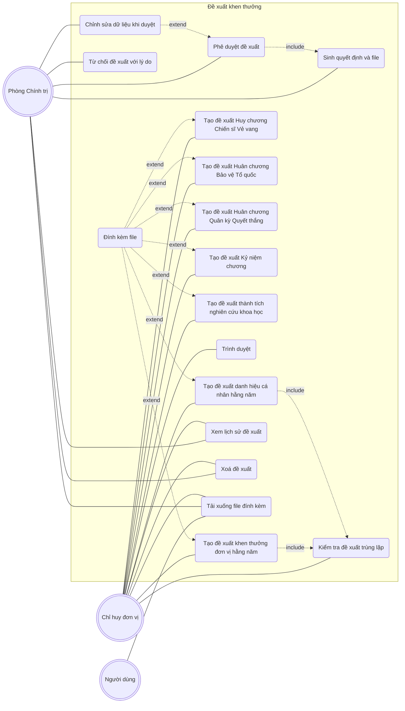
```mermaid
flowchart LR
    MG(((Chỉ huy đơn vị)))
    AD(((Phòng Chính trị)))
    US(((Người dùng)))

    subgraph SYS[Đề xuất khen thưởng]
        UC1(Tạo đề xuất danh hiệu cá nhân hằng năm)
        UC2(Tạo đề xuất khen thưởng đơn vị hằng năm)
        UC3(Tạo đề xuất Huy chương Chiến sĩ Vẻ vang)
        UC4(Tạo đề xuất Huân chương Bảo vệ Tổ quốc)
        UC5(Tạo đề xuất Huân chương Quân kỳ Quyết thắng)
        UC6(Tạo đề xuất Kỷ niệm chương)
        UC7(Tạo đề xuất thành tích nghiên cứu khoa học)
        UC8(Đính kèm file)
        UC9(Trình duyệt)
        UC10(Phê duyệt đề xuất)
        UC11(Từ chối đề xuất với lý do)
        UC12(Chỉnh sửa dữ liệu khi duyệt)
        UC13(Sinh quyết định và file)
        UC14(Xem lịch sử đề xuất)
        UC15(Kiểm tra đề xuất trùng lặp)
        UC16(Xoá đề xuất)
        UC17(Tải xuống file đính kèm)

        UC8 -.->|extend| UC1
        UC8 -.->|extend| UC2
        UC8 -.->|extend| UC3
        UC8 -.->|extend| UC4
        UC8 -.->|extend| UC5
        UC8 -.->|extend| UC6
        UC8 -.->|extend| UC7
        UC1 -.->|include| UC15
        UC2 -.->|include| UC15
        UC12 -.->|extend| UC10
        UC10 -.->|include| UC13
    end

    MG --- UC1
    MG --- UC2
    MG --- UC3
    MG --- UC4
    MG --- UC5
    MG --- UC6
    MG --- UC7
    MG --- UC9
    MG --- UC14
    MG --- UC15
    MG --- UC16
    MG --- UC17

    AD --- UC10
    AD --- UC11
    AD --- UC12
    AD --- UC13
    AD --- UC14
    AD --- UC16
    AD --- UC17

    US --- UC17
```

**UC16 (Xoá đề xuất)**: thêm trong commit gần đây (`6e27f06`). Xoá đề xuất chỉ khi ở trạng thái PENDING (chờ duyệt) — APPROVED/REJECTED không được xoá để giữ lịch sử khen thưởng.

**Đặc thù**: Đây là use case **trung tâm** của hệ thống. **7 loại đề xuất qua Strategy pattern** ở backend. Khen thưởng đột xuất (DOT_XUAT) có flow riêng — ADMIN tạo trực tiếp qua module `adhoc-awards`, không đi qua bảng `BangDeXuat` (xem A1.9 bên dưới).

---

## A1.9 — Use case phân rã: Khen thưởng đột xuất (Adhoc Awards)

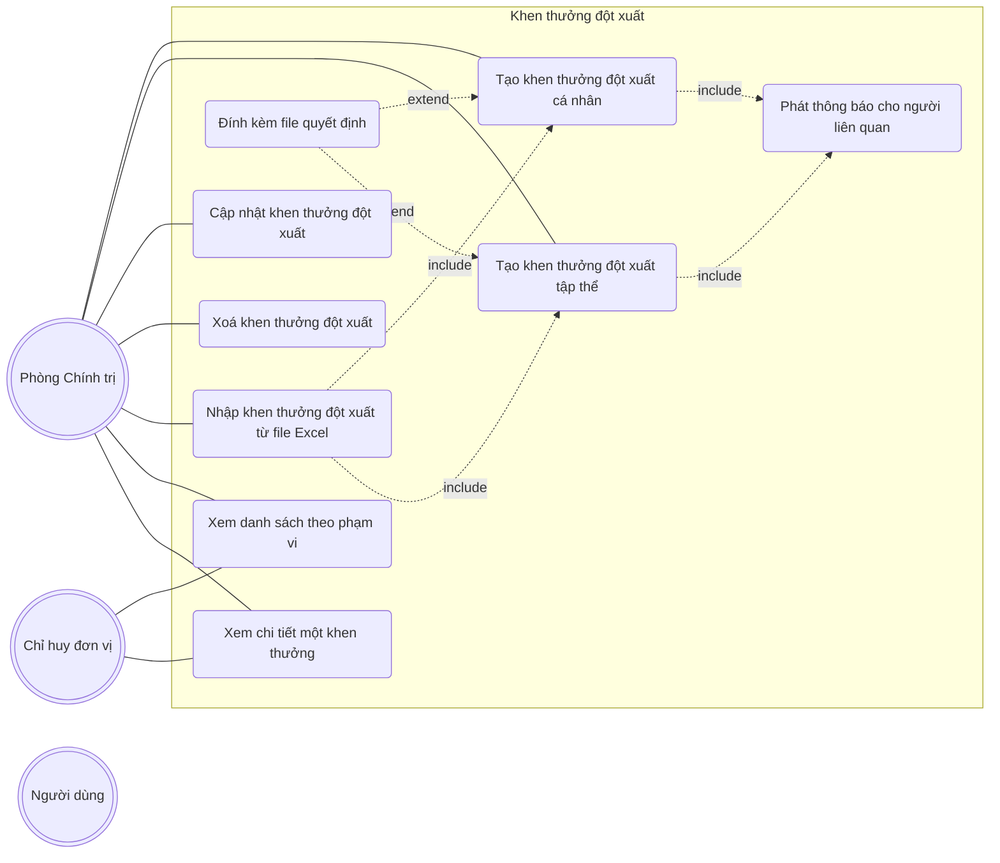
```mermaid
flowchart LR
    AD(((Phòng Chính trị)))
    MG(((Chỉ huy đơn vị)))
    US(((Người dùng)))

    subgraph SYS[Khen thưởng đột xuất]
        UC1(Tạo khen thưởng đột xuất cá nhân)
        UC2(Tạo khen thưởng đột xuất tập thể)
        UC3(Cập nhật khen thưởng đột xuất)
        UC4(Xoá khen thưởng đột xuất)
        UC5(Đính kèm file quyết định)
        UC6(Nhập khen thưởng đột xuất từ file Excel)
        UC7(Xem danh sách theo phạm vi)
        UC8(Xem chi tiết một khen thưởng)
        UC9(Phát thông báo cho người liên quan)

        UC5 -.->|extend| UC1
        UC5 -.->|extend| UC2
        UC1 -.->|include| UC9
        UC2 -.->|include| UC9
        UC6 -.->|include| UC1
        UC6 -.->|include| UC2
    end

    AD --- UC1
    AD --- UC2
    AD --- UC3
    AD --- UC4
    AD --- UC6
    AD --- UC7
    AD --- UC8

    MG --- UC7
    MG --- UC8
```

**Đặc thù**: Khác biệt so với A1.8 (Đề xuất khen thưởng):
- **Không qua duyệt 3 cấp**: ADMIN tạo trực tiếp, không có bước MANAGER review hay phê duyệt.
- **Không qua bảng `BangDeXuat`**: ghi thẳng vào bảng riêng `KhenThuongDotXuat`.
- **Không dùng Strategy pattern**: có service riêng `adhocAward.service.ts` với logic tách biệt.
- **Lý do thiết kế**: khen thưởng đột xuất xảy ra theo sự kiện / chiến công cụ thể, cần ghi nhận tức thì, không phù hợp với quy trình duyệt nhiều bước.
- **Phân quyền**: ADMIN tạo / sửa / xoá. ADMIN + MANAGER xem theo phạm vi (USER không truy cập khen thưởng đột xuất).

---

## A1.10 — Use case phân rã: Xét điều kiện khen thưởng

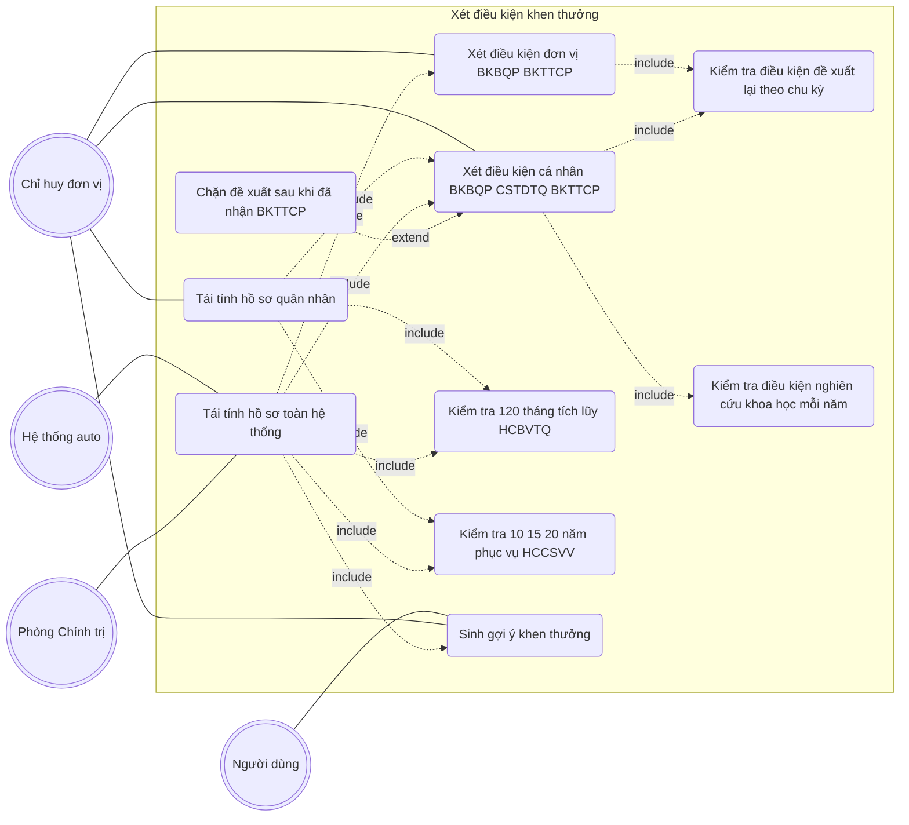
```mermaid
flowchart LR
    AD(((Phòng Chính trị)))
    SYSTEM(((Hệ thống auto)))
    MG(((Chỉ huy đơn vị)))
    US(((Người dùng)))

    subgraph SYS[Xét điều kiện khen thưởng]
        UC1(Xét điều kiện cá nhân BKBQP CSTDTQ BKTTCP)
        UC2(Xét điều kiện đơn vị BKBQP BKTTCP)
        UC3(Kiểm tra điều kiện đề xuất lại theo chu kỳ)
        UC4(Chặn đề xuất sau khi đã nhận BKTTCP)
        UC5(Kiểm tra 120 tháng tích lũy HCBVTQ)
        UC6(Kiểm tra 10 15 20 năm phục vụ HCCSVV)
        UC7(Kiểm tra điều kiện nghiên cứu khoa học mỗi năm)
        UC8(Sinh gợi ý khen thưởng)
        UC9(Tái tính hồ sơ toàn hệ thống)
        UC10(Tái tính hồ sơ quân nhân)

        UC1 -.->|include| UC3
        UC4 -.->|extend| UC1
        UC1 -.->|include| UC7
        UC2 -.->|include| UC3
        UC9 -.->|include| UC1
        UC9 -.->|include| UC2
        UC9 -.->|include| UC5
        UC9 -.->|include| UC6
        UC9 -.->|include| UC8
        UC10 -.->|include| UC1
        UC10 -.->|include| UC5
        UC10 -.->|include| UC6
    end

    AD --- UC9
    SYSTEM --- UC9
    MG --- UC1
    MG --- UC2
    MG --- UC8
    MG --- UC10
    US --- UC8
```

**Phân quyền route**:
- `POST /api/profiles/recalculate-all` (UC9 — batch toàn hệ thống): `requireAdminOnly` → chỉ ADMIN. Cron có thể trigger nội bộ.
- `POST /api/profiles/recalculate/:personnel_id` (UC10 — recalc 1 quân nhân): `requireManager` → ADMIN + MANAGER.

---

## A1.11 — Use case phân rã: Thông báo realtime (Socket.IO)

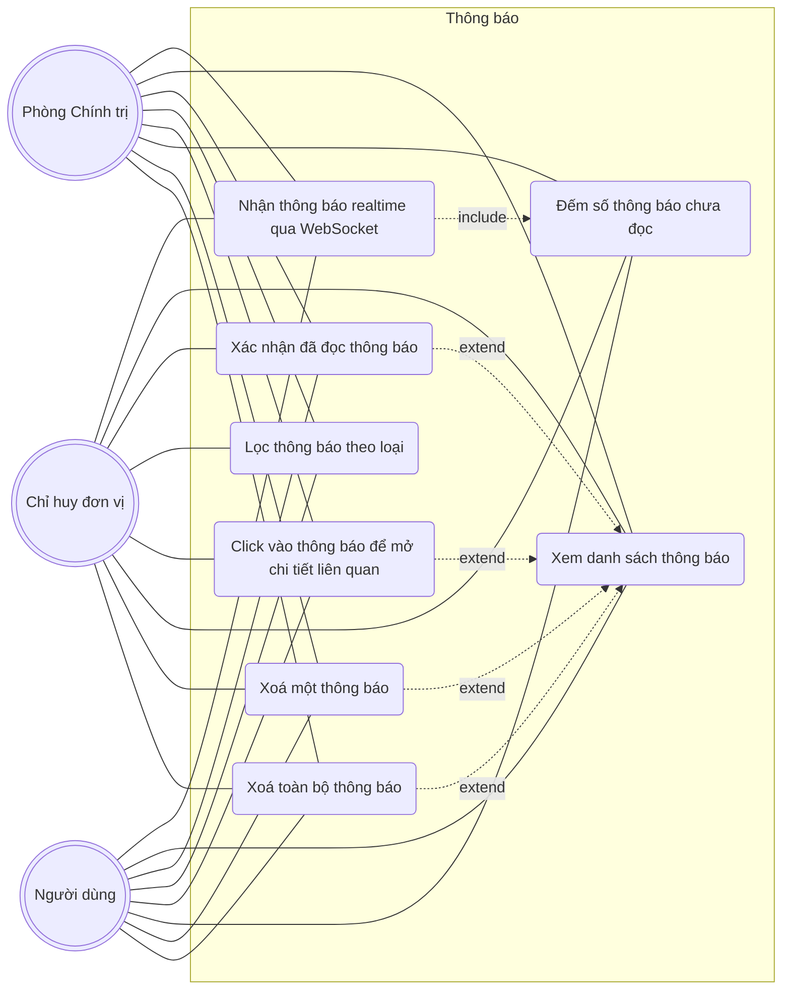
```mermaid
flowchart LR
    AD(((Phòng Chính trị)))
    MG(((Chỉ huy đơn vị)))
    US(((Người dùng)))

    subgraph SYS[Thông báo]
        UC1(Nhận thông báo realtime qua WebSocket)
        UC2(Xem danh sách thông báo)
        UC3(Xác nhận đã đọc thông báo)
        UC4(Lọc thông báo theo loại)
        UC5(Click vào thông báo để mở chi tiết liên quan)
        UC6(Đếm số thông báo chưa đọc)
        UC7(Xoá một thông báo)
        UC8(Xoá toàn bộ thông báo)

        UC1 -.->|include| UC6
        UC3 -.->|extend| UC2
        UC5 -.->|extend| UC2
        UC7 -.->|extend| UC2
        UC8 -.->|extend| UC2
    end

    AD --- UC1
    AD --- UC2
    AD --- UC3
    AD --- UC4
    AD --- UC5
    AD --- UC6
    AD --- UC7
    AD --- UC8
    MG --- UC1
    MG --- UC2
    MG --- UC3
    MG --- UC4
    MG --- UC5
    MG --- UC6
    MG --- UC7
    MG --- UC8
    US --- UC1
    US --- UC2
    US --- UC3
    US --- UC4
    US --- UC5
    US --- UC6
    US --- UC7
    US --- UC8
```

**Phân quyền**: route `/api/notifications` chỉ yêu cầu `verifyToken` — ADMIN, MANAGER và USER đều xem/lọc/đánh dấu/xoá thông báo của chính mình. **SA không nhận thông báo nghiệp vụ** (hệ thống chỉ gửi đến ADMIN / MANAGER / USER theo luồng đề xuất, quân nhân, khen thưởng).

---

## A1.12 — Use case phân rã: Nhật ký hệ thống (Audit log)

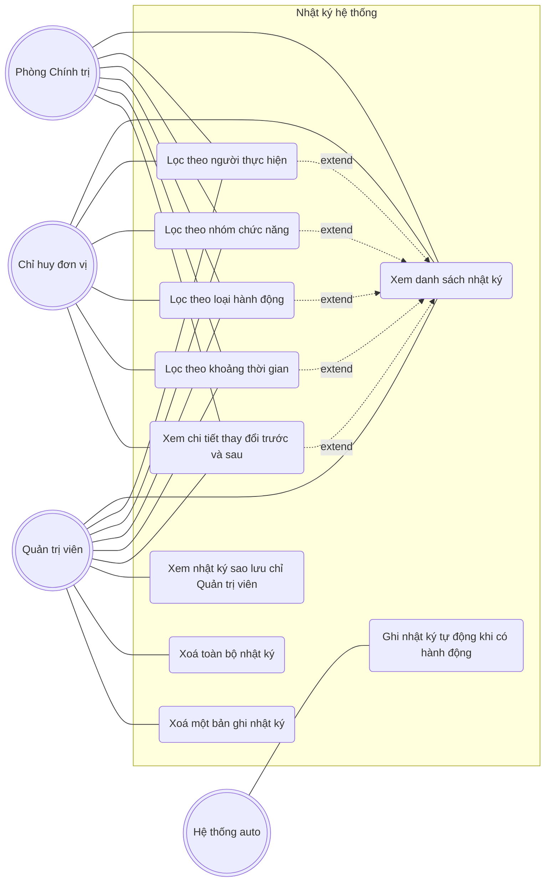
```mermaid
flowchart LR
    SA(((Quản trị viên)))
    AD(((Phòng Chính trị)))
    MG(((Chỉ huy đơn vị)))
    SYSTEM(((Hệ thống auto)))

    subgraph SYS[Nhật ký hệ thống]
        UC1(Ghi nhật ký tự động khi có hành động)
        UC2(Xem danh sách nhật ký)
        UC3(Lọc theo người thực hiện)
        UC4(Lọc theo nhóm chức năng)
        UC5(Lọc theo loại hành động)
        UC6(Lọc theo khoảng thời gian)
        UC7(Xem chi tiết thay đổi trước và sau)
        UC8(Xem nhật ký sao lưu chỉ Quản trị viên)
        UC9(Xoá toàn bộ nhật ký)
        UC10(Xoá một bản ghi nhật ký)

        UC3 -.->|extend| UC2
        UC4 -.->|extend| UC2
        UC5 -.->|extend| UC2
        UC6 -.->|extend| UC2
        UC7 -.->|extend| UC2
    end

    SYSTEM --- UC1

    SA --- UC2
    SA --- UC3
    SA --- UC4
    SA --- UC5
    SA --- UC6
    SA --- UC7
    SA --- UC8
    SA --- UC9
    SA --- UC10

    AD --- UC2
    AD --- UC3
    AD --- UC4
    AD --- UC5
    AD --- UC6
    AD --- UC7

    MG --- UC2
    MG --- UC3
    MG --- UC4
    MG --- UC5
    MG --- UC6
    MG --- UC7
```

**Phân quyền**: route `/api/system-logs` (GET) dùng `requireManager` → SA, ADMIN và MANAGER đều xem được nhật ký. Service `systemLogs.service.ts` áp filter:
- **UC8** — log có `resource: 'backup'` chỉ SA xem được; ADMIN và MANAGER bị filter loại bỏ hoàn toàn.
- MANAGER bị giới hạn theo phạm vi đơn vị: chỉ thấy log do tài khoản trong các đơn vị mình quản lý thực hiện (qua `getManagerAccountIds`).
- **UC9 / UC10** (xoá log) — `DELETE /api/system-logs` và `/all` dùng `requireSuperAdmin` → **chỉ SA** xoá được. ADMIN và MANAGER không có quyền xoá.

**Lưu ý**: phần mềm **chưa hỗ trợ xuất log ra Excel** — không có endpoint export trên `system-logs.route.ts`.

---

## A1.13 — Use case phân rã: Sao lưu (Backup qua DevZone)

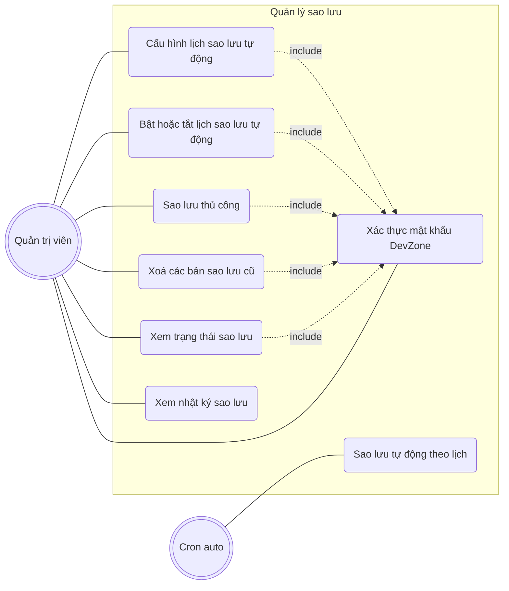
```mermaid
flowchart LR
    SA(((Quản trị viên)))
    SYSTEM(((Cron auto)))

    subgraph SYS[Quản lý sao lưu]
        UC1(Xác thực mật khẩu DevZone)
        UC2(Cấu hình lịch sao lưu tự động)
        UC3(Bật hoặc tắt lịch sao lưu tự động)
        UC4(Sao lưu thủ công)
        UC5(Xoá các bản sao lưu cũ)
        UC6(Xem trạng thái sao lưu)
        UC7(Sao lưu tự động theo lịch)
        UC8(Xem nhật ký sao lưu)

        UC2 -.->|include| UC1
        UC3 -.->|include| UC1
        UC4 -.->|include| UC1
        UC5 -.->|include| UC1
        UC6 -.->|include| UC1
    end

    SA --- UC1
    SA --- UC2
    SA --- UC3
    SA --- UC4
    SA --- UC5
    SA --- UC6
    SA --- UC8

    SYSTEM --- UC7
```

**Phân quyền**: tất cả route `/api/dev-zone/backup/*` đều yêu cầu middleware `verifyDevPassword` (mật khẩu DevZone riêng, không dùng JWT). Trong thực tế chỉ SUPER_ADMIN biết mật khẩu này.

**Khả năng chưa có**:
- **Tải file backup qua HTTP** — phần mềm không expose endpoint download. SUPER_ADMIN phải SSH vào server lấy file `.sql` thủ công từ thư mục `BE-QLKT/backups/`.
- **Xoá file riêng lẻ qua API** — chỉ có cleanup theo `retention_days`, không có DELETE từng file qua HTTP.
- **Khôi phục từ file backup qua giao diện** — phải dùng `psql -d qlkt < backup.sql` thủ công trên server.

→ Nếu báo cáo cần defend "tính năng đầy đủ", các UC trên đánh dấu là "phần mở rộng tương lai".

---

> **Ghi chú**: Phần "DevZone" (công cụ admin nâng cao truy cập bằng password riêng) là internal tool — A1.13 chỉ vẽ subset backup vì đây là feature có yếu tố nghiệp vụ. Các DevZone tool khác (cron trigger, recalculate-unit-count, feature toggle) thuộc dạng vận hành hệ thống, không đưa vào báo cáo.

---

## A1.15 — Use case phân rã: Quản lý quyết định khen thưởng (Decision)

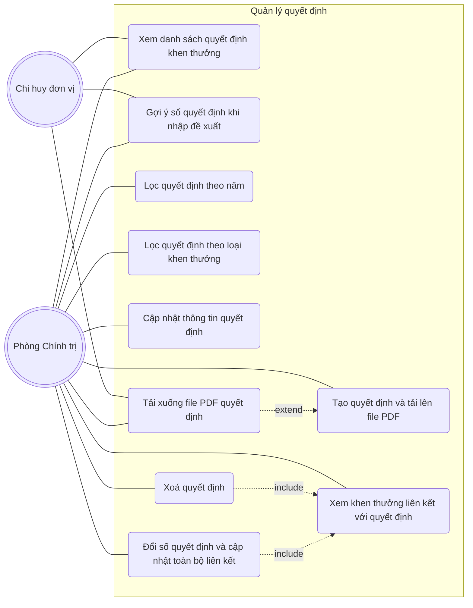
```mermaid
flowchart LR
    AD(((Phòng Chính trị)))
    MG(((Chỉ huy đơn vị)))

    subgraph SYS[Quản lý quyết định]
        UC1(Xem danh sách quyết định khen thưởng)
        UC2(Gợi ý số quyết định khi nhập đề xuất)
        UC3(Lọc quyết định theo năm)
        UC4(Lọc quyết định theo loại khen thưởng)
        UC5(Tạo quyết định và tải lên file PDF)
        UC6(Cập nhật thông tin quyết định)
        UC7(Đổi số quyết định và cập nhật toàn bộ liên kết)
        UC8(Xoá quyết định)
        UC9(Tải xuống file PDF quyết định)
        UC10(Xem khen thưởng liên kết với quyết định)

        UC9 -.->|extend| UC5
        UC7 -.->|include| UC10
        UC8 -.->|include| UC10
    end

    AD --- UC1
    AD --- UC2
    AD --- UC3
    AD --- UC4
    AD --- UC5
    AD --- UC6
    AD --- UC7
    AD --- UC8
    AD --- UC9
    AD --- UC10

    MG --- UC1
    MG --- UC2
    MG --- UC9
```

**Đặc thù**: `FileQuyetDinh` là bảng độc lập với `BangDeXuat`, liên kết với 8 bảng khen thưởng qua hard FK natural-key `so_quyet_dinh` (xem ERD §C5.1). Cascade rename (UC7) thay đổi `so_quyet_dinh` → Postgres tự cascade 13 cột FK trên 8 bảng đích + app-layer cascade JSON payload `BangDeXuat.data_*` cùng transaction (`services/decision/cascadeRename.ts`).

---

## A1.14 — Use case phân rã: Báo cáo và thống kê

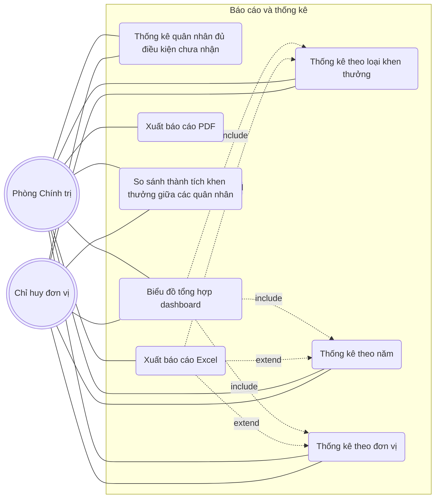
```mermaid
flowchart LR
    AD(((Phòng Chính trị)))
    MG(((Chỉ huy đơn vị)))

    subgraph SYS[Báo cáo và thống kê]
        UC1(Thống kê theo loại khen thưởng)
        UC2(Thống kê theo năm)
        UC3(Thống kê theo đơn vị)
        UC4(Thống kê quân nhân đủ điều kiện chưa nhận)
        UC5(Biểu đồ tổng hợp dashboard)
        UC6(Xuất báo cáo Excel)
        UC7(Xuất báo cáo PDF)
        UC8(So sánh thành tích khen thưởng giữa các quân nhân)

        UC5 -.->|include| UC1
        UC5 -.->|include| UC2
        UC5 -.->|include| UC3
        UC6 -.->|extend| UC1
        UC6 -.->|extend| UC2
        UC6 -.->|extend| UC3
    end

    AD --- UC1
    AD --- UC2
    AD --- UC3
    AD --- UC4
    AD --- UC5
    AD --- UC6
    AD --- UC7
    AD --- UC8

    MG --- UC1
    MG --- UC2
    MG --- UC3
    MG --- UC4
    MG --- UC5
    MG --- UC8
```

---

## Tổng kết

| # | Sơ đồ | Số use case | Actor |
|---|---|---|---|
| A1.1 | Use case tổng quát | 13 | 4 |
| A1.2 | Quản lý tài khoản | 8 | SUPER_ADMIN, ADMIN |
| A1.3 | Quản lý quân nhân | 7 | ADMIN, MANAGER |
| A1.4 | Quản lý đơn vị | 10 | SUPER_ADMIN, ADMIN |
| A1.5 | Danh hiệu cá nhân hằng năm (UC5) | 10 | ADMIN, MANAGER, USER |
| A1.6 | Khen thưởng đơn vị hằng năm (UC6) | 7 | ADMIN, MANAGER |
| A1.7 | UC7–UC11: HCCSVV / HCQKQT / KNC / HCBVTQ / NCKH | 7 | ADMIN, MANAGER, USER |
| A1.8 | Đề xuất khen thưởng (UC13) | 17 | MANAGER, ADMIN |
| A1.9 | Khen thưởng đột xuất (UC12 — flow riêng) | 9 | ADMIN, MANAGER, USER |
| A1.10 | Xét điều kiện khen thưởng (UC14) | 10 | ADMIN, System, MANAGER, USER |
| A1.11 | Thông báo realtime (UC15) | 8 | ADMIN, MANAGER, USER |
| A1.12 | Nhật ký hệ thống (UC16) | 10 | SUPER_ADMIN, ADMIN, MANAGER |
| A1.13 | Backup qua DevZone (UC17) | 8 | SUPER_ADMIN, Cron |
| A1.14 | Báo cáo thống kê (UC18) | 8 | ADMIN, MANAGER |
| A1.15 | Quản lý quyết định (Decision) | 10 | ADMIN, MANAGER |

**Tổng**: 1 sơ đồ tổng quát + 14 sơ đồ phân rã. DevZone backup được tách riêng vì có yếu tố nghiệp vụ; các DevZone tool khác (cron trigger, recalc unit count, feature toggle) không đưa vào báo cáo.
