# Sơ đồ Use Case (Mermaid)

> **Render**: Copy block `mermaid` vào https://mermaid.live hoặc dùng VSCode Mermaid Preview extension. Để xuất PNG/SVG cho báo cáo, dùng `mermaid.live` → Export.
>
> **Lưu ý**: Mermaid không có syntax UML use case "thuần", nên ở đây dùng `flowchart LR` với:
> - Actor: hình `(((Tên Actor)))` (oval đôi)
> - Use case: hình `(Tên use case)` (oval)
> - Hệ thống: gói `subgraph`
> - `<<extend>>` / `<<include>>`: cạnh nét đứt `-.->`

---

## A1.1 — Use case tổng quát

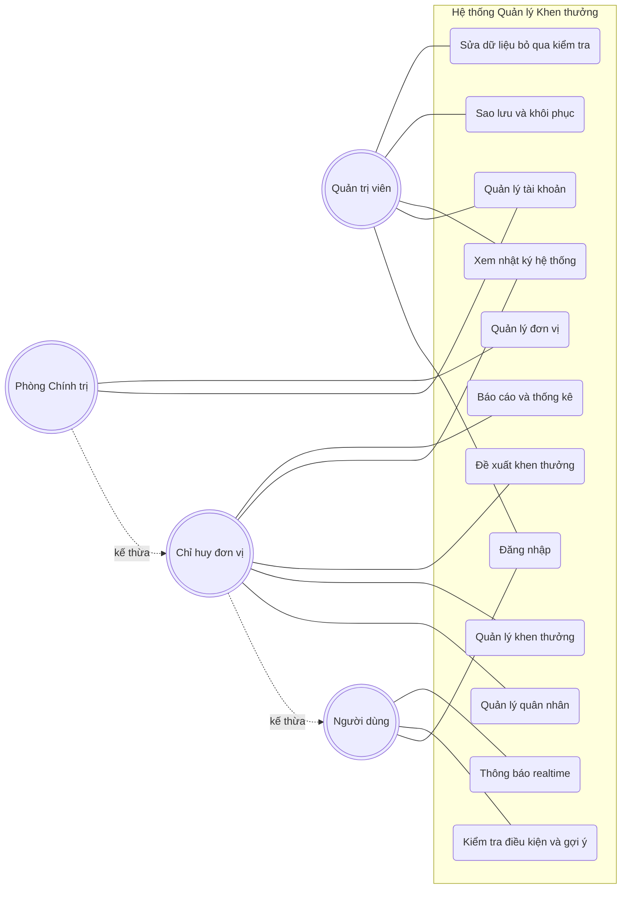
```mermaid
flowchart LR
    SA(((Quản trị viên)))
    AD(((Phòng Chính trị)))
    MG(((Chỉ huy đơn vị)))
    US(((Người dùng)))

    %% Actor generalization: AD → MG → US (SA là vai trò hệ thống độc lập)
    AD -.->|kế thừa| MG
    MG -.->|kế thừa| US

    subgraph SYS[Hệ thống Quản lý Khen thưởng]
        UC1(Đăng nhập)
        UC2(Quản lý tài khoản)
        UC3(Quản lý quân nhân)
        UC4(Quản lý đơn vị)
        UC5(Quản lý khen thưởng)
        UC6(Đề xuất khen thưởng)
        UC7(Kiểm tra điều kiện và gợi ý)
        UC8(Thông báo realtime)
        UC9(Xem nhật ký hệ thống)
        UC10(Sao lưu và khôi phục)
        UC11(Báo cáo và thống kê)
        UC12(Sửa dữ liệu bỏ qua kiểm tra)
    end

    %% US: use case gốc (MG, AD kế thừa)
    US --- UC1
    US --- UC7
    US --- UC8

    %% MG: thêm những UC không có ở US
    MG --- UC3
    MG --- UC5
    MG --- UC6
    MG --- UC9
    MG --- UC11

    %% AD: thêm những UC không có ở MG
    AD --- UC2
    AD --- UC4

    %% SA: vai trò hệ thống độc lập — không kế thừa AD
    SA --- UC1
    SA --- UC2
    SA --- UC9
    SA --- UC10
    SA --- UC12
```

**Quan hệ kế thừa actor**: `AD → MG → US` — ADMIN (Phòng Chính trị) kế thừa toàn bộ quyền MANAGER và bổ sung quản lý tài khoản + đơn vị; MANAGER kế thừa quyền USER và bổ sung quản lý nghiệp vụ khen thưởng.

**SUPER_ADMIN là vai trò hệ thống độc lập**: KHÔNG kế thừa từ ADMIN. SA phụ trách quản trị hệ thống (tài khoản, sao lưu, nhật ký đầy đủ, sửa dữ liệu) và không tham gia luồng nghiệp vụ khen thưởng.

**UC5 — Quản lý khen thưởng** gộp 8 nhóm nghiệp vụ (chi tiết ở sơ đồ phân rã A1.3 – A1.9): danh hiệu cá nhân hằng năm, khen thưởng đơn vị hằng năm, Huy chương Chiến sĩ vẻ vang, Huy chương Quân kỳ quyết thắng, Kỷ niệm chương, Huân chương Bảo vệ Tổ quốc, thành tích khoa học, khen thưởng đột xuất.

> Sơ đồ tổng quan **không** vẽ quan hệ `<<include>>` / `<<extend>>` giữa các use case. Quan hệ chi tiết mô tả trong từng sơ đồ phân rã A1.2 – A1.10.

---

## A1.2 — Use case phân rã: Quản lý tài khoản và phân quyền

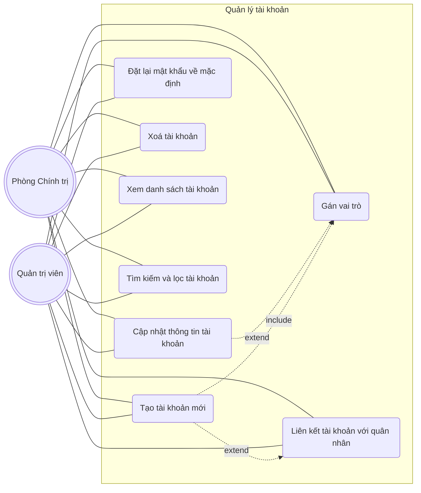
```mermaid
flowchart LR
    SA(((Quản trị viên)))
    AD(((Phòng Chính trị)))

    subgraph SYS[Quản lý tài khoản]
        UC1(Tạo tài khoản mới)
        UC2(Cập nhật thông tin tài khoản)
        UC3(Đặt lại mật khẩu về mặc định)
        UC4(Xoá tài khoản)
        UC5(Gán vai trò)
        UC6(Xem danh sách tài khoản)
        UC7(Tìm kiếm và lọc tài khoản)
        UC8(Liên kết tài khoản với quân nhân)

        UC1 -.->|include| UC5
        UC1 -.->|extend| UC8
        UC2 -.->|extend| UC5
    end

    SA --- UC1
    SA --- UC2
    SA --- UC3
    SA --- UC4
    SA --- UC5
    SA --- UC6
    SA --- UC7
    SA --- UC8

    AD --- UC1
    AD --- UC2
    AD --- UC3
    AD --- UC4
    AD --- UC5
    AD --- UC6
    AD --- UC7
    AD --- UC8
```

**Quyền**: route `/api/accounts` dùng middleware `requireAdmin` (SA + ADMIN) — đây là điểm giao thoa duy nhất giữa SA và ADMIN, vì quản lý tài khoản vừa là hệ thống vừa cần am hiểu cơ cấu tổ chức.

---

## A1.3 — Use case phân rã: Quản lý quân nhân

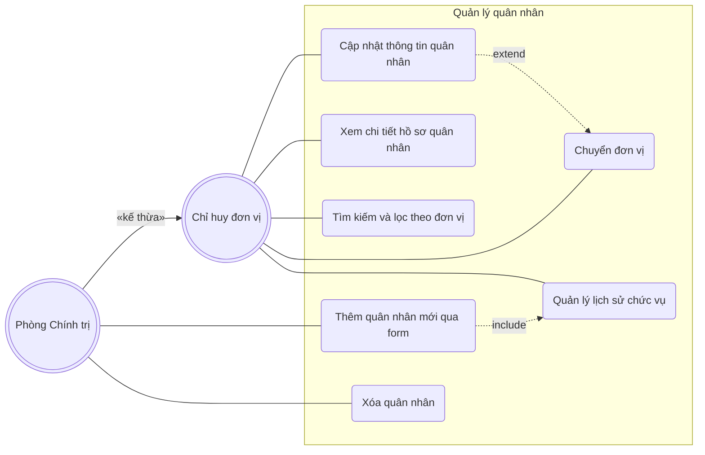
```mermaid
flowchart LR
    AD(((Phòng Chính trị)))
    MG(((Chỉ huy đơn vị)))

    subgraph SYS[Quản lý quân nhân]
        UC1(Thêm quân nhân mới qua form)
        UC2(Cập nhật thông tin quân nhân)
        UC3(Xóa quân nhân)
        UC4(Xem chi tiết hồ sơ quân nhân)
        UC5(Tìm kiếm và lọc theo đơn vị)
        UC6(Chuyển đơn vị)
        UC7(Quản lý lịch sử chức vụ)

        UC1 -.->|include| UC7
        UC2 -.->|extend| UC6
    end

    AD -->|«kế thừa»| MG

    AD --- UC1
    AD --- UC3

    MG --- UC2
    MG --- UC4
    MG --- UC5
    MG --- UC6
    MG --- UC7
```

**Phân quyền route**:
- POST/DELETE (`/api/personnel`): `requireAdmin` → SUPER_ADMIN + ADMIN.
- PUT `/api/personnel/:id`: `requireManager` → SA + ADMIN + MANAGER (MANAGER chỉ sửa quân nhân thuộc đơn vị quản lý). USER **không** sửa được hồ sơ.
- GET list / detail: MANAGER xem được trong phạm vi đơn vị; USER chỉ xem hồ sơ của chính mình (route `/profile/me`).
- `POST /check-contribution-eligibility`: `requireManager` → USER **không** gọi được.

**Lưu ý**: Bảng `QuanNhan` **không hỗ trợ Excel import/export** — chỉ thêm thủ công qua form. Excel import/export chỉ áp dụng cho các loại khen thưởng (xem A1.7).

---

## A1.4 — Use case phân rã: Quản lý đơn vị (CQDV / DVTT)

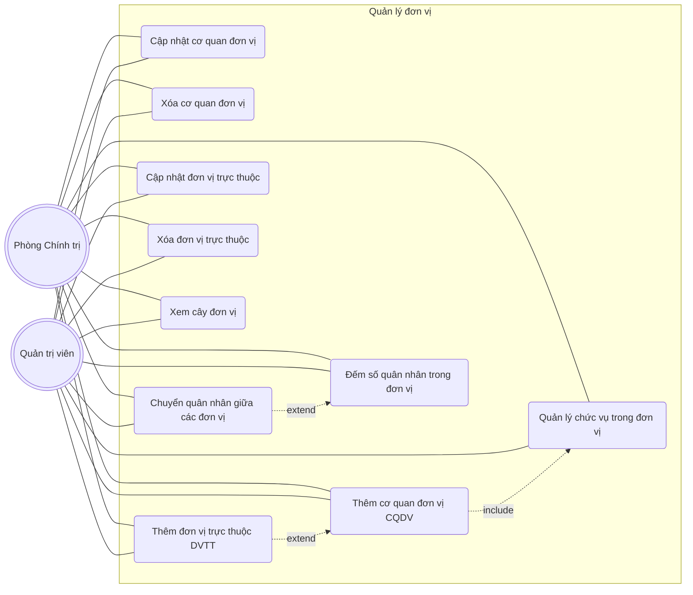
```mermaid
flowchart LR
    SA(((Quản trị viên)))
    AD(((Phòng Chính trị)))

    subgraph SYS[Quản lý đơn vị]
        UC1(Thêm cơ quan đơn vị CQDV)
        UC2(Cập nhật cơ quan đơn vị)
        UC3(Xóa cơ quan đơn vị)
        UC4(Thêm đơn vị trực thuộc DVTT)
        UC5(Cập nhật đơn vị trực thuộc)
        UC6(Xóa đơn vị trực thuộc)
        UC7(Xem cây đơn vị)
        UC8(Đếm số quân nhân trong đơn vị)
        UC9(Quản lý chức vụ trong đơn vị)
        UC10(Chuyển quân nhân giữa các đơn vị)

        UC4 -.->|extend| UC1
        UC1 -.->|include| UC9
        UC10 -.->|extend| UC8
    end

    SA --- UC1
    SA --- UC2
    SA --- UC3
    SA --- UC4
    SA --- UC5
    SA --- UC6
    SA --- UC7
    SA --- UC8
    SA --- UC9
    SA --- UC10

    AD --- UC1
    AD --- UC2
    AD --- UC3
    AD --- UC4
    AD --- UC5
    AD --- UC6
    AD --- UC7
    AD --- UC8
    AD --- UC9
    AD --- UC10
```

**Phân quyền route**: `unit.route.ts` — GET dùng `requireManager` (SA + ADMIN + MANAGER xem cây đơn vị); POST/PUT/DELETE dùng `requireAdmin` (SA + ADMIN). CQDV và DVTT phân biệt qua field `loai_don_vi`, dùng chung route nên ADMIN có toàn quyền CRUD trên cả hai cấp.

---

## A1.5 — Use case phân rã: Quản lý khen thưởng cá nhân hằng năm (CSTT / CSTDCS / BKBQP / CSTDTQ / BKTTCP)

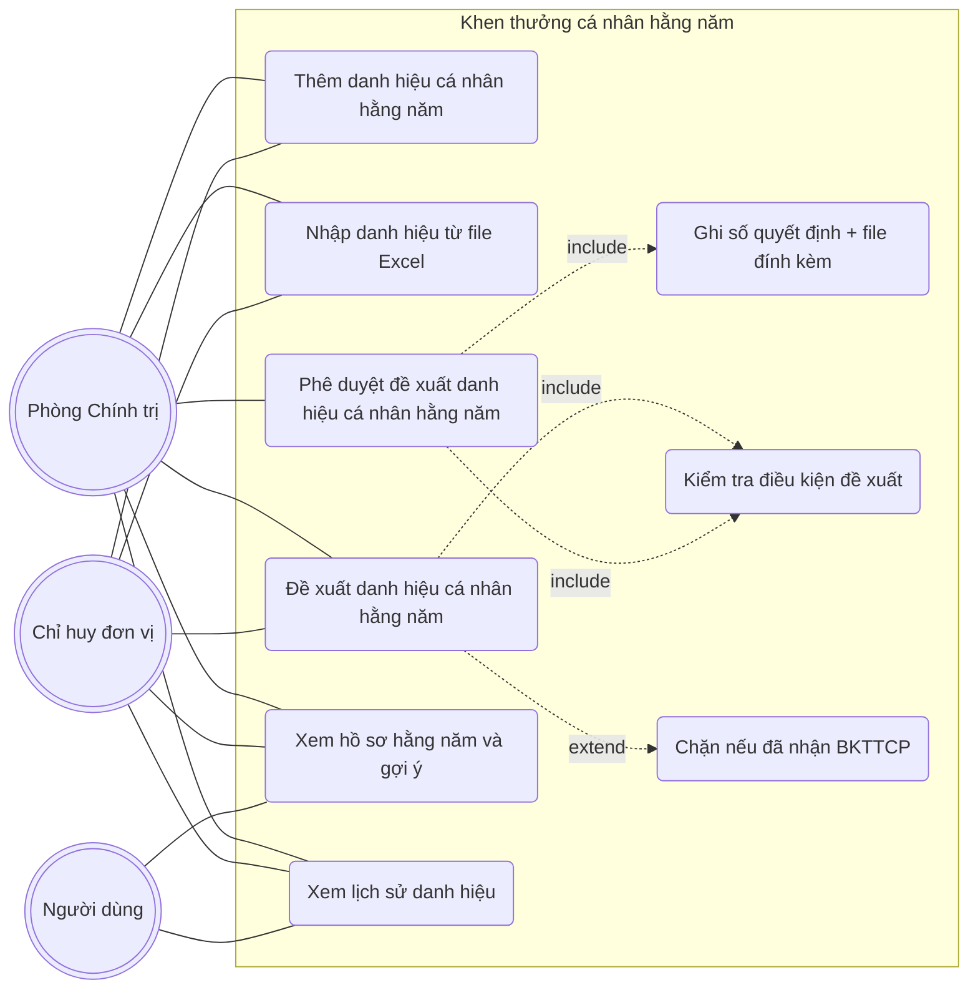
```mermaid
flowchart LR
    AD(((Phòng Chính trị)))
    MG(((Chỉ huy đơn vị)))
    US(((Người dùng)))

    subgraph SYS[Khen thưởng cá nhân hằng năm]
        UC1(Thêm danh hiệu cá nhân hằng năm)
        UC2(Nhập danh hiệu từ file Excel)
        UC3(Đề xuất danh hiệu cá nhân hằng năm)
        UC4(Phê duyệt đề xuất danh hiệu cá nhân hằng năm)
        UC5(Ghi số quyết định + file đính kèm)
        UC6(Kiểm tra điều kiện đề xuất)
        UC7(Chặn nếu đã nhận BKTTCP)
        UC8(Xem hồ sơ hằng năm và gợi ý)
        UC9(Xem lịch sử danh hiệu)

        UC4 -.->|include| UC5
        UC3 -.->|include| UC6
        UC4 -.->|include| UC6
        UC3 -.->|extend| UC7
    end

    AD --- UC1
    AD --- UC2
    AD --- UC3
    AD --- UC4
    AD --- UC8
    AD --- UC9

    MG --- UC1
    MG --- UC2
    MG --- UC3
    MG --- UC8
    MG --- UC9

    US --- UC8
    US --- UC9
```

**Đọc sơ đồ:**

- **5 danh hiệu hỗ trợ**: CSTT, CSTDCS, BKBQP, CSTDTQ, BKTTCP. CSTT/CSTDCS lưu vào cột `danh_hieu`; BKBQP/CSTDTQ/BKTTCP lưu thành flag boolean trên dòng `DanhHieuHangNam` của năm đó (đi kèm `danh_hieu='CSTDCS'`).
- **UC1, UC2**: Phòng Chính trị hoặc Chỉ huy đơn vị thêm danh hiệu vào hệ thống (thêm từng bản ghi hoặc nhập hàng loạt từ file Excel), không đi qua quy trình đề xuất — dùng để cập nhật kết quả thi đua sau khi đã có quyết định ngoài phần mềm.
- **UC3, UC4**: Đề xuất và phê duyệt qua `BangDeXuat` (strategy `CA_NHAN_HANG_NAM`). Cùng một strategy xử lý cả 5 danh hiệu, khác nhau ở payload và điều kiện đầu vào.
- **UC5 (include)**: mọi phê duyệt bắt buộc ghi số quyết định + file PDF.
- **UC6 (include)**: kiểm tra điều kiện cho **mọi** đề xuất; tập rule khác nhau theo danh hiệu — CSTT/CSTDCS chỉ kiểm tra cơ bản (năm hợp lệ, không trùng, không vừa CSTT vừa CSTDCS cùng năm, quân nhân/đơn vị hợp lệ); BKBQP/CSTDTQ/BKTTCP kiểm tra thêm điều kiện chuỗi (streak CSTDCS, flag chu kỳ trước, NCKH mỗi năm, cửa sổ trượt 3y/7y — `chainEligibility.ts`).
- **UC7 (extend)**: kích hoạt khi đề xuất BKTTCP và quân nhân đã từng nhận BKTTCP → chặn với message "Đã có BKTTCP, chưa hỗ trợ danh hiệu cao hơn".
- **UC8**: gợi ý tự động từ `recalculateAnnualProfile()` — Manager biết quân nhân nào đủ điều kiện đề xuất.
- **UC9**: tra cứu lịch sử danh hiệu.

**Đã loại bỏ:**
- ~~"Ghi nhận BKBQP/CSTDTQ/BKTTCP"~~ — không phải UC user, đây là **side-effect** của UC4 (phê duyệt) khi system lưu vào DB.
- ~~"Cập nhật điều kiện chuỗi khen thưởng"~~ — không phải UC user, đây là `recalculateAnnualProfile()` chạy **auto** sau approve, không có nút riêng. Đã merge vào UC6 (kiểm tra) và UC8 (xem gợi ý) — đây mới là phần user nhìn thấy.

---

## A1.6 — Use case phân rã: Quản lý khen thưởng đơn vị hằng năm (ĐVQT / ĐVTT / BKBQP / BKTTCP)

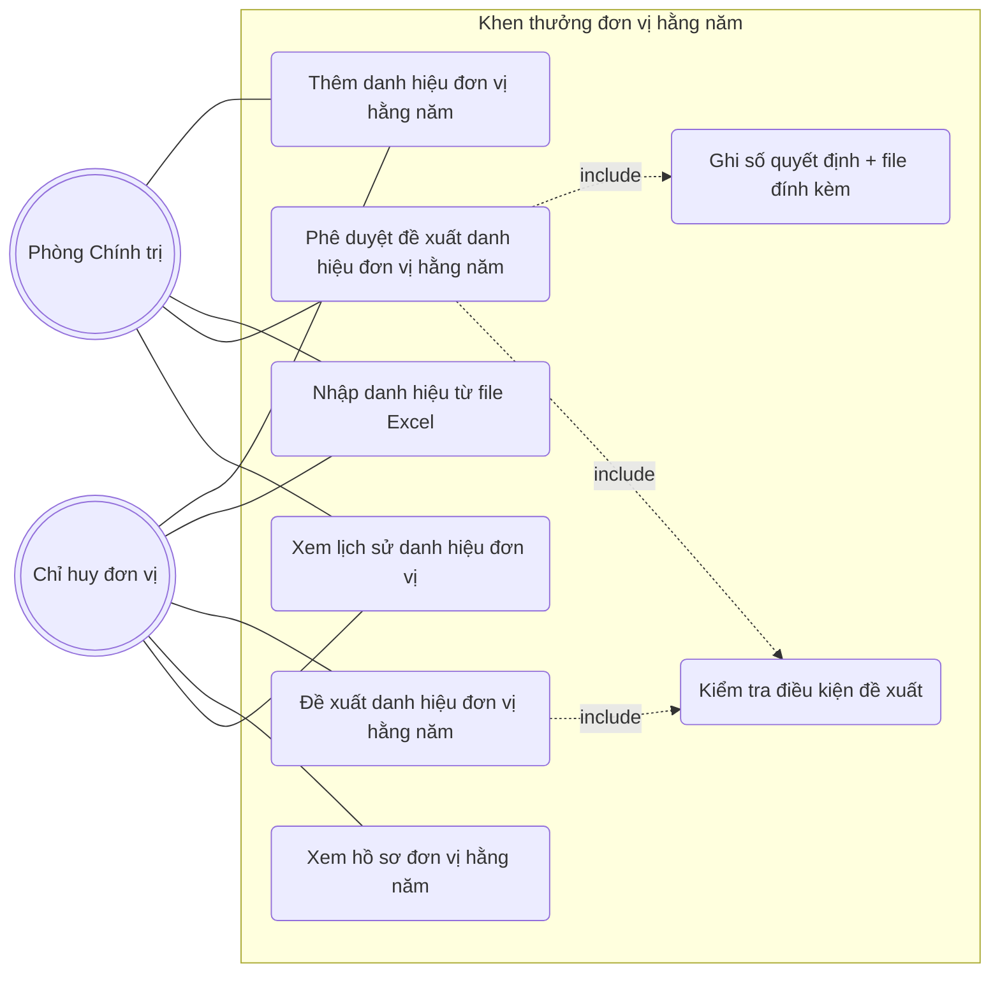
```mermaid
flowchart LR
    AD(((Phòng Chính trị)))
    MG(((Chỉ huy đơn vị)))

    subgraph SYS[Khen thưởng đơn vị hằng năm]
        UC1(Thêm danh hiệu đơn vị hằng năm)
        UC2(Nhập danh hiệu từ file Excel)
        UC3(Đề xuất danh hiệu đơn vị hằng năm)
        UC4(Phê duyệt đề xuất danh hiệu đơn vị hằng năm)
        UC5(Ghi số quyết định + file đính kèm)
        UC6(Kiểm tra điều kiện đề xuất)
        UC7(Xem hồ sơ đơn vị hằng năm)
        UC8(Xem lịch sử danh hiệu đơn vị)

        UC4 -.->|include| UC5
        UC3 -.->|include| UC6
        UC4 -.->|include| UC6
    end

    AD --- UC1
    AD --- UC2
    AD --- UC4
    AD --- UC8

    MG --- UC1
    MG --- UC2
    MG --- UC3
    MG --- UC7
    MG --- UC8
```

**Đọc sơ đồ:**

- **4 danh hiệu hỗ trợ**: ĐVQT (Đơn vị Quyết thắng), ĐVTT (Đơn vị Tiên tiến), BKBQP, BKTTCP. ĐVQT/ĐVTT lưu vào cột `danh_hieu`; BKBQP/BKTTCP lưu thành flag boolean trên dòng `DanhHieuDonViHangNam` của năm đó (đi kèm `danh_hieu='ĐVQT'`).
- **UC1, UC2**: thêm danh hiệu trực tiếp (từng bản ghi hoặc nhập hàng loạt từ Excel), không qua quy trình đề xuất.
- **UC3, UC4**: đề xuất và phê duyệt qua `BangDeXuat` (strategy `DON_VI_HANG_NAM`). Cùng strategy xử lý cả 4 danh hiệu, khác nhau ở payload và điều kiện.
- **UC5 (include)**: mọi phê duyệt bắt buộc ghi số quyết định + file PDF.
- **UC6 (include)**: kiểm tra điều kiện đề xuất; rule khác nhau theo danh hiệu — ĐVQT/ĐVTT chỉ kiểm tra cơ bản (năm, không trùng, không vừa ĐVQT vừa ĐVTT cùng năm); BKBQP/BKTTCP kiểm tra thêm điều kiện chuỗi (streak ĐVQT, flag chu kỳ trước, cửa sổ trượt 7y cho BKTTCP — `chainEligibility.ts`).
- **UC7**: xem hồ sơ tổng hợp đơn vị theo năm + gợi ý đề xuất.
- **UC8**: tra cứu lịch sử danh hiệu đơn vị.

**Khác cá nhân**: đơn vị **không có CSTDTQ** và **không kiểm tra NCKH**. BKTTCP đơn vị `isLifetime: false` — đơn vị có thể nhận BKTTCP lặp lại sau mỗi 7 năm (cycle repeat), khác BKTTCP cá nhân `isLifetime: true` chỉ nhận 1 lần.

---

## A1.7 — Use case phân rã: Huân/huy chương cá nhân và thành tích khoa học

A1.7 gồm **5 sơ đồ con**, mỗi loại khen thưởng/thành tích 1 sơ đồ:

- **A1.7.1** — Huy chương Chiến sĩ Vẻ vang (HCCSVV)
- **A1.7.2** — Huân chương Bảo vệ Tổ quốc (HCBVTQ)
- **A1.7.3** — Huân chương Quân kỳ Quyết thắng (HCQKQT)
- **A1.7.4** — Kỷ niệm chương VSNXD QĐNDVN (KNC)
- **A1.7.5** — Thành tích Nghiên cứu Khoa học (NCKH)

Cả 5 sơ đồ chia sẻ cùng cấu trúc 7 UC (Thêm / Excel / Đề xuất / Phê duyệt / Đính kèm Quyết định + file PDF / Kiểm tra điều kiện / Xem hồ sơ), khác nhau ở **điều kiện xét duyệt** đặc thù theo loại. UC5 (đính kèm Quyết định) được include từ UC4 (phê duyệt); UC6 (kiểm tra điều kiện) được include từ cả UC3 và UC4.

**Phân quyền chung cho cả 5 loại**:
- **ADMIN**: làm đầy đủ vòng đời (thêm, nhập Excel, đề xuất, phê duyệt).
- **MANAGER**: chỉ tạo đề xuất + xem hồ sơ.
- **USER**: xem hồ sơ khen thưởng / thành tích của bản thân (tất cả 5 loại) qua `/profile/tenure`, `/profile/contribution` hoặc các route nested `/personnel/:personnel_id/...`.

> **Lưu ý**: Khen thưởng đột xuất (DOT_XUAT) có flow riêng — xem **A1.9**. Chi tiết flow đề xuất + phê duyệt chung cho mọi loại xem **A1.8**.

---

### A1.7.1 — Huy chương Chiến sĩ Vẻ vang (HCCSVV)

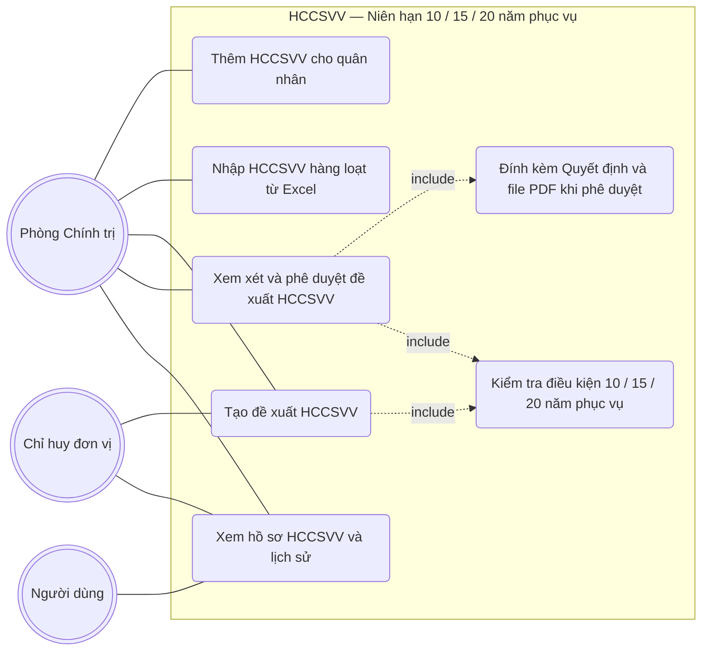
```mermaid
flowchart LR
    AD(((Phòng Chính trị)))
    MG(((Chỉ huy đơn vị)))
    US(((Người dùng)))

    subgraph SYS[HCCSVV — Niên hạn 10 / 15 / 20 năm phục vụ]
        UC1(Thêm HCCSVV cho quân nhân)
        UC2(Nhập HCCSVV hàng loạt từ Excel)
        UC3(Tạo đề xuất HCCSVV)
        UC4(Xem xét và phê duyệt đề xuất HCCSVV)
        UC5(Đính kèm Quyết định và file PDF khi phê duyệt)
        UC6(Kiểm tra điều kiện 10 / 15 / 20 năm phục vụ)
        UC7(Xem hồ sơ HCCSVV và lịch sử)

        UC4 -.->|include| UC5
        UC3 -.->|include| UC6
        UC4 -.->|include| UC6
    end

    AD --- UC1
    AD --- UC2
    AD --- UC3
    AD --- UC4
    AD --- UC7

    MG --- UC3
    MG --- UC7

    US --- UC7
```

**Strategy**: `hccsvvStrategy` · **Bảng đích**: `KhenThuongHCCSVV` (3 hạng Ba/Nhì/Nhất, validate thứ tự hạng). · **USER**: xem hồ sơ HCCSVV của bản thân qua `/profile/tenure/:personnel_id`.

---

### A1.7.2 — Huân chương Bảo vệ Tổ quốc (HCBVTQ)

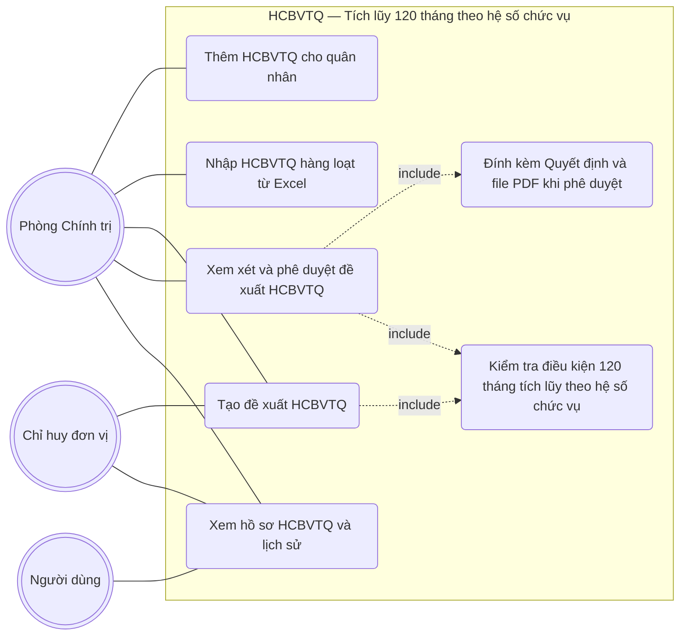
```mermaid
flowchart LR
    AD(((Phòng Chính trị)))
    MG(((Chỉ huy đơn vị)))
    US(((Người dùng)))

    subgraph SYS[HCBVTQ — Tích lũy 120 tháng theo hệ số chức vụ]
        UC1(Thêm HCBVTQ cho quân nhân)
        UC2(Nhập HCBVTQ hàng loạt từ Excel)
        UC3(Tạo đề xuất HCBVTQ)
        UC4(Xem xét và phê duyệt đề xuất HCBVTQ)
        UC5(Đính kèm Quyết định và file PDF khi phê duyệt)
        UC6(Kiểm tra điều kiện 120 tháng tích lũy theo hệ số chức vụ)
        UC7(Xem hồ sơ HCBVTQ và lịch sử)

        UC4 -.->|include| UC5
        UC3 -.->|include| UC6
        UC4 -.->|include| UC6
    end

    AD --- UC1
    AD --- UC2
    AD --- UC3
    AD --- UC4
    AD --- UC7

    MG --- UC3
    MG --- UC7

    US --- UC7
```

**Strategy**: `hcbvtqStrategy` · **Bảng đích**: `KhenThuongHCBVTQ` (tích lũy theo lịch sử chức vụ × hệ số). · **USER**: xem hồ sơ HCBVTQ của bản thân qua `/profile/contribution/:personnel_id`.

---

### A1.7.3 — Huân chương Quân kỳ Quyết thắng (HCQKQT)

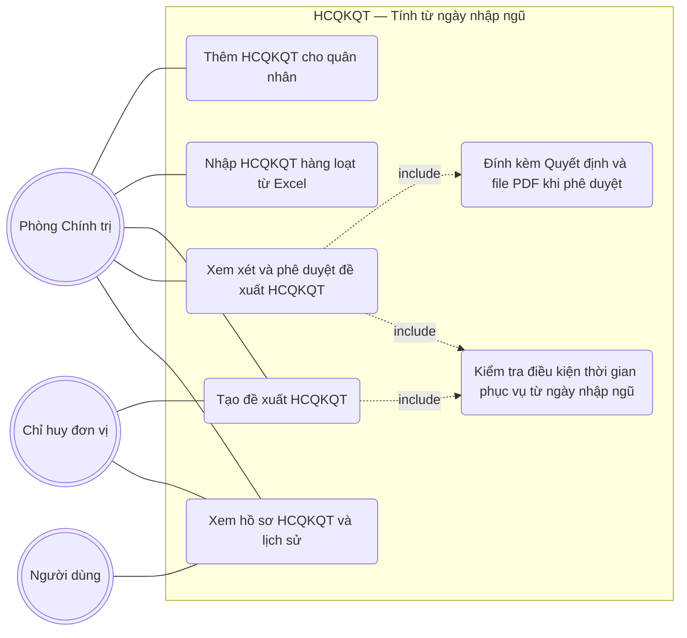
```mermaid
flowchart LR
    AD(((Phòng Chính trị)))
    MG(((Chỉ huy đơn vị)))
    US(((Người dùng)))

    subgraph SYS[HCQKQT — Tính từ ngày nhập ngũ]
        UC1(Thêm HCQKQT cho quân nhân)
        UC2(Nhập HCQKQT hàng loạt từ Excel)
        UC3(Tạo đề xuất HCQKQT)
        UC4(Xem xét và phê duyệt đề xuất HCQKQT)
        UC5(Đính kèm Quyết định và file PDF khi phê duyệt)
        UC6(Kiểm tra điều kiện thời gian phục vụ từ ngày nhập ngũ)
        UC7(Xem hồ sơ HCQKQT và lịch sử)

        UC4 -.->|include| UC5
        UC3 -.->|include| UC6
        UC4 -.->|include| UC6
    end

    AD --- UC1
    AD --- UC2
    AD --- UC3
    AD --- UC4
    AD --- UC7

    MG --- UC3
    MG --- UC7

    US --- UC7
```

**Strategy**: `hcqkqtStrategy` · **Bảng đích**: `KhenThuongHCQKQT` (1 lần / quân nhân). · **USER**: tra cứu HCQKQT của bản thân qua `/personnel/:personnel_id`.

---

### A1.7.4 — Kỷ niệm chương VSNXD QĐNDVN (KNC)

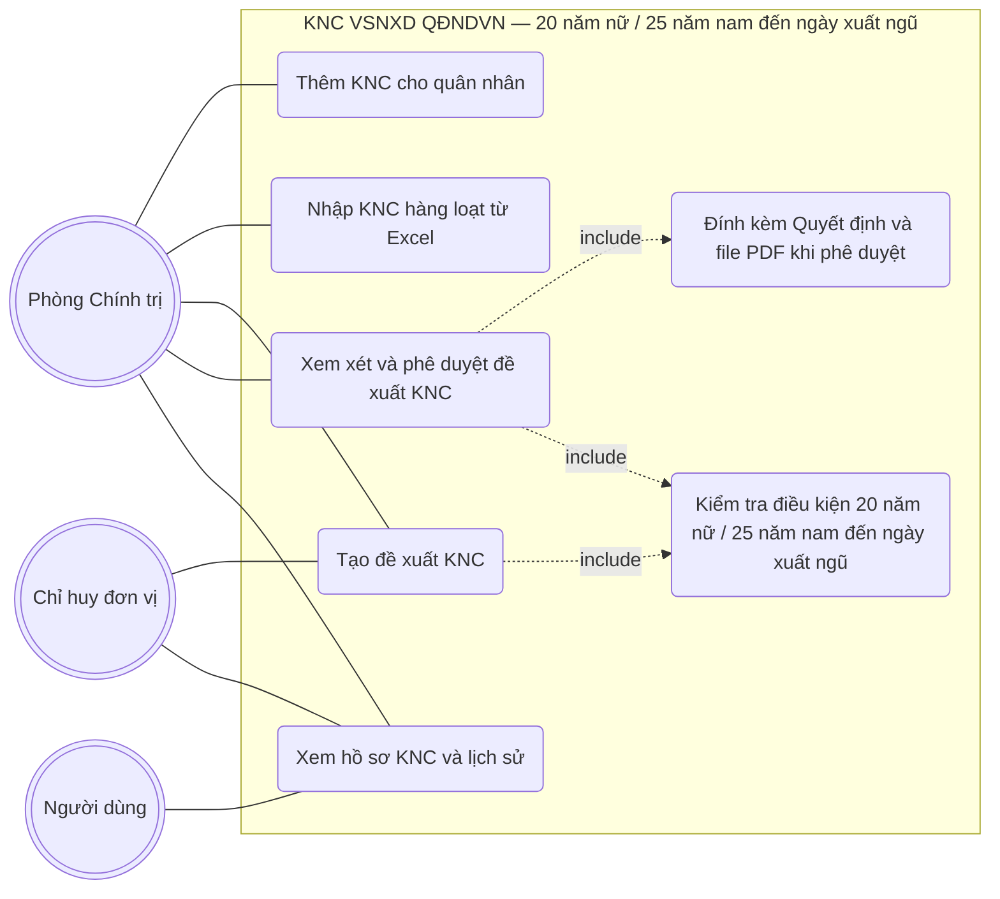
```mermaid
flowchart LR
    AD(((Phòng Chính trị)))
    MG(((Chỉ huy đơn vị)))
    US(((Người dùng)))

    subgraph SYS[KNC VSNXD QĐNDVN — 20 năm nữ / 25 năm nam đến ngày xuất ngũ]
        UC1(Thêm KNC cho quân nhân)
        UC2(Nhập KNC hàng loạt từ Excel)
        UC3(Tạo đề xuất KNC)
        UC4(Xem xét và phê duyệt đề xuất KNC)
        UC5(Đính kèm Quyết định và file PDF khi phê duyệt)
        UC6(Kiểm tra điều kiện 20 năm nữ / 25 năm nam đến ngày xuất ngũ)
        UC7(Xem hồ sơ KNC và lịch sử)

        UC4 -.->|include| UC5
        UC3 -.->|include| UC6
        UC4 -.->|include| UC6
    end

    AD --- UC1
    AD --- UC2
    AD --- UC3
    AD --- UC4
    AD --- UC7

    MG --- UC3
    MG --- UC7

    US --- UC7
```

**Strategy**: `kncStrategy` · **Bảng đích**: `KhenThuongKNC` (1 lần / quân nhân, gắn với ngày xuất ngũ). · **USER**: tra cứu KNC của bản thân qua `/personnel/:personnel_id`.

---

### A1.7.5 — Thành tích Nghiên cứu Khoa học (NCKH)

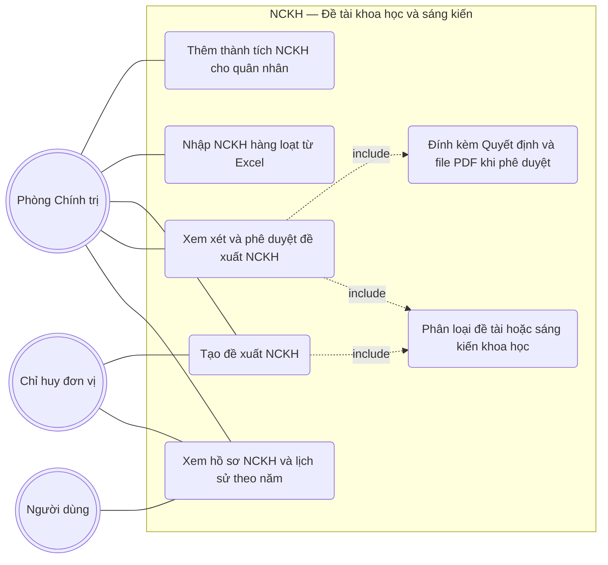
```mermaid
flowchart LR
    AD(((Phòng Chính trị)))
    MG(((Chỉ huy đơn vị)))
    US(((Người dùng)))

    subgraph SYS[NCKH — Đề tài khoa học và sáng kiến]
        UC1(Thêm thành tích NCKH cho quân nhân)
        UC2(Nhập NCKH hàng loạt từ Excel)
        UC3(Tạo đề xuất NCKH)
        UC4(Xem xét và phê duyệt đề xuất NCKH)
        UC5(Đính kèm Quyết định và file PDF khi phê duyệt)
        UC6(Phân loại đề tài hoặc sáng kiến khoa học)
        UC7(Xem hồ sơ NCKH và lịch sử theo năm)

        UC4 -.->|include| UC5
        UC3 -.->|include| UC6
        UC4 -.->|include| UC6
    end

    AD --- UC1
    AD --- UC2
    AD --- UC3
    AD --- UC4
    AD --- UC7

    MG --- UC3
    MG --- UC7

    US --- UC7
```

**Strategy**: `nckhStrategy` · **Bảng đích**: `ThanhTichNCKH` (unique key `personnel_id + năm + mô tả`). · NCKH ghi nhận theo năm, ảnh hưởng đến chuỗi BKBQP/CSTDTQ/BKTTCP cá nhân (xem A1.5). · **USER**: xem NCKH của bản thân qua `/personnel/:personnel_id/scientific-achievements`.

---

## A1.8 — Use case phân rã: Đề xuất khen thưởng (Proposal)

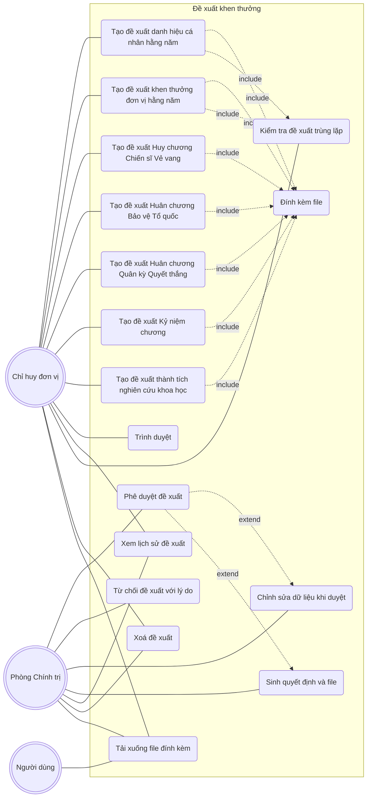
```mermaid
flowchart LR
    MG(((Chỉ huy đơn vị)))
    AD(((Phòng Chính trị)))
    US(((Người dùng)))

    subgraph SYS[Đề xuất khen thưởng]
        UC1(Tạo đề xuất danh hiệu cá nhân hằng năm)
        UC2(Tạo đề xuất khen thưởng đơn vị hằng năm)
        UC3(Tạo đề xuất Huy chương Chiến sĩ Vẻ vang)
        UC4(Tạo đề xuất Huân chương Bảo vệ Tổ quốc)
        UC5(Tạo đề xuất Huân chương Quân kỳ Quyết thắng)
        UC6(Tạo đề xuất Kỷ niệm chương)
        UC7(Tạo đề xuất thành tích nghiên cứu khoa học)
        UC8(Đính kèm file)
        UC9(Trình duyệt)
        UC10(Phê duyệt đề xuất)
        UC11(Từ chối đề xuất với lý do)
        UC12(Chỉnh sửa dữ liệu khi duyệt)
        UC13(Sinh quyết định và file)
        UC14(Xem lịch sử đề xuất)
        UC15(Kiểm tra đề xuất trùng lặp)
        UC16(Xoá đề xuất)
        UC17(Tải xuống file đính kèm)

        UC1 -.->|include| UC8
        UC2 -.->|include| UC8
        UC3 -.->|include| UC8
        UC4 -.->|include| UC8
        UC5 -.->|include| UC8
        UC6 -.->|include| UC8
        UC7 -.->|include| UC8
        UC1 -.->|include| UC15
        UC2 -.->|include| UC15
        UC10 -.->|extend| UC12
        UC10 -.->|extend| UC13
    end

    MG --- UC1
    MG --- UC2
    MG --- UC3
    MG --- UC4
    MG --- UC5
    MG --- UC6
    MG --- UC7
    MG --- UC9
    MG --- UC14
    MG --- UC15
    MG --- UC16
    MG --- UC17

    AD --- UC10
    AD --- UC11
    AD --- UC12
    AD --- UC13
    AD --- UC14
    AD --- UC16
    AD --- UC17

    US --- UC17
```

**UC16 (Xoá đề xuất)**: thêm trong commit gần đây (`6e27f06`). Xoá đề xuất ở trạng thái PENDING/REJECTED — APPROVED không được xoá để giữ lịch sử khen thưởng.

**Đặc thù**: Đây là use case **trung tâm** của hệ thống. **7 loại đề xuất qua Strategy pattern** ở backend. Khen thưởng đột xuất (DOT_XUAT) có flow riêng — ADMIN tạo trực tiếp qua module `adhoc-awards`, không đi qua bảng `BangDeXuat` (xem A1.9 bên dưới).

---

## A1.9 — Use case phân rã: Khen thưởng đột xuất (Adhoc Awards)

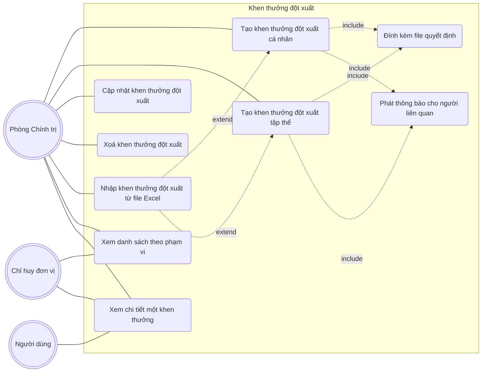
```mermaid
flowchart LR
    AD(((Phòng Chính trị)))
    MG(((Chỉ huy đơn vị)))
    US(((Người dùng)))

    subgraph SYS[Khen thưởng đột xuất]
        UC1(Tạo khen thưởng đột xuất cá nhân)
        UC2(Tạo khen thưởng đột xuất tập thể)
        UC3(Cập nhật khen thưởng đột xuất)
        UC4(Xoá khen thưởng đột xuất)
        UC5(Đính kèm file quyết định)
        UC6(Nhập khen thưởng đột xuất từ file Excel)
        UC7(Xem danh sách theo phạm vi)
        UC8(Xem chi tiết một khen thưởng)
        UC9(Phát thông báo cho người liên quan)

        UC1 -.->|include| UC5
        UC2 -.->|include| UC5
        UC1 -.->|include| UC9
        UC2 -.->|include| UC9
        UC6 -.->|extend| UC1
        UC6 -.->|extend| UC2
    end

    AD --- UC1
    AD --- UC2
    AD --- UC3
    AD --- UC4
    AD --- UC6
    AD --- UC7
    AD --- UC8

    MG --- UC7
    MG --- UC8

    US --- UC8
```

**Đặc thù**: Khác biệt so với A1.8 (Đề xuất khen thưởng):
- **Không qua duyệt 3 cấp**: ADMIN tạo trực tiếp, không có bước MANAGER review hay phê duyệt.
- **Không qua bảng `BangDeXuat`**: ghi thẳng vào bảng riêng `KhenThuongDotXuat`.
- **Không dùng Strategy pattern**: có service riêng `adhocAward.service.ts` với logic tách biệt.
- **Lý do thiết kế**: khen thưởng đột xuất xảy ra theo sự kiện / chiến công cụ thể, cần ghi nhận tức thì, không phù hợp với quy trình duyệt nhiều bước.
- **Phân quyền**: ADMIN tạo / sửa / xoá. MANAGER + USER chỉ xem theo phạm vi (đơn vị / cá nhân).

---

## A1.10 — Use case phân rã: Xét điều kiện khen thưởng

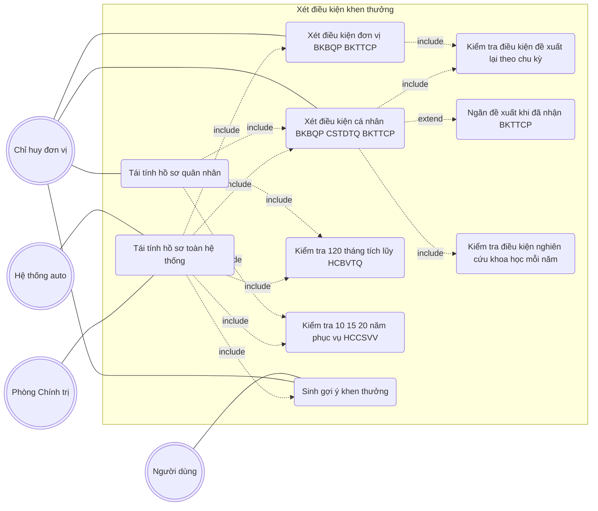
```mermaid
flowchart LR
    AD(((Phòng Chính trị)))
    SYSTEM(((Hệ thống auto)))
    MG(((Chỉ huy đơn vị)))
    US(((Người dùng)))

    subgraph SYS[Xét điều kiện khen thưởng]
        UC1(Xét điều kiện cá nhân BKBQP CSTDTQ BKTTCP)
        UC2(Xét điều kiện đơn vị BKBQP BKTTCP)
        UC3(Kiểm tra điều kiện đề xuất lại theo chu kỳ)
        UC4(Ngăn đề xuất khi đã nhận BKTTCP)
        UC5(Kiểm tra 120 tháng tích lũy HCBVTQ)
        UC6(Kiểm tra 10 15 20 năm phục vụ HCCSVV)
        UC7(Kiểm tra điều kiện nghiên cứu khoa học mỗi năm)
        UC8(Sinh gợi ý khen thưởng)
        UC9(Tái tính hồ sơ toàn hệ thống)
        UC10(Tái tính hồ sơ quân nhân)

        UC1 -.->|include| UC3
        UC1 -.->|extend| UC4
        UC1 -.->|include| UC7
        UC2 -.->|include| UC3
        UC9 -.->|include| UC1
        UC9 -.->|include| UC2
        UC9 -.->|include| UC5
        UC9 -.->|include| UC6
        UC9 -.->|include| UC8
        UC10 -.->|include| UC1
        UC10 -.->|include| UC5
        UC10 -.->|include| UC6
    end

    AD --- UC9
    SYSTEM --- UC9
    MG --- UC1
    MG --- UC2
    MG --- UC8
    MG --- UC10
    US --- UC8
```

**Phân quyền route**:
- `POST /api/profiles/recalculate-all` (UC9 — batch toàn hệ thống): `requireAdminOnly` → chỉ ADMIN. Cron có thể trigger nội bộ.
- `POST /api/profiles/recalculate/:personnel_id` (UC10 — recalc 1 quân nhân): `requireManager` → ADMIN + MANAGER.

---

## A1.11 — Use case phân rã: Thông báo realtime (Socket.IO)

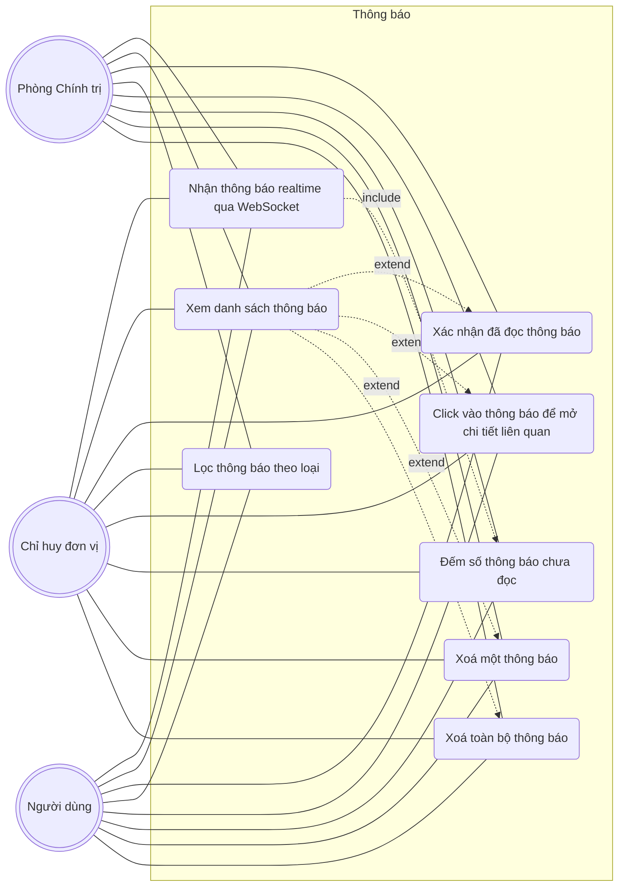
```mermaid
flowchart LR
    AD(((Phòng Chính trị)))
    MG(((Chỉ huy đơn vị)))
    US(((Người dùng)))

    subgraph SYS[Thông báo]
        UC1(Nhận thông báo realtime qua WebSocket)
        UC2(Xem danh sách thông báo)
        UC3(Xác nhận đã đọc thông báo)
        UC4(Lọc thông báo theo loại)
        UC5(Click vào thông báo để mở chi tiết liên quan)
        UC6(Đếm số thông báo chưa đọc)
        UC7(Xoá một thông báo)
        UC8(Xoá toàn bộ thông báo)

        UC1 -.->|include| UC6
        UC2 -.->|extend| UC3
        UC2 -.->|extend| UC5
        UC2 -.->|extend| UC7
        UC2 -.->|extend| UC8
    end

    AD --- UC1
    AD --- UC2
    AD --- UC3
    AD --- UC4
    AD --- UC5
    AD --- UC6
    AD --- UC7
    AD --- UC8
    MG --- UC1
    MG --- UC2
    MG --- UC3
    MG --- UC4
    MG --- UC5
    MG --- UC6
    MG --- UC7
    MG --- UC8
    US --- UC1
    US --- UC2
    US --- UC3
    US --- UC4
    US --- UC5
    US --- UC6
    US --- UC7
    US --- UC8
```

**Phân quyền**: route `/api/notifications` chỉ yêu cầu `verifyToken` — ADMIN, MANAGER và USER đều xem/lọc/đánh dấu/xoá thông báo của chính mình. **SA không nhận thông báo nghiệp vụ** (hệ thống chỉ gửi đến ADMIN / MANAGER / USER theo luồng đề xuất, quân nhân, khen thưởng).

---

## A1.12 — Use case phân rã: Nhật ký hệ thống (Audit log)

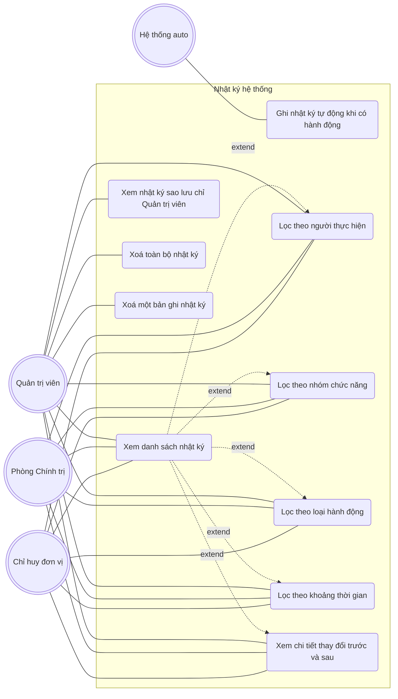
```mermaid
flowchart LR
    SA(((Quản trị viên)))
    AD(((Phòng Chính trị)))
    MG(((Chỉ huy đơn vị)))
    SYSTEM(((Hệ thống auto)))

    subgraph SYS[Nhật ký hệ thống]
        UC1(Ghi nhật ký tự động khi có hành động)
        UC2(Xem danh sách nhật ký)
        UC3(Lọc theo người thực hiện)
        UC4(Lọc theo nhóm chức năng)
        UC5(Lọc theo loại hành động)
        UC6(Lọc theo khoảng thời gian)
        UC7(Xem chi tiết thay đổi trước và sau)
        UC8(Xem nhật ký sao lưu chỉ Quản trị viên)
        UC9(Xoá toàn bộ nhật ký)
        UC10(Xoá một bản ghi nhật ký)

        UC2 -.->|extend| UC3
        UC2 -.->|extend| UC4
        UC2 -.->|extend| UC5
        UC2 -.->|extend| UC6
        UC2 -.->|extend| UC7
    end

    SYSTEM --- UC1

    SA --- UC2
    SA --- UC3
    SA --- UC4
    SA --- UC5
    SA --- UC6
    SA --- UC7
    SA --- UC8
    SA --- UC9
    SA --- UC10

    AD --- UC2
    AD --- UC3
    AD --- UC4
    AD --- UC5
    AD --- UC6
    AD --- UC7

    MG --- UC2
    MG --- UC3
    MG --- UC4
    MG --- UC5
    MG --- UC6
    MG --- UC7
```

**Phân quyền**: route `/api/system-logs` (GET) dùng `requireManager` → SA, ADMIN và MANAGER đều xem được nhật ký. Service `systemLogs.service.ts` áp filter:
- **UC8** — log có `resource: 'backup'` chỉ SA xem được; ADMIN và MANAGER bị filter loại bỏ hoàn toàn.
- MANAGER bị giới hạn theo phạm vi đơn vị: chỉ thấy log do tài khoản trong các đơn vị mình quản lý thực hiện (qua `getManagerAccountIds`).
- **UC9 / UC10** (xoá log) — `DELETE /api/system-logs` và `/all` dùng `requireSuperAdmin` → **chỉ SA** xoá được. ADMIN và MANAGER không có quyền xoá.

**Lưu ý**: phần mềm **chưa hỗ trợ xuất log ra Excel** — không có endpoint export trên `system-logs.route.ts`.

---

## A1.13 — Use case phân rã: Sao lưu (Backup qua DevZone)

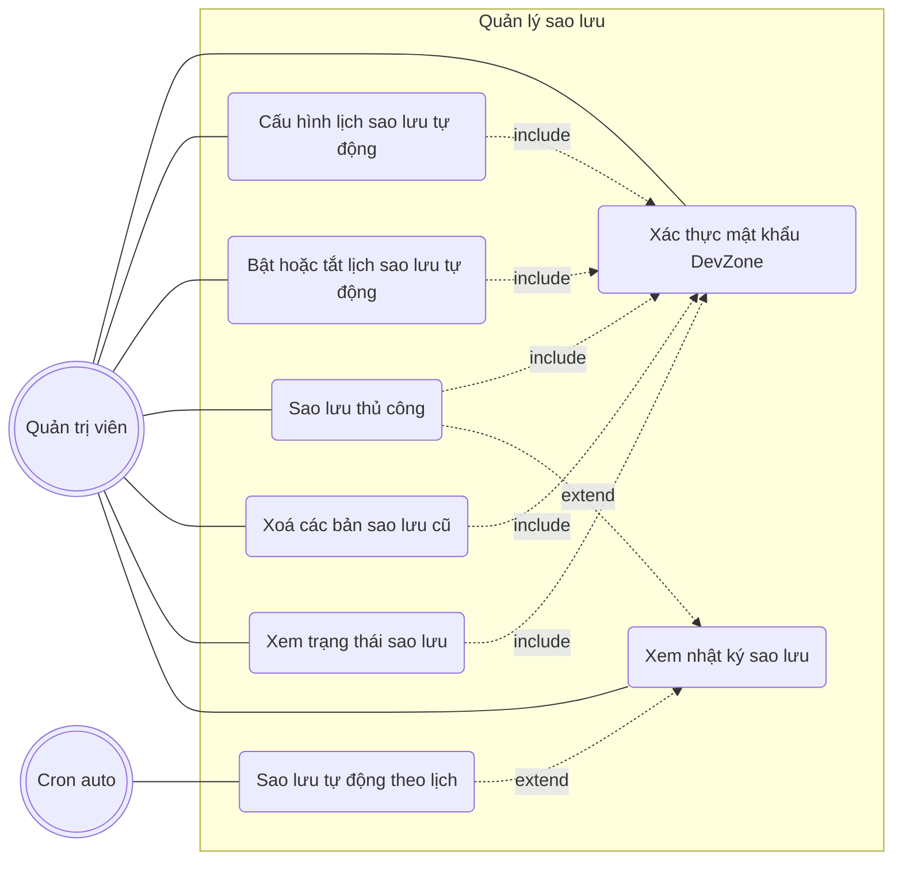
```mermaid
flowchart LR
    SA(((Quản trị viên)))
    SYSTEM(((Cron auto)))

    subgraph SYS[Quản lý sao lưu]
        UC1(Xác thực mật khẩu DevZone)
        UC2(Cấu hình lịch sao lưu tự động)
        UC3(Bật hoặc tắt lịch sao lưu tự động)
        UC4(Sao lưu thủ công)
        UC5(Xoá các bản sao lưu cũ)
        UC6(Xem trạng thái sao lưu)
        UC7(Sao lưu tự động theo lịch)
        UC8(Xem nhật ký sao lưu)

        UC2 -.->|include| UC1
        UC3 -.->|include| UC1
        UC4 -.->|include| UC1
        UC5 -.->|include| UC1
        UC6 -.->|include| UC1
        UC7 -.->|extend| UC8
        UC4 -.->|extend| UC8
    end

    SA --- UC1
    SA --- UC2
    SA --- UC3
    SA --- UC4
    SA --- UC5
    SA --- UC6
    SA --- UC8

    SYSTEM --- UC7
```

**Phân quyền**: tất cả route `/api/dev-zone/backup/*` đều yêu cầu middleware `verifyDevPassword` (mật khẩu DevZone riêng, không dùng JWT). Trong thực tế chỉ SUPER_ADMIN biết mật khẩu này.

**Khả năng chưa có**:
- **Tải file backup qua HTTP** — phần mềm không expose endpoint download. SUPER_ADMIN phải SSH vào server lấy file `.sql` thủ công từ thư mục `BE-QLKT/backups/`.
- **Xoá file riêng lẻ qua API** — chỉ có cleanup theo `retention_days`, không có DELETE từng file qua HTTP.
- **Khôi phục từ file backup qua giao diện** — phải dùng `psql -d qlkt < backup.sql` thủ công trên server.

→ Nếu báo cáo cần defend "tính năng đầy đủ", các UC trên đánh dấu là "phần mở rộng tương lai".

---

> **Ghi chú**: Phần "DevZone" (công cụ admin nâng cao truy cập bằng password riêng) là internal tool — A1.13 chỉ vẽ subset backup vì đây là feature có yếu tố nghiệp vụ. Các DevZone tool khác (cron trigger, recalculate-unit-count, feature toggle) thuộc dạng vận hành hệ thống, không đưa vào báo cáo.

---

## A1.15 — Use case phân rã: Quản lý quyết định khen thưởng (Decision)

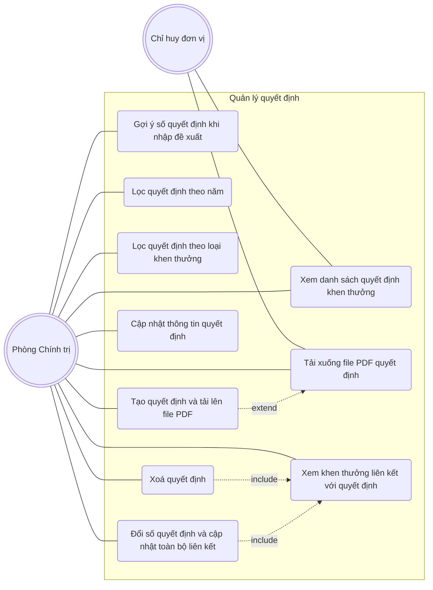
```mermaid
flowchart LR
    AD(((Phòng Chính trị)))
    MG(((Chỉ huy đơn vị)))

    subgraph SYS[Quản lý quyết định]
        UC1(Xem danh sách quyết định khen thưởng)
        UC2(Gợi ý số quyết định khi nhập đề xuất)
        UC3(Lọc quyết định theo năm)
        UC4(Lọc quyết định theo loại khen thưởng)
        UC5(Tạo quyết định và tải lên file PDF)
        UC6(Cập nhật thông tin quyết định)
        UC7(Đổi số quyết định và cập nhật toàn bộ liên kết)
        UC8(Xoá quyết định)
        UC9(Tải xuống file PDF quyết định)
        UC10(Xem khen thưởng liên kết với quyết định)

        UC5 -.->|extend| UC9
        UC7 -.->|include| UC10
        UC8 -.->|include| UC10
    end

    AD --- UC1
    AD --- UC2
    AD --- UC3
    AD --- UC4
    AD --- UC5
    AD --- UC6
    AD --- UC7
    AD --- UC8
    AD --- UC9
    AD --- UC10

    MG --- UC1
    MG --- UC9
```

**Phân quyền**: `decision.route.ts` — toàn bộ ghi (POST/PUT/DELETE) và list/autocomplete dùng `requireAdminOnly` → **chỉ ADMIN**. Riêng `/file-path/:`, `/download/:`, `/file-paths` chỉ cần `verifyToken` nên MANAGER (và mọi role đã đăng nhập) tải được file PDF khi biết số quyết định. MANAGER **không** gọi được autocomplete số quyết định (UC2).

**Đặc thù**: `FileQuyetDinh` là bảng độc lập với `BangDeXuat`, liên kết với 8 bảng khen thưởng qua hard FK natural-key `so_quyet_dinh` (xem ERD §C5.1). Cascade rename (UC7) thay đổi `so_quyet_dinh` → Postgres tự cascade 13 cột FK trên 8 bảng đích + app-layer cascade JSON payload `BangDeXuat.data_*` cùng transaction (`services/decision/cascadeRename.ts`).

---

## A1.14 — Use case phân rã: Báo cáo và thống kê

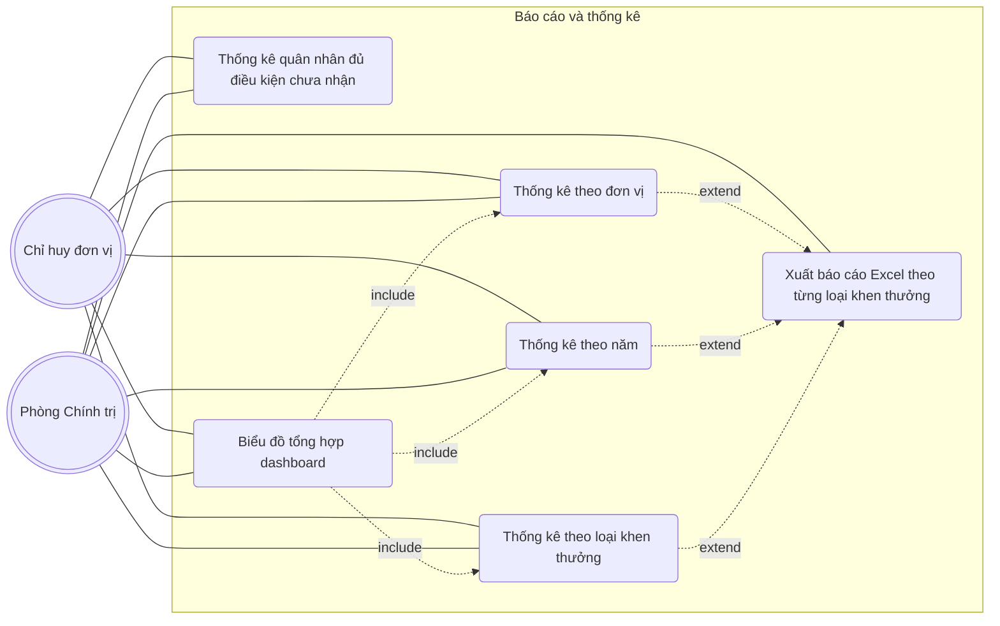
```mermaid
flowchart LR
    AD(((Phòng Chính trị)))
    MG(((Chỉ huy đơn vị)))

    subgraph SYS[Báo cáo và thống kê]
        UC1(Thống kê theo loại khen thưởng)
        UC2(Thống kê theo năm)
        UC3(Thống kê theo đơn vị)
        UC4(Thống kê quân nhân đủ điều kiện chưa nhận)
        UC5(Biểu đồ tổng hợp dashboard)
        UC6(Xuất báo cáo Excel theo từng loại khen thưởng)

        UC5 -.->|include| UC1
        UC5 -.->|include| UC2
        UC5 -.->|include| UC3
        UC1 -.->|extend| UC6
        UC2 -.->|extend| UC6
        UC3 -.->|extend| UC6
    end

    AD --- UC1
    AD --- UC2
    AD --- UC3
    AD --- UC4
    AD --- UC5
    AD --- UC6

    MG --- UC1
    MG --- UC2
    MG --- UC3
    MG --- UC4
    MG --- UC5
```

**Lưu ý**: UC6 (Xuất Excel) hiện chỉ có ở từng module khen thưởng (HCCSVV, HCBVTQ, HCQKQT, KNC, NCKH, danh hiệu hằng năm) — chưa có endpoint export tổng hợp. **Xuất báo cáo PDF** và **So sánh thành tích giữa các quân nhân** là phần mở rộng tương lai — chưa cài đặt trong phần mềm hiện tại.

---

## Tổng kết

| # | Sơ đồ | Số use case | Actor |
|---|---|---|---|
| A1.1 | Use case tổng quát | 12 | 4 |
| A1.2 | Quản lý tài khoản | 8 | SUPER_ADMIN, ADMIN |
| A1.3 | Quản lý quân nhân | 7 | ADMIN, MANAGER |
| A1.4 | Quản lý đơn vị | 10 | SUPER_ADMIN, ADMIN |
| A1.5 | Danh hiệu cá nhân hằng năm (UC5) | 9 | ADMIN, MANAGER, USER |
| A1.6 | Khen thưởng đơn vị hằng năm (UC6) | 8 | ADMIN, MANAGER |
| A1.7 | Huân/huy chương cá nhân và NCKH (5 sơ đồ con A1.7.1 → A1.7.5) | 7 × 5 = 35 | ADMIN, MANAGER, USER |
| A1.8 | Đề xuất khen thưởng (UC13) | 17 | MANAGER, ADMIN |
| A1.9 | Khen thưởng đột xuất (UC12 — flow riêng) | 9 | ADMIN, MANAGER, USER |
| A1.10 | Xét điều kiện khen thưởng (UC14) | 10 | ADMIN, System, MANAGER, USER |
| A1.11 | Thông báo realtime (UC15) | 8 | ADMIN, MANAGER, USER |
| A1.12 | Nhật ký hệ thống (UC16) | 10 | SUPER_ADMIN, ADMIN, MANAGER |
| A1.13 | Backup qua DevZone (UC17) | 8 | SUPER_ADMIN, Cron |
| A1.14 | Báo cáo thống kê (UC18) | 6 | ADMIN, MANAGER |
| A1.15 | Quản lý quyết định (Decision) | 10 | ADMIN, MANAGER |

**Tổng**: 1 sơ đồ tổng quát + 14 sơ đồ phân rã. DevZone backup được tách riêng vì có yếu tố nghiệp vụ; các DevZone tool khác (cron trigger, recalc unit count, feature toggle) không đưa vào báo cáo.
