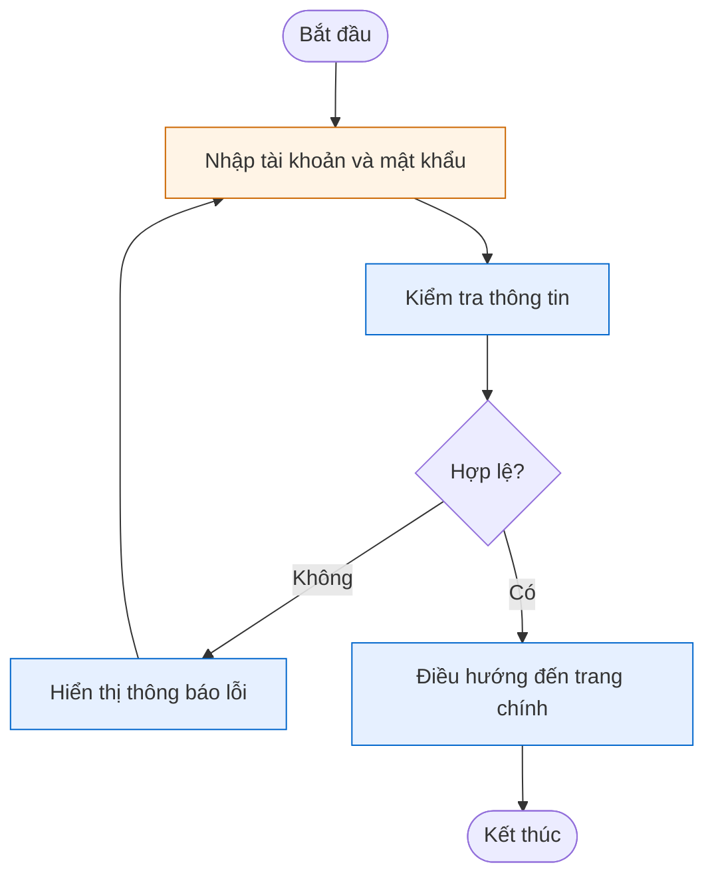
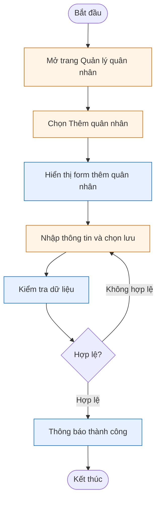
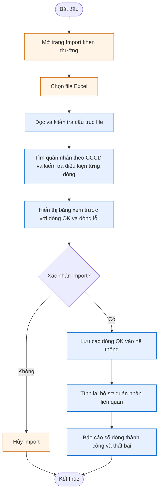
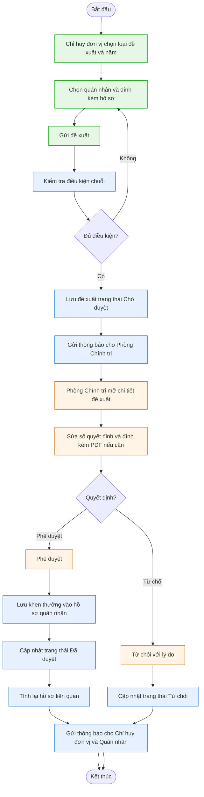
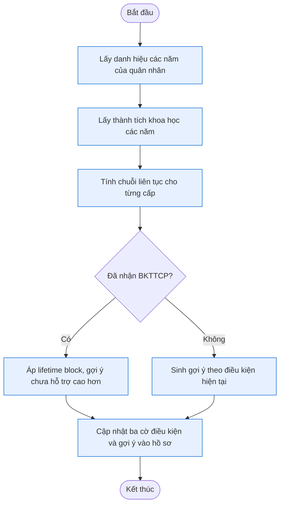
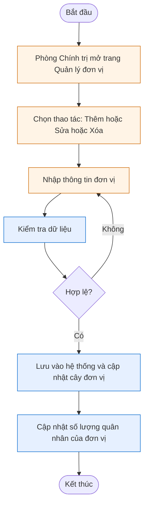
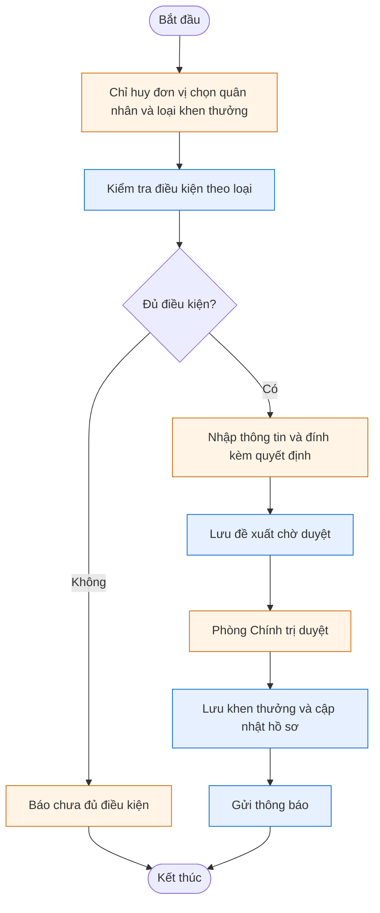
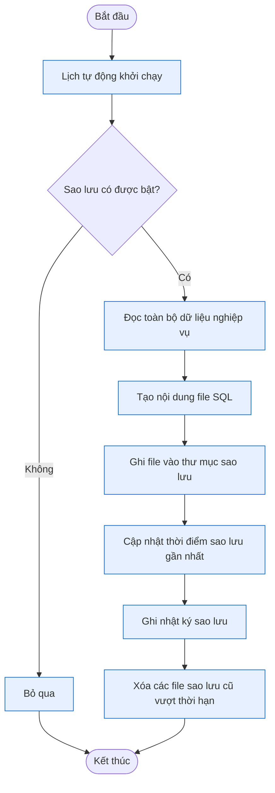

# Sơ đồ Hoạt động (Activity Diagrams)

> Bám sát style **báo cáo mẫu HUST**: 2 swimlane (Actor / Hệ thống), ngôn ngữ nghiệp vụ tiếng Việt, ít node (6–10 mỗi sơ đồ), diamond cho decision, vòng lại lane Actor khi không hợp lệ.
>
> Mermaid không có syntax UML Swimlane thuần — dùng `flowchart TD` + `subgraph` cho từng lane. Khi xuất sang báo cáo nên render lại trên **draw.io** (chọn UML Activity) để có swimlane chuẩn UML.

---

## A3.1 — Quy trình đăng nhập

**Lane**: hành động màu cam thuộc **Người dùng**, hành động màu xanh thuộc **Hệ thống**.

---

## A3.2 — Quy trình thêm mới quân nhân

---

## A3.3 — Quy trình import danh sách khen thưởng từ Excel

---

## A3.4 — Quy trình tạo và phê duyệt đề xuất khen thưởng

---

## A3.5 — Quy trình tính lại điều kiện chuỗi

**Lưu ý**: Quy trình này chỉ có lane Hệ thống (chạy nền tự động sau khi duyệt đề xuất hoặc sửa danh hiệu).

---

## A3.6 — Quy trình quản lý đơn vị

---

## A3.7 — Quy trình quản lý 5 loại huân huy chương riêng

**Áp dụng cho**: Huy chương Chiến sĩ Vẻ vang (HCCSVV niên hạn), Huân chương Bảo vệ Tổ quốc (HCBVTQ cống hiến), Huân chương Quân kỳ Quyết thắng, Kỷ niệm chương VSNXD QĐNDVN, Khen thưởng đột xuất, Thành tích NCKH.

---

## A3.8 — Quy trình sao lưu dữ liệu định kỳ

**Lưu ý**: Quy trình hoàn toàn chạy nền (lane Hệ thống). Quản trị viên (SUPER_ADMIN) tải file backup qua trang riêng (use case khác — UC-08).

---

## Tổng kết

| # | Quy trình | Lane | Số node |
|---|---|---|---|
| A3.1 | Đăng nhập | Người dùng + Hệ thống | 6 |
| A3.2 | Thêm quân nhân | Phòng Chính trị + Hệ thống | 7 |
| A3.3 | Import Excel khen thưởng | Phòng Chính trị + Hệ thống | 9 |
| A3.4 | Tạo và duyệt đề xuất | 3 lane (Chỉ huy đơn vị + Phòng Chính trị + Hệ thống) | 14 |
| A3.5 | Recalc điều kiện chuỗi | Hệ thống | 6 |
| A3.6 | Quản lý đơn vị | Phòng Chính trị + Hệ thống | 6 |
| A3.7 | 5 loại huân huy chương riêng | Chỉ huy đơn vị + Phòng Chính trị + Hệ thống | 9 |
| A3.8 | Sao lưu định kỳ | Hệ thống | 8 |

**Style nguyên tắc** (theo báo cáo mẫu):
- Tên hành động: **động từ tiếng Việt** ngắn gọn ("Nhập thông tin", "Kiểm tra dữ liệu", "Lưu vào hệ thống", "Thông báo thành công")
- Tránh từ dev: không "Joi validate", "INSERT", "Bulk insert", "Promise.all", "transaction" — thay bằng "Kiểm tra dữ liệu", "Lưu", "Lưu nhiều dòng", "Đọc dữ liệu"
- Decision: dạng câu hỏi ngắn ("Hợp lệ?", "Đủ điều kiện?", "Quyết định?")
- Loop back về lane Actor khi validate fail (giống mẫu — nhập lại dữ liệu)
- Mỗi sơ đồ tối đa ~10 node (trừ A3.4 phức tạp hơn vì có 2 actor)
