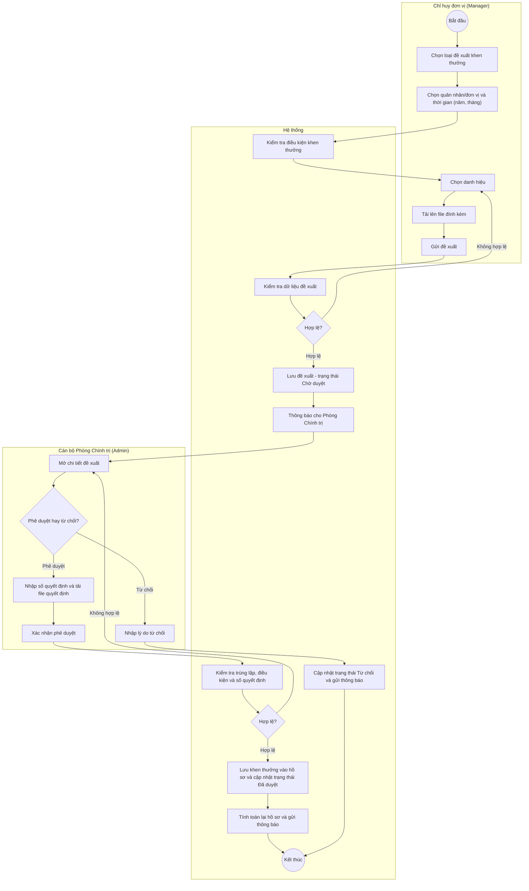
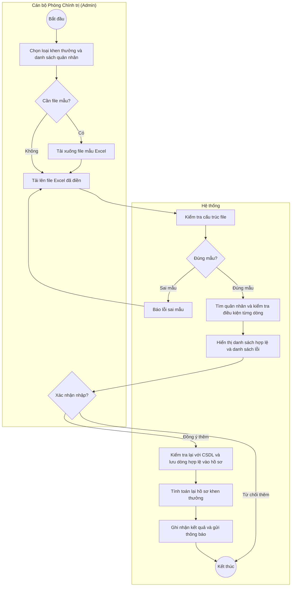
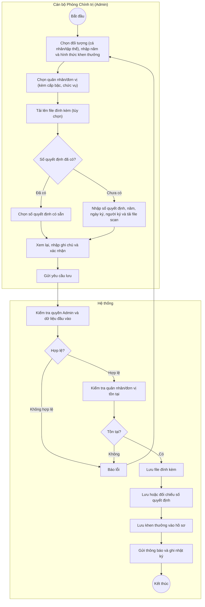

# Biểu đồ hoạt động (Activity diagrams)

Nguồn Mermaid của các biểu đồ hoạt động, bám sát mã nguồn hệ thống. Dán vào
[mermaid.live](https://mermaid.live) để xuất PNG bỏ vào `Báo cáo ĐATN/Hinhve/`.

- Sơ đồ 1 — Quy trình khen thưởng (đề xuất → phê duyệt): `Hinhve/activity-quy-trinh.png`
- Sơ đồ 2 — Thêm khen thưởng từ Excel: `Hinhve/activity-excel.png`
- Sơ đồ 3 — Thêm khen thưởng đột xuất (Admin thêm trực tiếp, không đề xuất)

---

## 1. Quy trình khen thưởng (đề xuất → phê duyệt)

Khen thưởng đột xuất KHÔNG đi qua luồng này (Manager bị chặn đề xuất `DOT_XUAT`) —
xem Sơ đồ 3. Submit: Admin hoặc Manager. Approve/Reject: chỉ Admin.

```mermaid
flowchart TD
    subgraph CHDV["Chỉ huy đơn vị (Manager)"]
        S(("Bắt đầu")) --> A1["Chọn loại đề xuất khen thưởng"]
        A1 --> A2["Chọn quân nhân/đơn vị và thời gian (năm, tháng)"]
        A3["Chọn danh hiệu"]
        A4["Tải lên file đính kèm"]
        A5["Gửi đề xuất"]
    end

    subgraph HT["Hệ thống"]
        B1["Kiểm tra điều kiện khen thưởng"]
        B2["Kiểm tra dữ liệu đề xuất"]
        D1{"Hợp lệ?"}
        B3["Lưu đề xuất - trạng thái Chờ duyệt"]
        B4["Thông báo cho Phòng Chính trị"]
        E1["Kiểm tra trùng lặp, điều kiện và số quyết định"]
        D3{"Hợp lệ?"}
        E2["Lưu khen thưởng vào hồ sơ và cập nhật trạng thái Đã duyệt"]
        E3["Cập nhật trạng thái Từ chối và gửi thông báo"]
        E4["Tính toán lại hồ sơ và gửi thông báo"]
        F(("Kết thúc"))
    end

    subgraph CB["Cán bộ Phòng Chính trị (Admin)"]
        C1["Mở chi tiết đề xuất"]
        D2{"Phê duyệt hay từ chối?"}
        C2["Nhập số quyết định và tải file quyết định"]
        C3["Xác nhận phê duyệt"]
        C4["Nhập lý do từ chối"]
    end

    A2 --> B1
    B1 --> A3
    A3 --> A4 --> A5
    A5 --> B2
    B2 --> D1
    D1 -->|"Không hợp lệ"| A3
    D1 -->|"Hợp lệ"| B3
    B3 --> B4
    B4 --> C1
    C1 --> D2
    D2 -->|"Phê duyệt"| C2
    C2 --> C3
    C3 --> E1
    E1 --> D3
    D3 -->|"Không hợp lệ"| C1
    D3 -->|"Hợp lệ"| E2
    E2 --> E4
    E4 --> F
    D2 -->|"Từ chối"| C4
    C4 --> E3
    E3 --> F
```

Bám theo mã nguồn:

- Trạng thái đề xuất chỉ có Chờ duyệt / Đã duyệt / Từ chối (`PENDING/APPROVED/REJECTED`).
- Lúc phê duyệt admin chỉ nhập số quyết định + file quyết định; năm/tháng nhận lấy từ
  chính đề xuất (không nhập "thời gian nhận").
- Lúc duyệt hệ thống chạy 3 lớp kiểm tra theo thứ tự: trùng lặp → điều kiện chuỗi danh
  hiệu → đủ số quyết định, rồi lưu hồ sơ + đổi trạng thái trong cùng một transaction;
  tính lại hồ sơ chạy sau khi transaction commit.
- Từ chối bắt buộc có lý do và không tính lại hồ sơ.

---

## 2. Thêm khen thưởng từ Excel

Luồng Admin nhập trực tiếp theo hai bước preview → confirm.

```mermaid
flowchart TD
    subgraph CB["Cán bộ Phòng Chính trị (Admin)"]
        S(("Bắt đầu")) --> A1["Chọn loại khen thưởng và danh sách quân nhân"]
        A1 --> D0{"Cần file mẫu?"}
        A2["Tải xuống file mẫu Excel"]
        A3["Tải lên file Excel đã điền"]
        D2{"Xác nhận nhập?"}
    end

    subgraph HT["Hệ thống"]
        B1["Kiểm tra cấu trúc file"]
        D1{"Đúng mẫu?"}
        Berr["Báo lỗi sai mẫu"]
        B2["Tìm quân nhân và kiểm tra điều kiện từng dòng"]
        B3["Hiển thị danh sách hợp lệ và danh sách lỗi"]
        B4["Kiểm tra lại với CSDL và lưu dòng hợp lệ vào hồ sơ"]
        B5["Tính toán lại hồ sơ khen thưởng"]
        B6["Ghi nhận kết quả và gửi thông báo"]
        F(("Kết thúc"))
    end

    D0 -->|"Có"| A2
    A2 --> A3
    D0 -->|"Không"| A3
    A3 --> B1
    B1 --> D1
    D1 -->|"Sai mẫu"| Berr
    Berr --> A3
    D1 -->|"Đúng mẫu"| B2
    B2 --> B3
    B3 --> D2
    D2 -->|"Từ chối thêm"| F
    D2 -->|"Đồng ý thêm"| B4
    B4 --> B5
    B5 --> B6
    B6 --> F
```

Bám theo mã nguồn:

- Luồng 2 lần gọi API: `import/preview` (chỉ kiểm tra, không ghi DB) → trang xem trước →
  `import/confirm` (kiểm tra lại với CSDL rồi ghi trong transaction).
- File sai cấu trúc bị ném lỗi và request fail → người dùng tải lên lại (vẽ thành vòng
  lặp về bước "Tải lên"). Lỗi từng dòng (sai quân nhân, không đủ điều kiện…) nằm trong
  "danh sách lỗi", không làm fail request.
- Tính toán lại hồ sơ: loại hằng năm recalc; HCBVTQ/Kỷ niệm chương thực tế tính lại qua
  job định kỳ chứ không ngay lúc nhập.

---

## 3. Thêm khen thưởng đột xuất (Admin thêm trực tiếp, không đề xuất)

Admin nhập qua wizard 5 bước (Thông tin cơ bản → Đối tượng → Tải tệp → Quyết định →
Xem lại). Mỗi đối tượng được chọn sẽ tạo một bản ghi khen thưởng riêng.

```mermaid
flowchart TD
    subgraph CB["Cán bộ Phòng Chính trị (Admin)"]
        S(("Bắt đầu")) --> A1["Chọn đối tượng (cá nhân/tập thể), nhập năm và hình thức khen thưởng"]
        A1 --> A2["Chọn quân nhân/đơn vị (kèm cấp bậc, chức vụ)"]
        A2 --> A3["Tải lên file đính kèm (tùy chọn)"]
        A3 --> A4{"Số quyết định đã có?"}
        A4 -->|"Đã có"| A5["Chọn số quyết định có sẵn"]
        A4 -->|"Chưa có"| A6["Nhập số quyết định, năm, ngày ký, người ký và tải file scan"]
        A5 --> A7["Xem lại, nhập ghi chú và xác nhận"]
        A6 --> A7
        A7 --> A8["Gửi yêu cầu lưu"]
    end

    subgraph HT["Hệ thống"]
        B1["Kiểm tra quyền Admin và dữ liệu đầu vào"]
        D1{"Hợp lệ?"}
        Berr["Báo lỗi"]
        B2["Kiểm tra quân nhân/đơn vị tồn tại"]
        D2{"Tồn tại?"}
        B3["Lưu file đính kèm"]
        B4["Lưu hoặc đối chiếu số quyết định"]
        B5["Lưu khen thưởng vào hồ sơ"]
        B6["Gửi thông báo và ghi nhật ký"]
        F(("Kết thúc"))
    end

    A8 --> B1
    B1 --> D1
    D1 -->|"Không hợp lệ"| Berr
    Berr --> A1
    D1 -->|"Hợp lệ"| B2
    B2 --> D2
    D2 -->|"Không"| Berr
    D2 -->|"Có"| B3
    B3 --> B4
    B4 --> B5
    B5 --> B6
    B6 --> F
```

Bám theo mã nguồn:

- Chỉ Admin được tạo (`requireAdminOnly`); lưu ở bảng riêng `KhenThuongDotXuat`, không
  dùng `BangDeXuat`.
- Số quyết định là khóa ngoại tới `FileQuyetDinh`: chọn số có sẵn thì tự điền năm/ngày
  ký/người ký; số mới thì bắt buộc nhập năm, ngày ký, người ký (kèm file scan tùy chọn).
- Hệ thống chỉ kiểm quyền Admin, dữ liệu đầu vào và đối tượng tồn tại; không kiểm tra
  điều kiện chuỗi danh hiệu, không kiểm tra trùng lặp, không tính lại hồ sơ.
- "Hình thức khen thưởng" là text tự do (vd "Giấy khen của HV"), không phải danh hiệu cố định.
