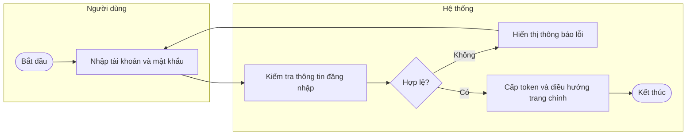
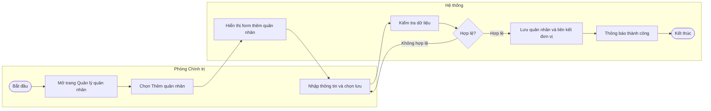
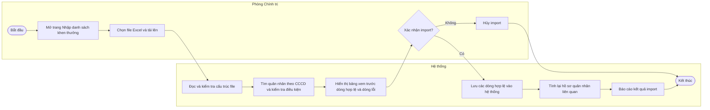
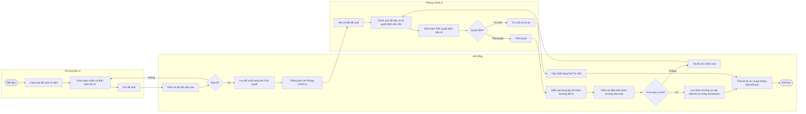
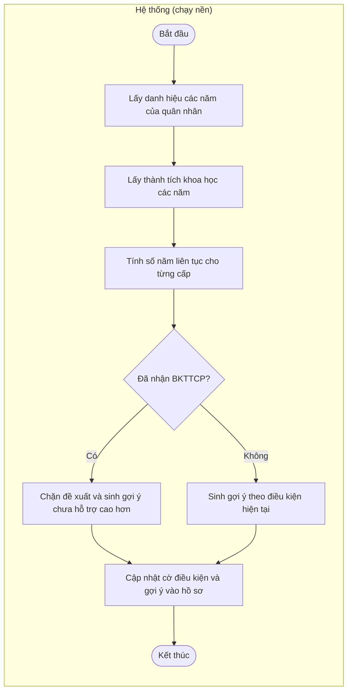
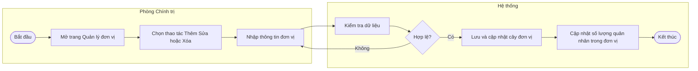
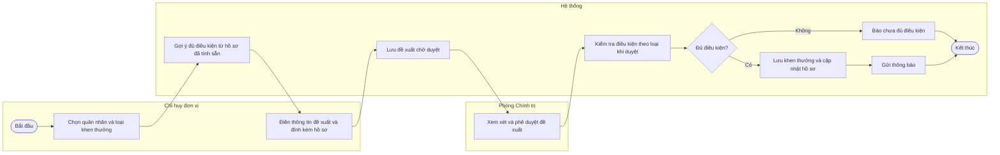
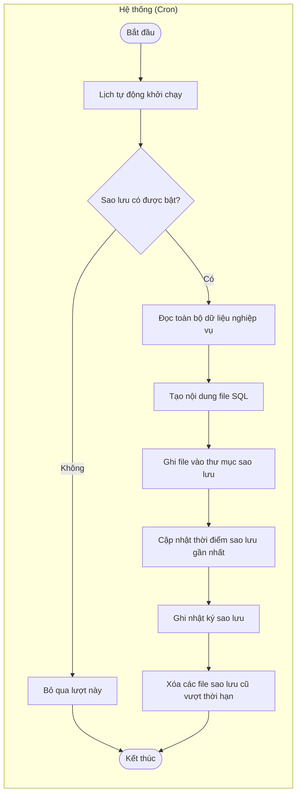

# Sơ đồ Hoạt động (Activity Diagrams)

> **Render**: Copy block `mermaid` vào https://mermaid.live hoặc dùng VSCode Mermaid Preview extension.
>
> **Swimlane**: Mỗi sơ đồ dùng `flowchart LR` + `subgraph direction TB` — mỗi `subgraph` là một làn dọc (actor), luồng đi từ trái sang phải qua các làn. Khi xuất báo cáo, render lại trên **draw.io** (Export → UML Activity) để có swimlane chuẩn UML với đường kẻ làn.

---

## A3.1 — Quy trình đăng nhập

```mermaid
flowchart LR
    subgraph NguoiDung["Người dùng"]
        direction TB
        Start([Bắt đầu])
        A1[Nhập tài khoản và mật khẩu]
    end
    subgraph HeTHong["Hệ thống"]
        direction TB
        S1[Kiểm tra thông tin đăng nhập]
        D1{Hợp lệ?}
        S2[Hiển thị thông báo lỗi]
        S3[Cấp token và điều hướng trang chính]
        End([Kết thúc])
    end

    Start --> A1 --> S1 --> D1
    D1 -- Không --> S2 --> A1
    D1 -- Có --> S3 --> End
```

---

## A3.2 — Quy trình thêm mới quân nhân

```mermaid
flowchart LR
    subgraph PCT["Phòng Chính trị"]
        direction TB
        Start([Bắt đầu])
        A1[Mở trang Quản lý quân nhân]
        A2[Chọn Thêm quân nhân]
        A3[Nhập thông tin và chọn lưu]
    end
    subgraph HeTHong["Hệ thống"]
        direction TB
        S1[Hiển thị form thêm quân nhân]
        S2[Kiểm tra dữ liệu]
        D1{Hợp lệ?}
        S3[Lưu quân nhân và liên kết đơn vị]
        S4[Thông báo thành công]
        End([Kết thúc])
    end

    Start --> A1 --> A2 --> S1 --> A3 --> S2 --> D1
    D1 -- Không hợp lệ --> A3
    D1 -- Hợp lệ --> S3 --> S4 --> End
```

---

## A3.3 — Quy trình nhập danh sách khen thưởng từ Excel

```mermaid
flowchart LR
    subgraph PCT["Phòng Chính trị"]
        direction TB
        Start([Bắt đầu])
        A1[Mở trang Nhập danh sách khen thưởng]
        A2[Chọn file Excel và tải lên]
        D1{Xác nhận import?}
        A3[Hủy import]
    end
    subgraph HeTHong["Hệ thống"]
        direction TB
        S1[Đọc và kiểm tra cấu trúc file]
        S2[Tìm quân nhân theo CCCD và kiểm tra điều kiện]
        S3[Hiển thị bảng xem trước dòng hợp lệ và dòng lỗi]
        S4[Lưu các dòng hợp lệ vào hệ thống]
        S5[Tính lại hồ sơ quân nhân liên quan]
        S6[Báo cáo kết quả import]
        End([Kết thúc])
    end

    Start --> A1 --> A2 --> S1 --> S2 --> S3 --> D1
    D1 -- Không --> A3 --> End
    D1 -- Có --> S4 --> S5 --> S6 --> End
```

---

## A3.4 — Quy trình tạo và phê duyệt đề xuất khen thưởng

```mermaid
flowchart LR
    subgraph MG["Chỉ huy đơn vị"]
        direction TB
        Start([Bắt đầu])
        M1[Chọn loại đề xuất và năm]
        M2[Chọn quân nhân và đính kèm hồ sơ]
        M3[Gửi đề xuất]
    end
    subgraph AD["Phòng Chính trị"]
        direction TB
        A1[Mở chi tiết đề xuất]
        A2[Chỉnh sửa dữ liệu và số quyết định nếu cần]
        A3[Đính kèm PDF quyết định nếu có]
        D2{Quyết định?}
        A4[Phê duyệt]
        A5[Từ chối với lý do]
    end
    subgraph SYS["Hệ thống"]
        direction TB
        S1[Kiểm tra dữ liệu đầu vào]
        D1{Hợp lệ?}
        S2[Lưu đề xuất trạng thái Chờ duyệt]
        S3[Thông báo cho Phòng Chính trị]
        S4a[Kiểm tra trùng lặp với khen thưởng đã có]
        S4b[Kiểm tra điều kiện khen thưởng theo loại]
        D3{Vượt qua cả hai?}
        S5[Trả lỗi cho chỉnh sửa]
        S6[Lưu khen thưởng và cập nhật hồ sơ trong transaction]
        S7[Tính lại hồ sơ và gửi thông báo kết quả]
        S8[Cập nhật trạng thái Từ chối]
        End([Kết thúc])
    end

    Start --> M1 --> M2 --> M3 --> S1 --> D1
    D1 -- Không --> M2
    D1 -- Có --> S2 --> S3 --> A1 --> A2 --> A3 --> D2
    D2 -- Phê duyệt --> A4 --> S4a --> S4b --> D3
    D3 -- Không --> S5 --> A2
    D3 -- Có --> S6 --> S7 --> End
    D2 -- Từ chối --> A5 --> S8 --> S7
```

**Ghi chú**:
1. Thứ tự kiểm tra ở bước duyệt: **trùng lặp trước** (`runDuplicateChecks`) rồi **điều kiện** (`runEligibilityChecks`) — khớp `services/proposal/approve.ts:290–292`. Nếu trùng lặp → fail luôn, không cần check điều kiện.
2. Bước `S6` bao gồm một giao dịch DB nguyên tử (`prisma.$transaction` ở `approve/import.ts:64`) — tạo `FileQuyetDinh`, lưu khen thưởng, cập nhật trạng thái đề xuất. Khoá lạc quan đảm bảo chỉ một yêu cầu phê duyệt thành công khi có race condition.

---

## A3.5 — Quy trình tính lại điều kiện khen thưởng

```mermaid
flowchart LR
    subgraph HeTHong["Hệ thống (chạy nền)"]
        direction TB
        Start([Bắt đầu])
        S1[Lấy danh hiệu các năm của quân nhân]
        S2[Lấy thành tích khoa học các năm]
        S3[Tính số năm liên tục cho từng cấp]
        D1{Đã nhận BKTTCP?}
        S4[Chặn đề xuất và sinh gợi ý chưa hỗ trợ cao hơn]
        S5[Sinh gợi ý theo điều kiện hiện tại]
        S6[Cập nhật cờ điều kiện và gợi ý vào hồ sơ]
        End([Kết thúc])
    end

    Start --> S1 --> S2 --> S3 --> D1
    D1 -- Có --> S4 --> S6 --> End
    D1 -- Không --> S5 --> S6
```

**Ghi chú**: Quy trình chỉ có một làn Hệ thống — tự động kích hoạt sau khi duyệt đề xuất hoặc sửa danh hiệu hằng năm.

---

## A3.6 — Quy trình quản lý đơn vị

```mermaid
flowchart LR
    subgraph PCT["Phòng Chính trị"]
        direction TB
        Start([Bắt đầu])
        A1[Mở trang Quản lý đơn vị]
        A2[Chọn thao tác Thêm Sửa hoặc Xóa]
        A3[Nhập thông tin đơn vị]
    end
    subgraph HeTHong["Hệ thống"]
        direction TB
        S1[Kiểm tra dữ liệu]
        D1{Hợp lệ?}
        S2[Lưu và cập nhật cây đơn vị]
        S3[Cập nhật số lượng quân nhân trong đơn vị]
        End([Kết thúc])
    end

    Start --> A1 --> A2 --> A3 --> S1 --> D1
    D1 -- Không --> A3
    D1 -- Có --> S2 --> S3 --> End
```

---

## A3.7 — Quy trình quản lý huân huy chương theo loại

```mermaid
flowchart LR
    subgraph MG["Chỉ huy đơn vị"]
        direction TB
        Start([Bắt đầu])
        A1[Chọn quân nhân và loại khen thưởng]
        A3[Điền thông tin đề xuất và đính kèm hồ sơ]
    end
    subgraph PCT["Phòng Chính trị"]
        direction TB
        A4[Xem xét và phê duyệt đề xuất]
    end
    subgraph HeTHong["Hệ thống"]
        direction TB
        S0[Gợi ý đủ điều kiện từ hồ sơ đã tính sẵn]
        S1[Kiểm tra điều kiện theo loại khi duyệt]
        D1{Đủ điều kiện?}
        S2[Báo chưa đủ điều kiện]
        S3[Lưu đề xuất chờ duyệt]
        S4[Lưu khen thưởng và cập nhật hồ sơ]
        S5[Gửi thông báo]
        End([Kết thúc])
    end

    Start --> A1 --> S0 --> A3 --> S3 --> A4 --> S1 --> D1
    D1 -- Không --> S2 --> End
    D1 -- Có --> S4 --> S5 --> End
```

**Áp dụng cho**: Huy chương Chiến sĩ Vẻ vang, Huân chương Bảo vệ Tổ quốc, Huân chương Quân kỳ Quyết thắng, Kỷ niệm chương vì sự nghiệp xây dựng QĐNDVN, thành tích nghiên cứu khoa học.

**Ghi chú thứ tự kiểm tra**:
- **S0 — Gợi ý ở bước form**: FE đọc cờ `du_dieu_kien_*` và `goi_y` từ `HoSoNienHan`/`HoSoCongHien` đã được tính sẵn (qua C4.4) để **hiển thị** đủ/chưa đủ — đây là gợi ý UX, **không chặn cứng** việc gửi đề xuất.
- **S1 — Kiểm tra thực sự ở bước duyệt**: Khi Phòng Chính trị phê duyệt, BE chạy `runEligibilityChecks` để xác nhận lại (xem C4.3). Sở dĩ check 2 lần vì dữ liệu có thể "stale" giữa lúc MGR tạo và ADM duyệt — đây là single source of truth.

---

## A3.8 — Quy trình sao lưu dữ liệu định kỳ

```mermaid
flowchart LR
    subgraph HeTHong["Hệ thống (Cron)"]
        direction TB
        Start([Bắt đầu])
        S1[Lịch tự động khởi chạy]
        D1{Sao lưu có được bật?}
        S2[Bỏ qua lượt này]
        S3[Đọc toàn bộ dữ liệu nghiệp vụ]
        S4[Tạo nội dung file SQL]
        S5[Ghi file vào thư mục sao lưu]
        S6[Cập nhật thời điểm sao lưu gần nhất]
        S7[Ghi nhật ký sao lưu]
        S8[Xóa các file sao lưu cũ vượt thời hạn]
        End([Kết thúc])
    end

    Start --> S1 --> D1
    D1 -- Không --> S2 --> End
    D1 -- Có --> S3 --> S4 --> S5 --> S6 --> S7 --> S8 --> End
```

**Ghi chú**: Quy trình chỉ có một làn Hệ thống — Quản trị viên (SUPER_ADMIN) kích hoạt/tắt lịch và tải file backup qua trang riêng, không thể hiện trong sơ đồ này.

---

## Tổng kết

| # | Quy trình | Làn (swimlane) | Số node |
|---|---|---|---|
| A3.1 | Đăng nhập | Người dùng · Hệ thống | 7 |
| A3.2 | Thêm quân nhân | Phòng Chính trị · Hệ thống | 9 |
| A3.3 | Nhập danh sách khen thưởng từ Excel | Phòng Chính trị · Hệ thống | 10 |
| A3.4 | Tạo và duyệt đề xuất | Chỉ huy đơn vị · Phòng Chính trị · Hệ thống | 19 |
| A3.5 | Tính lại điều kiện khen thưởng | Hệ thống | 7 |
| A3.6 | Quản lý đơn vị | Phòng Chính trị · Hệ thống | 7 |
| A3.7 | Huân huy chương theo loại | Chỉ huy đơn vị · Phòng Chính trị · Hệ thống | 10 |
| A3.8 | Sao lưu định kỳ | Hệ thống | 9 |

**Quy ước vẽ**:
- Swimlane: `flowchart LR` + `subgraph direction TB` — mỗi subgraph là một làn dọc, flow đi từ trái sang phải
- Tên hành động: **động từ tiếng Việt** ngắn gọn ("Nhập thông tin", "Kiểm tra dữ liệu", "Lưu vào hệ thống")
- Decision: câu hỏi ngắn kết thúc bằng dấu `?` ("Hợp lệ?", "Đủ điều kiện?", "Quyết định?")
- Loop back khi validate fail → mũi tên quay về làn Actor để nhập lại
- Bắt đầu (●) thường ở làn actor khởi tạo; Kết thúc ở làn Hệ thống
