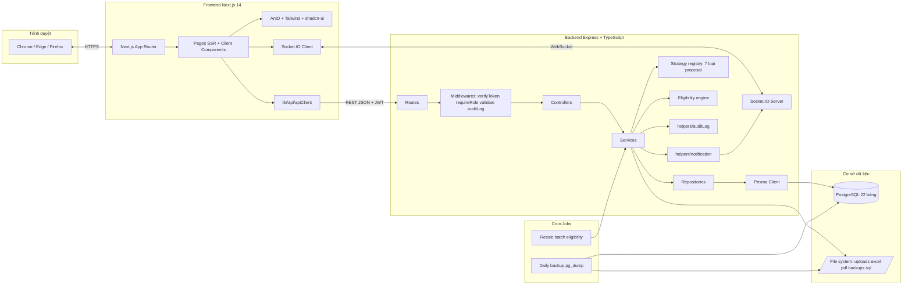
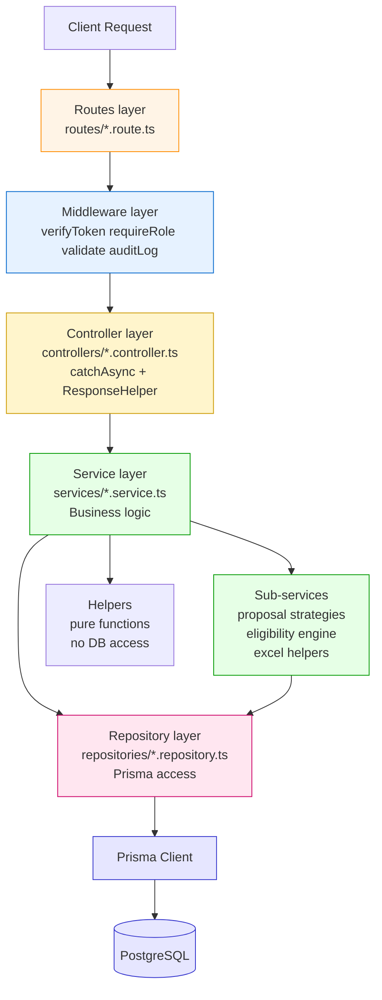
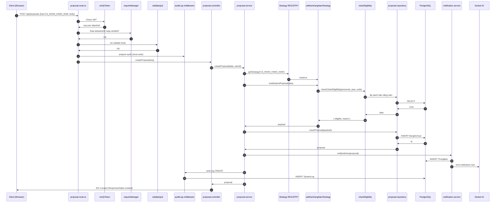
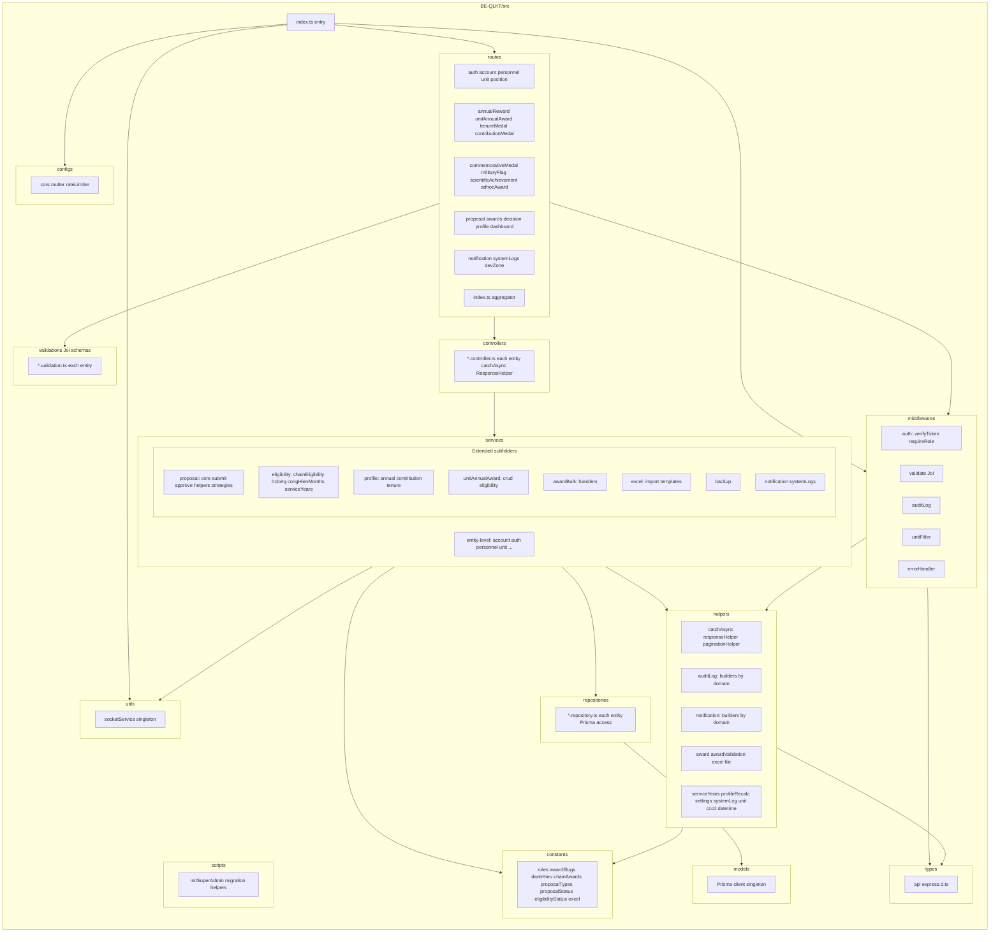
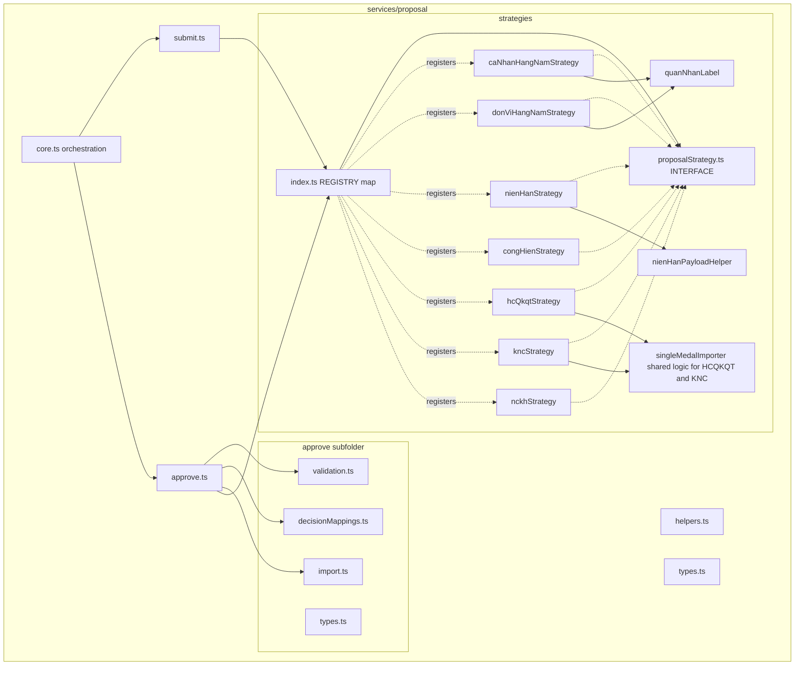
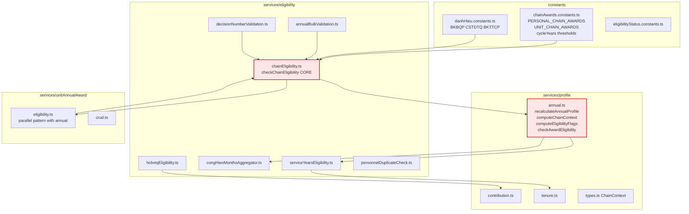

# Sơ đồ Kiến trúc & Gói (Architecture & Package)

> Sử dụng `flowchart` cho kiến trúc tổng thể và package diagram (Mermaid không có syntax UML Package thuần). Để render đẹp, dùng VSCode Mermaid Preview.

---

## C1.1 — Kiến trúc tổng thể Client-Server + REST API + WebSocket

**Điểm khác biệt với báo cáo mẫu**: Có thêm Socket.IO Server (realtime), Repository layer (decouple Prisma), Cron Jobs (backup + recalc), file system tách biệt.

---

## C1.2 — Mô hình Layered Architecture (Route → Middleware → Controller → Service → Repository → Prisma)

**So sánh với MVC truyền thống**: Báo cáo mẫu HRM dùng MVC 3 lớp (Model-View-Controller). PM QLKT dùng Layered 6 lớp với:
- Tách **Middleware chain** thành lớp riêng
- Thêm **Service** cho business logic (controller mỏng)
- Thêm **Repository** decouple Prisma (commit `9bd12f6`)
- Tách **Helpers** pure (không gọi DB)

→ Đây là điểm chuyên sâu cần defend khi bảo vệ.

---

## C1.3 — Luồng request-response (1 use case mẫu: Tạo đề xuất CA_NHAN_HANG_NAM)

---

## C2.1 — Package diagram phía Client (FE-QLKT)

```mermaid
flowchart TB
    subgraph FE[FE-QLKT/src]
        direction TB

        subgraph APP[app - Next.js App Router]
            APPROOT[layout.tsx + page.tsx + globals.css]
            APPAUTH[auth route group: login]
            APPADMIN[admin]
            APPMANAGER[manager]
            APPUSER[user]
            APPSA[super-admin]
            APPDEV[dev_zone]
        end

        subgraph COMP[components]
            CACC[accounts]
            CADHOC[adhoc-awards]
            CAUTH[auth]
            CCAT[categories]
            CCHART[charts]
            CDASH[dashboard]
            CDEC[decisions]
            CIMP[import-review]
            CPER[personnel]
            CPRO[profile]
            CPROP[proposals]
            CSHARE[shared]
            CSA[super-admin]
            CSL[system-logs]
            CUI[ui shadcn]
            CMAIN[MainLayout.tsx + ThemeProvider.tsx]
        end

        subgraph LIB[lib]
            LIBAPI[api: accounts auth awards personnel proposals notifications systemLogs units profiles dashboard decisions adhocAwards annualAwards unitAnnualAwards]
            LIBAWARD[award]
            LIBPROP[proposal]
            LIBFILE[file]
            LIBTYPES[types]
            LIBCLIENT[apiClient.ts apiError.ts axiosInstance.ts]
            LIBAUTH[authStorage.ts]
            LIBTHEME[antdTheme.ts chartConfig.ts navigation.tsx]
            LIBSCHEMA[schemas.ts]
            LIBUTILS[utils.ts]
        end

        subgraph CONST[constants]
            CONST1[roles awardSlugs danhHieu eligibilityStatus proposalTypes]
        end

        subgraph HOOKS[hooks]
            HOOK1[useAuthGuard]
            HOOK2[useFetch]
            HOOK3[useMobile]
            HOOK4[useProposalListFilters]
            HOOK5[useSocket]
            HOOK6[useToast]
        end

        subgraph CTX[contexts]
            CTX1[AuthContext.tsx]
            CTX2[DevZoneContext.tsx]
        end

        subgraph CONFIG[configs]
            CONFIG1[Next.js + Tailwind + AntD theme]
        end
    end

    APP --> COMP
    APP --> CTX
    APP --> HOOKS
    COMP --> LIB
    COMP --> CONST
    COMP --> HOOKS
    LIB --> CONFIG
    LIB --> CONST
    HOOKS --> LIB
    CTX --> LIB
```

**Đối chiếu code thực tế**: 15 folder `components/` (accounts, adhoc-awards, auth, categories, charts, dashboard, decisions, import-review, personnel, profile, proposals, shared, super-admin, system-logs, ui) + 5 route group `app/` (auth, admin, manager, user, super-admin, dev_zone) + 15 file API trong `lib/api/`.

---

## C2.2 — Package diagram phía Server (BE-QLKT)

---

## C2.3 — Sơ đồ chi tiết gói: module Đề xuất khen thưởng (Strategy pattern)

**Điểm bán pattern**: 7 strategy implement chung `ProposalStrategy` interface với 4 method (`buildSubmitPayload`, `validateApprove`, `importInTransaction`, `buildSuccessMessage`). Caller gọi `getStrategy(type).method(...)` thay vì 7 nhánh `if/else`. Thêm loại đề xuất mới = thêm 1 file strategy + register vào REGISTRY.

---

## C2.4 — Sơ đồ chi tiết gói: module Eligibility (chain rule)

**Điểm chuyên sâu**: `chainEligibility.checkChainEligibility()` là **single source of truth** dùng chung cho cả personal (qua `profile/annual.ts`) và unit (qua `unitAnnualAward/eligibility.ts`). Thay vì duplicate logic chuỗi hai chỗ.

---

## Tổng kết

| # | Sơ đồ | Mục đích | Điểm cộng cho thesis |
|---|---|---|---|
| C1.1 | Kiến trúc tổng thể | Cho hội đồng thấy bức tranh hệ thống | Có Socket + Cron, không chỉ REST đơn thuần |
| C1.2 | Layered architecture | Defend lý do tách Repository | Khác MVC mẫu — chuyên sâu hơn |
| C1.3 | Luồng request-response 1 use case | Giải thích middleware chain + Strategy | Chứng minh hiểu sâu request lifecycle |
| C2.1 | Package FE | Mô tả module hóa Next.js | Next.js App Router là khác biệt với CRA mẫu |
| C2.2 | Package BE | Mô tả module hóa Express | Có Repository + Helpers pure tách bạch |
| C2.3 | Strategy pattern proposal | Defend "easy to extend" | 7 loại đề xuất qua REGISTRY |
| C2.4 | Eligibility module | Defend "single source of truth" | chainEligibility dùng chung personal + unit |
