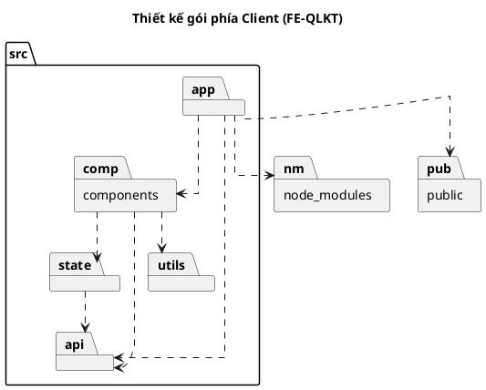
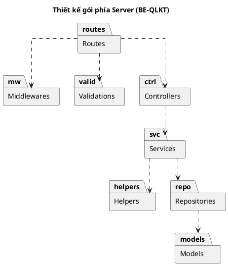
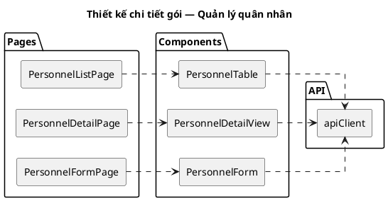
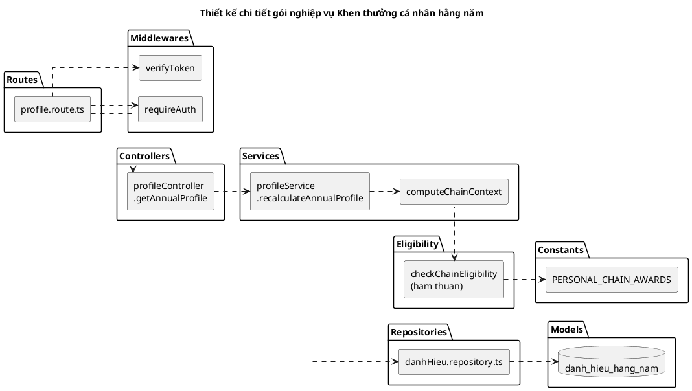

# Sơ đồ gói (Package Diagram)

> Notation UML chuẩn: package có tab, dependency nét đứt (`..>`). 4 sơ đồ: gói phía Client, gói phía Server, gói chi tiết quản lý quân nhân, và gói chi tiết khen thưởng cá nhân hằng năm.
> Nguồn: `package-client.puml`, `package-server.puml`, `package-detail-personnel.puml`, `package-detail-annual.puml`. Render bằng PlantUML extension (VS Code) hoặc `plantuml docs/diagrams/*.puml`.

---

## 1. Sơ đồ gói phía Client (FE-QLKT)

```plantuml
@startuml package-client
skinparam monochrome true
skinparam shadowing false
skinparam linetype ortho
skinparam nodesep 30
skinparam ranksep 45
title Thiết kế gói phía Client (FE-QLKT)

package "node_modules" as nm
package "public" as pub

package "src" as src {
  package "app" as app
  package "components" as comp
  package "api" as api
  package "state" as state
  package "utils" as utils
}

app ..> comp
app ..> api
comp ..> api
comp ..> state
comp ..> utils
state ..> api
app ..> nm
app ..> pub
@enduml
```

> Ánh xạ folder: `app` = Next.js App Router (`app/`), `api` = `lib/api`, `state` = `contexts` + `hooks`, `utils` = `lib/utils`.

---

## 2. Sơ đồ gói phía Server (BE-QLKT)

```plantuml
@startuml package-server
skinparam monochrome true
skinparam shadowing false
skinparam linetype ortho
skinparam nodesep 30
skinparam ranksep 45
title Thiết kế gói phía Server (BE-QLKT)

package "Routes" as routes
package "Middlewares" as mw
package "Validations" as valid
package "Controllers" as ctrl
package "Services" as svc
package "Helpers" as helpers
package "Repositories" as repo
package "Models" as models

routes ..> mw
routes ..> valid
routes ..> ctrl
ctrl ..> svc
svc ..> helpers
svc ..> repo
repo ..> models
@enduml
```

> Kiến trúc phân tầng `Routes → Middlewares/Validations → Controllers → Services → Repositories → Models`. Tầng `Repositories` tách Service khỏi Prisma; `Helpers` là pure function. `Models` = `src/models` (Prisma client + type).

---

## 3. Sơ đồ gói chi tiết — Quản lý quân nhân

```plantuml
@startuml package-detail-personnel
skinparam monochrome true
skinparam shadowing false
skinparam linetype ortho
skinparam nodesep 30
skinparam ranksep 45
left to right direction
title Thiết kế chi tiết gói — Quản lý quân nhân

package "Pages" as pages {
  rectangle "PersonnelListPage" as plist
  rectangle "PersonnelDetailPage" as pdetail
  rectangle "PersonnelFormPage" as pfpage
}

package "Components" as comp {
  rectangle "PersonnelTable" as ptable
  rectangle "PersonnelDetailView" as pdview
  rectangle "PersonnelForm" as pform
}

package "API" as api {
  rectangle "apiClient" as papi
}

plist ..> ptable
pdetail ..> pdview
pfpage ..> pform

ptable ..> papi
pdview ..> papi
pform ..> papi
@enduml
```

> Bố cục 3 tầng `Page → Component → API`: trang gọi component, component gọi `apiClient`. `PersonnelFormPage` dùng chung cho tạo + sửa.

## 4. Sơ đồ gói chi tiết — Khen thưởng cá nhân hằng năm

```plantuml
@startuml package-detail-annual
skinparam monochrome true
skinparam shadowing false
skinparam linetype ortho
skinparam nodesep 25
skinparam ranksep 45
left to right direction
title Thiết kế chi tiết gói nghiệp vụ Khen thưởng cá nhân hằng năm

package "Routes" as routes {
  rectangle "profile.route.ts" as proute
}
package "Middlewares" as mw {
  rectangle "verifyToken" as vt
  rectangle "requireAuth" as ra
}
package "Controllers" as ctrl {
  rectangle "profileController\n.getAnnualProfile" as pc
}
package "Services" as svc {
  rectangle "profileService\n.recalculateAnnualProfile" as ps
  rectangle "computeChainContext" as ccc
}
package "Eligibility" as elig {
  rectangle "checkChainEligibility\n(ham thuan)" as cce
}
package "Constants" as cons {
  rectangle "PERSONAL_CHAIN_AWARDS" as pca
}
package "Repositories" as repo {
  rectangle "danhHieu.repository.ts" as dr
}
package "Models" as models {
  database "danh_hieu_hang_nam" as tbl
}

proute ..> vt
proute ..> ra
proute ..> pc
pc ..> ps
ps ..> ccc
ps ..> cce
cce ..> pca
ps ..> dr
dr ..> tbl
@enduml
```

> Luồng 6 tầng `Route → Controller → Service → Eligibility → Repository → Models`. `checkChainEligibility` là hàm thuần đọc cấu hình `PERSONAL_CHAIN_AWARDS`, tách khỏi Service để dễ kiểm chứng.
