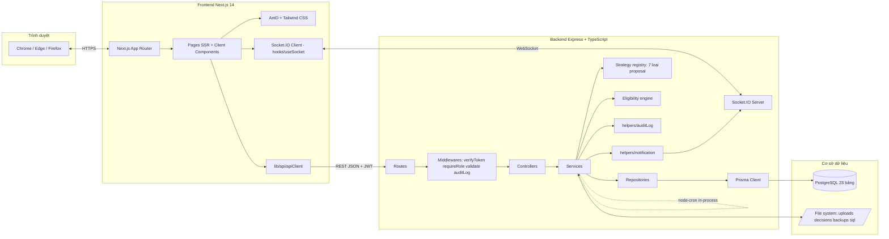
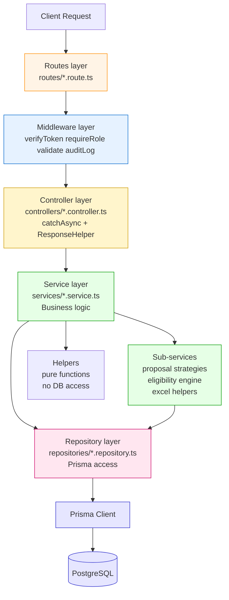
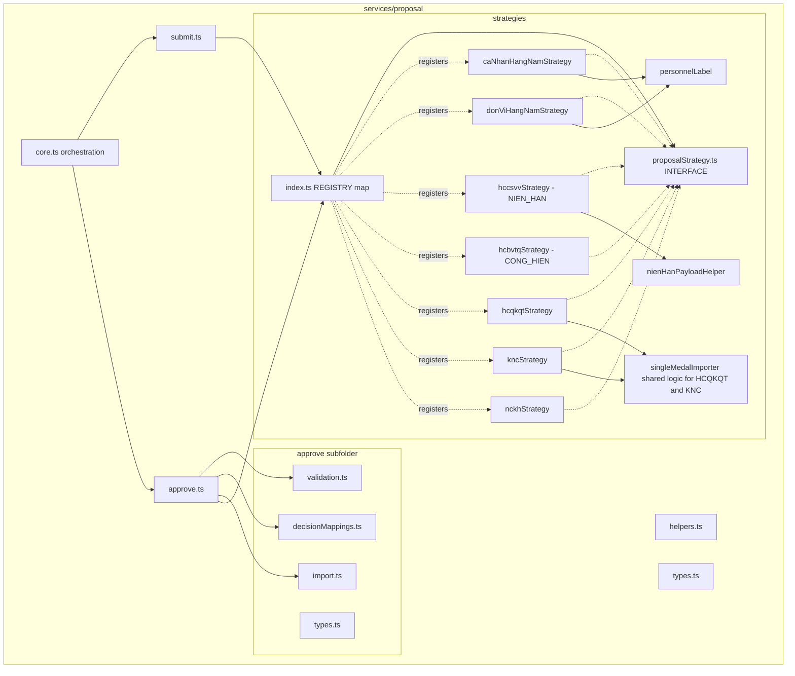

# Sơ đồ kiến trúc & module chi tiết

> Mermaid (render qua VS Code Mermaid Preview). Bổ trợ cho sơ đồ gói chuẩn UML ở `03-architecture.md`.

---

## C1.1 — Kiến trúc tổng thể Client-Server + REST API + WebSocket

**Điểm khác biệt với báo cáo mẫu**: Có thêm Socket.IO Server (realtime), Repository layer (decouple Prisma), `node-cron` in-process cho backup tự động (chạy trong cùng Express process, kích hoạt qua DevZone API thay vì process scheduler riêng), file system tách biệt.

---

## C1.2 — Mô hình Layered Architecture (Route → Middleware → Controller → Service → Repository → Prisma)

**So sánh với MVC truyền thống**: Báo cáo mẫu HRM dùng MVC 3 lớp (Model-View-Controller). PM QLKT dùng Layered 6 lớp với:
- Tách **Middleware chain** thành lớp riêng
- Thêm **Service** cho business logic (controller mỏng)
- Thêm **Repository** decouple Prisma (commit `9bd12f6`)
- Tách **Helpers** pure (không gọi DB)

→ Đây là điểm chuyên sâu cần defend khi bảo vệ.

---

## C2.3 — Sơ đồ chi tiết gói: module Đề xuất khen thưởng (Strategy pattern)

**Điểm bán pattern**: 7 strategy implement chung `ProposalStrategy` interface với 4 method (`buildSubmitPayload`, `validateApprove`, `importInTransaction`, `buildSuccessMessage`). Caller gọi `getStrategy(type).method(...)` thay vì 7 nhánh `if/else`. Thêm loại đề xuất mới = thêm 1 file strategy + register vào REGISTRY.

---

## C2.4 — Sơ đồ chi tiết gói: module Eligibility (chain rule)

```mermaid
flowchart TB
    subgraph CONST[constants]
        CHAIN[chainAwards.constants.ts<br/>PERSONAL_CHAIN_AWARDS<br/>UNIT_CHAIN_AWARDS<br/>cycleYears thresholds]
        DANH[danhHieu.constants.ts<br/>BKBQP CSTDTQ BKTTCP]
        ELIG[eligibilityStatus.constants.ts]
    end

    subgraph CORE[services/eligibility]
        CHAINELIG[chainEligibility.ts<br/>checkChainEligibility CORE]
        HCBVTQ[hcbvtqEligibility.ts]
        CONGHIEN[congHienMonthsAggregator.ts]
        SERVICEYR[serviceYearsEligibility.ts]
        DUPCHECK[personnelDuplicateCheck.ts]
        BULKVAL[annualBulkValidation.ts]
        DECNUM[decisionNumberValidation.ts]
    end

    subgraph PROFILE[services/profile]
        ANNUAL[annual.ts<br/>recalculateAnnualProfile<br/>computeChainContext<br/>computeEligibilityFlags<br/>checkAwardEligibility]
        CONTRIB[contribution.ts]
        TENURE[tenure.ts]
        TYPES[types.ts ChainContext]
    end

    subgraph UNIT[services/unitAnnualAward]
        UNITELIG[eligibility.ts<br/>parallel pattern with annual]
        UNITCRUD[crud.ts]
    end

    CHAIN --> CHAINELIG
    DANH --> CHAINELIG
    ANNUAL --> CHAINELIG
    UNITELIG --> CHAINELIG
    ANNUAL --> CONGHIEN
    ANNUAL --> SERVICEYR
    HCBVTQ --> CONTRIB
    SERVICEYR --> TENURE
    BULKVAL --> CHAINELIG
    DECNUM --> CHAINELIG

    classDef coreNode fill:#ffe6e6,stroke:#cc0000,stroke-width:2px
    class CHAINELIG coreNode
    class ANNUAL coreNode
```

**Điểm chuyên sâu**: `chainEligibility.checkChainEligibility()` là **single source of truth** dùng chung cho cả personal (qua `profile/annual.ts`) và unit (qua `unitAnnualAward/eligibility.ts`). Thay vì duplicate logic chuỗi hai chỗ.
