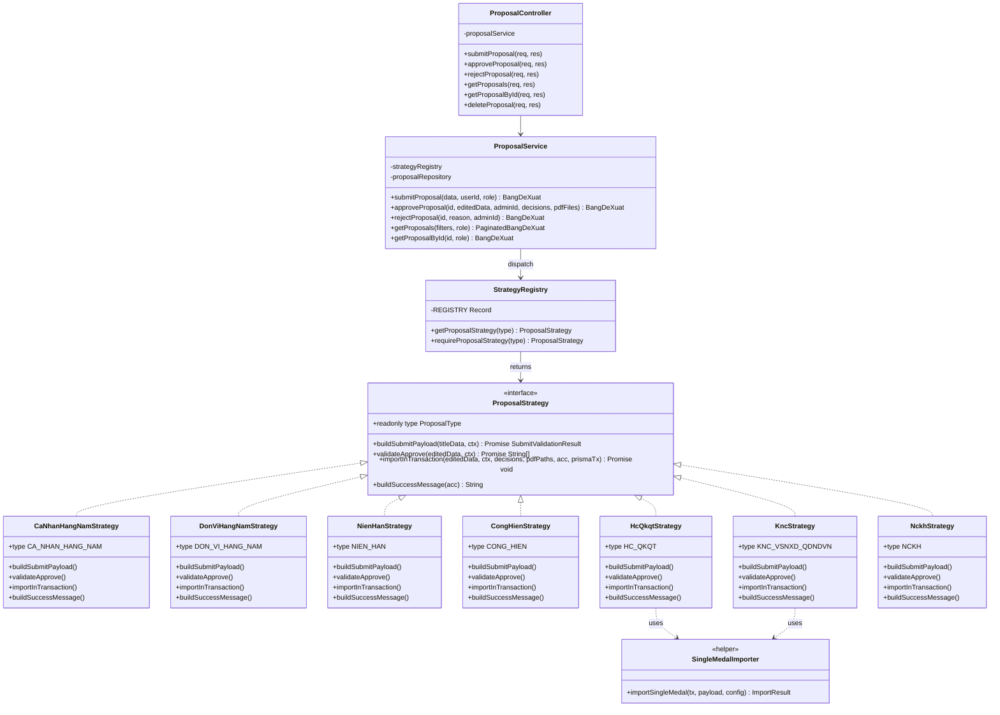
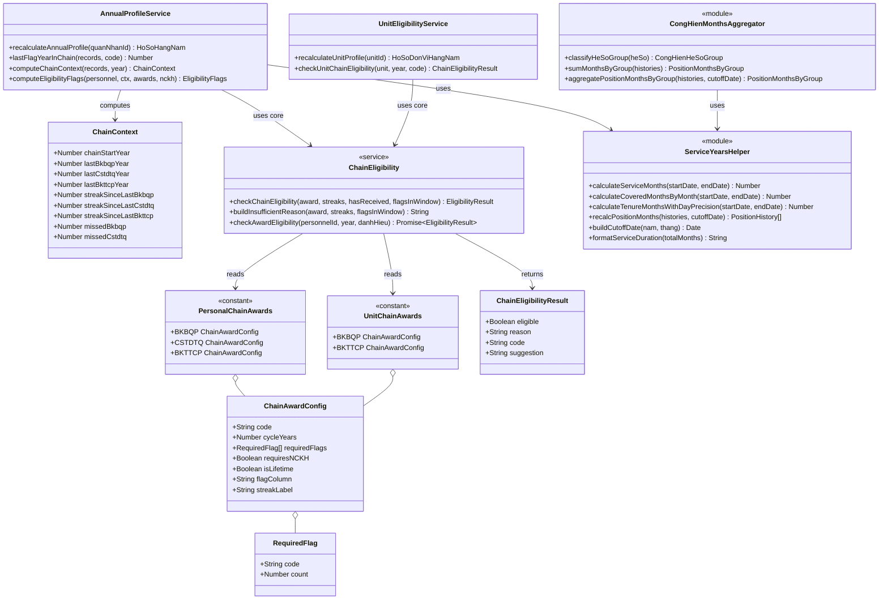
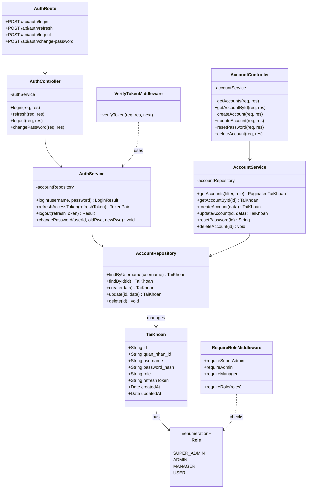
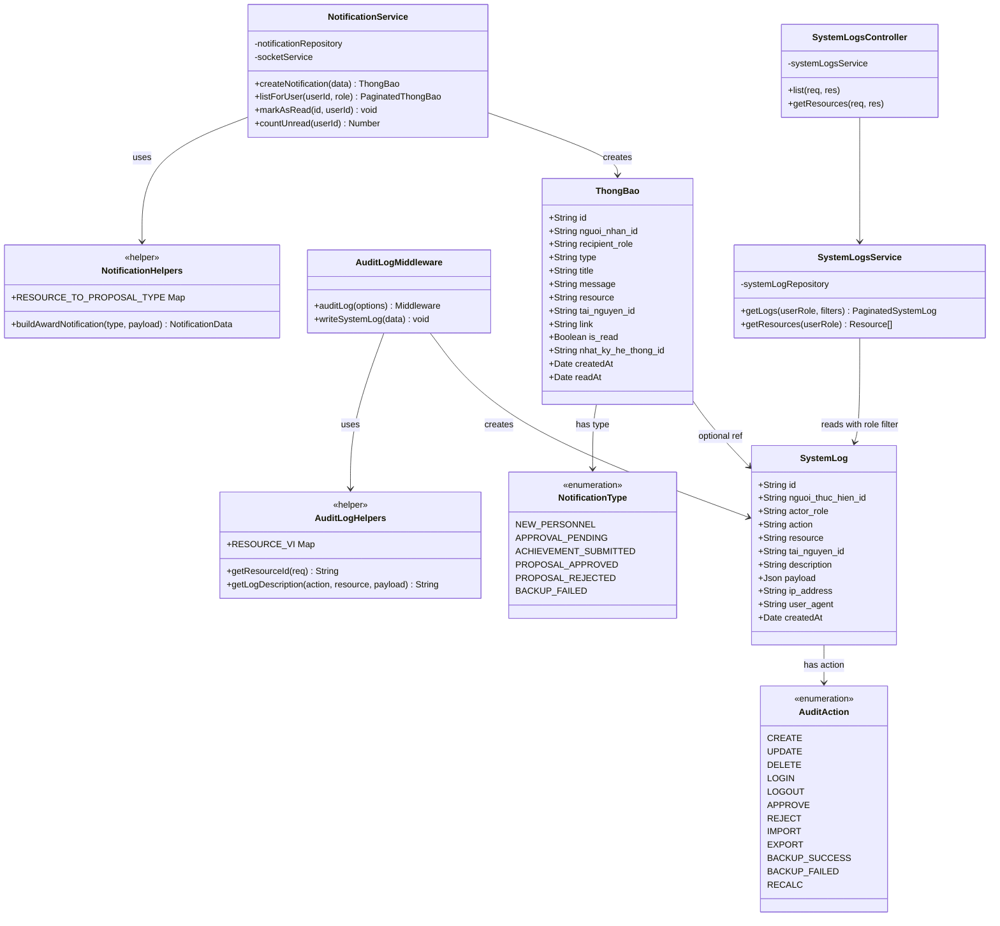

# Sơ đồ Lớp (Class Diagrams)

> Mermaid hỗ trợ `classDiagram` chuẩn UML. Các attribute được lấy đúng từ `prisma/schema.prisma` và method từ services thực tế trong code.

---

## C3.1 — Class diagram: module Quản lý quân nhân

```mermaid
classDiagram
    class QuanNhan {
        +String id
        +String cccd
        +String ho_ten
        +String gioi_tinh
        +Date ngay_sinh
        +String que_quan_2_cap
        +String que_quan_3_cap
        +String tru_quan
        +String cho_o_hien_nay
        +Json co_quan_don_vi
        +Date ngay_nhap_ngu
        +Date ngay_xuat_ngu
        +Date ngay_vao_dang
        +String so_the_dang_vien
        +String so_dien_thoai
        +String cap_bac
        +String co_quan_don_vi_id
        +String don_vi_truc_thuoc_id
        +String chuc_vu_id
        +Date createdAt
        +Date updatedAt
    }

    class CapBac {
        <<enumeration>>
        BINH_NHI
        BINH_NHAT
        HA_SI
        TRUNG_SI
        THUONG_SI
        THIEU_UY
        TRUNG_UY
        THUONG_UY
        DAI_UY
        THIEU_TA
        TRUNG_TA
        THUONG_TA
        DAI_TA
        THIEU_TUONG
        TRUNG_TUONG
        THUONG_TUONG
        DAI_TUONG
    }

    class GioiTinh {
        <<enumeration>>
        NAM
        NU
    }

    class PersonnelRoute {
        <<Route>>
        +GET /api/personnel
        +POST /api/personnel
        +GET /api/personnel/:id
        +PUT /api/personnel/:id
        +DELETE /api/personnel/:id
        +GET /api/personnel/export
        +POST /api/personnel/check-contribution-eligibility
    }

    class PersonnelController {
        -personnelService
        +getPersonnel(req, res)
        +getPersonnelById(req, res)
        +createPersonnel(req, res)
        +updatePersonnel(req, res)
        +deletePersonnel(req, res)
        +exportPersonnel(req, res)
        +checkContributionEligibility(req, res)
    }

    class PersonnelService {
        -quanNhanRepository
        -unitRepository
        +getPersonnel(filter, role, quanNhanId) PaginatedQuanNhan
        +getPersonnelById(id, userRole, userQuanNhanId) QuanNhan
        +createPersonnel(data) QuanNhan
        +updatePersonnel(id, data, role) QuanNhan
        +deletePersonnel(id, userRole, userQuanNhanId) void
        +exportPersonnel() QuanNhan[]
        +checkContributionEligibility(personnelIds) Result[]
    }

    class QuanNhanRepository {
        +findById(id, tx) QuanNhan
        +findByIdForDetail(id, tx) QuanNhanWithRelations
        +findByIdWithAccount(id, tx) QuanNhan
        +findIdByCccd(cccd, tx) String
        +findManyByIds(ids, tx) QuanNhan[]
        +findAllForExport(tx) QuanNhan[]
        +count(where, tx) Number
        +create(data, tx) QuanNhan
        +update(id, data, tx) QuanNhan
        +delete(id, tx) void
        +groupByCapBac(where, tx) Group[]
    }

    QuanNhan --> CapBac : sử dụng
    QuanNhan --> GioiTinh : sử dụng
    PersonnelRoute --> PersonnelController : routes to
    PersonnelController --> PersonnelService : uses
    PersonnelService --> QuanNhanRepository : uses
    QuanNhanRepository --> QuanNhan : manages
```

---

## C3.2 — Class diagram: module Đề xuất khen thưởng (Strategy pattern)

**Điểm bán pattern (defend trong ĐATN)**:
- 7 strategy đều implement interface `ProposalStrategy` với 4 method
- `ProposalService` không biết về cụ thể từng loại — gọi qua `getStrategy(type)`
- Thêm loại mới: thêm 1 file strategy + register vào REGISTRY, không sửa controller/service
- 2 strategy "single-medal" (HC_QKQT + KNC) chia sẻ logic qua helper `SingleMedalImporter`

---

## C3.3 — Class diagram: module Eligibility (chain rule)

**Defend**: `ChainEligibility` là **single source of truth** cho rule chuỗi — cả personal (`AnnualProfileService`) và unit (`UnitEligibilityService`) đều gọi cùng một hàm `checkChainEligibility()`, đảm bảo logic không bị lệch giữa hai bên.

---

## C3.4 — Class diagram: module Tài khoản và Phân quyền

---

## C3.5 — Class diagram: module Audit Log + Notification

**Đặc thù**: `SystemLogsService.getLogs()` có **filter theo role** — `resource: 'backup'` chỉ trả về cho `SUPER_ADMIN`. ADMIN và MANAGER không xem được log backup. Khác với HRM mẫu không có visibility filter.

---

## Tổng kết

| # | Sơ đồ | Số class | Pattern thể hiện |
|---|---|---|---|
| C3.1 | Quản lý quân nhân | 6 + 2 enum | Layered architecture |
| C3.2 | Đề xuất khen thưởng | 11 | **Strategy pattern** (điểm bán) |
| C3.3 | Eligibility module | 11 | **Single source of truth** chain rule |
| C3.4 | Tài khoản phân quyền | 9 + 1 enum | Middleware chain |
| C3.5 | Audit log + Notification | 9 + 2 enum | Cross-cutting concern |

→ Báo cáo mẫu HRM chỉ có **1 class diagram** đơn giản. PM QLKT có **5 class diagram** thể hiện được Strategy pattern + Repository pattern + chain eligibility — đủ chuyên sâu để defend.
