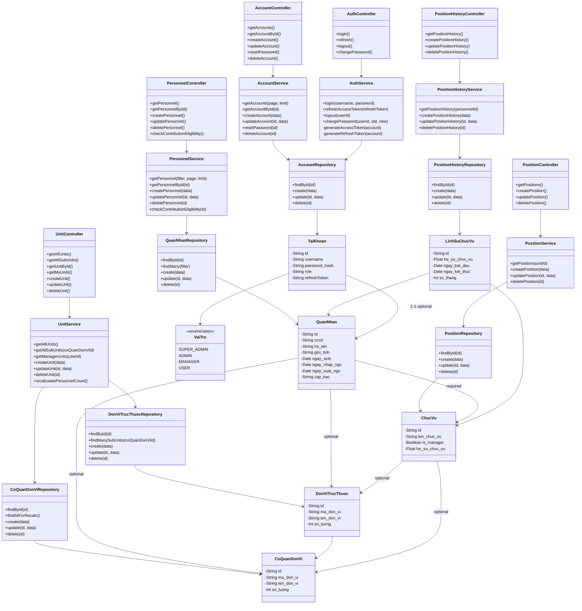
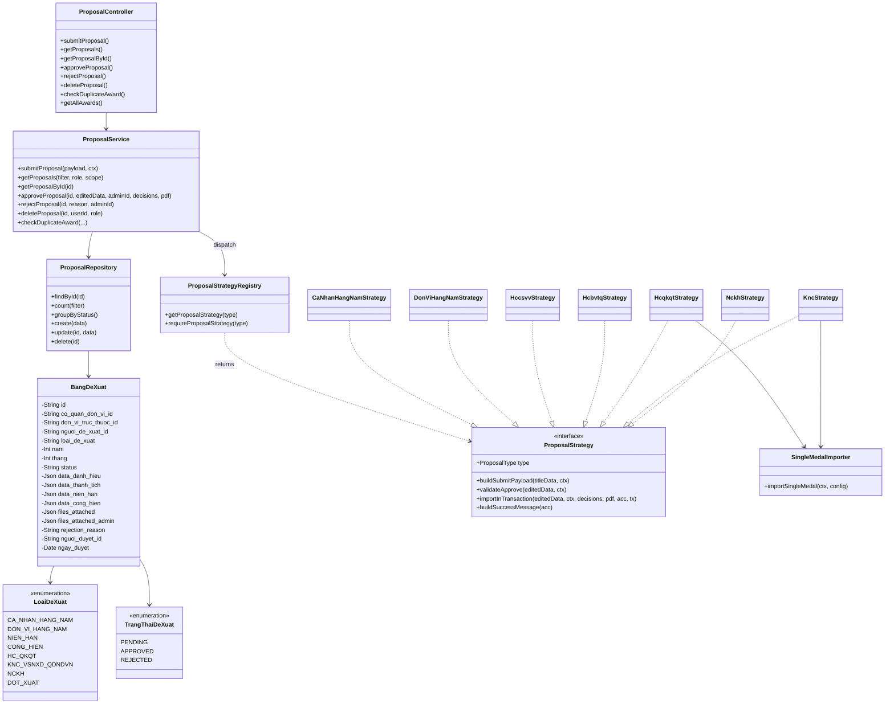

# Sơ đồ Lớp (Class Diagrams)

> **Render**: copy block `mermaid` vào https://mermaid.live (hoặc VSCode Mermaid Preview). Danh sách class/thuộc tính/method bên dưới trích đúng từ `prisma/schema.prisma` và `BE-QLKT/src/`.
>
> **Astah**: import Java skeleton ở `astah-import/` — 3 package `c3_1_tochuc` / `c3_2_dexuat` / `c3_3_khenthuong` khớp 1-1 với 3 sơ đồ dưới đây (xem `astah-import/README.md`).
>
> **Gọn còn 3 sơ đồ** (mỗi sơ đồ in vừa A4):
> - **C3.1 — Tổ chức, Quân nhân & Tài khoản** (nền tảng).
> - **C3.2 — Đề xuất khen thưởng + Strategy pattern** (trọng tâm nghiệp vụ).
> - **C3.3 — Thực thể khen thưởng, Hồ sơ điều kiện & Quyết định** (kết quả + cross-cutting).
>
> **Quy ước**:
> - Visibility: thuộc tính `-` (private, đóng gói); phương thức / API public `+`; thành viên interface `+`.
> - Mỗi sơ đồ vẽ đủ 4 tầng **Controller → Service → Repository → Entity**, nối bằng `-->` (association theo chiều phụ thuộc; mỗi Repository giữ 1 field kiểu entity để Astah tự vẽ Repository → Entity).
> - **FK = association**: khoá ngoại tới entity trong cùng sơ đồ chỉ vẽ bằng đường association, KHÔNG liệt kê cột `*_id` trong ô thuộc tính. FK tới entity ngoài sơ đồ thì giữ `*_id : String`.
> - `..>` dependency (dùng qua param/return), `-->` association (có FK / hold instance / inject), `..|>` realization (implements interface), `*-->` composition.
> - Các `«enumeration»` thực chất là **cột String + hằng số TS** (`src/constants/`) — Prisma không dùng native enum. Vẽ dạng enum cho rõ domain.
> - Layer ẩn không vẽ: **Route** (map URL → controller) và **Prisma client singleton** (`models/index.ts`) — Repository là ranh giới Prisma.

---

## C3.1 — Tổ chức, Quân nhân & Tài khoản

```mermaid
classDiagram
    class QuanNhan {
        -String id
        -String cccd
        -String ho_ten
        -String gioi_tinh
        -Date ngay_sinh
        -Date ngay_nhap_ngu
        -Date ngay_xuat_ngu
        -String cap_bac
    }
    class CoQuanDonVi {
        -String id
        -String ma_don_vi
        -String ten_don_vi
        -Int so_luong
    }
    class DonViTrucThuoc {
        -String id
        -String ma_don_vi
        -String ten_don_vi
        -Int so_luong
    }
    class ChucVu {
        -String id
        -String ten_chuc_vu
        -Boolean is_manager
        -Float he_so_chuc_vu
    }
    class LichSuChucVu {
        -String id
        -Float he_so_chuc_vu
        -Date ngay_bat_dau
        -Date ngay_ket_thuc
        -Int so_thang
    }
    class TaiKhoan {
        -String id
        -String username
        -String password_hash
        -String role
        -String refreshToken
    }
    class VaiTro {
        <<enumeration>>
        SUPER_ADMIN
        ADMIN
        MANAGER
        USER
    }

    class PersonnelService {
        +getPersonnel(filter, page, limit)
        +getPersonnelById(id)
        +createPersonnel(data)
        +updatePersonnel(id, data)
        +deletePersonnel(id)
        +checkContributionEligibility(id)
    }
    class UnitService {
        +getAllUnits()
        +getAllSubUnits(coQuanDonViId)
        +getManagerUnits(userId)
        +createUnit(data)
        +updateUnit(id, data)
        +deleteUnit(id)
        +recalculatePersonnelCount()
    }
    class PositionService {
        +getPositions(unitId)
        +createPosition(data)
        +updatePosition(id, data)
        +deletePosition(id)
    }
    class PositionHistoryService {
        +getPositionHistory(personnelId)
        +createPositionHistory(data)
        +updatePositionHistory(id, data)
        +deletePositionHistory(id)
    }
    class AccountService {
        +getAccounts(page, limit)
        +getAccountById(id)
        +createAccount(data)
        +updateAccount(id, data)
        +resetPassword(id)
        +deleteAccount(id)
    }
    class AuthService {
        +login(username, password)
        +refreshAccessToken(refreshToken)
        +logout(userId)
        +changePassword(userId, old, new)
        -generateAccessToken(account)
        -generateRefreshToken(account)
    }

    class PersonnelController {
        +getPersonnel()
        +getPersonnelById()
        +createPersonnel()
        +updatePersonnel()
        +deletePersonnel()
        +checkContributionEligibility()
    }
    class UnitController {
        +getAllUnits()
        +getAllSubUnits()
        +getUnitById()
        +getMyUnits()
        +createUnit()
        +updateUnit()
        +deleteUnit()
    }
    class PositionController {
        +getPositions()
        +createPosition()
        +updatePosition()
        +deletePosition()
    }
    class PositionHistoryController {
        +getPositionHistory()
        +createPositionHistory()
        +updatePositionHistory()
        +deletePositionHistory()
    }
    class AccountController {
        +getAccounts()
        +getAccountById()
        +createAccount()
        +updateAccount()
        +resetPassword()
        +deleteAccount()
    }
    class AuthController {
        +login()
        +refresh()
        +logout()
        +changePassword()
    }

    class QuanNhanRepository {
        +findById(id)
        +findMany(filter)
        +create(data)
        +update(id, data)
        +delete(id)
    }
    class CoQuanDonViRepository {
        +findById(id)
        +findAllForRecalc()
        +create(data)
        +update(id, data)
        +delete(id)
    }
    class DonViTrucThuocRepository {
        +findById(id)
        +findManySubUnits(coQuanDonViId)
        +create(data)
        +update(id, data)
        +delete(id)
    }
    class PositionRepository {
        +findById(id)
        +create(data)
        +update(id, data)
        +delete(id)
    }
    class PositionHistoryRepository {
        +findById(id)
        +create(data)
        +update(id, data)
        +delete(id)
    }
    class AccountRepository {
        +findById(id)
        +create(data)
        +update(id, data)
        +delete(id)
    }

    PersonnelController --> PersonnelService
    UnitController --> UnitService
    PositionController --> PositionService
    PositionHistoryController --> PositionHistoryService
    AccountController --> AccountService
    AuthController --> AuthService

    PersonnelService --> QuanNhanRepository
    UnitService --> CoQuanDonViRepository
    UnitService --> DonViTrucThuocRepository
    PositionService --> PositionRepository
    PositionHistoryService --> PositionHistoryRepository
    AccountService --> AccountRepository
    AuthService --> AccountRepository

    QuanNhanRepository --> QuanNhan
    CoQuanDonViRepository --> CoQuanDonVi
    DonViTrucThuocRepository --> DonViTrucThuoc
    PositionRepository --> ChucVu
    PositionHistoryRepository --> LichSuChucVu
    AccountRepository --> TaiKhoan

    QuanNhan --> CoQuanDonVi : optional
    QuanNhan --> DonViTrucThuoc : optional
    QuanNhan --> ChucVu : required
    DonViTrucThuoc --> CoQuanDonVi
    ChucVu --> CoQuanDonVi : optional
    ChucVu --> DonViTrucThuoc : optional
    LichSuChucVu --> QuanNhan
    LichSuChucVu --> ChucVu
    TaiKhoan --> QuanNhan : 1-1 optional
    TaiKhoan --> VaiTro
```

**Đúng với code**:
- **Unit priority**: xác định đơn vị quân nhân ưu tiên `don_vi_truc_thuoc_id || co_quan_don_vi_id` (DVTT trước, CQDV sau).
- `QuanNhan.chuc_vu_id` **bắt buộc** (`onDelete: Restrict`); `co_quan_don_vi_id` / `don_vi_truc_thuoc_id` nullable.
- `TaiKhoan ↔ QuanNhan`: 1-1 optional (`quan_nhan_id @unique`, nullable). JWT: access (15p) + refresh (7d), `refreshToken` lưu DB.
- `gioi_tinh` / `cap_bac` / `role` là cột **String** ràng buộc bằng hằng số (`constants/`), không phải Prisma enum.

---

## C3.2 — Đề xuất khen thưởng + Strategy pattern

```mermaid
classDiagram
    class BangDeXuat {
        -String id
        -String co_quan_don_vi_id
        -String don_vi_truc_thuoc_id
        -String nguoi_de_xuat_id
        -String loai_de_xuat
        -Int nam
        -Int thang
        -String status
        -Json data_danh_hieu
        -Json data_thanh_tich
        -Json data_nien_han
        -Json data_cong_hien
        -Json files_attached
        -Json files_attached_admin
        -String rejection_reason
        -String nguoi_duyet_id
        -Date ngay_duyet
    }
    class LoaiDeXuat {
        <<enumeration>>
        CA_NHAN_HANG_NAM
        DON_VI_HANG_NAM
        NIEN_HAN
        CONG_HIEN
        HC_QKQT
        KNC_VSNXD_QDNDVN
        NCKH
        DOT_XUAT
    }
    class TrangThaiDeXuat {
        <<enumeration>>
        PENDING
        APPROVED
        REJECTED
    }

    class ProposalController {
        +submitProposal()
        +getProposals()
        +getProposalById()
        +approveProposal()
        +rejectProposal()
        +deleteProposal()
        +checkDuplicateAward()
        +getAllAwards()
    }
    class ProposalService {
        +submitProposal(payload, ctx)
        +getProposals(filter, role, scope)
        +getProposalById(id)
        +approveProposal(id, editedData, adminId, decisions, pdf)
        +rejectProposal(id, reason, adminId)
        +deleteProposal(id, userId, role)
        +checkDuplicateAward(...)
    }
    class ProposalStrategy {
        <<interface>>
        +ProposalType type
        +buildSubmitPayload(titleData, ctx)
        +validateApprove(editedData, ctx)
        +importInTransaction(editedData, ctx, decisions, pdf, acc, tx)
        +buildSuccessMessage(acc)
    }
    class ProposalStrategyRegistry {
        +getProposalStrategy(type)
        +requireProposalStrategy(type)
    }
    class CaNhanHangNamStrategy
    class DonViHangNamStrategy
    class HccsvvStrategy
    class HcbvtqStrategy
    class HcqkqtStrategy
    class KncStrategy
    class NckhStrategy
    class SingleMedalImporter {
        +importSingleMedal(ctx, config)
    }
    class ProposalRepository {
        +findById(id)
        +count(filter)
        +groupByStatus()
        +create(data)
        +update(id, data)
        +delete(id)
    }

    ProposalController --> ProposalService
    ProposalService --> ProposalStrategyRegistry : dispatch
    ProposalStrategyRegistry ..> ProposalStrategy : returns
    CaNhanHangNamStrategy ..|> ProposalStrategy
    DonViHangNamStrategy ..|> ProposalStrategy
    HccsvvStrategy ..|> ProposalStrategy
    HcbvtqStrategy ..|> ProposalStrategy
    HcqkqtStrategy ..|> ProposalStrategy
    KncStrategy ..|> ProposalStrategy
    NckhStrategy ..|> ProposalStrategy
    HcqkqtStrategy --> SingleMedalImporter
    KncStrategy --> SingleMedalImporter
    ProposalService --> ProposalRepository
    ProposalRepository --> BangDeXuat
    BangDeXuat --> LoaiDeXuat
    BangDeXuat --> TrangThaiDeXuat
```

**Đúng với code** (`services/proposal/strategies/`):
- Interface `ProposalStrategy` có **property `readonly type`** + **4 method**: `buildSubmitPayload`, `validateApprove`, `importInTransaction`, `buildSuccessMessage` (KHÔNG có `getType()`).
- REGISTRY map (`strategies/index.ts`): `CA_NHAN_HANG_NAM→CaNhanHangNam`, `DON_VI_HANG_NAM→DonViHangNam`, `NIEN_HAN→Hccsvv`, `CONG_HIEN→Hcbvtq`, `HC_QKQT→Hcqkqt`, `KNC_VSNXD_QDNDVN→Knc`, `NCKH→Nckh`, `DOT_XUAT→null`.
- `SingleMedalImporter` share logic 2 loại "1 quân nhân ↔ 1 huân chương" (HCQKQT + KNC).
- **Submit vs Approve**: submit chỉ validate cấu trúc payload + năm/tháng; eligibility + duplicate check chạy ở **approve** (`validateApprove`).
- `loai_de_xuat` / `status` là cột String + hằng số. `DOT_XUAT` thuộc enum loại nhưng **không qua `BangDeXuat`** (xử lý riêng — xem C3).

---

## C3.3 — Thực thể khen thưởng, Hồ sơ điều kiện & Quyết định

```mermaid
classDiagram
    class DanhHieuHangNam {
        -String quan_nhan_id
        -Int nam
        -String danh_hieu
        -Boolean nhan_bkbqp
        -Boolean nhan_cstdtq
        -Boolean nhan_bkttcp
        -String so_quyet_dinh
    }
    class ThanhTichKhoaHoc {
        -String quan_nhan_id
        -Int nam
        -String loai
        -String mo_ta
        -String so_quyet_dinh
    }
    class KhenThuongHCCSVV {
        -String quan_nhan_id
        -String danh_hieu
        -Int nam
        -Int thang
        -String so_quyet_dinh
        -Json thoi_gian
    }
    class KhenThuongHCBVTQ {
        -String quan_nhan_id
        -String danh_hieu
        -Int nam
        -Int thang
        -String so_quyet_dinh
    }
    class HuanChuongQuanKyQuyetThang {
        -String quan_nhan_id
        -Int nam
        -Int thang
        -String so_quyet_dinh
        -Json thoi_gian
    }
    class KyNiemChuongVSNXDQDNDVN {
        -String quan_nhan_id
        -Int nam
        -Int thang
        -String so_quyet_dinh
        -Json thoi_gian
    }
    class DanhHieuDonViHangNam {
        -String co_quan_don_vi_id
        -String don_vi_truc_thuoc_id
        -Int nam
        -String danh_hieu
        -Boolean nhan_bkbqp
        -Boolean nhan_bkttcp
        -String status
        -String nguoi_tao_id
    }
    class KhenThuongDotXuat {
        -String doi_tuong
        -String quan_nhan_id
        -String co_quan_don_vi_id
        -String don_vi_truc_thuoc_id
        -String hinh_thuc_khen_thuong
        -Int nam
        -String so_quyet_dinh
    }
    class FileQuyetDinh {
        -String id
        -String so_quyet_dinh
        -Int nam
        -Date ngay_ky
        -String nguoi_ky
        -String file_path
        -String loai_khen_thuong
    }

    class HoSoHangNam {
        -Int cstdcs_lien_tuc
        -Int nckh_lien_tuc
        -Boolean du_dieu_kien_bkbqp
        -Boolean du_dieu_kien_cstdtq
        -Boolean du_dieu_kien_bkttcp
        -String goi_y
    }
    class HoSoNienHan {
        -String hccsvv_hang_ba_status
        -String hccsvv_hang_nhi_status
        -String hccsvv_hang_nhat_status
    }
    class HoSoCongHien {
        -Int hcbvtq_total_months
        -String hcbvtq_hang_ba_status
    }
    class HoSoDonViHangNam {
        -Int nam
        -Int dvqt_lien_tuc
        -Boolean du_dieu_kien_bk_tong_cuc
        -Boolean du_dieu_kien_bk_thu_tuong
    }
    class TrangThaiHoSo {
        <<enumeration>>
        CHUA_DU
        DU_DIEU_KIEN
        DA_NHAN
    }

    class ProfileService {
        +getAnnualProfile(id)
        +getTenureProfile(id)
        +getContributionProfile(id)
        +recalculateAnnualProfile(id)
        +recalculateTenureProfile(id)
        +recalculateContributionProfile(id)
        +recalculateAll()
        +checkAwardEligibility(id, year, danhHieu)
    }
    class DecisionService {
        +getAllDecisions(filter)
        +autocomplete(q)
        +createDecision(data, file)
        +updateDecision(id, data)
        +deleteDecision(id)
        +getDecisionFileForDownload(soQuyetDinh)
    }

    class ProfileController {
        +getAnnualProfile()
        +getTenureProfile()
        +getContributionProfile()
        +recalculateProfile()
        +recalculateAll()
        +checkEligibility()
        +getAllTenureProfiles()
        +updateTenureProfile()
    }
    class DecisionController {
        +getAllDecisions()
        +autocomplete()
        +getDecisionById()
        +createDecision()
        +updateDecision()
        +deleteDecision()
        +downloadDecisionFile()
    }

    class AnnualProfileRepository {
        +findByPersonnelId(id)
        +upsert(id, data)
        +deleteMany(filter)
    }
    class TenureProfileRepository {
        +findByPersonnelId(id)
        +upsert(id, data)
        +deleteMany(filter)
    }
    class ContributionProfileRepository {
        +findByPersonnelId(id)
        +upsert(id, data)
        +deleteMany(filter)
    }
    class UnitAnnualProfileRepository {
        +findByUnitIdAndType(unitId, type)
        +upsertByUnique(data)
    }
    class DecisionFileRepository {
        +findById(id)
        +groupByLoaiKhenThuong()
        +create(data)
        +update(id, data)
        +delete(id)
    }
    class DanhHieuDonViHangNamRepository {
        +findById(id)
        +findMany(filter)
        +create(data)
        +update(id, data)
        +delete(id)
    }
    class DanhHieuHangNamRepository {
        +findById(id)
        +findByPersonnelId(quanNhanId)
        +findByPersonnelAndYear(quanNhanId, nam)
        +create(data)
        +update(id, data)
        +upsertByPersonnelYear(quanNhanId, nam, data)
        +delete(id)
    }

    class UnitAnnualAwardService {
        +list(filter)
        +getById(id)
        +upsert(data)
        +approve(id, ctx)
        +reject(id, reason)
        +getAnnualUnit(donViId, year)
        +recalculate(unitId)
        +remove(id)
    }
    class UnitAnnualAwardController {
        +list()
        +getById()
        +upsert()
        +propose()
        +approve()
        +reject()
        +getUnitAnnualProfile()
        +recalculate()
        +remove()
    }

    class AnnualRewardService {
        +getAnnualRewards(personnelId)
        +createAnnualReward(data)
        +updateAnnualReward(id, data)
        +deleteAnnualReward(id)
        +checkAnnualRewards(personnelId, year)
        +bulkCreateAnnualRewards(data)
        +previewImport(buffer)
        +confirmImport(validItems)
        +exportToExcel(filters)
        +getStatistics(filters)
    }
    class AnnualRewardController {
        +getAnnualRewards()
        +createAnnualReward()
        +updateAnnualReward()
        +deleteAnnualReward()
        +checkAnnualRewards()
        +bulkCreateAnnualRewards()
        +previewImport()
        +confirmImport()
        +getTemplate()
        +exportToExcel()
        +getStatistics()
    }

    ProfileController --> ProfileService
    DecisionController --> DecisionService

    ProfileService ..> DanhHieuHangNam : input
    ProfileService ..> ThanhTichKhoaHoc : input
    ProfileService --> AnnualProfileRepository
    ProfileService --> TenureProfileRepository
    ProfileService --> ContributionProfileRepository
    AnnualProfileRepository --> HoSoHangNam
    TenureProfileRepository --> HoSoNienHan
    ContributionProfileRepository --> HoSoCongHien

    UnitAnnualAwardController --> UnitAnnualAwardService
    UnitAnnualAwardService --> DanhHieuDonViHangNamRepository
    UnitAnnualAwardService --> UnitAnnualProfileRepository
    DanhHieuDonViHangNamRepository --> DanhHieuDonViHangNam
    UnitAnnualProfileRepository --> HoSoDonViHangNam
    AnnualRewardController --> AnnualRewardService
    AnnualRewardService --> DanhHieuHangNamRepository
    AnnualRewardService --> ProfileService
    DanhHieuHangNamRepository --> DanhHieuHangNam
    HoSoNienHan --> TrangThaiHoSo
    HoSoCongHien --> TrangThaiHoSo
    DecisionService --> DecisionFileRepository
    DecisionFileRepository --> FileQuyetDinh
    FileQuyetDinh --> KhenThuongHCCSVV : so_quyet_dinh
    FileQuyetDinh --> KhenThuongHCBVTQ : so_quyet_dinh
    FileQuyetDinh --> HuanChuongQuanKyQuyetThang : so_quyet_dinh
    FileQuyetDinh --> KyNiemChuongVSNXDQDNDVN : so_quyet_dinh
    FileQuyetDinh --> DanhHieuHangNam : so_quyet_dinh
    FileQuyetDinh --> DanhHieuDonViHangNam : so_quyet_dinh
    FileQuyetDinh --> KhenThuongDotXuat : so_quyet_dinh
    FileQuyetDinh --> ThanhTichKhoaHoc : so_quyet_dinh
```

**Đúng với code**:
- **HoSo = OUTPUT cache**: 3 hồ sơ cá nhân (`HoSoHangNam` / `HoSoNienHan` / `HoSoCongHien`) do **`ProfileService`** (`services/profile/`) tính từ `DanhHieuHangNam` / `ThanhTichKhoaHoc` / `LichSuChucVu` / `ngay_nhap_ngu`; hồ sơ đơn vị (`HoSoDonViHangNam`) do **`UnitAnnualAwardService`** (`services/unitAnnualAward/`) tính. Recalc sau approve, sau import Excel, hoặc qua cron.
- **4 huân/huy chương cá nhân** cùng pattern (CRUD + import/export, khác rule eligibility), vẽ đủ trong sơ đồ:
  - `KhenThuongHCCSVV` (HCCSVV — niên hạn), `KhenThuongHCBVTQ` (HCBVTQ — 120 tháng hệ số),
  - `HuanChuongQuanKyQuyetThang` (HCQKQT — từ ngày nhập ngũ), `KyNiemChuongVSNXDQDNDVN` (KNC — 20/25 năm).
  - Service tương ứng (không vẽ): `tenureMedalService` / `contributionMedalService` / `militaryFlagService` / `commemorativeMedalService`.
- **`DanhHieuDonViHangNam`**: khen thưởng đơn vị, có `status` riêng — duyệt thẳng trong bảng này, **không qua `BangDeXuat`**. `KhenThuongDotXuat`: ADMIN ghi thẳng, không qua duyệt, không Strategy.
- **`FileQuyetDinh` = hub cross-cutting**: liên kết **8 bảng khen thưởng** qua FK natural-key `so_quyet_dinh` (`onUpdate: Cascade` để cascade rename, `onDelete: Restrict`). Sơ đồ vẽ đủ 8 liên kết.
- **Cross-cutting khác** (không vẽ ở đây, xem ERD §06): `ThongBao` (Socket.IO realtime), `SystemLog` (nhật ký), `SystemSetting` — đều theo pattern Controller → Service → Entity.

---

## Tổng kết

| # | Sơ đồ | Class | Enum | Đặc điểm defend |
|---|---|---|---|---|
| C3.1 | Tổ chức, Quân nhân & Tài khoản | 24 (6 Controller + 6 Service + 6 Repository + 6 Entity) | 1 (VaiTro) | 4 tầng Controller→Service→Repository→Entity, Unit priority DVTT > CQDV, JWT access+refresh |
| C3.2 | Đề xuất + Strategy pattern | 14 | 2 (LoaiDeXuat, TrangThaiDeXuat) | **Strategy + Open/Closed**, submit≠approve, ProposalRepository |
| C3.3 | Khen thưởng + Hồ sơ + Quyết định | 29 (4 Controller + 4 Service + 7 Repository + 13 Entity) | 1 (TrangThaiHoSo) | HoSo cá nhân (ProfileService) ≠ HoSo đơn vị (UnitAnnualAwardService); FileQuyetDinh hub đủ 8 bảng; khen thưởng cá nhân (AnnualReward) đối xứng với đơn vị (UnitAnnualAward) |

**Layer kiến trúc**: `Controller (HTTP) → Service (business logic) → Entity (Prisma model)`; cross-cutting qua Strategy / Helper.

**Patterns đáng defend**:

| Pattern | Sơ đồ | Vị trí code |
|---|---|---|
| Strategy pattern | C3.2 | `services/proposal/strategies/` — 7 strategy implement 1 interface, dispatch qua REGISTRY |
| Cache (computed OUTPUT) | C3.3 | 3 HoSo cá nhân (`services/profile/`) + HoSo đơn vị (`services/unitAnnualAward/`) recalc khi INPUT đổi |
| Cross-cutting hub | C3.3 | `FileQuyetDinh` natural-key FK → 8 bảng award, cascade rename trong transaction |
| Single helper cho loại giống nhau | C3.2 | `SingleMedalImporter` share HCQKQT + KNC |
