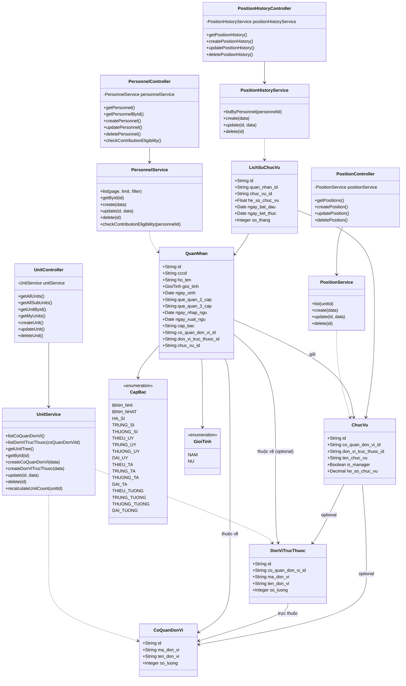
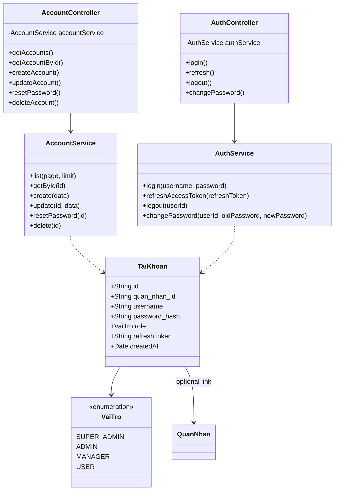
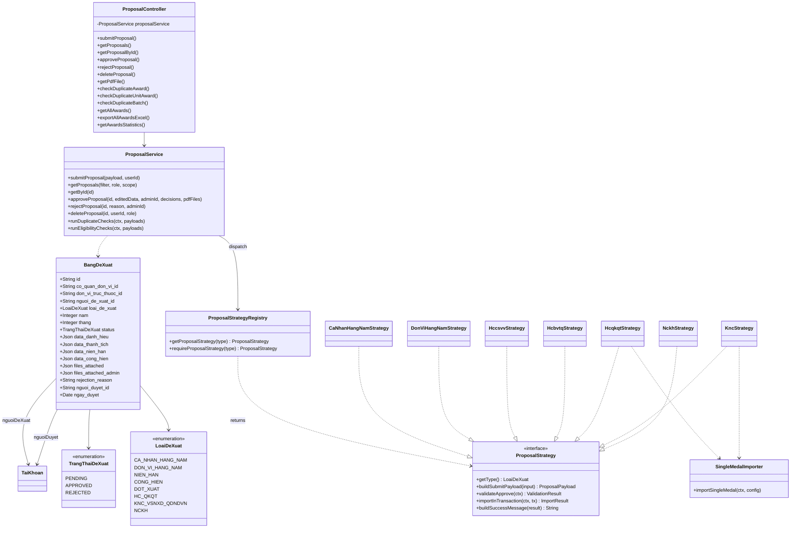
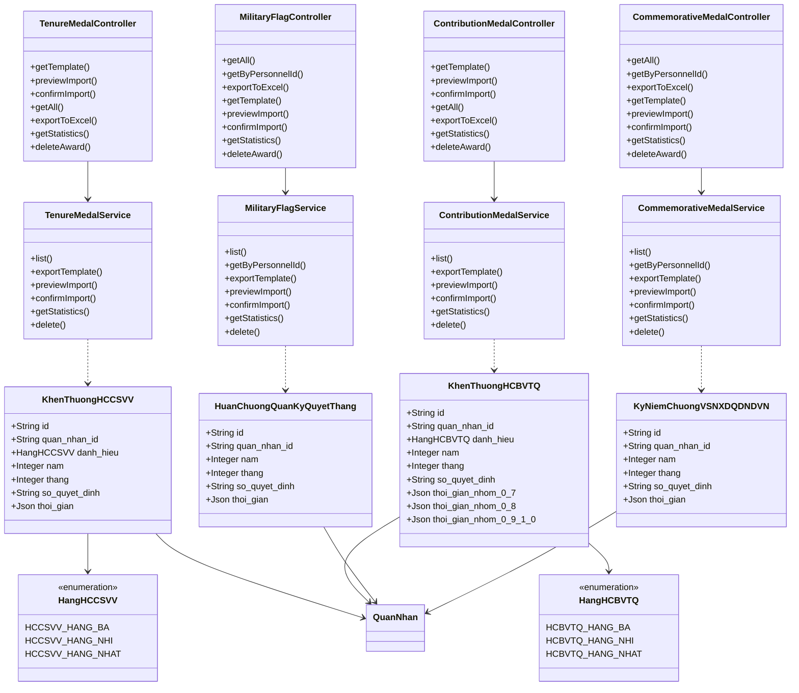
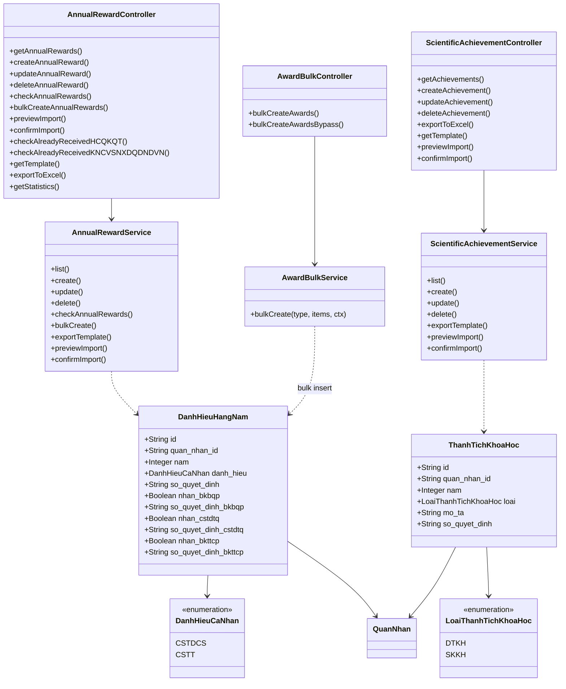
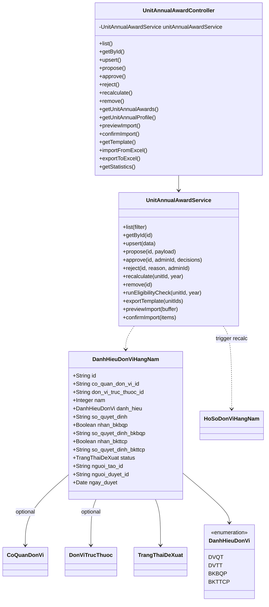
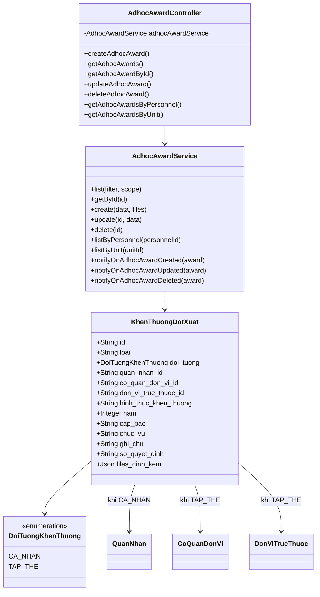
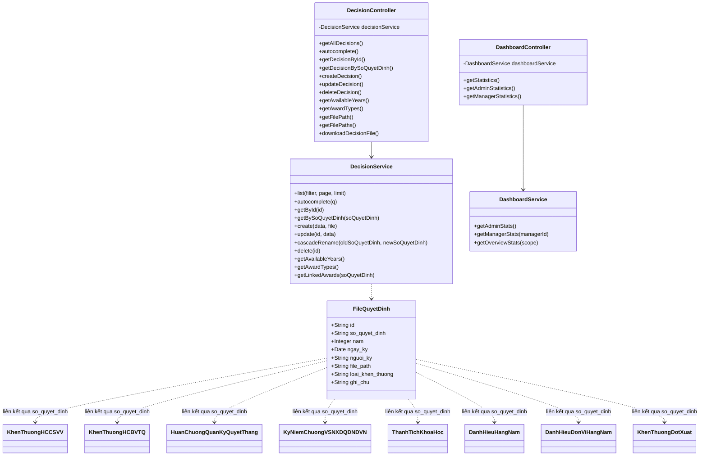
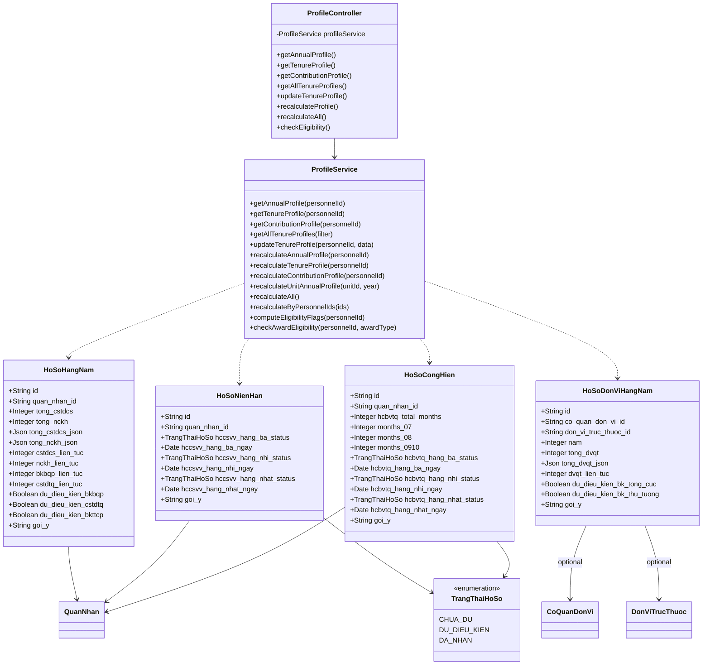
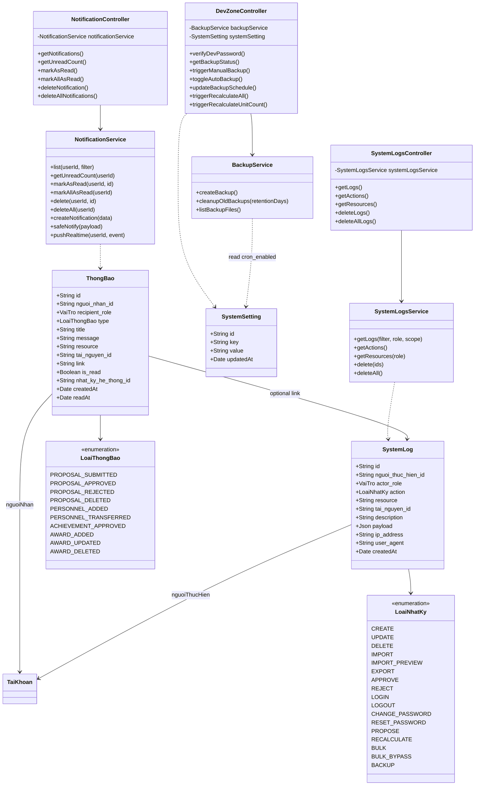

# Sơ đồ Lớp (Class Diagrams)

> Mỗi sơ đồ tương ứng 1 module trong code. Tên thuộc tính/method trích đúng từ `prisma/schema.prisma` và controller/service trong `BE-QLKT/src/`.
>
> **Astah import**: Java skeleton đã tạo sẵn ở `astah-import/` (90 file Java). Vào Astah → `Tools → Java → Import Java...` → chọn `astah-import/`. Astah tự sinh class diagram theo project tree.
>
> **Quy ước UML**:
> - **Association** (`──>` liền): có field instance type tới class kia. Vd: `Controller --> Service` (controller hold service singleton).
> - **Dependency** (`..>` đứt): không có field, chỉ dùng qua method param/return. Vd: `Service ..> Entity`.
> - **Realization** (`..|>`): `class X implements Interface`. Vd: 7 ProposalStrategy concrete classes.
> - **Composition** (`*-->` filled diamond): aggregation strong, ownership lifecycle.

## Tổng quan 10 sơ đồ (in vừa A4)

| # | Sơ đồ | Class | A4 | Câu hỏi defend |
|---|---|---|---|---|
| C3.1 | Quân nhân + Đơn vị | 15 | Landscape | Module quân nhân và cơ cấu đơn vị (CQDV/DVTT/ChucVu) tổ chức ra sao? |
| C3.2 | Tài khoản + xác thực | 6 | Portrait | Auth + Account hoạt động thế nào? |
| C3.3 | Đề xuất + Strategy pattern | 15 | Landscape | Strategy pattern cho 7 loại đề xuất ra sao? |
| **C3.4a** | **Huân/huy chương cá nhân (4 loại)** | 14 | Landscape | 4 loại huân/huy chương cá nhân tổ chức ra sao (HCCSVV, HCBVTQ, HCQKQT, KNC)? |
| **C3.4b** | **Danh hiệu hằng năm + NCKH + bulk import** | 10 | Portrait | Chuỗi danh hiệu BKBQP/CSTDTQ/BKTTCP + NCKH + import bulk gồm những gì? |
| C3.5 | Khen thưởng đơn vị qua duyệt | 4 | Portrait | Khen thưởng đơn vị khác cá nhân ở điểm nào? |
| C3.6 | Khen thưởng đột xuất | 4 | Portrait | Tại sao đột xuất tách riêng (không Strategy, không BangDeXuat)? |
| C3.7 | Quyết định + Dashboard (cross-cutting) | 5 | Portrait | Vì sao FileQuyetDinh + Dashboard không thuộc 1 loại khen thưởng cụ thể? |
| C3.8 | Hồ sơ điều kiện (Profile cache) | 7 | Portrait | Profile cache để làm gì, recalc lúc nào? |
| C3.9 | Thông báo + nhật ký + backup | 11 | Landscape | Notification, SystemLog, Backup tổ chức ra sao? |

---

## C3.1 — Quản lý quân nhân + đơn vị


```mermaid
classDiagram
    class QuanNhan {
        +String id
        +String cccd
        +String ho_ten
        +GioiTinh gioi_tinh
        +Date ngay_sinh
        +String que_quan_2_cap
        +String que_quan_3_cap
        +Date ngay_nhap_ngu
        +Date ngay_xuat_ngu
        +String cap_bac
        +String co_quan_don_vi_id
        +String don_vi_truc_thuoc_id
        +String chuc_vu_id
    }

    class CoQuanDonVi {
        +String id
        +String ma_don_vi
        +String ten_don_vi
        +Integer so_luong
    }

    class DonViTrucThuoc {
        +String id
        +String co_quan_don_vi_id
        +String ma_don_vi
        +String ten_don_vi
        +Integer so_luong
    }

    class ChucVu {
        +String id
        +String co_quan_don_vi_id
        +String don_vi_truc_thuoc_id
        +String ten_chuc_vu
        +Boolean is_manager
        +Decimal he_so_chuc_vu
    }

    class LichSuChucVu {
        +String id
        +String quan_nhan_id
        +String chuc_vu_id
        +Float he_so_chuc_vu
        +Date ngay_bat_dau
        +Date ngay_ket_thuc
        +Integer so_thang
    }

    class CapBac {
        <<enumeration>>
        BINH_NHI
        BINH_NHAT
        HA_SI
        TRUNG_SI
        THUONG_SI
        THIEU_UY
        TRUNG_UY
        THUONG_UY
        DAI_UY
        THIEU_TA
        TRUNG_TA
        THUONG_TA
        DAI_TA
        THIEU_TUONG
        TRUNG_TUONG
        THUONG_TUONG
        DAI_TUONG
    }

    class GioiTinh {
        <<enumeration>>
        NAM
        NU
    }

    class PersonnelController {
        -PersonnelService personnelService
        +getPersonnel()
        +getPersonnelById()
        +createPersonnel()
        +updatePersonnel()
        +deletePersonnel()
        +checkContributionEligibility()
    }

    class PersonnelService {
        +list(page, limit, filter)
        +getById(id)
        +create(data)
        +update(id, data)
        +delete(id)
        +checkContributionEligibility(personnelId)
    }

    class UnitController {
        -UnitService unitService
        +getAllUnits()
        +getAllSubUnits()
        +getUnitById()
        +getMyUnits()
        +createUnit()
        +updateUnit()
        +deleteUnit()
    }

    class UnitService {
        +listCoQuanDonVi()
        +listDonViTrucThuoc(coQuanDonViId)
        +getUnitTree()
        +getById(id)
        +createCoQuanDonVi(data)
        +createDonViTrucThuoc(data)
        +update(id, data)
        +delete(id)
        +recalculateUnitCount(unitId)
    }

    class PositionController {
        -PositionService positionService
        +getPositions()
        +createPosition()
        +updatePosition()
        +deletePosition()
    }

    class PositionService {
        +list(unitId)
        +create(data)
        +update(id, data)
        +delete(id)
    }

    class PositionHistoryController {
        -PositionHistoryService positionHistoryService
        +getPositionHistory()
        +createPositionHistory()
        +updatePositionHistory()
        +deletePositionHistory()
    }

    class PositionHistoryService {
        +listByPersonnel(personnelId)
        +create(data)
        +update(id, data)
        +delete(id)
    }

    PersonnelController --> PersonnelService
    UnitController --> UnitService
    PositionController --> PositionService
    PositionHistoryController --> PositionHistoryService

    PersonnelService ..> QuanNhan
    UnitService ..> CoQuanDonVi
    UnitService ..> DonViTrucThuoc
    PositionService ..> ChucVu
    PositionHistoryService ..> LichSuChucVu

    QuanNhan --> CoQuanDonVi : thuộc về
    QuanNhan --> DonViTrucThuoc : thuộc về (optional)
    QuanNhan --> ChucVu : giữ
    QuanNhan --> GioiTinh
    QuanNhan --> CapBac
    DonViTrucThuoc --> CoQuanDonVi : trực thuộc
    ChucVu --> CoQuanDonVi : optional
    ChucVu --> DonViTrucThuoc : optional
    LichSuChucVu --> QuanNhan
    LichSuChucVu --> ChucVu
```

**Ghi chú**:
- **Unit priority** (BE convention): khi xác định đơn vị của 1 quân nhân, luôn ưu tiên `don_vi_truc_thuoc_id || co_quan_don_vi_id` — DVTT trước, CQDV sau (CQDV có thể là đơn vị cha).
- **so_luong**: khi quân nhân chuyển đơn vị, dùng `if/else` để increment/decrement đúng 1 đơn vị — không dùng 2 `if` riêng (tránh đếm dư).
- **LichSuChucVu**: input để tính thời gian cống hiến (HCBVTQ), `so_thang` chỉ tính tới tháng, không tới ngày.

---

## C3.2 — Tài khoản và xác thực


```mermaid
classDiagram
    class TaiKhoan {
        +String id
        +String quan_nhan_id
        +String username
        +String password_hash
        +VaiTro role
        +String refreshToken
        +Date createdAt
    }

    class VaiTro {
        <<enumeration>>
        SUPER_ADMIN
        ADMIN
        MANAGER
        USER
    }

    class AccountController {
        -AccountService accountService
        +getAccounts()
        +getAccountById()
        +createAccount()
        +updateAccount()
        +resetPassword()
        +deleteAccount()
    }

    class AccountService {
        +list(page, limit)
        +getById(id)
        +create(data)
        +update(id, data)
        +resetPassword(id)
        +delete(id)
    }

    class AuthController {
        -AuthService authService
        +login()
        +refresh()
        +logout()
        +changePassword()
    }

    class AuthService {
        +login(username, password)
        +refreshAccessToken(refreshToken)
        +logout(userId)
        +changePassword(userId, oldPassword, newPassword)
    }

    AccountController --> AccountService
    AuthController --> AuthService
    AccountService ..> TaiKhoan
    AuthService ..> TaiKhoan
    TaiKhoan --> VaiTro
    TaiKhoan --> QuanNhan : optional link
```

**Ghi chú**:
- **JWT pair**: access token (15p) + refresh token (7d) — `refreshToken` lưu trong DB để hỗ trợ logout/rotation.
- **TaiKhoan ↔ QuanNhan**: 1-1 optional (1 quân nhân có thể không có tài khoản, ngược lại tài khoản system có thể không gắn quân nhân).
- **resetPassword**: đặt về mật khẩu mặc định, không gửi email — SA/ADMIN thông báo trực tiếp cho người dùng.

---

## C3.3 — Đề xuất khen thưởng + Strategy pattern


```mermaid
classDiagram
    class BangDeXuat {
        +String id
        +String co_quan_don_vi_id
        +String don_vi_truc_thuoc_id
        +String nguoi_de_xuat_id
        +LoaiDeXuat loai_de_xuat
        +Integer nam
        +Integer thang
        +TrangThaiDeXuat status
        +Json data_danh_hieu
        +Json data_thanh_tich
        +Json data_nien_han
        +Json data_cong_hien
        +Json files_attached
        +Json files_attached_admin
        +String rejection_reason
        +String nguoi_duyet_id
        +Date ngay_duyet
    }

    class LoaiDeXuat {
        <<enumeration>>
        CA_NHAN_HANG_NAM
        DON_VI_HANG_NAM
        NIEN_HAN
        CONG_HIEN
        DOT_XUAT
        HC_QKQT
        KNC_VSNXD_QDNDVN
        NCKH
    }

    class TrangThaiDeXuat {
        <<enumeration>>
        PENDING
        APPROVED
        REJECTED
    }

    class ProposalController {
        -ProposalService proposalService
        +submitProposal()
        +getProposals()
        +getProposalById()
        +approveProposal()
        +rejectProposal()
        +deleteProposal()
        +getPdfFile()
        +checkDuplicateAward()
        +checkDuplicateUnitAward()
        +checkDuplicateBatch()
        +getAllAwards()
        +exportAllAwardsExcel()
        +getAwardsStatistics()
    }

    class ProposalService {
        +submitProposal(payload, userId)
        +getProposals(filter, role, scope)
        +getById(id)
        +approveProposal(id, editedData, adminId, decisions, pdfFiles)
        +rejectProposal(id, reason, adminId)
        +deleteProposal(id, userId, role)
        +runDuplicateChecks(ctx, payloads)
        +runEligibilityChecks(ctx, payloads)
    }

    class ProposalStrategy {
        <<interface>>
        +getType() LoaiDeXuat
        +buildSubmitPayload(input) ProposalPayload
        +validateApprove(ctx) ValidationResult
        +importInTransaction(ctx, tx) ImportResult
        +buildSuccessMessage(result) String
    }

    class ProposalStrategyRegistry {
        +getProposalStrategy(type) ProposalStrategy
        +requireProposalStrategy(type) ProposalStrategy
    }

    class CaNhanHangNamStrategy
    class DonViHangNamStrategy
    class HccsvvStrategy
    class HcbvtqStrategy
    class HcqkqtStrategy
    class KncStrategy
    class NckhStrategy

    class SingleMedalImporter {
        +importSingleMedal(ctx, config)
    }

    ProposalController --> ProposalService
    ProposalService --> ProposalStrategyRegistry : dispatch
    ProposalStrategyRegistry ..> ProposalStrategy : returns
    CaNhanHangNamStrategy ..|> ProposalStrategy
    DonViHangNamStrategy ..|> ProposalStrategy
    HccsvvStrategy ..|> ProposalStrategy
    HcbvtqStrategy ..|> ProposalStrategy
    HcqkqtStrategy ..|> ProposalStrategy
    KncStrategy ..|> ProposalStrategy
    NckhStrategy ..|> ProposalStrategy

    HcqkqtStrategy ..> SingleMedalImporter
    KncStrategy ..> SingleMedalImporter

    ProposalService ..> BangDeXuat
    BangDeXuat --> LoaiDeXuat
    BangDeXuat --> TrangThaiDeXuat
    BangDeXuat --> TaiKhoan : nguoiDeXuat
    BangDeXuat --> TaiKhoan : nguoiDuyet
```

**Ghi chú**:
- **Strategy pattern**: 7 concrete strategy implement chung interface `ProposalStrategy` — dispatch qua `REGISTRY` map (`services/proposal/strategies/index.ts`).
- **`SingleMedalImporter`**: shared helper cho HCQKQT + KNC (2 loại có chung pattern "1 quân nhân nhận 1 huân chương duy nhất").
- **Submit vs Approve**: submit chỉ validate cấu trúc payload + năm/tháng. Eligibility check + duplicate check chạy ở bước **approve** (`runEligibilityChecks` + `runDuplicateChecks`) để tránh stale data.
- **Open/Closed Principle**: thêm loại đề xuất mới = thêm 1 strategy + register vào map — không sửa code cũ.

---

## C3.4a — Khen thưởng cá nhân: 4 loại huân/huy chương niên hạn


```mermaid
classDiagram
    class KhenThuongHCCSVV {
        +String id
        +String quan_nhan_id
        +HangHCCSVV danh_hieu
        +Integer nam
        +Integer thang
        +String so_quyet_dinh
        +Json thoi_gian
    }

    class KhenThuongHCBVTQ {
        +String id
        +String quan_nhan_id
        +HangHCBVTQ danh_hieu
        +Integer nam
        +Integer thang
        +String so_quyet_dinh
        +Json thoi_gian_nhom_0_7
        +Json thoi_gian_nhom_0_8
        +Json thoi_gian_nhom_0_9_1_0
    }

    class HuanChuongQuanKyQuyetThang {
        +String id
        +String quan_nhan_id
        +Integer nam
        +Integer thang
        +String so_quyet_dinh
        +Json thoi_gian
    }

    class KyNiemChuongVSNXDQDNDVN {
        +String id
        +String quan_nhan_id
        +Integer nam
        +Integer thang
        +String so_quyet_dinh
        +Json thoi_gian
    }

    class HangHCCSVV {
        <<enumeration>>
        HCCSVV_HANG_BA
        HCCSVV_HANG_NHI
        HCCSVV_HANG_NHAT
    }

    class HangHCBVTQ {
        <<enumeration>>
        HCBVTQ_HANG_BA
        HCBVTQ_HANG_NHI
        HCBVTQ_HANG_NHAT
    }

    class TenureMedalController {
        +getTemplate()
        +previewImport()
        +confirmImport()
        +getAll()
        +exportToExcel()
        +getStatistics()
        +deleteAward()
    }

    class TenureMedalService {
        +list()
        +exportTemplate()
        +previewImport()
        +confirmImport()
        +getStatistics()
        +delete()
    }

    class ContributionMedalController {
        +getTemplate()
        +previewImport()
        +confirmImport()
        +getAll()
        +exportToExcel()
        +getStatistics()
        +deleteAward()
    }

    class ContributionMedalService {
        +list()
        +exportTemplate()
        +previewImport()
        +confirmImport()
        +getStatistics()
        +delete()
    }

    class MilitaryFlagController {
        +getAll()
        +getByPersonnelId()
        +exportToExcel()
        +getTemplate()
        +previewImport()
        +confirmImport()
        +getStatistics()
        +deleteAward()
    }

    class MilitaryFlagService {
        +list()
        +getByPersonnelId()
        +exportTemplate()
        +previewImport()
        +confirmImport()
        +getStatistics()
        +delete()
    }

    class CommemorativeMedalController {
        +getAll()
        +getByPersonnelId()
        +exportToExcel()
        +getTemplate()
        +previewImport()
        +confirmImport()
        +getStatistics()
        +deleteAward()
    }

    class CommemorativeMedalService {
        +list()
        +getByPersonnelId()
        +exportTemplate()
        +previewImport()
        +confirmImport()
        +getStatistics()
        +delete()
    }

    TenureMedalController --> TenureMedalService
    ContributionMedalController --> ContributionMedalService
    MilitaryFlagController --> MilitaryFlagService
    CommemorativeMedalController --> CommemorativeMedalService

    TenureMedalService ..> KhenThuongHCCSVV
    ContributionMedalService ..> KhenThuongHCBVTQ
    MilitaryFlagService ..> HuanChuongQuanKyQuyetThang
    CommemorativeMedalService ..> KyNiemChuongVSNXDQDNDVN

    KhenThuongHCCSVV --> HangHCCSVV
    KhenThuongHCBVTQ --> HangHCBVTQ

    KhenThuongHCCSVV --> QuanNhan
    KhenThuongHCBVTQ --> QuanNhan
    HuanChuongQuanKyQuyetThang --> QuanNhan
    KyNiemChuongVSNXDQDNDVN --> QuanNhan
```

**Ghi chú**:
- **4 module CRUD đồng pattern**: list / preview-import / confirm-import / export-Excel / get-template / get-statistics / delete. Lý do tách 4 module riêng (không gộp): mỗi loại có rule eligibility khác nhau (HCCSVV theo 10/15/20 năm, HCBVTQ theo 120 tháng hệ số, HCQKQT từ ngày nhập ngũ, KNC 20/25 năm đến xuất ngũ).
- **Lifetime constraint**:
  - `KhenThuongHCBVTQ`, `HuanChuongQuanKyQuyetThang`, `KyNiemChuongVSNXDQDNDVN` có `@unique quan_nhan_id` — **1 quân nhân chỉ 1 bản ghi** (lifetime).
  - `KhenThuongHCCSVV` có `@@unique(quan_nhan_id, danh_hieu)` — 1 quân nhân tối đa 3 hạng (Ba/Nhì/Nhất).
- **Json `thoi_gian`**: lưu cached `{total_months, years, months, display}` để FE render nhanh, không tính lại từ ngay_nhap_ngu mỗi lần.
- **Khác `HCBVTQ`**: lưu 3 Json `thoi_gian_nhom_0_7/0_8/0_9_1_0` cho 3 nhóm hệ số chức vụ — vì rule HCBVTQ cộng dồn tháng theo hệ số.

---

## C3.4b — Danh hiệu hằng năm + NCKH + import bulk


```mermaid
classDiagram
    class DanhHieuHangNam {
        +String id
        +String quan_nhan_id
        +Integer nam
        +DanhHieuCaNhan danh_hieu
        +String so_quyet_dinh
        +Boolean nhan_bkbqp
        +String so_quyet_dinh_bkbqp
        +Boolean nhan_cstdtq
        +String so_quyet_dinh_cstdtq
        +Boolean nhan_bkttcp
        +String so_quyet_dinh_bkttcp
    }

    class ThanhTichKhoaHoc {
        +String id
        +String quan_nhan_id
        +Integer nam
        +LoaiThanhTichKhoaHoc loai
        +String mo_ta
        +String so_quyet_dinh
    }

    class DanhHieuCaNhan {
        <<enumeration>>
        CSTDCS
        CSTT
    }

    class LoaiThanhTichKhoaHoc {
        <<enumeration>>
        DTKH
        SKKH
    }

    class AnnualRewardController {
        +getAnnualRewards()
        +createAnnualReward()
        +updateAnnualReward()
        +deleteAnnualReward()
        +checkAnnualRewards()
        +bulkCreateAnnualRewards()
        +previewImport()
        +confirmImport()
        +checkAlreadyReceivedHCQKQT()
        +checkAlreadyReceivedKNCVSNXDQDNDVN()
        +getTemplate()
        +exportToExcel()
        +getStatistics()
    }

    class AnnualRewardService {
        +list()
        +create()
        +update()
        +delete()
        +checkAnnualRewards()
        +bulkCreate()
        +exportTemplate()
        +previewImport()
        +confirmImport()
    }

    class ScientificAchievementController {
        +getAchievements()
        +createAchievement()
        +updateAchievement()
        +deleteAchievement()
        +exportToExcel()
        +getTemplate()
        +previewImport()
        +confirmImport()
    }

    class ScientificAchievementService {
        +list()
        +create()
        +update()
        +delete()
        +exportTemplate()
        +previewImport()
        +confirmImport()
    }

    class AwardBulkController {
        +bulkCreateAwards()
        +bulkCreateAwardsBypass()
    }

    class AwardBulkService {
        +bulkCreate(type, items, ctx)
    }

    AnnualRewardController --> AnnualRewardService
    ScientificAchievementController --> ScientificAchievementService
    AwardBulkController --> AwardBulkService

    AnnualRewardService ..> DanhHieuHangNam
    ScientificAchievementService ..> ThanhTichKhoaHoc
    AwardBulkService ..> DanhHieuHangNam : bulk insert

    DanhHieuHangNam --> DanhHieuCaNhan
    ThanhTichKhoaHoc --> LoaiThanhTichKhoaHoc

    DanhHieuHangNam --> QuanNhan
    ThanhTichKhoaHoc --> QuanNhan
```

**Ghi chú**:
- **`DanhHieuHangNam` là input của chuỗi BKBQP/CSTDTQ/BKTTCP**: 3 cờ `nhan_bkbqp/cstdtq/bkttcp` + 3 số quyết định tương ứng. Mỗi `@@unique(quan_nhan_id, nam)` — mỗi quân nhân 1 dòng/năm.
- **`ThanhTichKhoaHoc` cũng là input chuỗi**: chuỗi danh hiệu yêu cầu **mỗi năm có ≥ 1 NCKH** (DTKH hoặc SKKH) mới tính `nckh_lien_tuc` → mới đủ điều kiện CSTDTQ/BKTTCP.
- **`AwardBulkController.bulkCreateAwardsBypass`**: route đặc biệt — admin seed dữ liệu lịch sử mà không qua duyệt 3 cấp. Chỉ SUPER_ADMIN/ADMIN dùng để khởi tạo dữ liệu trước khi go-live.
- **`checkAlreadyReceivedHCQKQT/KNCVSNXDQDNDVN`** ở `AnnualRewardController` (không phải ở MilitaryFlag/CommemorativeMedal controller) — vì gốc của 2 quyết định lifetime này nằm trong workflow đề xuất danh hiệu hằng năm theo từng đợt, cần check trước khi cho phép tạo đề xuất.
- **Liên kết với C3.4a**: 6 module trong C3.4a + C3.4b cùng dùng `FileQuyetDinh` qua FK `so_quyet_dinh` — xem C3.7.

---

## C3.5 — Khen thưởng đơn vị qua duyệt


```mermaid
classDiagram
    class DanhHieuDonViHangNam {
        +String id
        +String co_quan_don_vi_id
        +String don_vi_truc_thuoc_id
        +Integer nam
        +DanhHieuDonVi danh_hieu
        +String so_quyet_dinh
        +Boolean nhan_bkbqp
        +String so_quyet_dinh_bkbqp
        +Boolean nhan_bkttcp
        +String so_quyet_dinh_bkttcp
        +TrangThaiDeXuat status
        +String nguoi_tao_id
        +String nguoi_duyet_id
        +Date ngay_duyet
    }

    class DanhHieuDonVi {
        <<enumeration>>
        DVQT
        DVTT
        BKBQP
        BKTTCP
    }

    class UnitAnnualAwardController {
        -UnitAnnualAwardService unitAnnualAwardService
        +list()
        +getById()
        +upsert()
        +propose()
        +approve()
        +reject()
        +recalculate()
        +remove()
        +getUnitAnnualAwards()
        +getUnitAnnualProfile()
        +previewImport()
        +confirmImport()
        +getTemplate()
        +importFromExcel()
        +exportToExcel()
        +getStatistics()
    }

    class UnitAnnualAwardService {
        +list(filter)
        +getById(id)
        +upsert(data)
        +propose(id, payload)
        +approve(id, adminId, decisions)
        +reject(id, reason, adminId)
        +recalculate(unitId, year)
        +remove(id)
        +runEligibilityCheck(unitId, year)
        +exportTemplate(unitIds)
        +previewImport(buffer)
        +confirmImport(items)
    }

    UnitAnnualAwardController --> UnitAnnualAwardService
    UnitAnnualAwardService ..> DanhHieuDonViHangNam
    UnitAnnualAwardService ..> HoSoDonViHangNam : trigger recalc
    DanhHieuDonViHangNam --> CoQuanDonVi : optional
    DanhHieuDonViHangNam --> DonViTrucThuoc : optional
    DanhHieuDonViHangNam --> TrangThaiDeXuat
    DanhHieuDonViHangNam --> DanhHieuDonVi
```

**Ghi chú**:
- **Đơn vị nhận khen thưởng = CQDV hoặc DVTT** — 2 FK nullable, đúng 1 cái phải có giá trị.
- **Workflow đơn vị**: MGR `propose` → status PENDING → ADM `approve`/`reject` (giống cá nhân).
- **Khác cá nhân**: không qua bảng `BangDeXuat` chung mà **lưu thẳng vào `DanhHieuDonViHangNam`** với cột `status` riêng — quyết định kiến trúc lịch sử (đã có trước khi BangDeXuat ra đời, giữ để tránh migration).
- **Chuỗi BKBQP/BKTTCP đơn vị**: cũng 2y/7y giống cá nhân, nhưng **không có CSTDTQ**, **không có NCKH**, và **`BKTTCP đơn vị isLifetime: false`** — có thể nhận lặp.

---

## C3.6 — Khen thưởng đột xuất (flow riêng — không qua đề xuất)


```mermaid
classDiagram
    class KhenThuongDotXuat {
        +String id
        +String loai
        +DoiTuongKhenThuong doi_tuong
        +String quan_nhan_id
        +String co_quan_don_vi_id
        +String don_vi_truc_thuoc_id
        +String hinh_thuc_khen_thuong
        +Integer nam
        +String cap_bac
        +String chuc_vu
        +String ghi_chu
        +String so_quyet_dinh
        +Json files_dinh_kem
    }

    class DoiTuongKhenThuong {
        <<enumeration>>
        CA_NHAN
        TAP_THE
    }

    class AdhocAwardController {
        -AdhocAwardService adhocAwardService
        +createAdhocAward()
        +getAdhocAwards()
        +getAdhocAwardById()
        +updateAdhocAward()
        +deleteAdhocAward()
        +getAdhocAwardsByPersonnel()
        +getAdhocAwardsByUnit()
    }

    class AdhocAwardService {
        +list(filter, scope)
        +getById(id)
        +create(data, files)
        +update(id, data)
        +delete(id)
        +listByPersonnel(personnelId)
        +listByUnit(unitId)
        +notifyOnAdhocAwardCreated(award)
        +notifyOnAdhocAwardUpdated(award)
        +notifyOnAdhocAwardDeleted(award)
    }

    AdhocAwardController --> AdhocAwardService
    AdhocAwardService ..> KhenThuongDotXuat
    KhenThuongDotXuat --> DoiTuongKhenThuong
    KhenThuongDotXuat --> QuanNhan : khi CA_NHAN
    KhenThuongDotXuat --> CoQuanDonVi : khi TAP_THE
    KhenThuongDotXuat --> DonViTrucThuoc : khi TAP_THE
```

**Ghi chú — Tại sao tách riêng**:
1. **Không qua `BangDeXuat`** — ADMIN ghi thẳng vào `KhenThuongDotXuat`. Lý do: khen thưởng đột xuất xảy ra theo sự kiện/chiến công cụ thể, cần ghi nhận tức thì, không đi qua chu kỳ 3 cấp duyệt.
2. **Không dùng Strategy pattern** — chỉ có 1 service `AdhocAwardService` xử lý cả 2 nhánh `doi_tuong = CA_NHAN` vs `TAP_THE` qua if/else (không tách strategy vì chỉ 2 nhánh đơn giản).
3. **Notification phân nhánh trong helper** (`notifications.ts`):
   - `doi_tuong = CA_NHAN` → notify Quân nhân + Chỉ huy đơn vị
   - `doi_tuong = TAP_THE` → notify chỉ Chỉ huy đơn vị
4. **3 FK nullable**: `quan_nhan_id`, `co_quan_don_vi_id`, `don_vi_truc_thuoc_id` — đúng 1 trong 3 phải có giá trị tùy `doi_tuong`.

---

## C3.7 — Quyết định + Dashboard (cross-cutting)


```mermaid
classDiagram
    class FileQuyetDinh {
        +String id
        +String so_quyet_dinh
        +Integer nam
        +Date ngay_ky
        +String nguoi_ky
        +String file_path
        +String loai_khen_thuong
        +String ghi_chu
    }

    class DecisionController {
        -DecisionService decisionService
        +getAllDecisions()
        +autocomplete()
        +getDecisionById()
        +getDecisionBySoQuyetDinh()
        +createDecision()
        +updateDecision()
        +deleteDecision()
        +getAvailableYears()
        +getAwardTypes()
        +getFilePath()
        +getFilePaths()
        +downloadDecisionFile()
    }

    class DecisionService {
        +list(filter, page, limit)
        +autocomplete(q)
        +getById(id)
        +getBySoQuyetDinh(soQuyetDinh)
        +create(data, file)
        +update(id, data)
        +cascadeRename(oldSoQuyetDinh, newSoQuyetDinh)
        +delete(id)
        +getAvailableYears()
        +getAwardTypes()
        +getLinkedAwards(soQuyetDinh)
    }

    class DashboardController {
        -DashboardService dashboardService
        +getStatistics()
        +getAdminStatistics()
        +getManagerStatistics()
    }

    class DashboardService {
        +getAdminStats()
        +getManagerStats(managerId)
        +getOverviewStats(scope)
    }

    DecisionController --> DecisionService
    DashboardController --> DashboardService
    DecisionService ..> FileQuyetDinh

    FileQuyetDinh ..> KhenThuongHCCSVV : liên kết qua so_quyet_dinh
    FileQuyetDinh ..> KhenThuongHCBVTQ : liên kết qua so_quyet_dinh
    FileQuyetDinh ..> HuanChuongQuanKyQuyetThang : liên kết qua so_quyet_dinh
    FileQuyetDinh ..> KyNiemChuongVSNXDQDNDVN : liên kết qua so_quyet_dinh
    FileQuyetDinh ..> ThanhTichKhoaHoc : liên kết qua so_quyet_dinh
    FileQuyetDinh ..> DanhHieuHangNam : liên kết qua so_quyet_dinh
    FileQuyetDinh ..> DanhHieuDonViHangNam : liên kết qua so_quyet_dinh
    FileQuyetDinh ..> KhenThuongDotXuat : liên kết qua so_quyet_dinh
```

**Ghi chú**:
- **FileQuyetDinh là hub cross-cutting**: liên kết 8 bảng khen thưởng qua FK natural-key `so_quyet_dinh` (unique). Đổi tên quyết định (`cascadeRename`) phải cập nhật 13 cột FK trên 8 bảng (Postgres tự cascade qua `onUpdate: Cascade`) **+** app-layer cascade JSON payload `BangDeXuat.data_*` cùng transaction (`services/decision/cascadeRename.ts`).
- **Dashboard**: aggregate stats cross-module — đếm personnel, unit, đề xuất pending/approved, khen thưởng theo loại/năm. Service đơn giản, không có entity riêng.
- **Lý do gộp Decision + Dashboard 1 sơ đồ**: cả 2 đều không thuộc 1 loại khen thưởng cụ thể — bản chất là **utility/aggregation layer**.

---

## C3.8 — Hồ sơ điều kiện khen thưởng (Profile cache)


```mermaid
classDiagram
    class HoSoHangNam {
        +String id
        +String quan_nhan_id
        +Integer tong_cstdcs
        +Integer tong_nckh
        +Json tong_cstdcs_json
        +Json tong_nckh_json
        +Integer cstdcs_lien_tuc
        +Integer nckh_lien_tuc
        +Integer bkbqp_lien_tuc
        +Integer cstdtq_lien_tuc
        +Boolean du_dieu_kien_bkbqp
        +Boolean du_dieu_kien_cstdtq
        +Boolean du_dieu_kien_bkttcp
        +String goi_y
    }

    class HoSoNienHan {
        +String id
        +String quan_nhan_id
        +TrangThaiHoSo hccsvv_hang_ba_status
        +Date hccsvv_hang_ba_ngay
        +TrangThaiHoSo hccsvv_hang_nhi_status
        +Date hccsvv_hang_nhi_ngay
        +TrangThaiHoSo hccsvv_hang_nhat_status
        +Date hccsvv_hang_nhat_ngay
        +String goi_y
    }

    class HoSoCongHien {
        +String id
        +String quan_nhan_id
        +Integer hcbvtq_total_months
        +Integer months_07
        +Integer months_08
        +Integer months_0910
        +TrangThaiHoSo hcbvtq_hang_ba_status
        +Date hcbvtq_hang_ba_ngay
        +TrangThaiHoSo hcbvtq_hang_nhi_status
        +Date hcbvtq_hang_nhi_ngay
        +TrangThaiHoSo hcbvtq_hang_nhat_status
        +Date hcbvtq_hang_nhat_ngay
        +String goi_y
    }

    class HoSoDonViHangNam {
        +String id
        +String co_quan_don_vi_id
        +String don_vi_truc_thuoc_id
        +Integer nam
        +Integer tong_dvqt
        +Json tong_dvqt_json
        +Integer dvqt_lien_tuc
        +Boolean du_dieu_kien_bk_tong_cuc
        +Boolean du_dieu_kien_bk_thu_tuong
        +String goi_y
    }

    class TrangThaiHoSo {
        <<enumeration>>
        CHUA_DU
        DU_DIEU_KIEN
        DA_NHAN
    }

    class ProfileController {
        -ProfileService profileService
        +getAnnualProfile()
        +getTenureProfile()
        +getContributionProfile()
        +getAllTenureProfiles()
        +updateTenureProfile()
        +recalculateProfile()
        +recalculateAll()
        +checkEligibility()
    }

    class ProfileService {
        +getAnnualProfile(personnelId)
        +getTenureProfile(personnelId)
        +getContributionProfile(personnelId)
        +getAllTenureProfiles(filter)
        +updateTenureProfile(personnelId, data)
        +recalculateAnnualProfile(personnelId)
        +recalculateTenureProfile(personnelId)
        +recalculateContributionProfile(personnelId)
        +recalculateUnitAnnualProfile(unitId, year)
        +recalculateAll()
        +recalculateByPersonnelIds(ids)
        +computeEligibilityFlags(personnelId)
        +checkAwardEligibility(personnelId, awardType)
    }

    ProfileController --> ProfileService
    ProfileService ..> HoSoHangNam
    ProfileService ..> HoSoNienHan
    ProfileService ..> HoSoCongHien
    ProfileService ..> HoSoDonViHangNam

    HoSoHangNam --> QuanNhan
    HoSoNienHan --> QuanNhan
    HoSoCongHien --> QuanNhan
    HoSoDonViHangNam --> CoQuanDonVi : optional
    HoSoDonViHangNam --> DonViTrucThuoc : optional

    HoSoNienHan --> TrangThaiHoSo
    HoSoCongHien --> TrangThaiHoSo
```

**Ghi chú**:
- **4 bảng Profile = OUTPUT cache** — không phải input. Được tính bằng `ProfileService.recalculate*` từ các bảng INPUT (`DanhHieuHangNam`, `ThanhTichKhoaHoc`, `LichSuChucVu`, `QuanNhan.ngay_nhap_ngu/ngay_xuat_ngu`).
- **Trigger recalc**:
  - Sau khi approve đề xuất (`ProposalService.approveProposal`)
  - Sau khi import Excel khen thưởng (preview/confirm)
  - Manual qua `/api/profiles/recalculate-all` (ADMIN only)
  - Cron định kỳ (DevZone toggle)
- **`computeEligibilityFlags` vs `checkAwardEligibility`**: 2 hàm phải đồng nhất rule core — recalc dùng `computeEligibilityFlags` (output: 3 boolean), API duyệt dùng `checkAwardEligibility` (output: eligible + reason). Cùng dùng `chainEligibility.checkChainEligibility` underneath.
- **`isLifetime` BKTTCP cá nhân**: sau khi nhận 1 lần, profile flag `du_dieu_kien_bkttcp = false` permanent + `goi_y` = "Đã có BKTTCP. Phần mềm chưa hỗ trợ các danh hiệu cao hơn...".

---

## C3.9 — Thông báo + nhật ký + backup + cấu hình


```mermaid
classDiagram
    class ThongBao {
        +String id
        +String nguoi_nhan_id
        +VaiTro recipient_role
        +LoaiThongBao type
        +String title
        +String message
        +String resource
        +String tai_nguyen_id
        +String link
        +Boolean is_read
        +String nhat_ky_he_thong_id
        +Date createdAt
        +Date readAt
    }

    class SystemLog {
        +String id
        +String nguoi_thuc_hien_id
        +VaiTro actor_role
        +LoaiNhatKy action
        +String resource
        +String tai_nguyen_id
        +String description
        +Json payload
        +String ip_address
        +String user_agent
        +Date createdAt
    }

    class SystemSetting {
        +String id
        +String key
        +String value
        +Date updatedAt
    }

    class LoaiThongBao {
        <<enumeration>>
        PROPOSAL_SUBMITTED
        PROPOSAL_APPROVED
        PROPOSAL_REJECTED
        PROPOSAL_DELETED
        PERSONNEL_ADDED
        PERSONNEL_TRANSFERRED
        ACHIEVEMENT_APPROVED
        AWARD_ADDED
        AWARD_UPDATED
        AWARD_DELETED
    }

    class LoaiNhatKy {
        <<enumeration>>
        CREATE
        UPDATE
        DELETE
        IMPORT
        IMPORT_PREVIEW
        EXPORT
        APPROVE
        REJECT
        LOGIN
        LOGOUT
        CHANGE_PASSWORD
        RESET_PASSWORD
        PROPOSE
        RECALCULATE
        BULK
        BULK_BYPASS
        BACKUP
    }

    class NotificationController {
        -NotificationService notificationService
        +getNotifications()
        +getUnreadCount()
        +markAsRead()
        +markAllAsRead()
        +deleteNotification()
        +deleteAllNotifications()
    }

    class NotificationService {
        +list(userId, filter)
        +getUnreadCount(userId)
        +markAsRead(userId, id)
        +markAllAsRead(userId)
        +delete(userId, id)
        +deleteAll(userId)
        +createNotification(data)
        +safeNotify(payload)
        +pushRealtime(userId, event)
    }

    class SystemLogsController {
        -SystemLogsService systemLogsService
        +getLogs()
        +getActions()
        +getResources()
        +deleteLogs()
        +deleteAllLogs()
    }

    class SystemLogsService {
        +getLogs(filter, role, scope)
        +getActions()
        +getResources(role)
        +delete(ids)
        +deleteAll()
    }

    class BackupService {
        +createBackup()
        +cleanupOldBackups(retentionDays)
        +listBackupFiles()
    }

    class DevZoneController {
        -BackupService backupService
        -SystemSetting systemSetting
        +verifyDevPassword()
        +getBackupStatus()
        +triggerManualBackup()
        +toggleAutoBackup()
        +updateBackupSchedule()
        +triggerRecalculateAll()
        +triggerRecalculateUnitCount()
    }

    NotificationController --> NotificationService
    SystemLogsController --> SystemLogsService
    DevZoneController --> BackupService
    DevZoneController ..> SystemSetting

    NotificationService ..> ThongBao
    SystemLogsService ..> SystemLog
    BackupService ..> SystemSetting : read cron_enabled

    ThongBao --> TaiKhoan : nguoiNhan
    ThongBao --> SystemLog : optional link
    ThongBao --> LoaiThongBao
    SystemLog --> TaiKhoan : nguoiThucHien
    SystemLog --> LoaiNhatKy
```

**Ghi chú**:
- **`safeNotify` fire-and-forget**: `notificationService.safeNotify(...)` được gọi qua `void safeNotify(...)` trong các controller (vd `proposal.controller.ts:171–195`). Lỗi gửi thông báo **không ảnh hưởng** response chính của user.
- **Realtime via Socket.IO**: `pushRealtime(userId, event)` emit tới room `user_${userId}` — FE subscribe qua `useSocket.ts`.
- **DevZone không phải controller thật** — `routes/devZone.route.ts` chứa logic inline (cron schedule, backup trigger, feature toggle) thay vì controller class riêng. Vẽ thành `DevZoneController` để rõ kiến trúc; thực thi code nằm trong route handler.
- **`BackupService.createBackup`**: tạo SQL dump → ghi file `backups/*.sql` → cập nhật `SystemSetting.last_backup_time` → ghi log (`SystemLog.action = BACKUP`).
- **Filter log theo role**: `SystemLogsService.getLogs` ẩn `resource = 'backup'` khỏi ADMIN/MANAGER (chỉ SA thấy). `deleteLogs` chỉ SA gọi được.

---

## Tổng kết

| # | Sơ đồ | Class | Enum | Đặc điểm |
|---|---|---|---|---|
| C3.1 | Quân nhân + Đơn vị | 8 (Entity + 4 cặp Ctrl/Svc) | 2 (CapBac, GioiTinh) | Unit priority DVTT > CQDV |
| C3.2 | Tài khoản + xác thực | 5 (Entity + 2 cặp Ctrl/Svc) | 1 (VaiTro) | JWT access + refresh |
| C3.3 | Đề xuất + Strategy | 13 (Entity + Ctrl/Svc + Interface + Registry + 7 strategy + Importer) | 2 (LoaiDeXuat, TrangThaiDeXuat) | **Strategy pattern + Open/Closed Principle** |
| C3.4a | Huân/huy chương cá nhân 4 loại | 12 (4 Entity + 4 cặp Ctrl/Svc) | 2 (HangHCCSVV, HangHCBVTQ) | 4 module CRUD đồng pattern preview/confirm, lifetime constraint |
| C3.4b | Danh hiệu hằng năm + NCKH + bulk | 8 (2 Entity + 3 cặp Ctrl/Svc) | 2 (DanhHieuCaNhan, LoaiThanhTichKhoaHoc) | Input của chuỗi BKBQP/CSTDTQ/BKTTCP, AwardBulk bypass duyệt |
| C3.5 | Khen thưởng đơn vị qua duyệt | 3 (Entity + Ctrl/Svc) | 1 (DanhHieuDonVi) | Workflow riêng, **không qua BangDeXuat** |
| C3.6 | Khen thưởng đột xuất | 3 (Entity + Ctrl/Svc) | 1 (DoiTuongKhenThuong) | **Không qua duyệt 3 cấp, ADMIN tạo trực tiếp**, phân nhánh CA_NHAN/TAP_THE trong helper |
| C3.7 | Quyết định + Dashboard | 5 (Entity + 2 cặp Ctrl/Svc) | — | **FileQuyetDinh hub cross-cutting 8 bảng** |
| C3.8 | Hồ sơ điều kiện | 7 (4 Entity + Ctrl/Svc) | 1 (TrangThaiHoSo) | **OUTPUT cache** — recalc sau approve/import |
| C3.9 | Thông báo + nhật ký + backup | 11 (3 Entity + 3 cặp Ctrl/Svc + BackupService + DevZoneController) | 2 (LoaiThongBao, LoaiNhatKy) | safeNotify fire-and-forget, log filter theo role |

**Tổng**: 10 sơ đồ (C3.1, C3.2, C3.3, C3.4a, C3.4b, C3.5, C3.6, C3.7, C3.8, C3.9), ~75 unique class + 13 enum = **88 phần tử** (chênh ±2 do FileQuyetDinh và QuanNhan xuất hiện chéo ở nhiều sơ đồ). Mỗi sơ đồ ≤ 15 class → in vừa A4 (6 portrait + 4 landscape).

**Layer kiến trúc**:

```
Controller (HTTP req/res) → Service (business logic) → Entity (Prisma model)
                                       ↓
                              Strategy / Helper (cross-cutting)
```

Project có 2 layer ẩn không vẽ trong class diagram:
- **Route** — Express router (chỉ là config map URL → controller method)
- **Repository** — Prisma client singleton (`models/index.ts`), không có business logic

**Patterns đáng defend**:

| Pattern | Sơ đồ | Vị trí code |
|---|---|---|
| **Strategy pattern** | C3.3 | `services/proposal/strategies/` — 7 strategy implement chung interface, dispatch qua REGISTRY (Open/Closed) |
| **Cache pattern (computed OUTPUT)** | C3.8 | `services/profile/` — 4 bảng HoSo là cache, recalc khi INPUT thay đổi |
| **Cross-cutting hub** | C3.7 | `FileQuyetDinh` natural-key FK → 8 bảng award, cascade rename trong transaction |
| **Fire-and-forget side-effect** | C3.9 | `void safeNotify(...)` — notification không chặn response, lỗi notify không rollback |
| **Filter theo role** | C3.9 | `SystemLogsService.getLogs` filter `resource = 'backup'` chỉ cho SA |
| **Single helper for similar types** | C3.3 | `SingleMedalImporter` share logic HCQKQT + KNC |

**Đối xứng với use case diagrams** (xem `01-use-case.md`):
- C3.1 ↔ A1.3 + A1.4 (quân nhân + đơn vị)
- C3.2 ↔ A1.2 (tài khoản)
- C3.3 ↔ A1.8 (đề xuất)
- C3.4a ↔ A1.7 (4 loại huân/huy chương niên hạn — HCCSVV, HCBVTQ, HCQKQT, KNC)
- C3.4b ↔ A1.5 + A1.7 NCKH (danh hiệu hằng năm + thành tích khoa học)
- C3.5 ↔ A1.6 (đơn vị hằng năm)
- C3.6 ↔ A1.9 (đột xuất)
- C3.7 ↔ A1.14 + A1.15 (báo cáo + quyết định)
- C3.8 ↔ A1.10 (xét điều kiện)
- C3.9 ↔ A1.11 + A1.12 + A1.13 (thông báo + nhật ký + backup)
