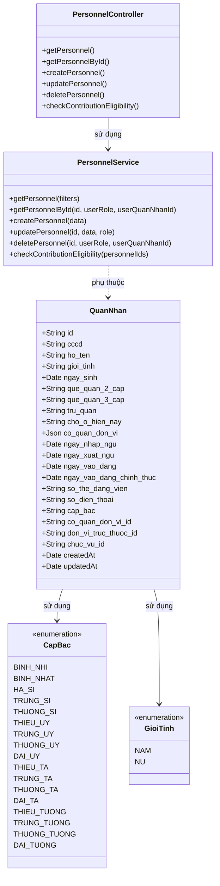
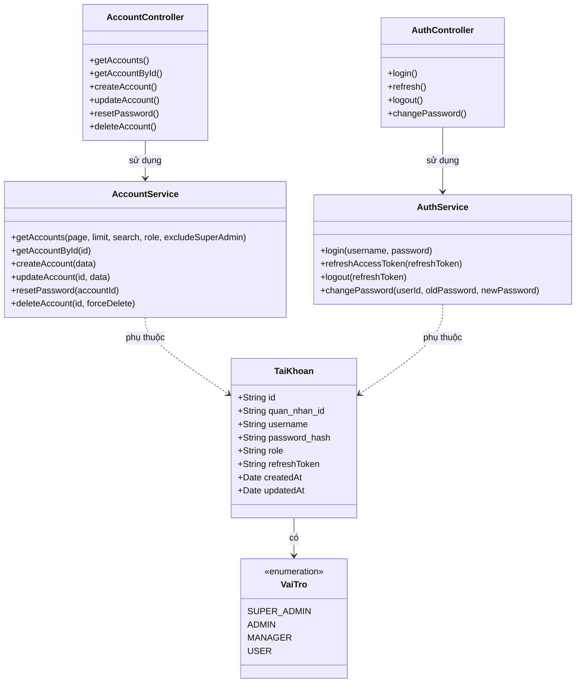
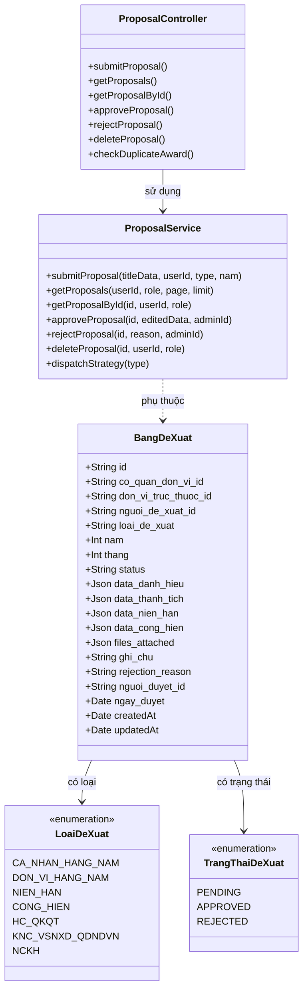
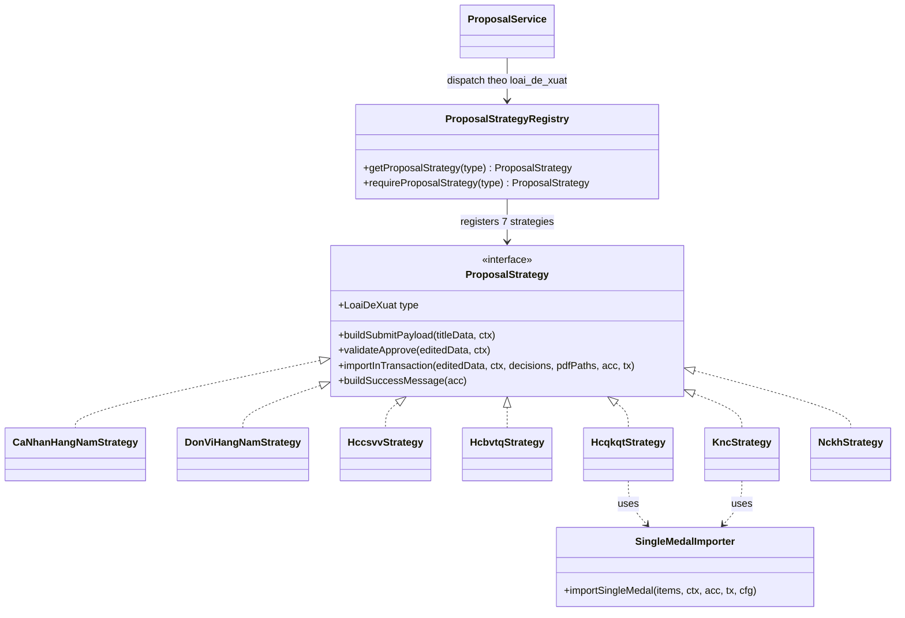
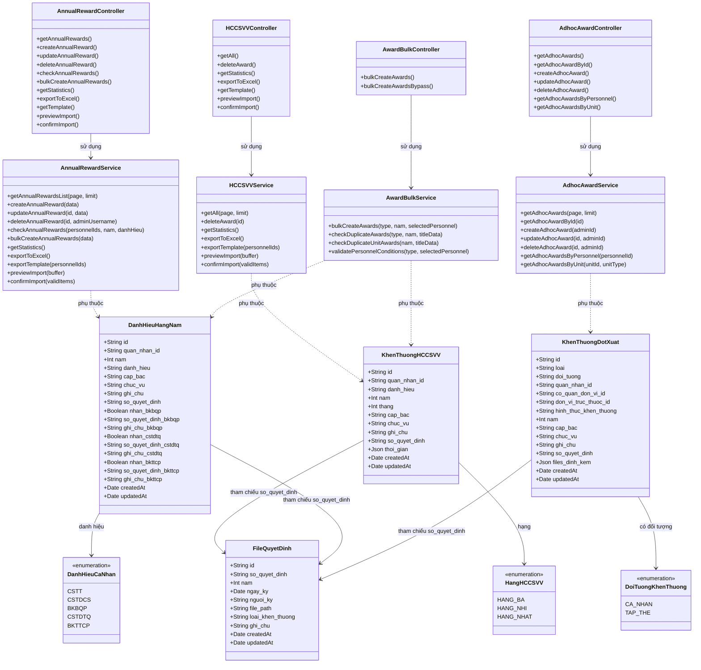
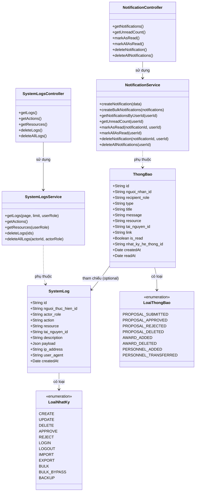

# Sơ đồ Lớp (Class Diagrams)

> Mỗi module có 1 sơ đồ gồm Entity + Controller + Service + Enum. Tên thuộc tính và phương thức lấy đúng từ `prisma/schema.prisma` và source code TypeScript.
>
> **Astah import**: Java skeleton files đã tạo sẵn ở `astah-import/` — vào Astah: `Tools → Java → Import Java...` rồi chọn từng subfolder (`personnel/`, `account/`, `proposal/`, `award/`, `notification/`). Astah tự sinh class diagram, không phải vẽ thủ công.
>
> **Quy ước UML**:
> - **Association** (`──>` liền): có composition field. Vd: `Controller → Service` (controller hold service singleton)
> - **Dependency** (`..>` đứt): không có field, chỉ dùng qua method param/return. Vd: `Service → Entity` (service uses entity tạm thời qua repository singleton-imported)
> - **Realization** (`..|>`): `class X implements Interface`. Vd: 7 ProposalStrategy concrete classes
> - **Generalization** (`──|>` rỗng đầu mũi): `class X extends Y`. (Project không dùng)

---

## C3.1 — Quản lý quân nhân


```mermaid
classDiagram
    class QuanNhan {
        +String id
        +String cccd
        +String ho_ten
        +String gioi_tinh
        +Date ngay_sinh
        +String que_quan_2_cap
        +String que_quan_3_cap
        +String tru_quan
        +String cho_o_hien_nay
        +Json co_quan_don_vi
        +Date ngay_nhap_ngu
        +Date ngay_xuat_ngu
        +Date ngay_vao_dang
        +Date ngay_vao_dang_chinh_thuc
        +String so_the_dang_vien
        +String so_dien_thoai
        +String cap_bac
        +String co_quan_don_vi_id
        +String don_vi_truc_thuoc_id
        +String chuc_vu_id
        +Date createdAt
        +Date updatedAt
    }

    class CapBac {
        <<enumeration>>
        BINH_NHI
        BINH_NHAT
        HA_SI
        TRUNG_SI
        THUONG_SI
        THIEU_UY
        TRUNG_UY
        THUONG_UY
        DAI_UY
        THIEU_TA
        TRUNG_TA
        THUONG_TA
        DAI_TA
        THIEU_TUONG
        TRUNG_TUONG
        THUONG_TUONG
        DAI_TUONG
    }

    class GioiTinh {
        <<enumeration>>
        NAM
        NU
    }

    class PersonnelController {
        +getPersonnel()
        +getPersonnelById()
        +createPersonnel()
        +updatePersonnel()
        +deletePersonnel()
        +checkContributionEligibility()
    }

    class PersonnelService {
        +getPersonnel(filters)
        +getPersonnelById(id, userRole, userQuanNhanId)
        +createPersonnel(data)
        +updatePersonnel(id, data, role)
        +deletePersonnel(id, userRole, userQuanNhanId)
        +checkContributionEligibility(personnelIds)
    }

    QuanNhan --> CapBac : sử dụng
    QuanNhan --> GioiTinh : sử dụng
    PersonnelController --> PersonnelService : sử dụng
    PersonnelService ..> QuanNhan : phụ thuộc
```

---

## C3.2 — Quản lý tài khoản và xác thực


```mermaid
classDiagram
    class TaiKhoan {
        +String id
        +String quan_nhan_id
        +String username
        +String password_hash
        +String role
        +String refreshToken
        +Date createdAt
        +Date updatedAt
    }

    class VaiTro {
        <<enumeration>>
        SUPER_ADMIN
        ADMIN
        MANAGER
        USER
    }

    class AccountController {
        +getAccounts()
        +getAccountById()
        +createAccount()
        +updateAccount()
        +resetPassword()
        +deleteAccount()
    }

    class AuthController {
        +login()
        +refresh()
        +logout()
        +changePassword()
    }

    class AccountService {
        +getAccounts(page, limit, search, role, excludeSuperAdmin)
        +getAccountById(id)
        +createAccount(data)
        +updateAccount(id, data)
        +resetPassword(accountId)
        +deleteAccount(id, forceDelete)
    }

    class AuthService {
        +login(username, password)
        +refreshAccessToken(refreshToken)
        +logout(refreshToken)
        +changePassword(userId, oldPassword, newPassword)
    }

    TaiKhoan --> VaiTro : có
    AccountController --> AccountService : sử dụng
    AuthController --> AuthService : sử dụng
    AccountService ..> TaiKhoan : phụ thuộc
    AuthService ..> TaiKhoan : phụ thuộc
```

---

## C3.3 — Đề xuất khen thưởng


```mermaid
classDiagram
    class BangDeXuat {
        +String id
        +String co_quan_don_vi_id
        +String don_vi_truc_thuoc_id
        +String nguoi_de_xuat_id
        +String loai_de_xuat
        +Int nam
        +Int thang
        +String status
        +Json data_danh_hieu
        +Json data_thanh_tich
        +Json data_nien_han
        +Json data_cong_hien
        +Json files_attached
        +String ghi_chu
        +String rejection_reason
        +String nguoi_duyet_id
        +Date ngay_duyet
        +Date createdAt
        +Date updatedAt
    }

    class LoaiDeXuat {
        <<enumeration>>
        CA_NHAN_HANG_NAM
        DON_VI_HANG_NAM
        NIEN_HAN
        CONG_HIEN
        HC_QKQT
        KNC_VSNXD_QDNDVN
        NCKH
    }

    class TrangThaiDeXuat {
        <<enumeration>>
        PENDING
        APPROVED
        REJECTED
    }

    class ProposalController {
        +submitProposal()
        +getProposals()
        +getProposalById()
        +approveProposal()
        +rejectProposal()
        +deleteProposal()
        +checkDuplicateAward()
    }

    class ProposalService {
        +submitProposal(titleData, userId, type, nam)
        +getProposals(userId, role, page, limit)
        +getProposalById(id, userId, role)
        +approveProposal(id, editedData, adminId)
        +rejectProposal(id, reason, adminId)
        +deleteProposal(id, userId, role)
        +dispatchStrategy(type)
    }

    BangDeXuat --> LoaiDeXuat : có loại
    BangDeXuat --> TrangThaiDeXuat : có trạng thái
    ProposalController --> ProposalService : sử dụng
    ProposalService ..> BangDeXuat : phụ thuộc
```

**Mở rộng — Strategy pattern cho 7 loại đề xuất**


```mermaid
classDiagram
    class ProposalStrategy {
        <<interface>>
        +LoaiDeXuat type
        +buildSubmitPayload(titleData, ctx)
        +validateApprove(editedData, ctx)
        +importInTransaction(editedData, ctx, decisions, pdfPaths, acc, tx)
        +buildSuccessMessage(acc)
    }

    class CaNhanHangNamStrategy
    class DonViHangNamStrategy
    class HccsvvStrategy
    class HcbvtqStrategy
    class HcqkqtStrategy
    class KncStrategy
    class NckhStrategy

    class SingleMedalImporter {
        +importSingleMedal(items, ctx, acc, tx, cfg)
    }

    class ProposalStrategyRegistry {
        +getProposalStrategy(type) ProposalStrategy
        +requireProposalStrategy(type) ProposalStrategy
    }

    ProposalStrategy <|.. CaNhanHangNamStrategy
    ProposalStrategy <|.. DonViHangNamStrategy
    ProposalStrategy <|.. HccsvvStrategy
    ProposalStrategy <|.. HcbvtqStrategy
    ProposalStrategy <|.. HcqkqtStrategy
    ProposalStrategy <|.. KncStrategy
    ProposalStrategy <|.. NckhStrategy

    HcqkqtStrategy ..> SingleMedalImporter : uses
    KncStrategy ..> SingleMedalImporter : uses

    ProposalStrategyRegistry --> ProposalStrategy : registers 7 strategies
    ProposalService --> ProposalStrategyRegistry : dispatch theo loai_de_xuat
```

**Defend**:
- 7 loại đề xuất đều implement chung interface `ProposalStrategy`. `ProposalService.approveProposal()` dispatch qua `ProposalStrategyRegistry.requireProposalStrategy(type).importInTransaction(...)`, không có if/else theo loại
- Thêm loại mới chỉ cần tạo file strategy mới + register vào REGISTRY, không sửa controller/service (Open/Closed Principle)
- 2 strategy `HcqkqtStrategy` + `KncStrategy` chia sẻ logic chung qua helper `SingleMedalImporter.importSingleMedal()` — tránh duplicate code cho 2 loại huy chương 1 hạng (HC_QKQT, KNC_VSNXD_QDNDVN)

---

## C3.4 — Quản lý khen thưởng (split theo controller thật)

Trong code, "quản lý khen thưởng" gồm 7 controller riêng (annual, tenure, contribution, commemorative, militaryFlag, adhoc, awardBulk). Sơ đồ vẽ **3 controller nổi bật** để giữ độ rõ — các controller còn lại có cấu trúc tương tự.


```mermaid
classDiagram
    class DanhHieuHangNam {
        +String id
        +String quan_nhan_id
        +Int nam
        +String danh_hieu
        +String cap_bac
        +String chuc_vu
        +String ghi_chu
        +String so_quyet_dinh
        +Boolean nhan_bkbqp
        +String so_quyet_dinh_bkbqp
        +String ghi_chu_bkbqp
        +Boolean nhan_cstdtq
        +String so_quyet_dinh_cstdtq
        +String ghi_chu_cstdtq
        +Boolean nhan_bkttcp
        +String so_quyet_dinh_bkttcp
        +String ghi_chu_bkttcp
        +Date createdAt
        +Date updatedAt
    }

    class KhenThuongHCCSVV {
        +String id
        +String quan_nhan_id
        +String danh_hieu
        +Int nam
        +Int thang
        +String cap_bac
        +String chuc_vu
        +String ghi_chu
        +String so_quyet_dinh
        +Json thoi_gian
        +Date createdAt
        +Date updatedAt
    }

    class FileQuyetDinh {
        +String id
        +String so_quyet_dinh
        +Int nam
        +Date ngay_ky
        +String nguoi_ky
        +String file_path
        +String loai_khen_thuong
        +String ghi_chu
        +Date createdAt
        +Date updatedAt
    }

    class DanhHieuCaNhan {
        <<enumeration>>
        CSTT
        CSTDCS
        BKBQP
        CSTDTQ
        BKTTCP
    }

    class HangHCCSVV {
        <<enumeration>>
        HANG_BA
        HANG_NHI
        HANG_NHAT
    }

    class AnnualRewardController {
        +getAnnualRewards()
        +createAnnualReward()
        +updateAnnualReward()
        +deleteAnnualReward()
        +checkAnnualRewards()
        +bulkCreateAnnualRewards()
        +getStatistics()
        +exportToExcel()
        +getTemplate()
        +previewImport()
        +confirmImport()
    }

    class AnnualRewardService {
        +getAnnualRewardsList(page, limit)
        +createAnnualReward(data)
        +updateAnnualReward(id, data)
        +deleteAnnualReward(id, adminUsername)
        +checkAnnualRewards(personnelIds, nam, danhHieu)
        +bulkCreateAnnualRewards(data)
        +getStatistics()
        +exportToExcel()
        +exportTemplate(personnelIds)
        +previewImport(buffer)
        +confirmImport(validItems)
    }

    class HCCSVVController {
        +getAll()
        +deleteAward()
        +getStatistics()
        +exportToExcel()
        +getTemplate()
        +previewImport()
        +confirmImport()
    }

    class HCCSVVService {
        +getAll(page, limit)
        +deleteAward(id)
        +getStatistics()
        +exportToExcel()
        +exportTemplate(personnelIds)
        +previewImport(buffer)
        +confirmImport(validItems)
    }

    class AwardBulkController {
        +bulkCreateAwards()
        +bulkCreateAwardsBypass()
    }

    class AwardBulkService {
        +bulkCreateAwards(type, nam, selectedPersonnel)
        +checkDuplicateAwards(type, nam, titleData)
        +checkDuplicateUnitAwards(nam, titleData)
        +validatePersonnelConditions(type, selectedPersonnel)
    }

    class KhenThuongDotXuat {
        +String id
        +String loai
        +String doi_tuong
        +String quan_nhan_id
        +String co_quan_don_vi_id
        +String don_vi_truc_thuoc_id
        +String hinh_thuc_khen_thuong
        +Int nam
        +String cap_bac
        +String chuc_vu
        +String ghi_chu
        +String so_quyet_dinh
        +Json files_dinh_kem
        +Date createdAt
        +Date updatedAt
    }

    class DoiTuongKhenThuong {
        <<enumeration>>
        CA_NHAN
        TAP_THE
    }

    class AdhocAwardController {
        +getAdhocAwards()
        +getAdhocAwardById()
        +createAdhocAward()
        +updateAdhocAward()
        +deleteAdhocAward()
        +getAdhocAwardsByPersonnel()
        +getAdhocAwardsByUnit()
    }

    class AdhocAwardService {
        +getAdhocAwards(page, limit)
        +getAdhocAwardById(id)
        +createAdhocAward(adminId)
        +updateAdhocAward(id, adminId)
        +deleteAdhocAward(id, adminId)
        +getAdhocAwardsByPersonnel(personnelId)
        +getAdhocAwardsByUnit(unitId, unitType)
    }

    DanhHieuHangNam --> DanhHieuCaNhan : danh hiệu
    KhenThuongHCCSVV --> HangHCCSVV : hạng
    KhenThuongHCCSVV --> FileQuyetDinh : tham chiếu so_quyet_dinh
    DanhHieuHangNam --> FileQuyetDinh : tham chiếu so_quyet_dinh
    KhenThuongDotXuat --> DoiTuongKhenThuong : có đối tượng
    KhenThuongDotXuat --> FileQuyetDinh : tham chiếu so_quyet_dinh
    AnnualRewardController --> AnnualRewardService : sử dụng
    HCCSVVController --> HCCSVVService : sử dụng
    AwardBulkController --> AwardBulkService : sử dụng
    AdhocAwardController --> AdhocAwardService : sử dụng
    AnnualRewardService ..> DanhHieuHangNam : phụ thuộc
    HCCSVVService ..> KhenThuongHCCSVV : phụ thuộc
    AwardBulkService ..> DanhHieuHangNam : phụ thuộc
    AwardBulkService ..> KhenThuongHCCSVV : phụ thuộc
    AdhocAwardService ..> KhenThuongDotXuat : phụ thuộc
```

**Lưu ý**:
- Project có 8 bảng khen thưởng + 8 controller tương ứng. Sơ đồ vẽ 4 controller nổi bật (`AnnualReward`, `HCCSVV`, `AwardBulk`, `AdhocAward`) — các controller còn lại (`ContributionMedal` cho HCBVTQ, `CommemorativeMedal` cho KNC, `MilitaryFlag` cho HCQKQT, `ScientificAchievement` cho NCKH) có cấu trúc tương tự `HCCSVVController`.
- `AwardBulkService` là điểm sáng: có method `validatePersonnelConditions` được điều khiển bởi flag `bypassEligibility` (xem `bulkCreateAwardsBypass` controller method) — cho phép SA bỏ qua kiểm tra điều kiện để hiệu chỉnh dữ liệu lịch sử.
- **`KhenThuongDotXuat` (khen thưởng đột xuất)** có flow khác biệt so với 7 loại khen thưởng nghiệp vụ chính: ADMIN tạo trực tiếp qua giao diện (không qua duyệt 3 cấp như đề xuất thường), hỗ trợ cả cá nhân và tập thể qua enum `DoiTuongKhenThuong`. Không có flow `submit → approve` mà chỉ có `create → update → delete` đơn giản.

---

## C3.5 — Thông báo và nhật ký hệ thống


```mermaid
classDiagram
    class ThongBao {
        +String id
        +String nguoi_nhan_id
        +String recipient_role
        +String type
        +String title
        +String message
        +String resource
        +String tai_nguyen_id
        +String link
        +Boolean is_read
        +String nhat_ky_he_thong_id
        +Date createdAt
        +Date readAt
    }

    class SystemLog {
        +String id
        +String nguoi_thuc_hien_id
        +String actor_role
        +String action
        +String resource
        +String tai_nguyen_id
        +String description
        +Json payload
        +String ip_address
        +String user_agent
        +Date createdAt
    }

    class LoaiThongBao {
        <<enumeration>>
        PROPOSAL_SUBMITTED
        PROPOSAL_APPROVED
        PROPOSAL_REJECTED
        PROPOSAL_DELETED
        AWARD_ADDED
        AWARD_DELETED
        PERSONNEL_ADDED
        PERSONNEL_TRANSFERRED
    }

    class LoaiNhatKy {
        <<enumeration>>
        CREATE
        UPDATE
        DELETE
        APPROVE
        REJECT
        LOGIN
        LOGOUT
        IMPORT
        EXPORT
        BULK
        BULK_BYPASS
        BACKUP
    }

    class NotificationController {
        +getNotifications()
        +getUnreadCount()
        +markAsRead()
        +markAllAsRead()
        +deleteNotification()
        +deleteAllNotifications()
    }

    class SystemLogsController {
        +getLogs()
        +getActions()
        +getResources()
        +deleteLogs()
        +deleteAllLogs()
    }

    class NotificationService {
        +createNotification(data)
        +createBulkNotifications(notifications)
        +getNotificationsByUserId(userId)
        +getUnreadCount(userId)
        +markAsRead(notificationId, userId)
        +markAllAsRead(userId)
        +deleteNotification(notificationId, userId)
        +deleteAllNotifications(userId)
    }

    class SystemLogsService {
        +getLogs(page, limit, userRole)
        +getActions()
        +getResources(userRole)
        +deleteLogs(ids)
        +deleteAllLogs(actorId, actorRole)
    }

    ThongBao --> LoaiThongBao : có loại
    ThongBao --> SystemLog : tham chiếu (optional)
    SystemLog --> LoaiNhatKy : có loại
    NotificationController --> NotificationService : sử dụng
    SystemLogsController --> SystemLogsService : sử dụng
    NotificationService ..> ThongBao : phụ thuộc
    SystemLogsService ..> SystemLog : phụ thuộc
```

**Đặc thù SystemLog**: `SystemLogService.getLogs()` áp filter theo role — log có `resource = 'backup'` chỉ trả về cho `SUPER_ADMIN`. ADMIN/MANAGER không xem được log backup.

---

## Tổng kết

| # | Sơ đồ | Class chính | Enum |
|---|---|---|---|
| C3.1 | Quản lý quân nhân | 3 (Entity + Controller + Service) | 2 (CapBac, GioiTinh) |
| C3.2 | Tài khoản và xác thực | 5 (Entity + 2 Controller + 2 Service) | 1 (VaiTro) |
| C3.3 | Đề xuất khen thưởng | 3 + Strategy pattern (8 class) | 2 (LoaiDeXuat, TrangThaiDeXuat) |
| C3.4 | Quản lý khen thưởng | 12 (4 Entity + FileQuyetDinh + 4 Controller + 4 Service, split theo file thật) | 3 (DanhHieuCaNhan, HangHCCSVV, DoiTuongKhenThuong) |
| C3.5 | Thông báo và nhật ký | 6 (2 Entity + 2 Controller + 2 Service) | 2 (LoaiThongBao, LoaiNhatKy) |

**Style nguyên tắc**:
- **Entity**: tên model nghiệp vụ, attributes lấy từ `prisma/schema.prisma`
- **Controller**: tên hàm khớp source code (`getPersonnel`, `submitProposal`, `approveProposal`...)
- **Service**: tên hàm khớp source code, cùng tên với controller method tương ứng
- **Enum**: `<<enumeration>>` với giá trị
- **Quan hệ**: arrow `-->` với label tiếng Việt ("sử dụng", "truy cập", "có", "danh hiệu", "hạng")

**Layer kiến trúc**:

```
Controller (HTTP req/res) → Service (business logic) → Entity (Prisma model)
```

Project có 2 layer ẩn không vẽ trong class diagram để giữ độ rõ:
- **Route** — Express router (chỉ là config map URL → controller method)
- **Repository** — thin wrapper quanh Prisma client (không có business logic)

**Patterns đáng defend**:
- **Strategy pattern** (C3.3): 7 loại đề xuất đều implement chung interface, dispatch qua REGISTRY — thêm loại mới không sửa code cũ (Open/Closed Principle)
- **Filter theo role** (C3.5): `SystemLogService.getLogs()` filter `resource = 'backup'` chỉ cho SUPER_ADMIN — đảm bảo log nhạy cảm không lộ cho admin nghiệp vụ
