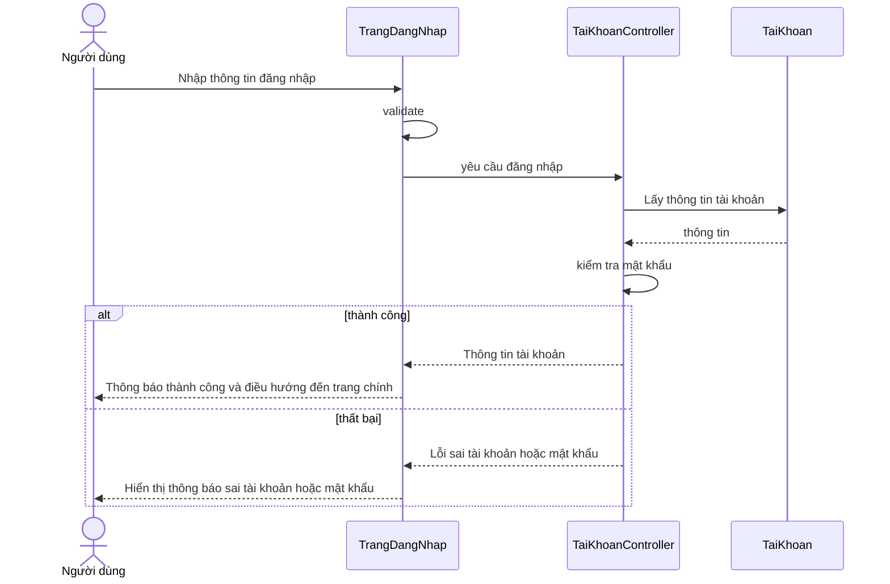
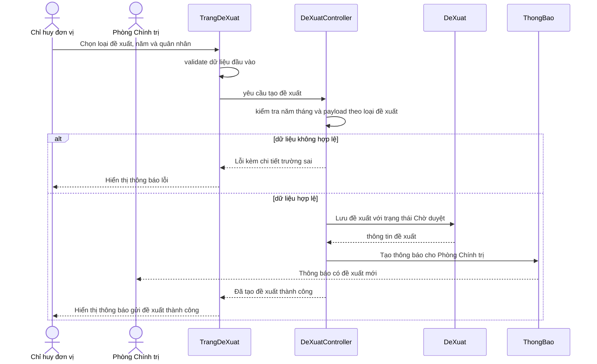
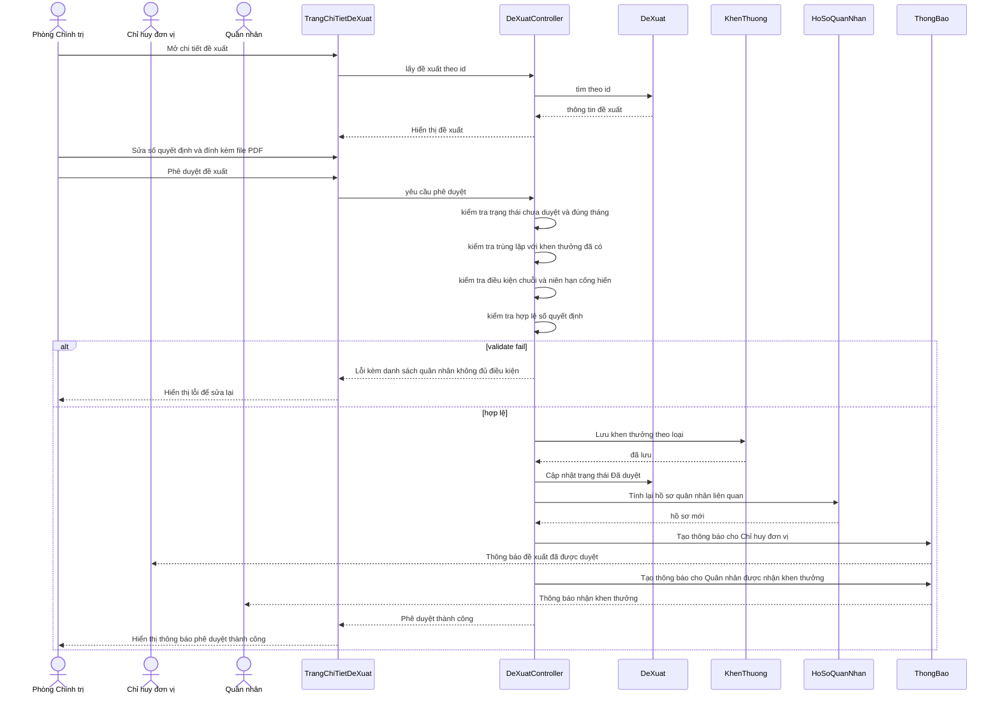
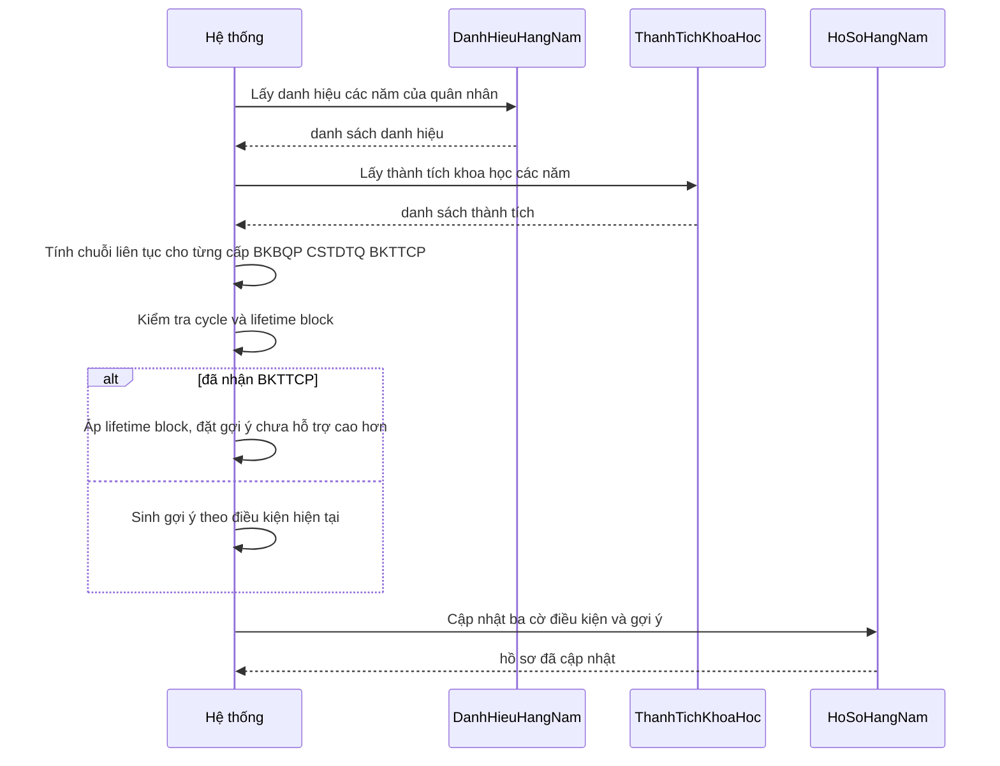
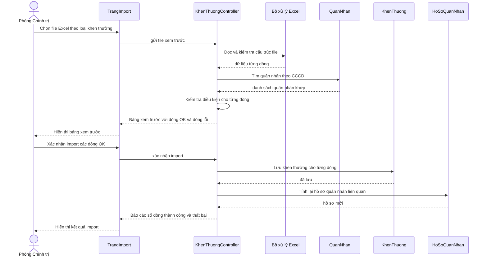
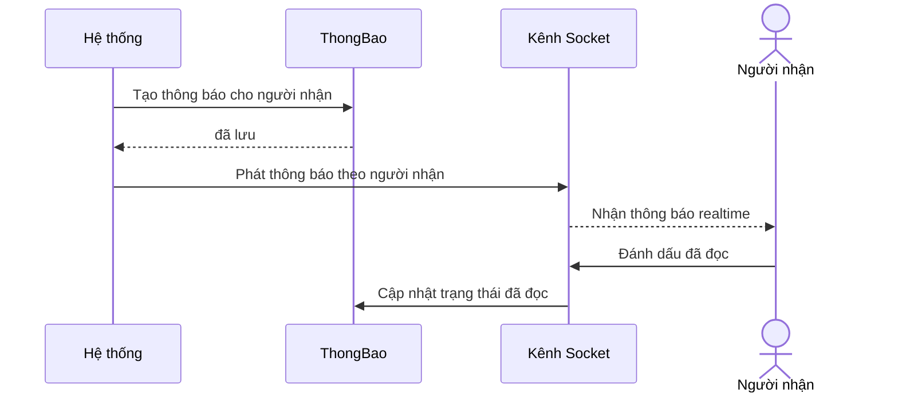
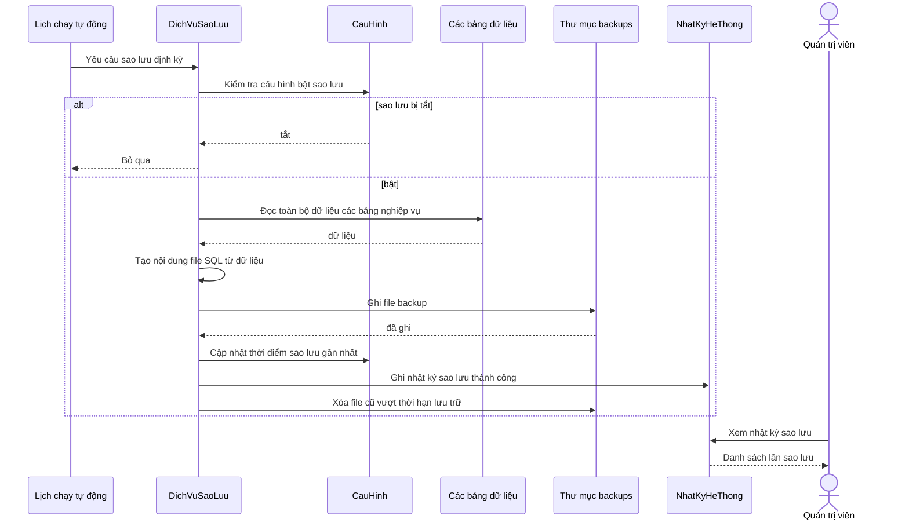

# Sơ đồ Tuần tự (Sequence Diagrams)

> Bám sát style **báo cáo mẫu HUST**: lifeline gồm Actor + Page + Controller + Entity (4–6 lifeline). Message dùng ngôn ngữ nghiệp vụ tiếng Việt (vd: "Nhập thông tin đăng nhập", "Kiểm tra mật khẩu", "Lấy thông tin quân nhân"), tránh từ khóa dev (`verifyToken`, `prisma.$transaction`, ...).

---

## C4.1 — Tuần tự đăng nhập



---

## C4.2 — Tuần tự tạo đề xuất khen thưởng



**Lưu ý**: bước tạo đề xuất **không** chạy kiểm tra điều kiện chuỗi (BKBQP/CSTDTQ/BKTTCP) hay kiểm tra trùng lặp với khen thưởng đã có. Các kiểm tra đó chạy ở bước **phê duyệt** (xem C4.3) qua `runEligibilityChecks` + `runDuplicateChecks` để đảm bảo dữ liệu không bị "stale" giữa lúc Chỉ huy đơn vị tạo và Phòng Chính trị duyệt. Submit chỉ validate cấu trúc payload và năm/tháng hợp lệ.

---

## C4.3 — Tuần tự phê duyệt đề xuất khen thưởng



---

## C4.4 — Tuần tự tính lại điều kiện chuỗi (recalc)



---

## C4.5 — Tuần tự import Excel danh sách khen thưởng



---

## C4.6 — Tuần tự gửi thông báo realtime



---

## C4.7 — Tuần tự xóa đề xuất khen thưởng

```mermaid
sequenceDiagram
    actor Actor as Người xóa
    actor MGR as Chỉ huy đơn vị
    actor ADM as Phòng Chính trị
    participant Page as TrangDeXuat
    participant Ctrl as DeXuatController
    participant DX as DeXuat
    participant TB as ThongBao

    Actor->>Page: Chọn xóa đề xuất
    Page->>Page: xác nhận thao tác
    Page->>Ctrl: yêu cầu xóa đề xuất
    Ctrl->>DX: tìm đề xuất theo id

    alt không tồn tại hoặc đã duyệt
        Ctrl-->>Page: Lỗi không thể xóa
        Page-->>Actor: Hiển thị thông báo lỗi
    else hợp lệ
        Ctrl->>DX: Xóa đề xuất
        DX-->>Ctrl: đã xóa

        Ctrl->>TB: Tạo thông báo cho Phòng Chính trị (trừ người xóa)
        TB-->>ADM: Thông báo đề xuất bị xóa

        opt Phòng Chính trị xóa đề xuất của Chỉ huy đơn vị
            Ctrl->>TB: Tạo thông báo cho Chỉ huy đơn vị đã đề xuất
            TB-->>MGR: Thông báo đề xuất của bạn đã bị xóa
        end

        Ctrl-->>Page: Đã xóa thành công
        Page-->>Actor: Hiển thị thông báo xóa thành công
    end
```

---

## C4.8 — Tuần tự sao lưu dữ liệu theo lịch



---

## Tổng kết

| # | Sequence | Lifeline | Đặc điểm |
|---|---|---|---|
| C4.1 | Đăng nhập | 4 (Người dùng + TrangDangNhap + TaiKhoanController + TaiKhoan) | Có self-call validate + alt thành công thất bại |
| C4.2 | Tạo đề xuất | 5 | Có alt eligibility + thông báo cho Phòng Chính trị |
| C4.3 | Phê duyệt | 7 | 2 actor + alt validate + 2 thông báo (Chỉ huy đơn vị + Quân nhân) |
| C4.4 | Recalc chuỗi | 4 | Background process, có alt lifetime block |
| C4.5 | Import Excel | 6 | 2 bước Preview/Confirm |
| C4.6 | Thông báo realtime | 4 | Pub-sub qua kênh Socket |
| C4.7 | Xóa đề xuất | 7 | 3 actor + alt validate + opt thông báo cho người đề xuất |
| C4.8 | Sao lưu dữ liệu | 7 | Cron + alt bật/tắt |

**Style nguyên tắc** (theo báo cáo mẫu):
- Actor: tên Tiếng Việt nghiệp vụ ("Chỉ huy đơn vị", "Phòng Chính trị", "Quân nhân", "Người dùng")
- Page: PascalCase tiếng Việt theo trang ("TrangDangNhap", "TrangDeXuat", "TrangChiTietDeXuat")
- Controller: PascalCase + suffix Controller ("TaiKhoanController", "DeXuatController", "KhenThuongController")
- Entity: tên model nghiệp vụ ("TaiKhoan", "DeXuat", "KhenThuong", "HoSoQuanNhan", "ThongBao", "DanhHieuHangNam")
- Message: ngắn gọn nghiệp vụ tiếng Việt, không reveal implementation (không nói `prisma.$transaction`, `bcrypt.compare`, `Joi validate`...)
- `alt` cho nhánh thành công/thất bại, có nhãn rõ ràng
