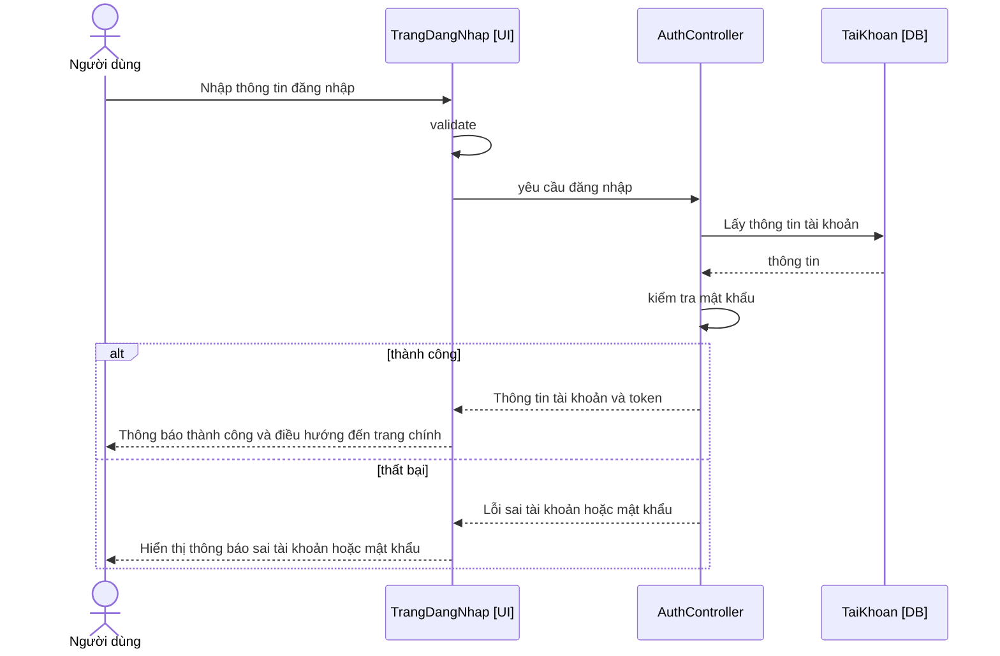
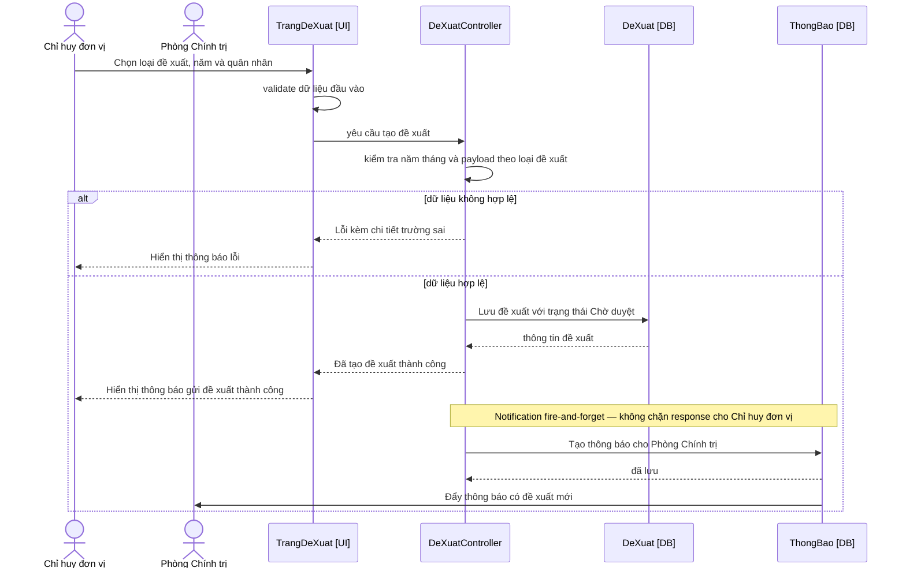
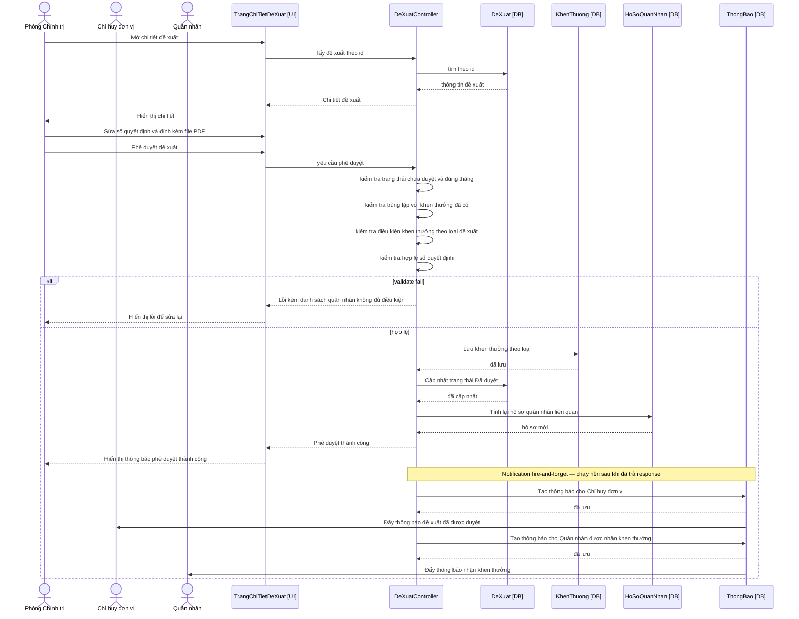
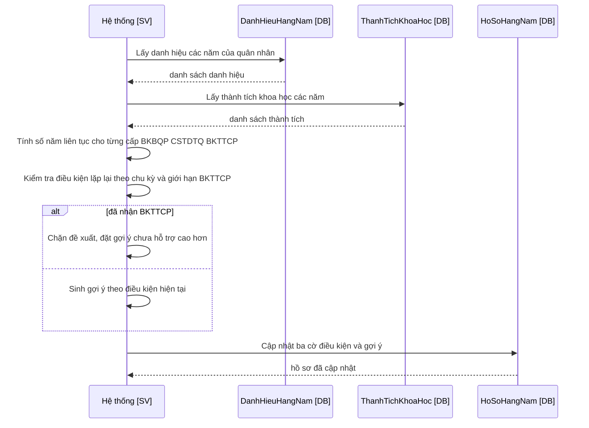
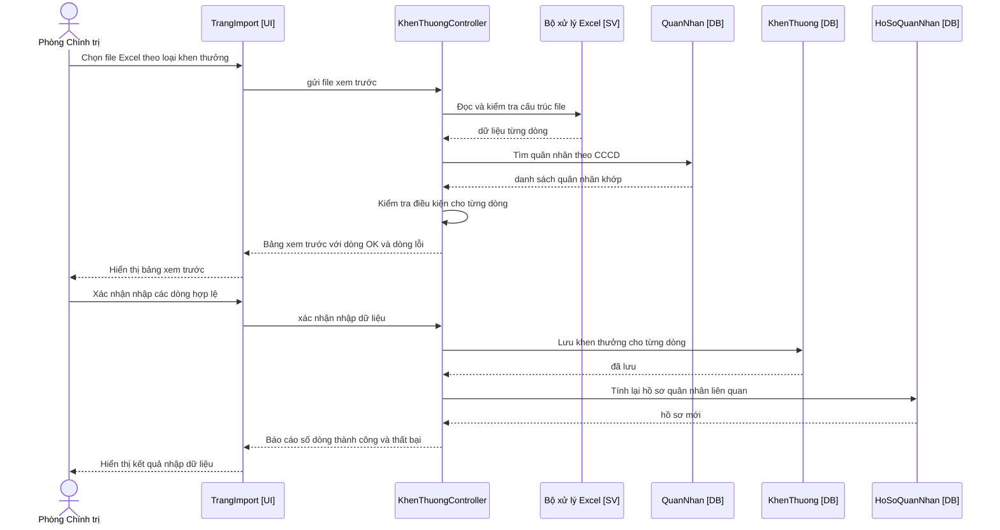
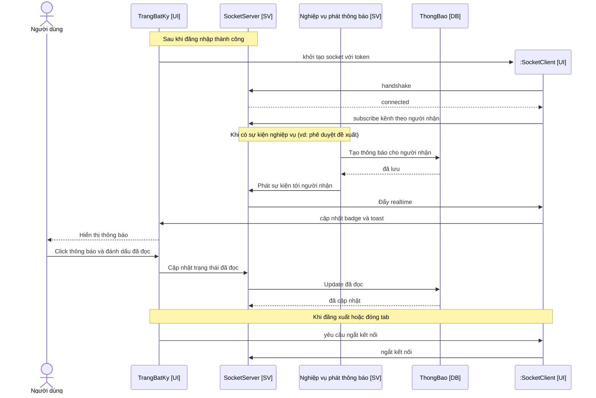

# Sơ đồ Tuần tự (Sequence Diagrams)

> Bám sát style **báo cáo mẫu HUST**: lifeline gồm Actor + Page + Controller + Entity (4–6 lifeline). Message dùng ngôn ngữ nghiệp vụ tiếng Việt (vd: "Nhập thông tin đăng nhập", "Kiểm tra mật khẩu", "Lấy thông tin quân nhân"), tránh từ khóa dev (`verifyToken`, `prisma.$transaction`, ...).
>
> **Quy ước arrow**:
> - `->>` (liền, đầu kín) — sync call, caller đợi reply
> - `-->>` (nét đứt) — reply / return value
> - `->>` không kèm reply ở sau — async push, fire-and-forget (vd: realtime notification)
> - `create participant X` — khởi tạo instance X tại thời điểm đó (vd: Modal mount, Socket connect)
> - `destroy X` — hủy instance X

---

## C4.1 — Tuần tự đăng nhập

```mermaid
sequenceDiagram
    actor User as Người dùng
    participant Page as TrangDangNhap [UI]
    participant Ctrl as AuthController
    participant Acc as TaiKhoan [DB]

    User->>Page: Nhập thông tin đăng nhập
    Page->>Page: validate
    Page->>Ctrl: yêu cầu đăng nhập
    Ctrl->>Acc: Lấy thông tin tài khoản
    Acc-->>Ctrl: thông tin
    Ctrl->>Ctrl: kiểm tra mật khẩu

    alt thành công
        Ctrl-->>Page: Thông tin tài khoản và token
        Page-->>User: Thông báo thành công và điều hướng đến trang chính
    else thất bại
        Ctrl-->>Page: Lỗi sai tài khoản hoặc mật khẩu
        Page-->>User: Hiển thị thông báo sai tài khoản hoặc mật khẩu
    end
```

---

## C4.2 — Tuần tự tạo đề xuất khen thưởng

```mermaid
sequenceDiagram
    actor MGR as Chỉ huy đơn vị
    actor ADM as Phòng Chính trị
    participant Page as TrangDeXuat [UI]
    participant Ctrl as DeXuatController
    participant DX as DeXuat [DB]
    participant TB as ThongBao [DB]

    MGR->>Page: Chọn loại đề xuất, năm và quân nhân
    Page->>Page: validate dữ liệu đầu vào
    Page->>Ctrl: yêu cầu tạo đề xuất
    Ctrl->>Ctrl: kiểm tra năm tháng và payload theo loại đề xuất

    alt dữ liệu không hợp lệ
        Ctrl-->>Page: Lỗi kèm chi tiết trường sai
        Page-->>MGR: Hiển thị thông báo lỗi
    else dữ liệu hợp lệ
        Ctrl->>DX: Lưu đề xuất với trạng thái Chờ duyệt
        DX-->>Ctrl: thông tin đề xuất
        Ctrl-->>Page: Đã tạo đề xuất thành công
        Page-->>MGR: Hiển thị thông báo gửi đề xuất thành công

        Note over Ctrl,TB: Notification fire-and-forget — không chặn response cho Chỉ huy đơn vị
        Ctrl->>TB: Tạo thông báo cho Phòng Chính trị
        TB-->>Ctrl: đã lưu
        TB->>ADM: Đẩy thông báo có đề xuất mới
    end
```

**Lưu ý**:
1. Bước tạo đề xuất **không** chạy kiểm tra điều kiện chuỗi (BKBQP/CSTDTQ/BKTTCP) hay kiểm tra trùng lặp với khen thưởng đã có. Các kiểm tra đó chạy ở bước **phê duyệt** (xem C4.3) qua `runEligibilityChecks` + `runDuplicateChecks` để đảm bảo dữ liệu không bị "stale" giữa lúc Chỉ huy đơn vị tạo và Phòng Chính trị duyệt. Submit chỉ validate cấu trúc payload và năm/tháng hợp lệ.
2. Reply cho Chỉ huy đơn vị **trả về trước** khi notification chạy — vì notification là side-effect fire-and-forget (`void safeNotify` trong code), lỗi gửi thông báo không ảnh hưởng việc tạo đề xuất.

---

## C4.3 — Tuần tự phê duyệt đề xuất khen thưởng

```mermaid
sequenceDiagram
    actor ADM as Phòng Chính trị
    actor MGR as Chỉ huy đơn vị
    actor QN as Quân nhân
    participant Page as TrangChiTietDeXuat [UI]
    participant Ctrl as DeXuatController
    participant DX as DeXuat [DB]
    participant KT as KhenThuong [DB]
    participant HS as HoSoQuanNhan [DB]
    participant TB as ThongBao [DB]

    ADM->>Page: Mở chi tiết đề xuất
    Page->>Ctrl: lấy đề xuất theo id
    Ctrl->>DX: tìm theo id
    DX-->>Ctrl: thông tin đề xuất
    Ctrl-->>Page: Chi tiết đề xuất
    Page-->>ADM: Hiển thị chi tiết

    ADM->>Page: Sửa số quyết định và đính kèm file PDF
    ADM->>Page: Phê duyệt đề xuất
    Page->>Ctrl: yêu cầu phê duyệt
    Ctrl->>Ctrl: kiểm tra trạng thái chưa duyệt và đúng tháng
    Ctrl->>Ctrl: kiểm tra trùng lặp với khen thưởng đã có
    Ctrl->>Ctrl: kiểm tra điều kiện khen thưởng theo loại đề xuất
    Ctrl->>Ctrl: kiểm tra hợp lệ số quyết định

    alt validate fail
        Ctrl-->>Page: Lỗi kèm danh sách quân nhân không đủ điều kiện
        Page-->>ADM: Hiển thị lỗi để sửa lại
    else hợp lệ
        Ctrl->>KT: Lưu khen thưởng theo loại
        KT-->>Ctrl: đã lưu
        Ctrl->>DX: Cập nhật trạng thái Đã duyệt
        DX-->>Ctrl: đã cập nhật
        Ctrl->>HS: Tính lại hồ sơ quân nhân liên quan
        HS-->>Ctrl: hồ sơ mới

        Ctrl-->>Page: Phê duyệt thành công
        Page-->>ADM: Hiển thị thông báo phê duyệt thành công

        Note over Ctrl,TB: Notification fire-and-forget — chạy nền sau khi đã trả response
        Ctrl->>TB: Tạo thông báo cho Chỉ huy đơn vị
        TB-->>Ctrl: đã lưu
        TB->>MGR: Đẩy thông báo đề xuất đã được duyệt
        Ctrl->>TB: Tạo thông báo cho Quân nhân được nhận khen thưởng
        TB-->>Ctrl: đã lưu
        TB->>QN: Đẩy thông báo nhận khen thưởng
    end
```

**Lưu ý**:
1. Toàn bộ block trong `alt hợp lệ` chạy trong **một transaction Prisma** (`prisma.$transaction`) — nếu bất kỳ insert nào fail, toàn bộ rollback, đề xuất giữ trạng thái PENDING. Diagram giản lược không vẽ transaction frame để giữ độ rõ.
2. Reply cho Phòng Chính trị (`Phê duyệt thành công`) **trả về trước** khi notification chạy — admin nhận response ngay, không phải đợi gửi thông báo cho Chỉ huy đơn vị / Quân nhân xong.

---

## C4.4 — Tuần tự tính lại điều kiện khen thưởng

```mermaid
sequenceDiagram
    participant Sys as Hệ thống [SV]
    participant DH as DanhHieuHangNam [DB]
    participant NCKH as ThanhTichKhoaHoc [DB]
    participant HS as HoSoHangNam [DB]

    Sys->>DH: Lấy danh hiệu các năm của quân nhân
    DH-->>Sys: danh sách danh hiệu
    Sys->>NCKH: Lấy thành tích khoa học các năm
    NCKH-->>Sys: danh sách thành tích

    Sys->>Sys: Tính số năm liên tục cho từng cấp BKBQP CSTDTQ BKTTCP
    Sys->>Sys: Kiểm tra điều kiện lặp lại theo chu kỳ và giới hạn BKTTCP

    alt đã nhận BKTTCP
        Sys->>Sys: Chặn đề xuất, đặt gợi ý chưa hỗ trợ cao hơn
    else
        Sys->>Sys: Sinh gợi ý theo điều kiện hiện tại
    end

    Sys->>HS: Cập nhật ba cờ điều kiện và gợi ý
    HS-->>Sys: hồ sơ đã cập nhật
```

---

## C4.5 — Tuần tự nhập danh sách khen thưởng từ Excel

```mermaid
sequenceDiagram
    actor ADM as Phòng Chính trị
    participant Page as TrangImport [UI]
    participant Ctrl as KhenThuongController
    participant Excel as Bộ xử lý Excel [SV]
    participant QN as QuanNhan [DB]
    participant KT as KhenThuong [DB]
    participant HS as HoSoQuanNhan [DB]

    ADM->>Page: Chọn file Excel theo loại khen thưởng
    Page->>Ctrl: gửi file xem trước
    Ctrl->>Excel: Đọc và kiểm tra cấu trúc file
    Excel-->>Ctrl: dữ liệu từng dòng
    Ctrl->>QN: Tìm quân nhân theo CCCD
    QN-->>Ctrl: danh sách quân nhân khớp
    Ctrl->>Ctrl: Kiểm tra điều kiện cho từng dòng
    Ctrl-->>Page: Bảng xem trước với dòng OK và dòng lỗi
    Page-->>ADM: Hiển thị bảng xem trước

    ADM->>Page: Xác nhận nhập các dòng hợp lệ
    Page->>Ctrl: xác nhận nhập dữ liệu
    Ctrl->>KT: Lưu khen thưởng cho từng dòng
    KT-->>Ctrl: đã lưu
    Ctrl->>HS: Tính lại hồ sơ quân nhân liên quan
    HS-->>Ctrl: hồ sơ mới
    Ctrl-->>Page: Báo cáo số dòng thành công và thất bại
    Page-->>ADM: Hiển thị kết quả nhập dữ liệu
```

---

## C4.6 — Tuần tự gửi thông báo realtime (Socket.IO)

```mermaid
sequenceDiagram
    actor User as Người dùng
    participant Page as TrangBatKy [UI]
    participant Server as SocketServer [SV]
    participant Sys as Nghiệp vụ phát thông báo [SV]
    participant TB as ThongBao [DB]

    Note over Page,Server: Sau khi đăng nhập thành công
    create participant Sock as :SocketClient [UI]
    Page->>Sock: khởi tạo socket với token
    Sock->>Server: handshake
    Server-->>Sock: connected
    Sock->>Server: subscribe kênh theo người nhận

    Note over Sys,Server: Khi có sự kiện nghiệp vụ (vd: phê duyệt đề xuất)
    Sys->>TB: Tạo thông báo cho người nhận
    TB-->>Sys: đã lưu
    Sys->>Server: Phát sự kiện tới người nhận
    Server->>Sock: Đẩy realtime
    Sock->>Page: cập nhật badge và toast
    Page-->>User: Hiển thị thông báo

    User->>Page: Click thông báo và đánh dấu đã đọc
    Page->>Server: Cập nhật trạng thái đã đọc
    Server->>TB: Update đã đọc
    TB-->>Server: đã cập nhật

    Note over Page,Sock: Khi đăng xuất hoặc đóng tab
    Page->>Sock: yêu cầu ngắt kết nối
    Sock->>Server: ngắt kết nối
    destroy Sock
```

**Đặc điểm**: lifeline `SocketClient` **được khởi tạo** (`«create»`) ngay sau login và **bị hủy** (`destroy`) khi logout/đóng tab — phản ánh đúng vòng đời connection trong code (`hooks/useSocket.ts` gọi `io()` khi mount, `socket.disconnect()` khi unmount).

---

## C4.7 — Tuần tự xóa đề xuất khen thưởng

```mermaid
sequenceDiagram
    actor Actor as Người xóa
    actor MGR as Chỉ huy đơn vị
    actor ADM as Phòng Chính trị
    participant Page as TrangDeXuat [UI]
    participant Ctrl as DeXuatController
    participant DX as DeXuat [DB]
    participant TB as ThongBao [DB]

    Actor->>Page: Chọn xóa đề xuất
    Page->>Page: xác nhận thao tác
    Page->>Ctrl: yêu cầu xóa đề xuất
    Ctrl->>DX: tìm đề xuất theo id

    alt không tồn tại hoặc đã duyệt
        Ctrl-->>Page: Lỗi không thể xóa
        Page-->>Actor: Hiển thị thông báo lỗi
    else hợp lệ
        Ctrl->>DX: Xóa đề xuất
        DX-->>Ctrl: đã xóa
        Ctrl-->>Page: Đã xóa thành công
        Page-->>Actor: Hiển thị thông báo xóa thành công

        Note over Ctrl,TB: Notification fire-and-forget
        Ctrl->>TB: Tạo thông báo cho Phòng Chính trị (trừ người xóa)
        TB-->>Ctrl: đã lưu
        TB->>ADM: Đẩy thông báo đề xuất bị xóa

        opt Phòng Chính trị xóa đề xuất của Chỉ huy đơn vị
            Ctrl->>TB: Tạo thông báo cho Chỉ huy đơn vị đã đề xuất
            TB-->>Ctrl: đã lưu
            TB->>MGR: Đẩy thông báo đề xuất của bạn đã bị xóa
        end
    end
```

---

## C4.8 — Tuần tự sao lưu dữ liệu theo lịch

```mermaid
sequenceDiagram
    actor SA as Quản trị viên
    participant Page as TrangDevZone [UI]
    participant Ctrl as DevZoneController
    participant Backup as DichVuSaoLuu [SV]
    participant Setting as CauHinh [DB]
    participant Repos as Các bảng dữ liệu [DB]
    participant FS as Thư mục backups [FS]
    participant Log as NhatKyHeThong [DB]

    Note over SA,Ctrl: Bật lịch sao lưu tự động
    SA->>Page: Bật "Sao lưu tự động"
    Page->>Ctrl: yêu cầu bật lịch
    Ctrl->>Setting: Lưu cron_enabled = true
    create participant Cron as :ScheduledTask [Cron]
    Ctrl->>Cron: lên lịch theo biểu thức cron
    Cron-->>Ctrl: task active
    Ctrl-->>Page: đã bật
    Page-->>SA: Hiển thị trạng thái đã bật

    Note over Cron,Backup: Khi đến mốc cron (vd: 01h ngày 1 hằng tháng)
    loop Mỗi chu kỳ cron
        Cron->>Backup: Yêu cầu sao lưu định kỳ
        Backup->>Setting: Kiểm tra cấu hình bật sao lưu

        alt sao lưu bị tắt
            Setting-->>Backup: tắt
            Backup-->>Cron: Bỏ qua
        else bật
            Backup->>Repos: Đọc toàn bộ dữ liệu các bảng nghiệp vụ
            Repos-->>Backup: dữ liệu
            Backup->>Backup: Tạo nội dung file SQL
            Backup->>FS: Ghi file backup
            FS-->>Backup: đã ghi
            Backup->>Setting: Cập nhật thời điểm sao lưu gần nhất
            Backup->>Log: Ghi nhật ký sao lưu thành công
            Backup->>FS: Xóa file cũ vượt thời hạn lưu trữ
        end
    end

    Note over SA,Cron: Tắt lịch
    SA->>Page: Tắt "Sao lưu tự động"
    Page->>Ctrl: yêu cầu tắt lịch
    Ctrl->>Cron: dừng task
    destroy Cron
    Ctrl->>Setting: Lưu cron_enabled = false
    Ctrl-->>Page: đã tắt
    Page-->>SA: Hiển thị trạng thái đã tắt

    Note over SA,Log: Xem nhật ký
    SA->>Log: Xem nhật ký sao lưu
    Log-->>SA: Danh sách lần sao lưu
```

**Đặc điểm**: lifeline `ScheduledTask` **được tạo** khi SA bật lịch và **bị hủy** khi tắt — phản ánh `node-cron.schedule()` / `task.stop()` trong `routes/devZone.route.ts`.

---

## C4.9 — Tuần tự thêm khen thưởng đột xuất

```mermaid
sequenceDiagram
    actor ADM as Phòng Chính trị
    actor MGR as Chỉ huy đơn vị
    actor QN as Quân nhân
    participant Page as TrangKhenThuongDotXuat [UI]
    participant Ctrl as KhenThuongDotXuatController
    participant Quan as QuanNhan [DB]
    participant DV as DonVi [DB]
    participant KT as KhenThuongDotXuat [DB]
    participant FS as Thư mục files [FS]
    participant TB as ThongBao [DB]

    ADM->>Page: Click "Thêm khen thưởng đột xuất"
    create participant Modal as :ModalThemKhenThuong [UI]
    Page->>Modal: mở modal
    Modal->>Ctrl: lấy danh sách quân nhân và đơn vị
    Ctrl->>Quan: Lấy danh sách quân nhân
    Quan-->>Ctrl: danh sách
    Ctrl->>DV: Lấy danh sách đơn vị
    DV-->>Ctrl: danh sách
    Ctrl-->>Modal: dữ liệu chọn
    Modal-->>ADM: Hiển thị form

    ADM->>Modal: Chọn loại đối tượng cá nhân hoặc tập thể, danh hiệu, lý do
    ADM->>Modal: Đính kèm file quyết định PDF
    ADM->>Modal: Submit
    Modal->>Modal: validate dữ liệu đầu vào
    Modal->>Ctrl: yêu cầu tạo khen thưởng đột xuất
    Ctrl->>Ctrl: kiểm tra cấu trúc dữ liệu và loại đối tượng

    alt validate fail
        Ctrl-->>Modal: Lỗi kèm chi tiết trường sai
        Modal-->>ADM: Hiển thị lỗi sửa lại
    else hợp lệ
        Ctrl->>FS: Lưu file quyết định
        FS-->>Ctrl: đường dẫn file
        Ctrl->>KT: Lưu khen thưởng đột xuất
        KT-->>Ctrl: đã lưu

        Ctrl-->>Modal: Tạo thành công
        Modal->>Page: thông báo thành công
        Page->>Modal: đóng modal
        destroy Modal
        Page->>Page: refresh danh sách
        Page-->>ADM: Hiển thị "Đã thêm" và danh sách mới

        Note over Ctrl,TB: Notification fire-and-forget
        alt khen thưởng cá nhân
            Ctrl->>TB: Tạo thông báo cho Quân nhân nhận khen thưởng
            TB-->>Ctrl: đã lưu
            TB->>QN: Đẩy thông báo nhận khen thưởng đột xuất
            Ctrl->>TB: Tạo thông báo cho Chỉ huy đơn vị của Quân nhân
            TB-->>Ctrl: đã lưu
            TB->>MGR: Đẩy thông báo quân nhân trong đơn vị được khen thưởng
        else khen thưởng tập thể (đơn vị)
            Ctrl->>TB: Tạo thông báo cho Chỉ huy đơn vị
            TB-->>Ctrl: đã lưu
            TB->>MGR: Đẩy thông báo đơn vị được khen thưởng đột xuất
        end
    end
```

**Đặc điểm**:
1. **Modal lifecycle với «create» / `destroy`**: `ModalThemKhenThuong` chỉ tồn tại từ khi ADM click "Thêm" đến khi Submit thành công hoặc Cancel — phản ánh React component mount/unmount động (`CreateAdhocAwardModal.tsx`).
2. **Khác đề xuất thông thường**: ADMIN tạo trực tiếp, không qua bước MANAGER đề xuất rồi ADMIN duyệt (3 cấp). Đây là khen thưởng theo sự kiện / chiến công cần ghi nhận tức thì.
3. **Không qua bảng `BangDeXuat`**: ghi thẳng vào `KhenThuongDotXuat` riêng — không có trạng thái PENDING/APPROVED.
4. **Phân nhánh recipient**: cá nhân → thông báo cho Quân nhân + Chỉ huy đơn vị; tập thể → chỉ thông báo Chỉ huy đơn vị.

---

## Tổng kết

| # | Sequence | Lifeline | Đặc điểm |
|---|---|---|---|
| C4.1 | Đăng nhập | 4 (Người dùng + TrangDangNhap + AuthController + TaiKhoan) | Có self-call validate + alt thành công/thất bại |
| C4.2 | Tạo đề xuất | 6 | alt validate + notification fire-and-forget sau response |
| C4.3 | Phê duyệt | 8 | 3 actor + alt validate + 2 cặp create-push thông báo |
| C4.4 | Recalc chuỗi | 4 | Background process, có alt lifetime block |
| C4.5 | Import Excel | 6 | 2 bước Preview/Confirm |
| C4.6 | Thông báo realtime | 6 | **`«create»/destroy` SocketClient** theo session login |
| C4.7 | Xóa đề xuất | 7 | 3 actor + alt validate + opt thông báo cho người đề xuất |
| C4.8 | Sao lưu dữ liệu | 9 | **`«create»/destroy` ScheduledTask** + loop cron |
| C4.9 | Thêm khen thưởng đột xuất | 9 | **`«create»/destroy` Modal** + alt cá nhân/tập thể |

**Style nguyên tắc** (theo báo cáo mẫu):
- Actor: tên Tiếng Việt nghiệp vụ ("Chỉ huy đơn vị", "Phòng Chính trị", "Quân nhân", "Người dùng")
- Page: PascalCase tiếng Việt theo trang ("TrangDangNhap", "TrangDeXuat", "TrangChiTietDeXuat", "TrangKhenThuongDotXuat")
- Controller: PascalCase + suffix Controller ("AuthController", "DeXuatController", "KhenThuongController", "KhenThuongDotXuatController", "DevZoneController")
- Entity: tên model nghiệp vụ ("TaiKhoan", "DeXuat", "KhenThuong", "KhenThuongDotXuat", "HoSoQuanNhan", "ThongBao", "DanhHieuHangNam")
- Message: ngắn gọn nghiệp vụ tiếng Việt, không reveal implementation (không nói `prisma.$transaction`, `bcrypt.compare`, `Joi validate`...)
- `alt` cho nhánh thành công/thất bại, có nhãn rõ ràng
- `opt` cho điều kiện optional (vd: chỉ chạy khi điều kiện cụ thể)
- `loop` cho chu kỳ lặp (vd: cron tick, for each personnel)
- `Note over X,Y` cho ghi chú nội dung quan trọng (vd: transaction boundary, fire-and-forget)

**Khi nào dùng `«create»` / `destroy`**:
- Lifeline có **vòng đời rõ ràng** trong sequence (mount/unmount, connect/disconnect, schedule/stop)
- C4.6 — SocketClient (login → logout)
- C4.8 — ScheduledTask (enable cron → disable cron)
- C4.9 — Modal (open → close)
- **Không dùng** cho entity DB (Prisma model luôn tồn tại — chỉ insert row, không tạo object mới)

**Notification fire-and-forget pattern**:
Tất cả notification (`Ctrl → TB → User`) **chạy sau** khi đã trả response cho actor gốc (`Ctrl-->>Page-->>Actor`). Phản ánh `void safeNotify(...)` trong `proposal.controller.ts` và `void (async () => {...})()` trong `awardBulk.service.ts` — lỗi gửi thông báo **không ảnh hưởng** kết quả nghiệp vụ. Diagram đặt block notification ở **sau reply chain** + kèm `Note over` để diễn tả intent.
