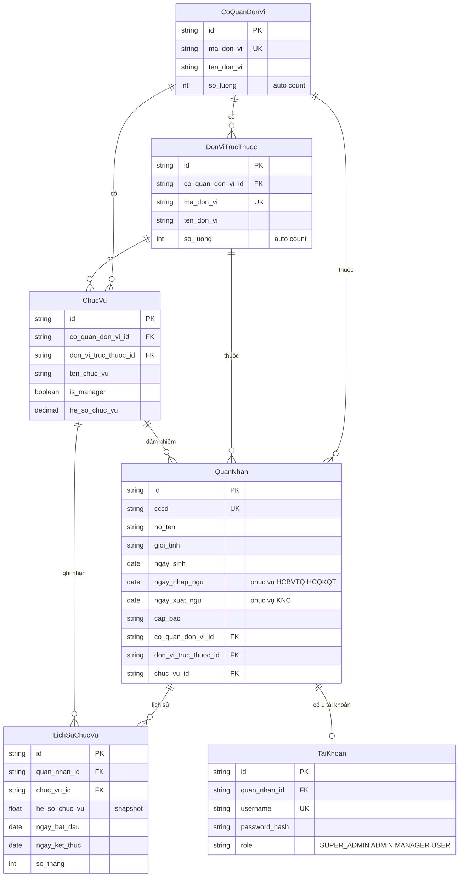
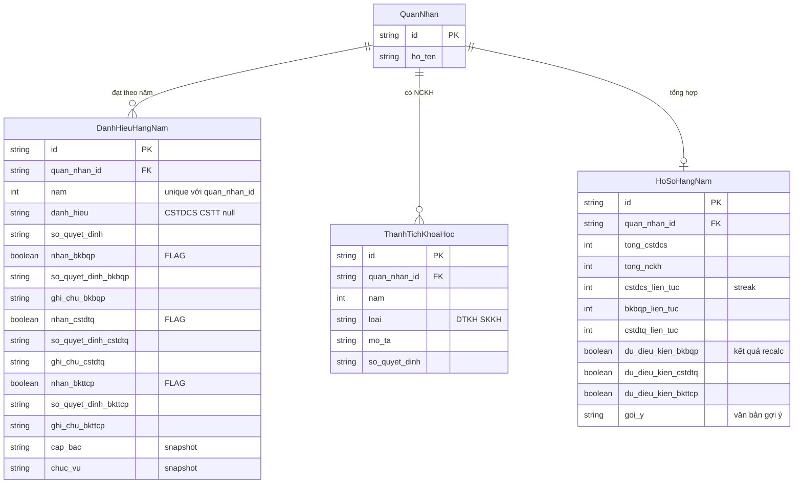
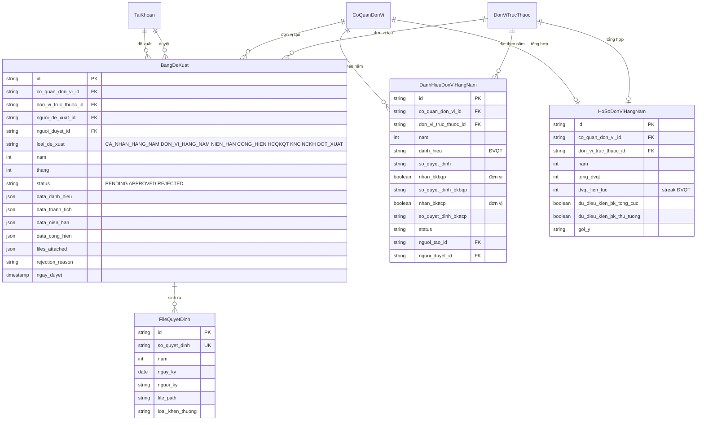
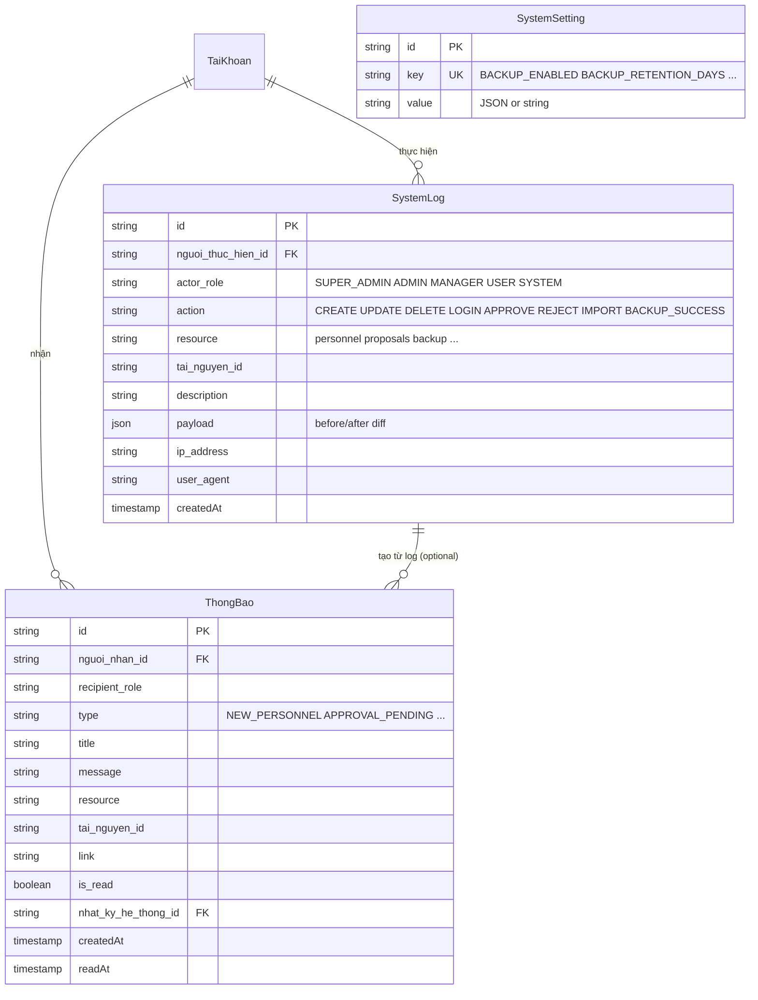

# Sơ đồ Cơ sở Dữ liệu (ERD)

> Mermaid hỗ trợ `erDiagram` với 3 ký hiệu quan hệ: `||--o{` (1-N), `||--||` (1-1), `}o--o{` (N-N). Toàn bộ entity được lấy đúng từ `BE-QLKT/prisma/schema.prisma` (23 model).
>
> **Lưu ý render**: ERD lớn có thể bị tràn trên mermaid.live. Bạn có thể tách 6 sơ đồ con (C5.2 → C5.5) để render riêng từng module, sau đó ghép trong báo cáo.

---

## C5.1 — ERD tổng thể (toàn bộ 23 entity)

```mermaid
erDiagram
    CoQuanDonVi ||--o{ DonViTrucThuoc : "1-N"
    CoQuanDonVi ||--o{ ChucVu : "1-N"
    CoQuanDonVi ||--o{ QuanNhan : "1-N"
    CoQuanDonVi ||--o{ BangDeXuat : "1-N"
    CoQuanDonVi ||--o{ DanhHieuDonViHangNam : "1-N"
    CoQuanDonVi ||--o{ HoSoDonViHangNam : "1-N"
    CoQuanDonVi ||--o{ KhenThuongDotXuat : "1-N"

    DonViTrucThuoc ||--o{ ChucVu : "1-N"
    DonViTrucThuoc ||--o{ QuanNhan : "1-N"
    DonViTrucThuoc ||--o{ BangDeXuat : "1-N"
    DonViTrucThuoc ||--o{ DanhHieuDonViHangNam : "1-N"
    DonViTrucThuoc ||--o{ HoSoDonViHangNam : "1-N"
    DonViTrucThuoc ||--o{ KhenThuongDotXuat : "1-N"

    ChucVu ||--o{ QuanNhan : "1-N"
    ChucVu ||--o{ LichSuChucVu : "1-N"

    QuanNhan ||--o| TaiKhoan : "1-1"
    QuanNhan ||--o{ LichSuChucVu : "1-N"
    QuanNhan ||--o{ ThanhTichKhoaHoc : "1-N"
    QuanNhan ||--o{ DanhHieuHangNam : "1-N"
    QuanNhan ||--o| KhenThuongHCBVTQ : "1-1"
    QuanNhan ||--o{ KhenThuongHCCSVV : "1-N"
    QuanNhan ||--o{ KhenThuongDotXuat : "1-N"
    QuanNhan ||--o| HuanChuongQuanKyQuyetThang : "1-1"
    QuanNhan ||--o| KyNiemChuongVSNXDQDNDVN : "1-1"
    QuanNhan ||--o| HoSoNienHan : "1-1"
    QuanNhan ||--o| HoSoCongHien : "1-1"
    QuanNhan ||--o| HoSoHangNam : "1-1"

    TaiKhoan ||--o{ SystemLog : "thực hiện"
    TaiKhoan ||--o{ BangDeXuat : "đề xuất"
    TaiKhoan ||--o{ BangDeXuat : "duyệt"
    TaiKhoan ||--o{ ThongBao : "nhận"

    SystemLog ||--o{ ThongBao : "tạo từ log"

    CoQuanDonVi {
        string id PK
        string ma_don_vi UK
        string ten_don_vi
        int so_luong
        timestamp createdAt
        timestamp updatedAt
    }
    DonViTrucThuoc {
        string id PK
        string co_quan_don_vi_id FK
        string ma_don_vi UK
        string ten_don_vi
        int so_luong
    }
    ChucVu {
        string id PK
        string co_quan_don_vi_id FK
        string don_vi_truc_thuoc_id FK
        string ten_chuc_vu
        boolean is_manager
        decimal he_so_chuc_vu
    }
    QuanNhan {
        string id PK
        string cccd UK
        string ho_ten
        string gioi_tinh
        date ngay_sinh
        date ngay_nhap_ngu
        date ngay_xuat_ngu
        string cap_bac
        string co_quan_don_vi_id FK
        string don_vi_truc_thuoc_id FK
        string chuc_vu_id FK
    }
    TaiKhoan {
        string id PK
        string quan_nhan_id FK
        string username UK
        string password_hash
        string role
        string refreshToken
    }
    LichSuChucVu {
        string id PK
        string quan_nhan_id FK
        string chuc_vu_id FK
        float he_so_chuc_vu
        date ngay_bat_dau
        date ngay_ket_thuc
        int so_thang
    }
    ThanhTichKhoaHoc {
        string id PK
        string quan_nhan_id FK
        int nam
        string loai
        string mo_ta
        string so_quyet_dinh
    }
    DanhHieuHangNam {
        string id PK
        string quan_nhan_id FK
        int nam
        string danh_hieu
        boolean nhan_bkbqp
        boolean nhan_cstdtq
        boolean nhan_bkttcp
        string so_quyet_dinh
    }
    KhenThuongHCBVTQ {
        string id PK
        string quan_nhan_id FK
        string danh_hieu
        int nam
        int thang
        json thoi_gian_nhom_0_7
        json thoi_gian_nhom_0_8
        json thoi_gian_nhom_0_9_1_0
    }
    HuanChuongQuanKyQuyetThang {
        string id PK
        string quan_nhan_id FK
        int nam
        int thang
        json thoi_gian
    }
    KyNiemChuongVSNXDQDNDVN {
        string id PK
        string quan_nhan_id FK
        int nam
        int thang
        json thoi_gian
    }
    KhenThuongHCCSVV {
        string id PK
        string quan_nhan_id FK
        string danh_hieu
        int nam
        int thang
        json thoi_gian
    }
    KhenThuongDotXuat {
        string id PK
        string doi_tuong
        string quan_nhan_id FK
        string co_quan_don_vi_id FK
        string don_vi_truc_thuoc_id FK
        string hinh_thuc_khen_thuong
        int nam
        json files_dinh_kem
    }
    HoSoNienHan {
        string id PK
        string quan_nhan_id FK
        string hccsvv_hang_ba_status
        string hccsvv_hang_nhi_status
        string hccsvv_hang_nhat_status
        string goi_y
    }
    HoSoCongHien {
        string id PK
        string quan_nhan_id FK
        int hcbvtq_total_months
        int months_07
        int months_08
        int months_0910
        string hcbvtq_hang_ba_status
        string hcbvtq_hang_nhi_status
        string hcbvtq_hang_nhat_status
        string goi_y
    }
    HoSoHangNam {
        string id PK
        string quan_nhan_id FK
        int tong_cstdcs
        int tong_nckh
        int cstdcs_lien_tuc
        int bkbqp_lien_tuc
        int cstdtq_lien_tuc
        boolean du_dieu_kien_bkbqp
        boolean du_dieu_kien_cstdtq
        boolean du_dieu_kien_bkttcp
        string goi_y
    }
    SystemLog {
        string id PK
        string nguoi_thuc_hien_id FK
        string actor_role
        string action
        string resource
        string tai_nguyen_id
        string description
        json payload
        string ip_address
    }
    ThongBao {
        string id PK
        string nguoi_nhan_id FK
        string recipient_role
        string type
        string title
        string message
        string resource
        boolean is_read
        string nhat_ky_he_thong_id FK
    }
    BangDeXuat {
        string id PK
        string co_quan_don_vi_id FK
        string don_vi_truc_thuoc_id FK
        string nguoi_de_xuat_id FK
        string nguoi_duyet_id FK
        string loai_de_xuat
        int nam
        int thang
        string status
        json data_danh_hieu
        json data_thanh_tich
        json data_nien_han
        json data_cong_hien
        json files_attached
        string rejection_reason
    }
    HoSoDonViHangNam {
        string id PK
        string co_quan_don_vi_id FK
        string don_vi_truc_thuoc_id FK
        int nam
        int tong_dvqt
        int dvqt_lien_tuc
        boolean du_dieu_kien_bk_tong_cuc
        boolean du_dieu_kien_bk_thu_tuong
        string goi_y
    }
    DanhHieuDonViHangNam {
        string id PK
        string co_quan_don_vi_id FK
        string don_vi_truc_thuoc_id FK
        int nam
        string danh_hieu
        boolean nhan_bkbqp
        boolean nhan_bkttcp
        string status
        string nguoi_tao_id FK
        string nguoi_duyet_id FK
    }
    FileQuyetDinh {
        string id PK
        string so_quyet_dinh UK
        int nam
        date ngay_ky
        string nguoi_ky
        string file_path
        string loai_khen_thuong
    }
    SystemSetting {
        string id PK
        string key UK
        string value
    }
```

---

## C5.2 — ERD module Hồ sơ quân nhân (Quân nhân + Đơn vị + Chức vụ)

**Đặc thù**: 1 quân nhân có thể có **nhiều bản ghi `LichSuChucVu`** — phục vụ tính 120 tháng cống hiến với hệ số 0.7/0.8/0.9/1.0 cho HCBVTQ.

---

## C5.3 — ERD module Khen thưởng cá nhân hằng năm (chain BKBQP/CSTDTQ/BKTTCP)

**Đặc thù**: Bảng `DanhHieuHangNam` vừa là INPUT (lưu danh hiệu CSTDCS/CSTT theo năm) vừa là OUTPUT (lưu flag `nhan_bkbqp/cstdtq/bkttcp` khi đã nhận chuỗi). Bảng `HoSoHangNam` lưu **kết quả recalc** — cờ `du_dieu_kien_*` được tính tự động bởi `recalculateAnnualProfile()`.

---

## C5.4 — ERD module 5 loại huân/huy chương riêng

```mermaid
erDiagram
    QuanNhan ||--o| KhenThuongHCBVTQ : "1 lần (HCBVTQ cống hiến)"
    QuanNhan ||--o{ KhenThuongHCCSVV : "3 hạng (HCCSVV niên hạn)"
    QuanNhan ||--o| HuanChuongQuanKyQuyetThang : "1 lần"
    QuanNhan ||--o| KyNiemChuongVSNXDQDNDVN : "1 lần"
    QuanNhan ||--o{ KhenThuongDotXuat : "nhiều lần"
    CoQuanDonVi ||--o{ KhenThuongDotXuat : "tập thể"
    DonViTrucThuoc ||--o{ KhenThuongDotXuat : "tập thể"
    QuanNhan ||--o| HoSoNienHan : "tổng hợp HCCSVV"
    QuanNhan ||--o| HoSoCongHien : "tổng hợp HCBVTQ"

    QuanNhan {
        string id PK
        string ho_ten
        date ngay_nhap_ngu
        date ngay_xuat_ngu
    }
    KhenThuongHCBVTQ {
        string id PK
        string quan_nhan_id FK
        string danh_hieu "HCBVTQ_HANG_BA NHI NHAT"
        int nam
        int thang
        json thoi_gian_nhom_0_7
        json thoi_gian_nhom_0_8
        json thoi_gian_nhom_0_9_1_0
    }
    KhenThuongHCCSVV {
        string id PK
        string quan_nhan_id FK
        string danh_hieu "HCCSVV_HANG_BA NHI NHAT"
        int nam
        int thang
        json thoi_gian
    }
    HuanChuongQuanKyQuyetThang {
        string id PK
        string quan_nhan_id FK
        int nam
        int thang
        json thoi_gian "tính từ ngày nhập ngũ"
    }
    KyNiemChuongVSNXDQDNDVN {
        string id PK
        string quan_nhan_id FK
        int nam
        int thang
        json thoi_gian "20 năm nữ 25 năm nam đến ngày xuất ngũ"
    }
    KhenThuongDotXuat {
        string id PK
        string doi_tuong "CA_NHAN TAP_THE"
        string quan_nhan_id FK
        string co_quan_don_vi_id FK
        string don_vi_truc_thuoc_id FK
        string hinh_thuc_khen_thuong
        int nam
        json files_dinh_kem
    }
    HoSoNienHan {
        string id PK
        string quan_nhan_id FK
        string hccsvv_hang_ba_status
        date hccsvv_hang_ba_ngay
        string hccsvv_hang_nhi_status
        string hccsvv_hang_nhat_status
        string goi_y
    }
    HoSoCongHien {
        string id PK
        string quan_nhan_id FK
        int hcbvtq_total_months
        int months_07
        int months_08
        int months_0910
        string hcbvtq_hang_ba_status
        string hcbvtq_hang_nhi_status
        string hcbvtq_hang_nhat_status
        string goi_y
    }
```

**Cardinality đặc thù**:
- `KhenThuongHCBVTQ`, `HCQKQT`, `KNC`: **1-1 với QuanNhan** (1 lần duy nhất, lifetime)
- `KhenThuongHCCSVV`: **1-N** (3 hạng — Ba/Nhì/Nhất, có thể nhận từng hạng theo niên hạn 10/15/20 năm)
- `KhenThuongDotXuat`: **1-N**, có cả CA_NHAN (FK quan_nhan_id) và TAP_THE (FK co_quan_don_vi_id hoặc don_vi_truc_thuoc_id)

---

## C5.5 — ERD module Đề xuất khen thưởng & Khen thưởng đơn vị

**Đặc thù `BangDeXuat`**: 1 bảng duy nhất chứa **7 loại đề xuất** đi qua flow duyệt (qua `loai_de_xuat`). Dữ liệu cụ thể của từng loại lưu trong các JSON column khác nhau (`data_danh_hieu`, `data_thanh_tich`, `data_nien_han`, `data_cong_hien`). Strategy pattern ở backend dispatch theo `loai_de_xuat`. Khen thưởng đột xuất (DOT_XUAT) **không** dùng bảng này — có bảng riêng `KhenThuongDotXuat` (xem A1.9).

---

## C5.6 — ERD module Audit log + Notification + System Setting

**Đặc thù**: `SystemLog` có **role-based visibility** — log với `resource: 'backup'` chỉ SUPER_ADMIN xem được (filter ở `systemLogs.service.ts.getLogs()`).

---

## Tóm tắt số bảng

| Module | Số bảng | Tham chiếu Prisma model |
|---|---|---|
| Hồ sơ quân nhân (C5.2) | 6 | CoQuanDonVi, DonViTrucThuoc, ChucVu, QuanNhan, LichSuChucVu, TaiKhoan |
| Khen thưởng cá nhân hằng năm (C5.3) | 4 | DanhHieuHangNam, ThanhTichKhoaHoc, HoSoHangNam (+ QuanNhan) |
| 5 loại huân huy chương (C5.4) | 7 | KhenThuongHCBVTQ, KhenThuongHCCSVV, HCQKQT, KNC, KhenThuongDotXuat, HoSoNienHan, HoSoCongHien |
| Đề xuất + Đơn vị (C5.5) | 4 | BangDeXuat, DanhHieuDonViHangNam, HoSoDonViHangNam, FileQuyetDinh |
| Audit + Notification + Setting (C5.6) | 3 | SystemLog, ThongBao, SystemSetting |
| **Tổng** | **23 model Prisma** (cộng QuanNhan dùng chung) | |

→ Báo cáo mẫu HRM có 14 bảng. PM QLKT của bạn có **23 bảng** — gấp 1.6 lần. Đây là một trong những điểm dễ defend "hệ thống nghiệp vụ phức tạp".

---

## Bảng data dictionary chi tiết (cho báo cáo)

> Mỗi bảng trên cần thêm 1 bảng Markdown chi tiết (Bảng 4.1, Bảng 4.2, ...) với các cột: **Thuộc tính / Kiểu dữ liệu / Ý nghĩa**. Tham khảo format ở `slide-content.md` hoặc copy template từ báo cáo mẫu.
>
> Ưu tiên 12 bảng quan trọng nhất:
> 1. Bảng `QuanNhan`
> 2. Bảng `TaiKhoan`
> 3. Bảng `CoQuanDonVi` + `DonViTrucThuoc`
> 4. Bảng `LichSuChucVu`
> 5. Bảng `DanhHieuHangNam`
> 6. Bảng `HoSoHangNam`
> 7. Bảng `KhenThuongHCBVTQ` + `HoSoCongHien`
> 8. Bảng `KhenThuongHCCSVV` + `HoSoNienHan`
> 9. Bảng `BangDeXuat`
> 10. Bảng `DanhHieuDonViHangNam` + `HoSoDonViHangNam`
> 11. Bảng `SystemLog`
> 12. Bảng `ThongBao`
