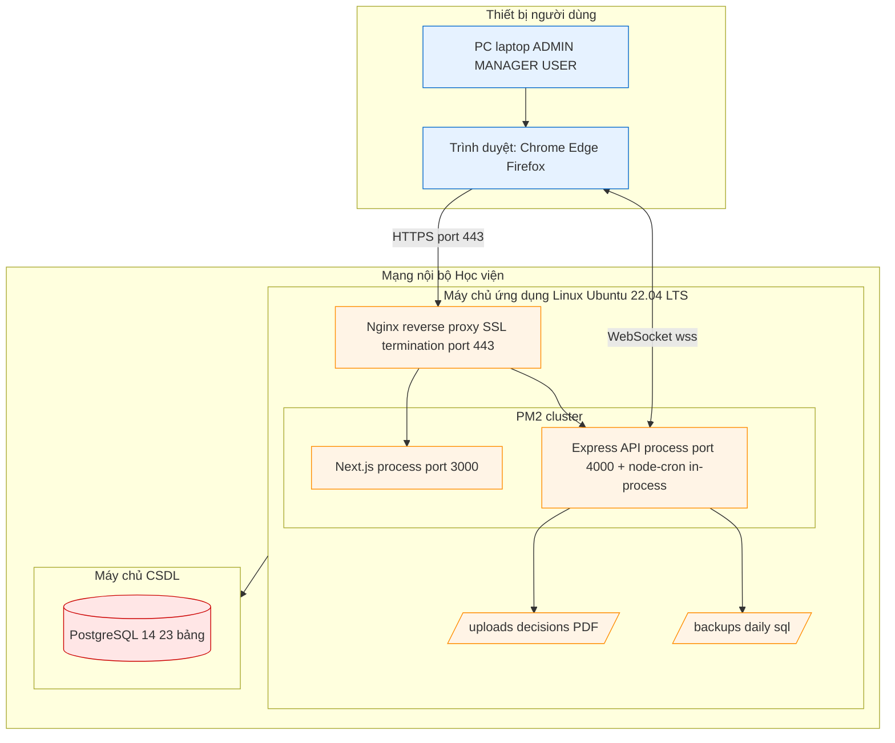
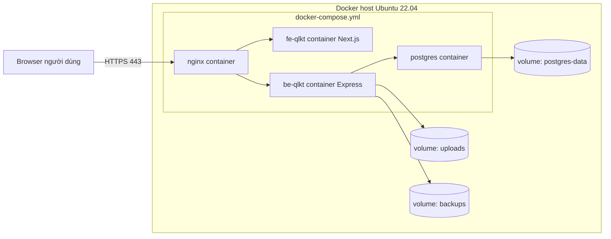

# Sơ đồ Triển khai (Deployment Diagram)

> Mermaid không có syntax UML Deployment thuần — dùng `flowchart` với `subgraph` để biểu diễn các node (server/máy chủ/thiết bị).

---

## C8.1 — Deployment diagram tổng thể



---

## C8.2 — Mô tả thành phần

### Thiết bị người dùng
- **PC / laptop**: Thiết bị nội bộ của các vai trò SUPER_ADMIN / ADMIN / MANAGER / USER trong Phòng QLKT
- **Trình duyệt**: Khuyến nghị Chrome 120+, Edge 120+, Firefox 120+ (hỗ trợ ES2020 + WebSocket)

### Máy chủ ứng dụng (App Server)
- **OS**: Ubuntu 22.04 LTS (giả định)
- **Nginx**: Reverse proxy + SSL termination (cấp cert nội bộ hoặc Let's Encrypt nếu domain public)
  - Public port 443 (HTTPS) + 80 (redirect)
  - Forward request `/` → Next.js (port 3000)
  - Forward request `/api/*` và `/socket.io/*` → Express (port 4000)
- **PM2**: Process manager với `ecosystem.config.js` (file đã có ở root project)
  - **Next.js process** (`fe-qlkt`): chạy `node_modules/.bin/next start`, port 3000, render UI + route groups `app/{admin,manager,user}/*`
  - **Express API process** (`be-qlkt`): chạy `dist/index.js` (đã build từ TS), port 4000, REST + Socket.IO server + audit log + notification + `node-cron` in-process
- **File system** (paths tương đối với BE-QLKT):
  - `uploads/decisions/`: file PDF quyết định (multer disk storage). Excel import dùng `memoryStorage` không ghi đĩa.
  - `backups/`: file SQL backup hằng ngày sinh bởi `backup.service.ts` qua `pg_dump` (giữ N ngày theo `SystemSetting.BACKUP_RETENTION_DAYS`)

### Máy chủ CSDL (DB Server)
- **PostgreSQL 14+**: 23 bảng theo `prisma/schema.prisma`
- Có thể deploy cùng máy với App Server (single-node) hoặc tách máy riêng (cluster) tùy quy mô
- Backup file `.sql` được lưu trên App Server qua `pg_dump`

### Mạng
- **HTTPS port 443**: kết nối client ↔ Nginx
- **WebSocket WSS**: kết nối client ↔ Express qua Socket.IO (cho thông báo realtime)
- Toàn bộ chạy trong **mạng nội bộ Học viện** (LAN), không expose ra internet để đáp ứng yêu cầu bảo mật quân đội

---

## C8.3 — Tùy chọn deploy nâng cao (Docker Compose)

> Đây là **option** nếu bạn muốn defend thêm phần "deploy production-ready". Không bắt buộc.



**Lợi ích**:
- One-command deploy: `docker compose up -d`
- Isolation: mỗi service trong container riêng
- Dễ backup: copy volume `postgres-data`, `uploads`, `backups`
- Dễ migrate: pull image mới + `docker compose up -d --no-deps fe-qlkt be-qlkt`

**Trade-off**:
- Thêm overhead bộ nhớ ~200MB (4 container)
- Cần học Docker (có thể là lợi thế khi defend "biết DevOps cơ bản")

---

## C8.4 — Mô tả file `ecosystem.config.js` (PM2)

Nội dung thực tế của file `ecosystem.config.js` ở root project:

```javascript
module.exports = {
  apps: [
    {
      name: 'be-qlkt',
      cwd: './BE-QLKT',
      script: 'dist/index.js',
      instances: 1,
      exec_mode: 'fork',
      autorestart: true,
      watch: false,
      max_memory_restart: '500M',
      env_file: './BE-QLKT/.env',
      log_date_format: 'YYYY-MM-DD HH:mm:ss',
      out_file: './BE-QLKT/logs/out.log',
      error_file: './BE-QLKT/logs/error.log',
      merge_logs: true,
    },
    {
      name: 'fe-qlkt',
      cwd: './FE-QLKT',
      script: 'node_modules/.bin/next',
      args: 'start',
      instances: 1,
      exec_mode: 'fork',
      autorestart: true,
      watch: false,
      max_memory_restart: '500M',
      env_file: './FE-QLKT/.env',
      log_date_format: 'YYYY-MM-DD HH:mm:ss',
      out_file: './FE-QLKT/logs/out.log',
      error_file: './FE-QLKT/logs/error.log',
      merge_logs: true,
    },
  ],
};
```

**Đặc điểm**:
- BE chạy file `dist/index.js` đã build (cần `npm run build` trước) — không phải `npm run start` để giảm overhead spawn shell.
- FE gọi trực tiếp binary `next start` để PM2 quản lý process Next.js gốc, không qua npm wrapper.
- Mỗi service đọc `.env` riêng từ thư mục con (`BE-QLKT/.env`, `FE-QLKT/.env`) — port BE mặc định `4000` (theo `BE-QLKT/src/configs/index.ts`), FE `3000`.

Khởi động:
```bash
pm2 start ecosystem.config.js
pm2 save
pm2 startup     # tự khởi động khi reboot máy
```

---

## Tổng kết

| # | Sơ đồ | Mục đích |
|---|---|---|
| C8.1 | Deployment tổng thể | Cho hội đồng thấy hệ thống deploy thực tế thế nào |
| C8.2 | Mô tả thành phần | Giải thích từng node/server |
| C8.3 | Docker Compose option | Defend khả năng DevOps |
| C8.4 | PM2 ecosystem | Trích minh họa file cấu hình |

→ Báo cáo mẫu HRM **không có** Deployment diagram. Phần này là **điểm cộng** cho thesis của bạn.
