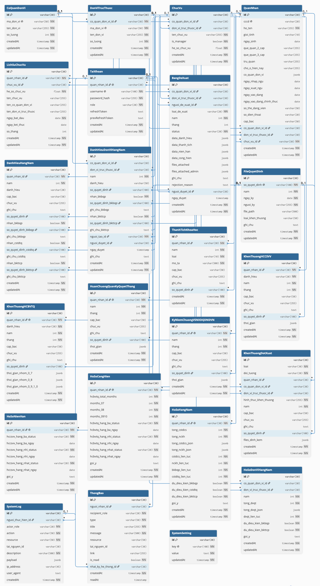

# Giải thích các mối quan hệ trong CSDL (tài liệu ôn bảo vệ)

> Nguồn: `BE-QLKT/prisma/schema.prisma` (đã đối chiếu với `database.dbml`).
> 23 bảng · 47 khóa ngoại. Sơ đồ minh họa: `ERD 0.png` (báo cáo) dựng từ `database.dbml`. Mọi hành vi `onDelete` dưới đây đúng theo schema thật.

---

## 1. Cách đọc

**Cardinality (chân quạ — crow's foot):**
- `1 — N`: một bản ghi cha ứng với nhiều bản ghi con. Đây là dạng phổ biến (khóa ngoại ở bảng con, không UNIQUE).
- `1 — 1`: khóa ngoại ở bảng con có ràng buộc **UNIQUE** → mỗi cha chỉ có tối đa một con.

**Hành vi khi xóa bản ghi cha (`onDelete`):**
- **Cascade** — xóa cha thì các con bị xóa theo. Dùng cho dữ liệu "thuộc về" cha (con không tồn tại độc lập).
- **SetNull** — xóa cha thì khóa ngoại ở con để `NULL`, **con vẫn sống**. Dùng cho dữ liệu *lịch sử/sổ cái* phải giữ lại dù nguồn tham chiếu mất.
- **Restrict** — **chặn** không cho xóa cha khi vẫn còn con tham chiếu. Dùng để bảo vệ dữ liệu đang được dùng.

**`onUpdate: Cascade`** (chỉ ở nhánh số quyết định): đổi giá trị khóa ở cha thì con tự cập nhật theo — xem mục 3.5.

**Hai tầng dữ liệu (chìa khóa để nhớ tại sao mỗi quan hệ chọn Cascade/SetNull/Restrict):**
- **Tầng vận hành** (đơn vị, chức vụ, tài khoản): là trạng thái hiện tại. Xóa thì hoặc *chặn* (Restrict) hoặc *xóa kèm dữ liệu phụ thuộc* (Cascade).
- **Tầng lịch sử / sổ cái** (lịch sử chức vụ, đề xuất, nhật ký): bất biến, phải sống sót khi nguồn bị xóa → **SetNull + snapshot** (chụp lại tên để vẫn hiển thị được).

---

## 2. Mô hình tổng thể — 4 "trục" cần nhớ

1. **Đơn vị 2 cấp**: `CoQuanDonVi` (đơn vị cha) → `DonViTrucThuoc` (đơn vị con).
2. **`QuanNhan`** là tâm của toàn bộ hồ sơ cá nhân: chức vụ, lịch sử, tài khoản, mọi bảng khen thưởng và hồ sơ điều kiện đều trỏ về đây.
3. **`TaiKhoan`** là tài khoản đăng nhập, gắn 1–1 với một quân nhân; đồng thời là "người thực hiện" trong đề xuất, nhật ký, thông báo.
4. **`FileQuyetDinh`** là "sổ quyết định": các bảng khen thưởng không lưu lại thông tin quyết định mà **trỏ tới số quyết định** trong sổ này.

Sơ đồ ERD tổng quan dưới đây (dựng từ `database.dbml`, chính là sơ đồ tổng quan trong báo cáo) thể hiện toàn bộ 23 bảng và các quan hệ giữa chúng. Các mục 3.1–3.6 phóng to và giải thích chi tiết từng nhóm.

{ width=100% }

---

## 3. Chi tiết quan hệ theo nhóm

Ký hiệu: *Bảng con.khóa_ngoại → Bảng cha.khóa*.

### 3.1. Tổ chức · Quân nhân · Tài khoản

{ width=95% }

| Quan hệ | Kiểu | Ý nghĩa | onDelete · vì sao |
|---|---|---|---|
| `DonViTrucThuoc.co_quan_don_vi_id → CoQuanDonVi.id` | 1–N | Đơn vị con thuộc một đơn vị cha | **Cascade** — xóa cơ quan thì các đơn vị con của nó không còn ý nghĩa |
| `ChucVu.co_quan_don_vi_id → CoQuanDonVi.id` | 1–N | Chức vụ thuộc một cơ quan | **Cascade** — chức vụ gắn chặt với đơn vị |
| `ChucVu.don_vi_truc_thuoc_id → DonViTrucThuoc.id` | 1–N | Chức vụ thuộc một đơn vị con | **Cascade** — như trên |
| `QuanNhan.chuc_vu_id → ChucVu.id` | 1–N | Chức vụ **hiện tại** của quân nhân | **Restrict** — không cho xóa chức vụ khi vẫn còn quân nhân đang giữ |
| `QuanNhan.co_quan_don_vi_id → CoQuanDonVi.id` | 1–N | Cơ quan quản lý quân nhân | **Cascade** |
| `QuanNhan.don_vi_truc_thuoc_id → DonViTrucThuoc.id` | 1–N | Đơn vị con của quân nhân | **Cascade** |
| `LichSuChucVu.quan_nhan_id → QuanNhan.id` | 1–N | Một quân nhân có nhiều giai đoạn giữ chức vụ | **Cascade** — lịch sử thuộc về quân nhân |
| `LichSuChucVu.chuc_vu_id → ChucVu.id` | 1–N | Giai đoạn đó giữ chức vụ nào | **SetNull + snapshot** — khi chức vụ bị xóa, dòng lịch sử vẫn sống và hiển thị tên đã chụp (`ten_chuc_vu`, `ten_co_quan_don_vi`, `ten_don_vi_truc_thuoc`) |
| `TaiKhoan.quan_nhan_id → QuanNhan.id` | **1–1** | Mỗi quân nhân có tối đa một tài khoản (`quan_nhan_id` UNIQUE) | **Cascade** — xóa quân nhân thì tài khoản của họ cũng bỏ |

> **Lưu ý 2 khóa đơn vị của quân nhân**: một quân nhân lưu **cả** `co_quan_don_vi_id` lẫn `don_vi_truc_thuoc_id` vì cơ cấu có 2 cấp. Quy ước nghiệp vụ: ưu tiên đơn vị trực thuộc (DVTT) khi xác định đơn vị của chính quân nhân.

### 3.2. Đề xuất khen thưởng

{ width=95% }

| Quan hệ | Kiểu | Ý nghĩa | onDelete · vì sao |
|---|---|---|---|
| `BangDeXuat.co_quan_don_vi_id → CoQuanDonVi.id` | 1–N | Cơ quan của bên nộp đề xuất | **Cascade** |
| `BangDeXuat.don_vi_truc_thuoc_id → DonViTrucThuoc.id` | 1–N | Đơn vị con của bên nộp | **Cascade** |
| `BangDeXuat.nguoi_de_xuat_id → TaiKhoan.id` | 1–N | Tài khoản người lập đề xuất | **SetNull** — đề xuất là dữ liệu lịch sử, phải giữ lại dù tài khoản người lập bị xóa |
| `BangDeXuat.nguoi_duyet_id → TaiKhoan.id` | 1–N | Tài khoản người phê duyệt | **SetNull** — tương tự, giữ lịch sử duyệt |

### 3.3. Khen thưởng cá nhân & hồ sơ điều kiện (đều quy về `QuanNhan`)

{ width=95% }

| Quan hệ | Kiểu | Ý nghĩa | onDelete · vì sao |
|---|---|---|---|
| `DanhHieuHangNam.quan_nhan_id → QuanNhan.id` | 1–N (UNIQUE theo `quan_nhan_id, nam`) | Danh hiệu thi đua mỗi năm | **Cascade** |
| `ThanhTichKhoaHoc.quan_nhan_id → QuanNhan.id` | 1–N | Thành tích NCKH theo năm | **Cascade** |
| `KhenThuongHCCSVV.quan_nhan_id → QuanNhan.id` | 1–N (UNIQUE theo `quan_nhan_id, danh_hieu`) | HCCSVV theo từng hạng | **Cascade** |
| `KhenThuongHCBVTQ.quan_nhan_id → QuanNhan.id` | **1–1** (`quan_nhan_id` UNIQUE) | HCBVTQ — mỗi quân nhân một bản ghi | **Cascade** |
| `HuanChuongQuanKyQuyetThang.quan_nhan_id → QuanNhan.id` | **1–1** | HCQKQT — một bản ghi/quân nhân | **Cascade** |
| `KyNiemChuongVSNXDQDNDVN.quan_nhan_id → QuanNhan.id` | **1–1** | Kỷ niệm chương — một bản ghi/quân nhân | **Cascade** |
| `KhenThuongDotXuat.quan_nhan_id → QuanNhan.id` | 1–N | Khen thưởng đột xuất cho **cá nhân** (nullable) | **Cascade** |
| `KhenThuongDotXuat.co_quan_don_vi_id → CoQuanDonVi.id` | 1–N | Khen thưởng đột xuất cho **tập thể** cấp cơ quan (nullable) | **Cascade** |
| `KhenThuongDotXuat.don_vi_truc_thuoc_id → DonViTrucThuoc.id` | 1–N | Khen thưởng đột xuất cho tập thể cấp đơn vị con (nullable) | **Cascade** |
| `HoSoNienHan.quan_nhan_id → QuanNhan.id` | **1–1** | Hồ sơ điều kiện HCCSVV (suy diễn) | **Cascade** |
| `HoSoCongHien.quan_nhan_id → QuanNhan.id` | **1–1** | Hồ sơ điều kiện HCBVTQ (suy diễn) | **Cascade** |
| `HoSoHangNam.quan_nhan_id → QuanNhan.id` | **1–1** | Hồ sơ điều kiện chuỗi danh hiệu (suy diễn) | **Cascade** |

> `KhenThuongDotXuat` trỏ tới **hoặc** quân nhân **hoặc** đơn vị (3 khóa ngoại đều nullable) vì khen thưởng đột xuất áp dụng cho cá nhân lẫn tập thể.

### 3.4. Khen thưởng & hồ sơ đơn vị

{ width=95% }

| Quan hệ | Kiểu | Ý nghĩa | onDelete · vì sao |
|---|---|---|---|
| `DanhHieuDonViHangNam.co_quan_don_vi_id → CoQuanDonVi.id` | 1–N (UNIQUE theo `co_quan_don_vi_id, nam`) | Danh hiệu của đơn vị cấp cơ quan | **Cascade** |
| `DanhHieuDonViHangNam.don_vi_truc_thuoc_id → DonViTrucThuoc.id` | 1–N (UNIQUE theo `don_vi_truc_thuoc_id, nam`) | Danh hiệu của đơn vị con | **Cascade** |
| `DanhHieuDonViHangNam.nguoi_tao_id → TaiKhoan.id` | 1–N | Tài khoản người tạo đề nghị | **SetNull** — giữ bản ghi danh hiệu khi tài khoản người tạo bị xóa |
| `DanhHieuDonViHangNam.nguoi_duyet_id → TaiKhoan.id` | 1–N | Tài khoản người duyệt | **SetNull** — giữ bản ghi khi tài khoản người duyệt bị xóa |
| `HoSoDonViHangNam.co_quan_don_vi_id → CoQuanDonVi.id` | 1–N (UNIQUE theo `co_quan_don_vi_id, nam`) | Hồ sơ điều kiện đơn vị cấp cơ quan | **Cascade** |
| `HoSoDonViHangNam.don_vi_truc_thuoc_id → DonViTrucThuoc.id` | 1–N (UNIQUE theo `don_vi_truc_thuoc_id, nam`) | Hồ sơ điều kiện đơn vị con | **Cascade** |

### 3.5. Quyết định — trỏ vào `FileQuyetDinh.so_quyet_dinh`

{ width=95% }

Đặc thù: các bảng khen thưởng **không** trỏ vào khóa chính `id` của `FileQuyetDinh` mà trỏ vào cột `so_quyet_dinh` (cột UNIQUE). Tất cả đều `onUpdate: Cascade` và `onDelete: Restrict`.

| Bảng con (khóa ngoại) | → `FileQuyetDinh.so_quyet_dinh` |
|---|---|
| `DanhHieuHangNam.so_quyet_dinh` | Có (1–N) |
| `DanhHieuHangNam.so_quyet_dinh_bkbqp` | Có |
| `DanhHieuHangNam.so_quyet_dinh_cstdtq` | Có |
| `DanhHieuHangNam.so_quyet_dinh_bkttcp` | Có |
| `DanhHieuDonViHangNam.so_quyet_dinh` | Có |
| `DanhHieuDonViHangNam.so_quyet_dinh_bkbqp` | Có |
| `DanhHieuDonViHangNam.so_quyet_dinh_bkttcp` | Có |
| `ThanhTichKhoaHoc.so_quyet_dinh` | Có |
| `KhenThuongHCCSVV.so_quyet_dinh` | Có |
| `KhenThuongHCBVTQ.so_quyet_dinh` | Có |
| `HuanChuongQuanKyQuyetThang.so_quyet_dinh` | Có |
| `KyNiemChuongVSNXDQDNDVN.so_quyet_dinh` | Có |
| `KhenThuongDotXuat.so_quyet_dinh` | Có |

→ Tổng **13 khóa ngoại** vào `FileQuyetDinh`.
- **onUpdate Cascade**: khi cán bộ sửa lại số quyết định trong sổ, mọi bảng khen thưởng tham chiếu tự cập nhật theo (không phải sửa tay nhiều nơi).
- **onDelete Restrict**: không cho xóa một quyết định khi vẫn còn khen thưởng tham chiếu — tránh mất căn cứ pháp lý của danh hiệu đã trao.

### 3.6. Hệ thống

{ width=95% }

| Quan hệ | Kiểu | Ý nghĩa | onDelete · vì sao |
|---|---|---|---|
| `SystemLog.nguoi_thuc_hien_id → TaiKhoan.id` | 1–N | Người thực hiện thao tác (NULL nếu là hệ thống) | **SetNull** — nhật ký kiểm toán phải giữ lại dù tài khoản bị xóa |
| `ThongBao.nguoi_nhan_id → TaiKhoan.id` | 1–N | Tài khoản người nhận thông báo | **Cascade** — thông báo gắn với người nhận, mất tài khoản thì bỏ |
| `ThongBao.nhat_ky_he_thong_id → SystemLog.id` | 1–N | Thông báo được sinh từ bản ghi nhật ký nào | **SetNull** — giữ thông báo dù bản ghi nhật ký nguồn bị xóa |

> `SystemSetting` (cấu hình khóa–giá trị) **độc lập, không có khóa ngoại**.

---

## 4. Tổng hợp: quan hệ 1–1 và các bảng "đứng riêng"

**1–1 với `QuanNhan`** (khóa ngoại UNIQUE — mỗi quân nhân tối đa một bản ghi):
`TaiKhoan`, `KhenThuongHCBVTQ`, `HuanChuongQuanKyQuyetThang`, `KyNiemChuongVSNXDQDNDVN`, `HoSoNienHan`, `HoSoCongHien`, `HoSoHangNam`.

**Vì sao 1–1?** Ba bảng `HoSo*` là **bảng suy diễn** (hệ thống tự tính lại sau mỗi thay đổi), mỗi quân nhân chỉ cần một hồ sơ tổng. HCBVTQ/HCQKQT/Kỷ niệm chương là danh hiệu mỗi quân nhân chỉ nhận **một lần**, nên một bản ghi là đủ. Còn HCCSVV (theo từng hạng) và danh hiệu hằng năm (theo năm) là 1–N.

**Bảng không có khóa ngoại đi ra** (chỉ được tham chiếu hoặc đứng riêng): `CoQuanDonVi`, `FileQuyetDinh`, `SystemSetting`.

---

## 5. Câu hỏi hay gặp khi bảo vệ (Q&A)

**H: Vì sao khen thưởng trỏ vào `so_quyet_dinh` (cột thường) thay vì khóa chính `id` của `FileQuyetDinh`?**
Đ: Để khai thác `ON UPDATE CASCADE`. Số quyết định là cái cán bộ làm việc trực tiếp và có thể nhập sai rồi sửa; khi sửa số trong sổ quyết định, mọi bảng khen thưởng liên quan tự cập nhật. `so_quyet_dinh` là cột UNIQUE nên đủ điều kiện làm đích khóa ngoại.

**H: Vì sao mỗi quân nhân lưu cả `co_quan_don_vi_id` lẫn `don_vi_truc_thuoc_id`?**
Đ: Cơ cấu tổ chức có 2 cấp (cơ quan cha — đơn vị con). Quân nhân ở đơn vị con lưu cả hai để truy ngược lên cấp cha; khi xác định "đơn vị của quân nhân" thì ưu tiên đơn vị trực thuộc.

**H: Vì sao chỗ thì Cascade, chỗ thì SetNull, chỗ thì Restrict?**
Đ: Theo hai tầng dữ liệu. Dữ liệu *thuộc về* quân nhân (khen thưởng, hồ sơ, lịch sử) → **Cascade** theo quân nhân. Dữ liệu *lịch sử/kiểm toán* tham chiếu tới tài khoản/chức vụ/nhật ký → **SetNull** (kèm snapshot ở lịch sử chức vụ) để bản ghi sống sót. Dữ liệu đang được dùng làm căn cứ (chức vụ hiện tại, quyết định đã trao) → **Restrict** để chặn xóa nhầm.

**H: Vì sao `QuanNhan.chuc_vu_id` là Restrict còn `LichSuChucVu.chuc_vu_id` là SetNull?**
Đ: `QuanNhan.chuc_vu_id` là **chức vụ hiện tại** (tầng vận hành) — không cho xóa chức vụ khi còn người giữ. `LichSuChucVu` là **lịch sử** (tầng sổ cái) — chức vụ cũ có thể bị xóa, nhưng dòng lịch sử phải sống, nên SetNull và đã chụp sẵn tên chức vụ/đơn vị để vẫn hiển thị được.

**H: Vì sao đề xuất (`BangDeXuat`) dùng SetNull cho người đề xuất/người duyệt?**
Đ: Đề xuất là chứng cứ quy trình, phải tra cứu lại được kể cả khi tài khoản người lập/người duyệt đã bị xóa. SetNull giữ bản ghi, chỉ mất liên kết tới tài khoản.

**H: Khen thưởng đột xuất gắn với ai?**
Đ: Trỏ tới **một trong** quân nhân (cá nhân) hoặc đơn vị (tập thể) — cả ba khóa ngoại đều nullable, tùy `doi_tuong` là cá nhân hay tập thể.

**H: Vì sao `DanhHieuHangNam` có tới 4 cột số quyết định?**
Đ: Mỗi quân nhân có một dòng cho mỗi năm (UNIQUE `quan_nhan_id, nam`), nhưng trong năm có thể nhận thêm các cấp danh hiệu chuỗi (BKBQP, CSTĐTQ, BKTTCP), mỗi cấp một số quyết định riêng → 4 khóa ngoại cùng trỏ về sổ quyết định.

**H: Hành vi xóa của khen thưởng đơn vị (`DanhHieuDonViHangNam`) ra sao?**
Đ: Cả `nguoi_tao_id` lẫn `nguoi_duyet_id` đều là **SetNull**: khi tài khoản người tạo hoặc người duyệt bị xóa, bản ghi danh hiệu đơn vị vẫn sống và chỉ bỏ liên kết tới tài khoản — nhất quán với cách xử lý dữ liệu lịch sử/sổ cái ở toàn hệ thống. Còn liên kết tới đơn vị (cơ quan hoặc đơn vị trực thuộc) là **Cascade** vì danh hiệu thuộc về đơn vị đó.
