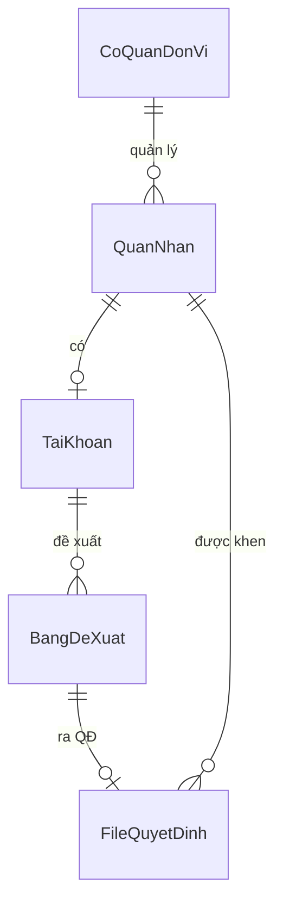
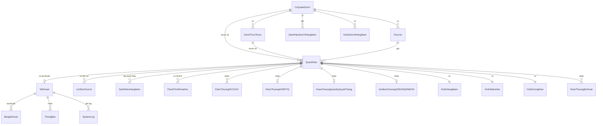
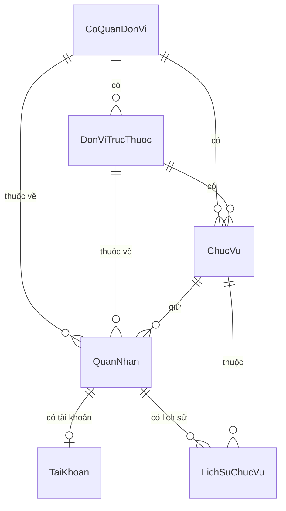
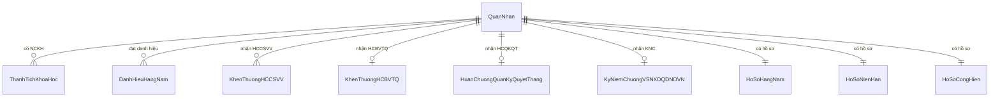
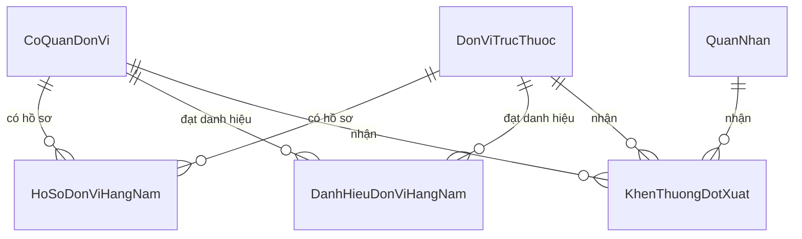
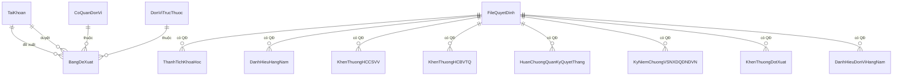
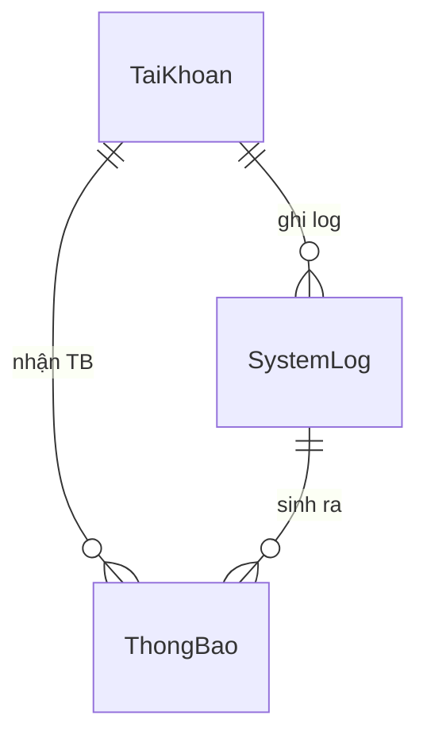

# ERD Tổng quan (Mermaid)

Sơ đồ chỉ thể hiện **tên bảng + quan hệ**, không có field — phù hợp cho slide bảo vệ hoặc chương kiến trúc tổng quan.

> Render: paste vào [mermaid.live](https://mermaid.live) hoặc xem trực tiếp trong VS Code (extension Markdown Preview Mermaid).

## Ký hiệu

| Ký hiệu | Ý nghĩa |
|---|---|
| `\|\|--\|\|` | 1-1 (cả hai bắt buộc) |
| `\|\|--o\|` | 1-1 (con tùy chọn) |
| `\|\|--o{` | 1-N (con có thể không có) |
| `\|\|--\|{` | 1-N (con bắt buộc ≥ 1) |
| Nhãn trên line | Mô tả quan hệ |

---

## C0 — ERD cực gọn (cho slide bảo vệ — 5 entity trung tâm)

> Sơ đồ này chỉ giữ 5 entity quan trọng nhất, dùng cho slide giới thiệu ban đầu — diagram cụ thể xem C1-C6 bên dưới.

---

## C1 — ERD tổng thể (core, ~20 quan hệ)

> Đã bỏ 15 quan hệ noise `FileQuyetDinh → award tables` (xem C5 chi tiết).

---

## C2 — Module Nhân sự & Tổ chức

---

## C3 — Module Khen thưởng cá nhân

---

## C4 — Module Khen thưởng đơn vị + Đột xuất

---

## C5 — Module Đề xuất + Quyết định

---

## C6 — Module Hệ thống

---

## Ghi chú

- **`QuanNhan`** là entity trung tâm của module cá nhân — 9 bảng khen thưởng/hồ sơ tỏa ra từ đây.
- **`CoQuanDonVi`** là entity gốc của tổ chức — `DonViTrucThuoc`, `ChucVu`, `QuanNhan` đều tham chiếu về.
- **`FileQuyetDinh`** là entity dùng chung cho 8 bảng khen thưởng — tham chiếu qua `so_quyet_dinh` (text field, không phải `id`).
- **`KhenThuongDotXuat`** là **polymorphic**: chỉ 1 trong 3 FK (`quan_nhan_id` / `co_quan_don_vi_id` / `don_vi_truc_thuoc_id`) có giá trị tùy `doi_tuong` (CA_NHAN / TAP_THE).
