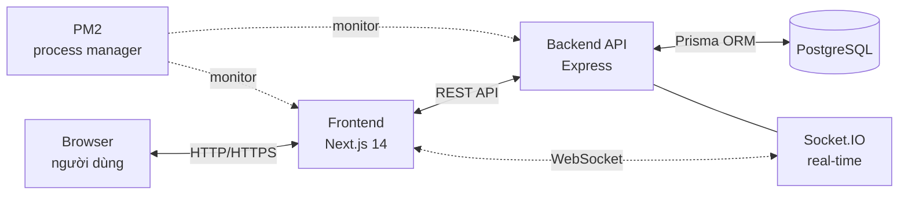
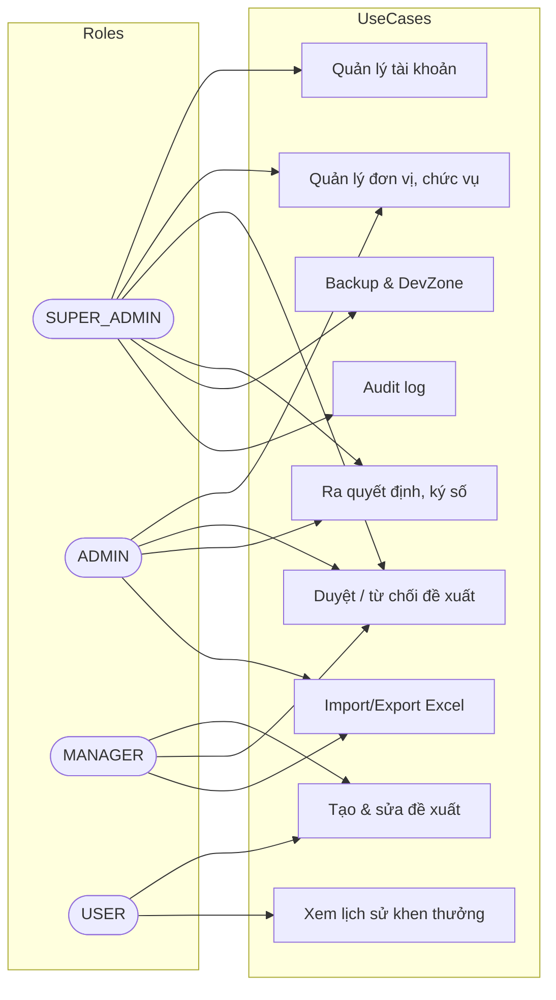
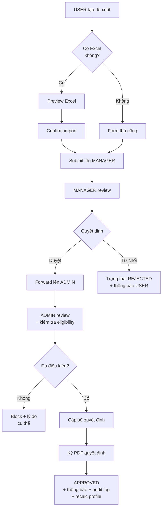
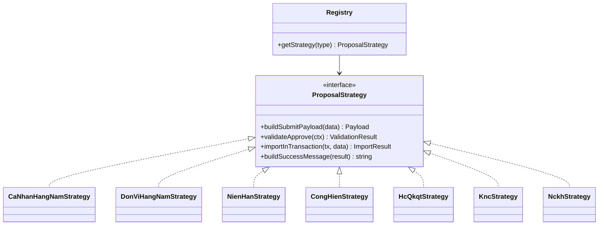

# Slide bảo vệ ĐATN — PM QLKT

> Hướng dẫn dùng:
> - Mở `HUST_PPT_template_2022_RED_4x3.pptx` trong PowerPoint.
> - Mỗi block "## Slide X" tương ứng 1 slide trong template.
> - Phần **Tiêu đề**, **Nội dung** copy thẳng vào slide. Phần **Kịch bản nói** không lên slide — em đọc khi thuyết trình (~14 phút).
> - Diagram dùng code Mermaid: paste vào https://mermaid.live → export PNG → chèn slide.
> - Tổng: 18 slide, mục tiêu 13–14 phút (chừa thời gian Q&A).

---

## Slide 1 — Trang bìa

**Tiêu đề**: Phần mềm Quản lý Khen thưởng (PM QLKT)

**Nội dung**:
- Sinh viên: [Họ tên] – [MSSV]
- Lớp: [...]
- Giảng viên hướng dẫn: [Tên GVHD]
- Đại học Bách khoa Hà Nội – [Năm học]

**Kịch bản nói** (~30s):
> "Em xin kính chào các thầy cô trong hội đồng. Em là [tên], lớp [...]. Hôm nay em xin trình bày đồ án tốt nghiệp với đề tài **Phần mềm Quản lý Khen thưởng** dưới sự hướng dẫn của thầy/cô [...]."

---

## Slide 2 — Nội dung trình bày

**Tiêu đề**: Nội dung trình bày

**Nội dung** (5 mục lớn):
1. Mục tiêu của đồ án
2. Phân tích bài toán
3. Thiết kế hệ thống
4. Kết quả thử nghiệm
5. Kết luận & Hướng phát triển

**Kịch bản nói** (~20s):
> "Bài thuyết trình gồm 5 phần chính: mục tiêu, phân tích bài toán, thiết kế, kết quả và kết luận."

---

## Slide 3 — Mục tiêu của đồ án

**Tiêu đề**: Mục tiêu đồ án

**Nội dung**:

*Đặt vấn đề*:
- Quản lý khen thưởng quân nhân hiện làm thủ công bằng Excel/giấy tờ
- Khó tra cứu lịch sử nhiều năm, dễ sai sót khi xét chuỗi danh hiệu phức tạp
- Cần phần mềm chạy nội bộ, không phụ thuộc internet

*Mục tiêu cụ thể*:
- Quản lý 7 loại khen thưởng + 1 loại đột xuất, 4 vai trò người dùng
- Tự động xét đủ điều kiện theo quy định (chuỗi danh hiệu, niên hạn, cống hiến)
- Quy trình đề xuất → duyệt → ra quyết định, audit trail đầy đủ
- Triển khai mạng nội bộ, không cần internet

**Kịch bản nói** (~60s):
> "Hiện nay việc quản lý khen thưởng trong các đơn vị quân đội chủ yếu dựa vào Excel và hồ sơ giấy. Khi xét các danh hiệu cao như BKBQP hay BKTTCP, cán bộ phải tra cứu lịch sử nhiều năm và áp dụng các quy định phức tạp như chuỗi danh hiệu, cửa sổ trượt — rất dễ sai sót. Đồ án này xây dựng phần mềm tự động hoá quy trình đó, hỗ trợ 7 loại khen thưởng, 4 vai trò, và quan trọng là chạy được trên mạng nội bộ không có internet."

---

## Slide 4 — Phân tích bài toán

**Tiêu đề**: Bài toán cần giải quyết

**Nội dung**:
- **Quản lý nghiệp vụ**: 7 loại khen thưởng, mỗi loại có quy định xét duyệt riêng
- **Logic phức tạp**: chuỗi danh hiệu hằng năm với cửa sổ trượt 3y/7y, lifetime semantics
- **Phân quyền 4 cấp**: SUPER_ADMIN > ADMIN > MANAGER > USER, mỗi cấp scope dữ liệu khác nhau
- **Real-time**: thông báo tức thì khi đề xuất được duyệt/từ chối
- **Audit trail**: mọi thao tác phải log lại, ai làm gì lúc nào
- **Triển khai offline**: mạng nội bộ, không gọi API ngoài

**Kịch bản nói** (~60s):
> "Bài toán có 6 thách thức chính. Thứ nhất là nghiệp vụ phức tạp với 7 loại khen thưởng khác nhau. Thứ hai là logic chuỗi danh hiệu — phần em sẽ trình bày kỹ ở slide sau vì đây là phần khó nhất. Tiếp theo là phân quyền 4 cấp, thông báo real-time, audit log, và yêu cầu chạy được trong môi trường mạng nội bộ không có internet."

---

## Slide 5 — Hệ thống danh hiệu khen thưởng

**Tiêu đề**: 8 loại đề xuất khen thưởng

**Nội dung** (bảng):

| # | Loại | Tên đầy đủ | Đặc trưng |
|---|---|---|---|
| 1 | Cá nhân hằng năm | CSTDCS, CSTT + chuỗi BKBQP/CSTDTQ/BKTTCP | Xét theo năm |
| 2 | Đơn vị hằng năm | ĐVQT, ĐVTT + chuỗi BKBQP/BKTTCP | Cấp đơn vị |
| 3 | Niên hạn (HCCSVV) | HC Chiến sĩ vẻ vang Ba/Nhì/Nhất | 10/15/20 năm phục vụ |
| 4 | Cống hiến (HCBVTQ) | HC Bảo vệ Tổ quốc Ba/Nhì/Nhất | Hệ số cống hiến 0.7/0.8/0.9-1.0 |
| 5 | HC Quân kỳ Quyết thắng | HCQKQT | 25 năm phục vụ |
| 6 | Kỷ niệm chương VSNXD | KNC QĐNDVN | Nam 25y / Nữ 20y |
| 7 | Nghiên cứu khoa học | Đề tài KH (DTKH), Sáng kiến KH (SKKH) | Theo công trình |
| 8 | Khen thưởng đột xuất | Theo chiến công cụ thể | Không định kỳ |

**Kịch bản nói** (~60s):
> "Hệ thống quản lý 8 loại đề xuất, chia 2 nhóm. Nhóm hằng năm gồm cá nhân và đơn vị, xét theo từng năm với chuỗi danh hiệu phức tạp. Nhóm còn lại gồm các loại huy chương theo niên hạn, theo cống hiến, theo chiến công, và nghiên cứu khoa học. Mỗi loại có quy định xét duyệt riêng được mã hoá thành rule trong hệ thống."

---

## Slide 6 — Chuỗi danh hiệu hằng năm (CORE BUSINESS)

**Tiêu đề**: Chuỗi danh hiệu hằng năm — Logic cốt lõi

**Nội dung** (sơ đồ + chú thích):

*Cá nhân*:
```
CSTDCS × 2 năm liên tục → BKBQP (chu kỳ 2 năm, lặp lại)
                          ↓
                   3 năm + 1 BKBQP/3y → CSTDTQ (chu kỳ 3 năm)
                                         ↓
                              7 năm + 3 BKBQP + 2 CSTDTQ
                              + NCKH mỗi năm → BKTTCP (lifetime)
```

*Đơn vị* (giống nhưng không có CSTDTQ và NCKH):
```
ĐVQT × 2 năm → BKBQP → 7y + 3 BKBQP/7y → BKTTCP (lặp lại)
```

**Quy tắc đặc biệt**:
- **Cửa sổ trượt**: BKBQP của chu kỳ trước rơi ra → bắt buộc có BKBQP mới
- **Lifetime**: BKTTCP cá nhân chỉ nhận 1 lần, sau đó block
- **Lỡ đợt**: cycle vẫn đếm tiếp, không cần đứt streak

**Kịch bản nói** (~90s):
> "Đây là phần em đầu tư nhiều thời gian nhất. Chuỗi danh hiệu cá nhân gồm 3 cấp: BKBQP yêu cầu 2 năm CSTDCS liên tục, CSTDTQ thêm 1 BKBQP trong 3 năm gần nhất, BKTTCP yêu cầu 7 năm với đủ flag và NCKH mỗi năm.
> Điểm phức tạp là **cửa sổ trượt** — khi xét CSTDTQ năm 2026, em chỉ tính BKBQP trong 3 năm 2024-2026, BKBQP cũ tự rơi ra. Nếu lỡ một đợt đề xuất, chuỗi vẫn đếm tiếp đến chu kỳ kế.
> BKTTCP cá nhân là **lifetime** — nhận 1 lần là khoá luôn vì luật chưa quy định danh hiệu cao hơn."

---

## Slide 7 — Kiến trúc tổng quan hệ thống

**Tiêu đề**: Kiến trúc hệ thống

**Nội dung** (sơ đồ + chú thích):



**Chú thích** (4 thành phần):
- **Frontend** (Next.js 14): UI người dùng, App Router, server components
- **Backend** (Express + TypeScript): API REST, layered architecture
- **PostgreSQL**: lưu trữ dữ liệu, Prisma ORM type-safe
- **Socket.IO**: thông báo real-time qua WebSocket
- **PM2**: quản lý process, auto-restart, log

**Kịch bản nói** (~75s):
> "Hệ thống chia 4 tầng: trình duyệt giao tiếp với Frontend Next.js, Frontend gọi REST API tới Backend Express. Backend dùng Prisma ORM để truy cập PostgreSQL. Khi có sự kiện cần thông báo tức thì, Backend đẩy qua Socket.IO tới browser. Toàn bộ chạy trong PM2 để tự khởi động lại khi crash."

---

## Slide 8 — Công nghệ Frontend

**Tiêu đề**: Công nghệ Frontend

**Nội dung**:
- **Next.js 14** (App Router): server components, file-based routing
- **TypeScript**: type safety toàn dự án
- **Ant Design**: component library — Form, Table, DatePicker, Modal
- **Tailwind CSS + shadcn/ui**: styling tuỳ biến
- **Zod**: schema validation cho form
- **Socket.IO client**: nhận thông báo real-time

**Lý do chọn**: Next.js có App Router routing rõ ràng theo thư mục, cộng đồng lớn. AntD đầy đủ component nghiệp vụ (Table có sort/filter sẵn, Form validation chuẩn) — tiết kiệm thời gian.

**Kịch bản nói** (~45s):
> "Phía client em dùng Next.js 14 với App Router để routing theo file system. UI dùng Ant Design vì có sẵn các component phức tạp như Table phân trang, Form validation. Tailwind dùng để custom style. Form validate hai lớp: Zod ở client cho UX nhanh, Joi ở server để bảo mật."

---

## Slide 9 — Công nghệ Backend + Database

**Tiêu đề**: Công nghệ Backend & CSDL

**Nội dung**:
- **Express + TypeScript**: REST API, middleware chain
- **Prisma ORM 6.x**: type-safe queries, migration tự động
- **PostgreSQL**: RDBMS, hỗ trợ transaction SERIALIZABLE
- **Joi**: validate request body (server-side)
- **bcrypt**: hash password 10 rounds
- **JWT**: xác thực 2 token (access ngắn + refresh dài)

**Layered architecture**:
```
Route → Middleware → Controller → Service → Repository → Prisma → PostgreSQL
```

**Lý do chọn**:
- Prisma sinh ra TypeScript client → autocomplete + type check ở compile time
- Express đơn giản, ecosystem lớn, vừa đủ cho scale ~vài trăm user nội bộ
- PostgreSQL hỗ trợ transaction tốt cho race condition

**Kịch bản nói** (~50s):
> "Backend dùng Express với TypeScript. ORM em chọn Prisma vì sinh code client type-safe — viết code có autocomplete và compile-time check, an toàn hơn TypeORM. Database PostgreSQL có hỗ trợ isolation level SERIALIZABLE cần cho test race condition. Kiến trúc layered 5 tầng tách biệt rõ ràng: route, controller, service, repository, ORM."

---

## Slide 10 — Công nghệ phụ trợ

**Tiêu đề**: Công nghệ phụ trợ

**Nội dung**:
- **Socket.IO**: thông báo real-time, room theo user_id
- **PM2**: process manager, auto-restart, max RAM 500MB
- **node-cron**: lịch backup DB tự động
- **ExcelJS**: import/export Excel (template + parse)
- **PDFKit + docx**: sinh quyết định, văn bản

**Kịch bản nói** (~30s):
> "Một số thư viện phụ trợ: Socket.IO cho thông báo, PM2 quản lý process, node-cron lịch backup, ExcelJS để import/export Excel cho cán bộ quen làm việc với file Excel."

---

## Slide 11 — Thiết kế CSDL

**Tiêu đề**: Thiết kế cơ sở dữ liệu

**Nội dung**:
- **23 bảng** chính, quan hệ FK đầy đủ
- ID dạng **CUID** (25 ký tự, sortable theo thời gian)
- Timestamp `@db.Timestamptz(6)` — có timezone
- Tên model PascalCase TypeScript, map `@@map` snake_case PostgreSQL

**Các bảng cốt lõi**:
- `QuanNhan` ↔ `CoQuanDonVi` ↔ `DonViTrucThuoc`: cấu trúc tổ chức
- `BangDeXuat`: đề xuất khen thưởng
- `DanhHieuHangNam`, `HoSoNienHan`, `HoSoCongHien`, `HoSoDonViHangNam`: hồ sơ từng loại
- `TaiKhoan`: tài khoản, phân 4 vai trò
- `SystemLog`, `ThongBao`: audit + thông báo
- `FileQuyetDinh`: PDF quyết định ký số

**[Chèn ảnh ERD]**: dùng file `BE-QLKT/prisma/ERD.svg` (rút gọn các bảng phụ nếu cần)

**Kịch bản nói** (~75s):
> "Database có 23 bảng, em chia thành 4 nhóm: bảng tổ chức quân nhân và đơn vị, bảng đề xuất và hồ sơ khen thưởng theo từng loại, bảng tài khoản và phân quyền, và bảng phụ trợ như audit log, thông báo, file quyết định. ID dùng CUID 25 ký tự để sortable theo thời gian mà không lộ thứ tự. Sơ đồ ERD chi tiết em đã đính kèm trong file đồ án."

---

## Slide 12 — Phân tích chức năng

**Tiêu đề**: Sơ đồ Use-case theo vai trò

**Nội dung** (Use-case diagram):



**Kịch bản nói** (~60s):
> "Hệ thống có 4 vai trò phân theo phân cấp. USER chỉ tạo và xem đề xuất của mình. MANAGER duyệt cấp đơn vị mình quản lý. ADMIN duyệt cấp cao hơn và ký quyết định. SUPER_ADMIN có quyền tối cao gồm quản lý tài khoản, backup, xem toàn bộ audit log."

---

## Slide 13 — Thiết kế hoạt động: Duyệt đề xuất

**Tiêu đề**: Quy trình duyệt đề xuất

**Nội dung** (Activity diagram):



**Kịch bản nói** (~75s):
> "Quy trình duyệt qua 3 cấp. USER tạo đề xuất qua form hoặc import Excel hàng loạt. MANAGER review ở cấp đơn vị. ADMIN ở bước cuối kiểm tra eligibility — gọi service `checkAwardEligibility` để xác nhận quân nhân thực sự đủ điều kiện theo quy định. Nếu pass, hệ thống cấp số quyết định, sinh PDF, lưu file, cập nhật profile và phát thông báo real-time."

---

## Slide 14 — Kiến trúc phần mềm: Strategy pattern

**Tiêu đề**: Strategy pattern cho 8 loại đề xuất

**Nội dung**:

Vấn đề: Mỗi loại đề xuất có logic submit/validate/import/build payload khác nhau → nếu dùng `if/else` thì 8 nhánh, dài và khó bảo trì.

Giải pháp: **Strategy pattern** — interface chung `ProposalStrategy`, mỗi loại 1 file implement.



**Tổng số file strategy**: 7, dispatch qua REGISTRY map. HC_QKQT và KNC dùng chung helper `singleMedalImporter` để DRY.

**Kịch bản nói** (~60s):
> "Phần phức tạp nhất ở backend là xử lý 8 loại đề xuất. Em áp dụng Strategy pattern: định nghĩa 1 interface chung với 4 method, mỗi loại có 1 file implement riêng. Khi service cần xử lý một đề xuất, nó tra Registry để lấy đúng strategy rồi gọi method tương ứng. Cách này thay vì if/else 8 nhánh giúp code dễ test và dễ thêm loại mới."

---

## Slide 15 — Kết quả: Chức năng đã hoàn thành

**Tiêu đề**: Kết quả thử nghiệm — Chức năng

**Nội dung**:
- ✅ 8 loại đề xuất khen thưởng + recalc profile tự động
- ✅ Logic chuỗi danh hiệu cá nhân + đơn vị, eligibility validation 2 lớp
- ✅ Phân quyền 4 cấp + scope dữ liệu theo đơn vị
- ✅ Import/Export Excel với template chuẩn, validate trước commit
- ✅ Sinh PDF quyết định + lưu file
- ✅ Thông báo real-time qua Socket.IO
- ✅ Audit log toàn diện + Backup DB tự động (cron)

**[Chèn 2-3 screenshot ấn tượng]**:
- Trang dashboard (số liệu khen thưởng theo năm/đơn vị)
- Trang chuỗi danh hiệu của 1 quân nhân (timeline)
- Trang duyệt đề xuất (preview eligibility)

**Kịch bản nói** (~60s):
> "Em đã hoàn thành đầy đủ 7 nhóm chức năng chính. Một số điểm nhấn: chuỗi danh hiệu được kiểm tra ở 2 lớp đảm bảo nhất quán giữa hiển thị goi_y và validate khi submit. Import Excel có bước preview để cán bộ thấy lỗi từng dòng trước khi commit. Backup DB tự động bằng cron, file SQL có thể restore lại bằng lệnh `psql`."

---

## Slide 16 — Kết quả: Test, hiệu năng, deploy

**Tiêu đề**: Kết quả — Test & Triển khai

**Nội dung** (3 cột):

| Test | Hiệu năng | Triển khai |
|---|---|---|
| **74 test files** | Import 1000 dòng Excel < 2s | PM2 fork mode |
| Pass 100% | Batch query thay N+1 | Mạng nội bộ offline |
| Coverage chuỗi danh hiệu | `Promise.all` query song song | Auto-restart + backup |
| Coverage security/race | DB index migration | `npm run setup` 1 lệnh |

**4 test tiêu biểu**:
1. **Race condition** — 2 admin duyệt song song, chỉ 1 thắng (8 case × 6 loại)
2. **BKTTCP eligibility** — cửa sổ trượt 7y + lifetime semantics
3. **Edited-data tampering** — admin cố sửa payload bypass FE, server vẫn ghi đúng
4. **Real-life vòng đời** — quân nhân qua nhiều năm, lên cấp danh hiệu

**Kịch bản nói** (~75s):
> "Em viết 74 file test, bao phủ logic chuỗi danh hiệu, eligibility, race condition và security. 4 test tiêu biểu: thứ nhất là race condition khi 2 admin duyệt song song cùng đề xuất, em dùng Prisma transaction SERIALIZABLE để chỉ 1 request thắng. Thứ hai là eligibility BKTTCP với cửa sổ trượt 7 năm. Thứ ba là tampering — em test các trường hợp admin cố sửa payload bypass validate FE. Thứ tư là kịch bản end-to-end vòng đời 1 quân nhân qua nhiều năm.
> Về hiệu năng, em tối ưu import Excel 1000 dòng dưới 2 giây nhờ batch query. Về triển khai, hệ thống chạy PM2 trong mạng nội bộ, không cần internet, deploy chỉ 1 lệnh `npm run setup`."

---

## Slide 17 — Kết luận & Hướng phát triển

**Tiêu đề**: Kết luận

**Nội dung**:

*Kết quả đạt được*:
- Hoàn thành đầy đủ 8 loại đề xuất, 4 vai trò, đầy đủ tính năng quản lý
- 74 file test đảm bảo độ tin cậy
- Triển khai thành công môi trường mạng nội bộ
- ~40k LOC backend + ~59k LOC frontend, kiến trúc layered rõ ràng

*Hạn chế*:
- BKTTCP cá nhân đang là lifetime — chưa hỗ trợ danh hiệu cao hơn
- Chưa có module thống kê báo cáo nâng cao (chỉ có dashboard cơ bản)
- Chỉ chạy 1 instance PM2, chưa scale ngang được

*Hướng phát triển*:
- Mobile app (React Native) cho cán bộ duyệt nhanh
- Module thống kê BI: chart trend khen thưởng theo năm/đơn vị
- Tích hợp ký số quyết định (Smart Card), thay thế quy trình ký giấy
- Cluster mode + Redis adapter cho Socket.IO khi cần scale

**Kịch bản nói** (~75s):
> "Tổng kết, em đã hoàn thành các mục tiêu đề ra. Hệ thống hỗ trợ đủ 8 loại đề xuất, có 74 file test bao phủ các kịch bản khó, đã triển khai thực tế trên mạng nội bộ. Một số hạn chế em nhận thấy: chưa có module BI thống kê chi tiết, chưa scale ngang. Hướng phát triển tiếp theo gồm app mobile, tích hợp ký số bằng Smart Card, và mở rộng cluster khi cần."

---

## Slide 18 — Cảm ơn

**Tiêu đề**: Em xin cảm ơn các thầy cô

**Nội dung** (đơn giản):
> Em xin cảm ơn các thầy cô đã lắng nghe.
> Em rất mong nhận được nhận xét và câu hỏi từ Hội đồng.

**Kịch bản nói** (~20s):
> "Bài thuyết trình của em đến đây là kết thúc. Em xin cảm ơn thầy/cô đã lắng nghe và rất mong nhận được câu hỏi cũng như góp ý từ Hội đồng. Em xin trân trọng cảm ơn ạ."

---

## Phụ lục — Câu hỏi Q&A có thể gặp

(Không lên slide — đọc thuộc để trả lời)

**Q1**: Tại sao dùng Prisma không dùng TypeORM?
> A: Prisma sinh ra TypeScript Client thực tế trong quá trình build → autocomplete và type-check ở compile time toàn diện. TypeORM dùng decorator + reflection chỉ check 1 chiều, dễ lệch type.

**Q2**: Race condition em xử lý sao?
> A: Prisma transaction với isolation level SERIALIZABLE. Test bằng `Promise.all` 2 request duyệt song song, verify chỉ 1 thắng còn 1 fail với constraint violation.

**Q3**: Sao chọn JWT 2 token (access + refresh)?
> A: Access TTL ngắn để giảm rủi ro nếu lộ. Refresh TTL dài để user không phải login lại. Khi access hết hạn, FE dùng refresh xin access mới mà không cần login.

**Q4**: Mạng nội bộ làm sao npm install?
> A: Cài 1 lần trên máy có internet, copy `node_modules` sang server. Hoặc dùng local npm registry như Verdaccio.

**Q5**: BKTTCP lifetime là gì?
> A: BKTTCP cá nhân chỉ nhận 1 lần. Sau khi nhận, hệ thống block với message "Đã có BKTTCP. Phần mềm chưa hỗ trợ các danh hiệu cao hơn BKTTCP, sẽ phát triển trong thời gian tới." Vì luật chưa có quy định cao hơn.

**Q6**: 23 bảng có nhiều quá không, có chuẩn hoá không?
> A: Đã chuẩn hoá đến 3NF. 23 bảng vì có 7 loại khen thưởng, mỗi loại có hồ sơ riêng (HoSoNienHan, HoSoCongHien...) — không gộp được vì cấu trúc field khác nhau.

**Q7**: Audit log có làm chậm hệ thống không?
> A: Audit log ghi đồng bộ trong middleware sau controller. Một số log fire-and-forget dùng `void writeSystemLog(...)`. Trong stress test, overhead khoảng 5-10ms/request, chấp nhận được vì yêu cầu nghiệp vụ bắt buộc.

**Q8**: Strategy pattern có over-engineering không?
> A: Em từng viết theo if/else và phát hiện file `approve.ts` lên 2000 LOC, khó test. Refactor sang Strategy giúp mỗi loại độc lập, test riêng được. Trade-off chấp nhận được khi có 8 loại.
